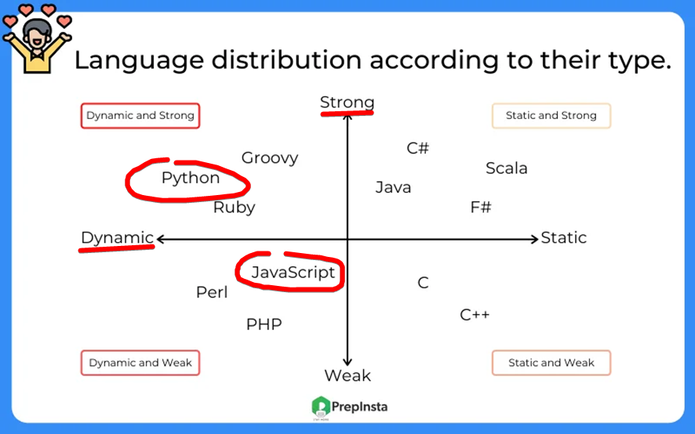
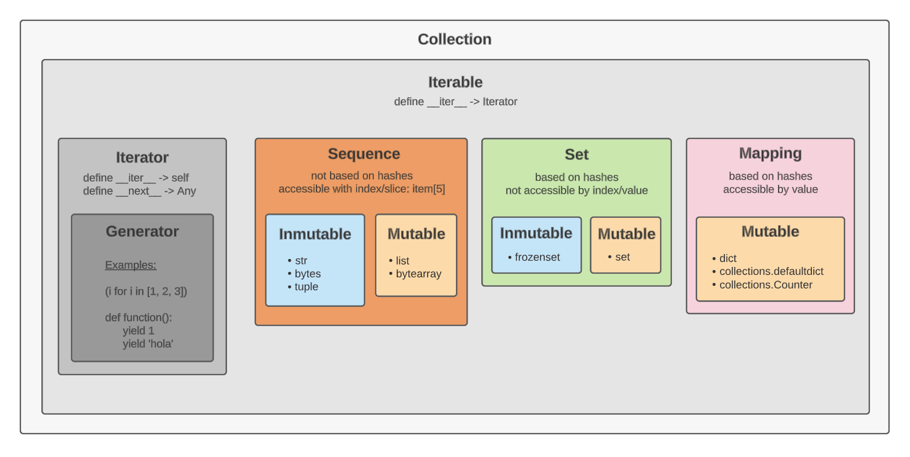
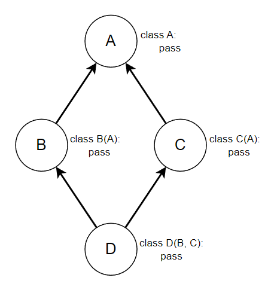
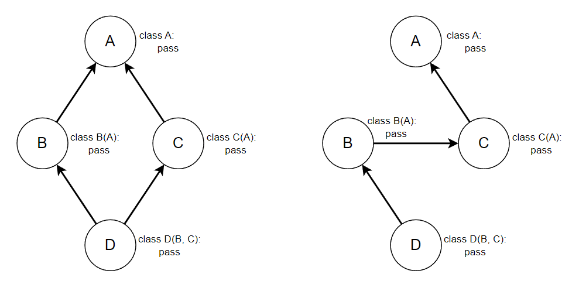
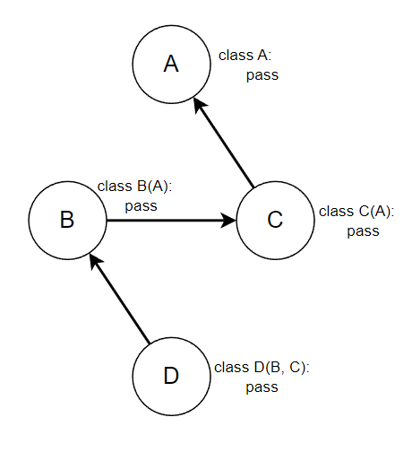
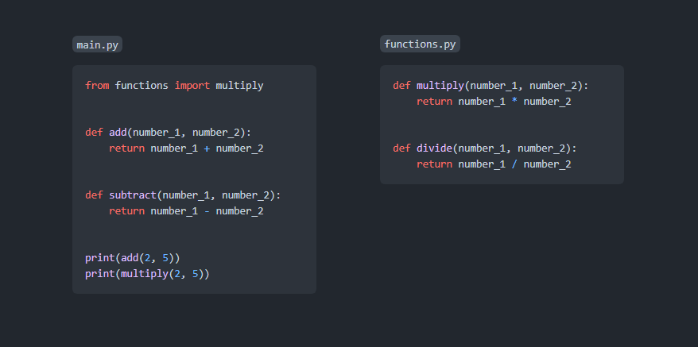
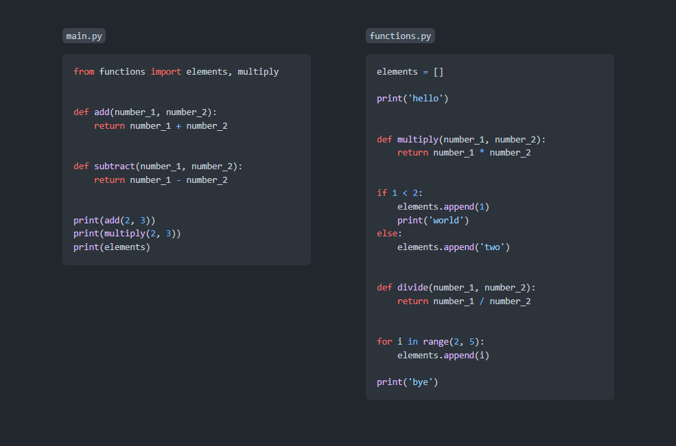

# Guía de Python

## Índice

1. [Tipos de datos](#1-tipos-de-datos)
    1. [Tipos más usados](#11-tipos-más-usados)
    2. [Conversión de tipos](#12-conversión-de-tipos)
    3. [Cadenas (Strings)](#13-cadenas-strings)
        1. [Formateo/interpolación de cadenas](#131-formateointerpolación-de-cadenas)
    4. [Tuplas](#14-tuplas)
    5. [Listas](#15-listas)
    6. [Conjuntos](#16-conjuntos)
    7. [Diccionarios](#17-diccionarios)
    8. [Rangos](#18-rangos)
    9. [Enumeraciones](#19-enumeraciones)
2. [Empaquetado y desempaquetado](#2-empaquetado-y-desempaquetado)
3. [Entrada y salida](#3-entrada-y-salida)
    1. [Consola](#31-consola)
    2. [Archivos](#32-archivos)
4. [Condicionales](#4-condicionales)
5. [Bucles](#5-bucles)
    1. [Listas por comprensión](#51-listas-por-comprensión)
    2. [Iteradores](#52-iteradores)
        1. [Generadores](#521-generadores)
6. [Funciones](#6-funciones)
    1. [Funciones sin argumentos](#61-funciones-sin-argumentos)
    2. [Funciones con argumentos](#62-funciones-con-argumentos)
    3. [Ámbitos](#63-ámbitos)
    4. [Argumentos por defecto](#64-argumentos-por-defecto)
    5. [Argumentos posicionales y argumentos nombrados](#65-argumentos-posicionales-y-argumentos-nombrados)
    6. [Número indeterminado de argumentos](#66-número-indeterminado-de-argumentos)
    7. [Funciones anónimas](#67-funciones-anónimas)
    8. [Funciones generadoras](#68-funciones-generadoras)
7. [Excepciones](#7-excepciones)
    1. [Lanzamiento de excepciones](#71-lanzamiento-de-excepciones)
    2. [Captura de excepciones](#72-captura-de-excepciones)
8. [Clases](#8-clases)
    1. [Atributos](#81-atributos)
        1. [Propiedades](#811-propiedades)
        2. [Atributos estáticos](#812-atributos-estáticos)
    2. [Métodos](#82-métodos)
        1. [Métodos especiales](#821-métodos-especiales)
        2. [Métodos estáticos](#822-métodos-estáticos)
        3. [Métodos de clase](#823-métodos-de-clase)
    3. [Herencia](#83-herencia)
        1. [Clases abstractas](#831-clases-abstractas)
        2. [Herencia múltiple](#832-herencia-múltiple)
9. [Importaciones](#9-importaciones)    
    1. [Nombre especial `__name__`](#91-nombre-especial-__name__)
10. [Convenciones de estilo](#10-convenciones-de-estilo)
    1. [PascalCase y snake_case](#101-pascalcase-y-snake_case)
    2. [Nombres privados](#102-nombres-privados)
    3. [Nombres ya existentes](#103-nombres-ya-existentes)
11. [Anotaciones de tipos](#11-anotaciones-de-tipos)
12. [Gestión de paquetes](#12-gestión-de-paquetes)
    1. [Instalación de paquetes](#121-instalación-de-paquetes)
        1. [Archivo `requirements.txt`](#1211-archivo-requirementstxt)
    2. [Entornos virtuales](#122-entornos-virtuales)

<br>

## 1. Tipos de datos

Python es un lenguaje de tipado **fuerte** y **dinámico**. A diferencia de otros lenguajes de tipado más débil, en Python cada valor contenido en una variable tienen su tipo y operaciones bien definidas y existen restricciones firmes a la hora de combinar dichos tipos de datos cuando se operan con ellos. En un lenguaje de tipado fuerte cuando se usan tipos distintos en una operación no soportada se produce un error en vez de realizarse transformaciones implícitas de datos.

### JavaScript (weak and dynamic)

```javascript
>>> 2 + '3'
'23'
>>> 2 * '3'
6
>>> [] + {}
'[object Object]'
>>> {} + []
0
```

### Python (strong and dynamic)

```python
>>> 2 + '3'
Traceback (most recent call last):
  File "<stdin>", line 1, in <module>
TypeError: unsupported operand type(s) for +: 'int' and 'str'
```

En Python las variables no tienen tipo, pero su contenido sí. Una variable no es más que un nombre que apunta o referencia a un valor, el cual siempre tiene tipo. Se considera un lenguaje **dinámico** porque dicha referencia puede cambiar y apuntar a otro valor (cambiar su contenido), que puede tener incluso otro tipo.

```python
>>> house = 5
>>> house = 'hello'
>>> house
'hello'
```

```python
>>> house = 5
>>> house
5
>>> type(house)
<class 'int'>
>>> house = 'hello'
>>> house
'hello'
>>> type(house)
<class 'str'>
```



<br>

### 1.1. Tipos más usados

```python
name = 5  # integer
name = 5.1  # float
name = True  # boolean (True/False)
name = 'hello'  # string
name = (1, 2, 'bye')  # tuple
name = [1, 2, 'bye']  # list
name = {1, 2, 'bye'}  # set
name = {1: 2, 'hello': 'world', 'a': 48.34, 48.34: 'a'}  # dictionary
```



<br>

### 1.2. Conversión de tipos

Podemos servirnos de las [funciones integradas](https://docs.python.org/3/library/functions.html) en el lenguaje para construir unos tipos de datos a partir de otros:

```python
>>> text = '45'
>>> number = int(text)
>>> number
45
>>> str(number)
'45'
>>> float(number)
45.0
>>> ord('a')  # to unicode
97
>>> chr(97)  # from unicode
'a'
>>> list('hello world')
['h', 'e', 'l', 'l', 'o', ' ', 'w', 'o', 'r', 'l', 'd']
>>> elements = ('tuple', 'elements', ';)')
>>> elements
>>> ('tuple', 'elements', ';)')
>>> list(elements)
['tuple', 'elements', ';)']
>>> set(elements)
{'elements', ';)', 'tuple'}
>>> keys_values = [(1, 'one'), (2, 'two'), ('a', 'b')]
>>> dict(keys_values)
{1: 'one', 2: 'two', 'a': 'b'}
```

Valores que se evalúan a `True`:

```python
>>> bool(1)
True
>>> bool(4984)
True
>>> bool(-12)
True
>>> bool(0.1)
True
>>> bool('a')
True
>>> bool('hello')
True
>>> bool(' ')  # space
True
>>> bool((1, 2))
True
>>> bool([1, 2])
True
>>> bool({1, 2})
True
>>> bool({1: 2})
True
```

Valores que se evalúan a `False`:

```python
>>> bool()
False
>>> bool(0)
False
>>> bool(0.0)
False
>>> bool('')
False
>>> bool(())
False
>>> bool([])
False
>>> bool(set())
False
>>> bool({})
False
```

<br>

### 1.3. Cadenas (strings)

```python
>>> text = 'Hello WORLD'
>>> text[0]
'H'
>>> text[4]
'o'
>>> text[-1]
'D'
>>> text[3:9]
'lo WOR'
>>> text[:3]
'Hel'
>>> text[3:]
'lo WORLD'
>>> text[:]
'Hello WORLD'
>>> text[::2]
'HloWRD'
>>> text[3:9:2]
'l O'
>>> text[::-1]
'DLROW olleH'
```

Las cadenas son **inmutables**:

```python
>>> text[0] = 'x'
Traceback (most recent call last):
  File "<stdin>", line 1, in <module>
TypeError: 'str' object does not support item assignment
```

Algunas funciones de las cadenas:

```python
>>> 'Hello WORLD'.lower()
'hello world'
```
```python
>>> 'Hello WORLD'.upper()
'HELLO WORLD'
```
```python
>>> 'Hello WORLD'.capitalize()
'Hello world'
```
```python
>>> 'Hello WORLD'.title()
'Hello World'
```
```python
>>> 'hello world'.islower()
True
```
```python
>>> 'Hello WORLD'.isupper()
False
```
```python
>>> 'hello world'.isspace()
False
>>> '       '.isspace()
True
```
```python
>>> 'hello'.count('l')
2
>>> 'hello'.count('hel')
1
```
```python
>>> 'hello'.startswith('x')
False
>>> 'hello'.startswith('hel')
True
```
```python
>>> 'hello'.endswith('o')
True
```
```python
>>> 'hello world'.find('o')
4
>>> 'hello world'.find('world')
6
>>> 'hello world'.find('x')
-1
```
```python
>>> 'hello world'.index('o')
4
>>> 'hello world'.index('world')
6
>>> 'hello world'.index('x')
Traceback (most recent call last):
  File "<stdin>", line 1, in <module>
ValueError: substring not found
```
```python
>>> ', '.join(['one', 'two', 'three', 'four'])
'one, two, three, four'
>>> '-YEAH-'.join(['one', 'two', 'three', 'four'])
'one-YEAH-two-YEAH-three-YEAH-four'
```
```python
>>> '    hello  '.strip()
'hello'
>>> '    hello  hellll'.strip('l')
'    hello  he'
```
```python
>>> elements = 'hello world, one two'.split()
>>> elements
['hello', 'world,', 'one', 'two']
>>> len(elements)
4
>>> elements = 'hello world, one two'.split(',')
>>> elements
['hello world', ' one two']
>>> len(elements)
2
```
```python
>>> 'hello'.replace('l', 'g')
'heggo'
>>> 'hello'.replace('ell', '-')
'h-o'
```

<br>

#### 1.3.1. Formateo/interpolación de cadenas

Siempre que necesitemos concatenar cadenas, unirlas, mezclar texto de cadenas y variables para construir una cadena final, etc. vamos a usar las llamadas `f-strings`. Es el método más moderno, legible, eficiente y potente para formatear cadenas.

Solo hay que poner una `f` antes de la cadena.

```python
print(f'2 + 1 = {2 + 1}')
```
Salida:
```
2 + 1 = 3
```

<br>

```python
name = 'Juan'
age = 1400
print(f'Hello! My name is {name} and I am {age} years old.')
```
Salida:
```
Hello! My name is Juan and I am 1400 years old.
```

Si no pusieramos la `f`:

```python
name = 'Juan'
age = 1400
print('Hello! My name is {name} and I am {age} years old.')
```
Salida:
```
Hello! My name is {name} and I am {age} years old.
```

Si por alguna razón necesitáramos construir una plantilla para, posteriormente en otra parte del código, llenar esa plantilla con valores, usaríamos el método `format()` de las cadenas.

```python
text = 'Hello! My name is {} and I am {} years old.'
...
print(text.format('Juan', 1400))
```
Salida:
```
Hello! My name is Juan and I am 1400 years old.
```

<br>

```python
text = 'Hello! My name is {1} and I am {0} years old.'
...
print(text.format('Juan', 1400))
```
Salida:
```
Hello! My name is 1400 and I am Juan years old.
```

<br>

```python
text = 'Hello! My name is {name} and I am {age} years old.'
...
print(text.format(age=1400, name='Juan'))
```
Salida:
```
Hello! My name is Juan and I am 1400 years old.
```

<br>

Esta sintaxis es mucho más potente: podemos usar las [especificaciones de formato](https://docs.python.org/3/library/string.html#formatspec) para definir cómo se presentan los valores. Por ejemplo:

```python
>>> f'{'hola':<10}'
'hola      '
>>> f'{'hola':0>10}'
'000000hola'
>>> f'{'hola':-^10}'
'---hola---'
>>> f'{3.14159:.2f}'
'3.14'
>>> f'{1000000:_}'
'1_000_000'
>>> f'{42:#b}'
'0b101010'
>>> f'{42:b}'
'101010'
>>> f'{42:#x}'
'0x2a'
>>> f'{42:x}'
'2a'
```

<br>

### 1.4. Tuplas

Las tuplas son colecciones de elementos inmutables menos potentes y flexibles que las listas, esto le permite un manejo más eficiente de la memoria en la mayoría de los casos. Aunque usar una tupla en vez de una lista en Python sería una microptimización superflua con un impacto despreciable, no está de más pensar en usar una tupla cuando definimos una colección de elementos que sabemos que no va a ser alterada nunca más, ya que nos sobraría toda la sobrecarga que aportan las listas.

Se crean con los paréntesis `(` `)`. Pero hay que tener en cuenta que este carácter también se usa para agrupar operaciones: `()` es una tupla vacía, pero cuando escribimos `(1)` no estamos creando una tupla, sino un entero `1`. Igual que `(1+2)` se interpreta así: `(1+2) -> (3) -> 3`. Para solucionar esto usamos la `,`:

```python
>>> elements = ()
>>> type(elements)
<class 'tuple'>
>>> elements = ('hello')
>>> elements
'hello'
>>> type(elements)
<class 'str'>
>>> elements = ('hello',)  # notice the comma
>>> elements
('hello',)
>>> type(elements)
<class 'tuple'>
>>> (1 + 2) * 3
9
```

Uso de las tuplas:

```python
>>> elements = (0, 1, 2, 3, 'four', 5, 6, 'seven', 8, 9, 9, 9)
>>> len(elements)
12
>>> elements[0]
0
>>> elements[4]
'four'
>>> elements[-1]
9
>>> elements[2:8]
(2, 3, 'four', 5, 6, 'seven')
>>> elements[2:8:2]
(2, 'four', 6)
>>> elements[3:]
(3, 'four', 5, 6, 'seven', 8, 9, 9, 9)
>>> elements[:]
(0, 1, 2, 3, 'four', 5, 6, 'seven', 8, 9, 9, 9)
>>> elements[::-1]
(9, 9, 9, 8, 'seven', 6, 5, 'four', 3, 2, 1, 0)
```

Las tuplas son **inmutables**:

```python
>>> elements[0] = 'x'
Traceback (most recent call last):
  File "<stdin>", line 1, in <module>
TypeError: 'tuple' object does not support item assignment
```

Funciones de las tuplas:

```python
>>> elements = (0, 1, 'two', 3, 4, 'five', 'five again', 'five again')
>>> elements.index('two')
2
>>> elements.count('five again')
2
```

<br>

### 1.5. Listas

Las listas son una de las colecciones más útiles del lenguaje, se usan continuamente y estarán presentas en prácticamente cualquier programa Python. Funcionan en base al almacenamiento de objetos en bloques contiguos de memoria, por ello este tipo de estructura permite el acceso eficiente de los elementos mediante un índice que indica la posicion relativa dentro de la lista.

Las [cadenas](#13-cadenas-strings) y las [tuplas](#14-tuplas) también almacenan datos de forma contigua en memoria, pero las primeras almacenan caracteres y, las segundas, aunque almacenan objetos, son colecciones inmutables y más simples. Las listas tienen muchas más herramientas y métodos predefinidos, esto hace que sea algo menos eficientes en memoria en la mayoría de los casos pero, como dijimos en el apartado de las tuplas, sería despreciable.

```python
>>> elements = [0, 1, 2, 3, 'four', 5, 6, 'seven', 8, 9, 9, 9]
>>> len(elements)
12
>>> elements[0]
0
>>> elements[4]
'four'
>>> elements[-1]
9
>>> elements[2:8]
[2, 3, 'four', 5, 6, 'seven']
>>> elements[2:8:2]
[2, 'four', 6]
>>> elements[3:]
[3, 'four', 5, 6, 'seven', 8, 9, 9, 9]
>>> elements[:]
[0, 1, 2, 3, 'four', 5, 6, 'seven', 8, 9, 9, 9]
>>> elements[::-1]
[9, 9, 9, 8, 'seven', 6, 5, 'four', 3, 2, 1, 0]
```

Las listas son **mutables**:

```python
>>> elements[0] = 'x'
>>> elements
['x', 1, 2, 3, 'four', 5, 6, 'seven', 8, 9, 9, 9]
```

Algunas funciones de las listas:

```python
>>> elements = [0, 1, 'two', 3, 4, 'five', 'five again', 'five again']
```
```python
>>> elements.append('last')
>>> elements
[0, 1, 'two', 3, 4, 'five', 'five again', 'five again', 'last']
```
```python
>>> del elements[5]
[0, 1, 'two', 3, 4, 'five again', 'five again', 'last']
```
```python
>>> elements.remove('two')
>>> elements
[0, 1, 3, 4, 'five again', 'five again', 'last']
```
```python
>>> elements.insert(2, 'new two')
>>> elements
[0, 1, 'new two', 3, 4, 'five again', 'five again', 'last']
```
```python
>>> last = elements.pop()
>>> last
'last'
>>> elements
[0, 1, 'new two', 3, 4, 'five again', 'five again']  # pop remove the element
>>> second = elements.pop(2)
>>> second
'new two'
>>> elements
[0, 1, 3, 4, 'five again', 'five again']  # pop remove the element
```
```python
>>> elements.index(4)
3
```
```python
>>> elements.count('five again')
2
```
```python
>>> elements_copy = elements.copy()
```
```python
>>> elements.reverse()
>>> elements
['five again', 'five again', 4, 3, 1, 0]
```
```python
>>> elements.clear()
>>> elements
[]
```
```python
>>> elements_copy
[0, 1, 3, 4, 'five again', 'five again']
```

Cómo concatenar/fusionar varias listas:

```python
>>> elements_1 = ['one', False, 2.25, [0, 1, 2], 'last']
>>> elements_2 = ['a', 'b', 'c']
>>> new_elements = elements_1 + elements_2
>>> new_elements
['one', False, 2.25, [0, 1, 2], 'last', 'a', 'b', 'c']
>>> new_elements = [*elements_1, *elements_2]  # alternative
>>> new_elements
['one', False, 2.25, [0, 1, 2], 'last', 'a', 'b', 'c']  # same result
>>> new_elements = [0, 1, 2]
>>> new_elements.extend(elements_2)
>>> new_elements
[0, 1, 2, 'a', 'b', 'c']
```

<br>

### 1.6. Conjuntos

Los conjuntos (`set`) son colecciones cuyos elementos se almacenan a través del cáclulo de [hashes](https://es.wikipedia.org/wiki/Funci%C3%B3n_hash). Los elementos que contienen se organizan según su hash, el cual indica en qué posición se guarda en la estructura, por lo tanto el orden de los elementos es arbitrario: por ejemplo, no mantienen el orden de entrada como las listas.

Se crean con las llaves `{` `}`. Pero hay que tener en cuenta que este carácter también se usa para crear diccionarios así que cuando escribimos `{}` no estamos creando un conjunto vacío, sino un diccionario vacío.

```python
>>> elements = {1}
>>> type(elements)
<class 'set'>
>>> elements = {}
>>> type(elements)
<class 'dict'>
```

Si queremos construir un conjunto vacío tendremos que recurrir a su constructor.

```python
>>> elements = set()
>>> type(elements)
<class 'set'>
```

Los conjuntos **no contienen elementos repetidos**, son estructuras pensadas para comprobar rápida y eficientemente si un elemento está o no en la estructura. Si se añade un elemento que ya existe no ocurrirá nada ni se producirá un error.

```python
>>> elements = {'five', (1, 2), 4, 3, 2, 1, 1, 1, 1, 0, 0, 0, 0, 0, 0, 0, 0, 0}
>>> elements
{0, 1, 2, 3, (1, 2), 'five', 4}
>>> elements.add('five')
>>> elements
{0, 1, 2, 3, (1, 2), 'five', 4}
```

No vamos a poder acceder a los elementos mediante un índice como pasaba en las listas.

```python
>>> elements = {1, 2, 3}
>>> elements[0]
Traceback (most recent call last):
  File "<stdin>", line 1, in <module>
TypeError: 'set' object is not subscriptable
```

Como funcionan mediante hashes solo pueden contener elementos hasheables que mantengan ese valor hash durante toda su vida, es decir, elementos que sean inmutables, ya que si se alteran también alterarían su hash (su "firma") y ocuparían otra posición dentro del conjunto como si fueran otro objeto.

```python
>>> elements = {['lists', 'are', 'mutable'], 1, 0}
Traceback (most recent call last):
  File "<stdin>", line 1, in <module>
TypeError: unhashable type: 'list'
```

Las listas son mutables, por lo tanto no son hasheables y no se pueden almacenar en conjuntos. En cambio las tuplas sí, porque son inmutables.

```python
>>> elements = {('tuples', 'are', 'inmutable'), 1, 0}
>>> elements
{0, ('tuples', 'are', 'inmutable'), 1}
```

Usos de los conjuntos:

```python
>>> names = ['Juan', 'Alberto', 'Elena', 'Juan', 'Juan', 'Ana', 'Elena']  # list
>>> unique_names = set(names)  # set
>>> len(unique_names)
4
>>> len(names) == len(unique_names)
False
>>> unique_names
{'Ana', 'Juan', 'Elena', 'Alberto'}
>>> unique_names.add('Pikachu')
>>> unique_names
{'Pikachu', 'Elena', 'Alberto', 'Ana', 'Juan'}
>>> 'Juan' in unique_names
True
>>> other_names = {'Elena', 'Juanita'}
>>> unique_names - other_names
{'Ana', 'Pikachu', 'Juan', 'Alberto'}
>>> unique_names.discard('Pikachu')
>>> unique_names
{'Elena', 'Alberto', 'Ana', 'Juan'}
>>> unique_names.clear()
>>> unique_names
set()
```

Cómo concatenar/fusionar varios conjuntos:

```python
>>> elements_1 = {'a', 'b', 'c', 'one', False, 2.25, (0, 1, 2), 'last'}
>>> elements_2 = {'a', 'b', 'c'}
>>> new_elements = elements_1 | elements_2
>>> new_elements
{'b', False, 2.25, 'one', 'c', 'a', (0, 1, 2), 'last'}
>>> new_elements = {*elements_1, *elements_2}  # alternative
>>> new_elements
{'b', False, 2.25, 'one', 'c', 'a', (0, 1, 2), 'last'}  # same result
>>> new_elements = {0, 1, 2}
>>> new_elements.update(elements_2)
>>> new_elements
{0, 1, 2, 'b', 'a', 'c'}
```

<br>

### 1.7. Diccionarios

Los diccionarios, junto a las listas, son las colecciones más importantes y útiles del lenguaje. La gestión de elementos se va a hacer, casi siempre, mediante el uso de listas o diccionarios:

- **listas:** cuando únicamente nos interesen los valores en sí.
- **diccionarios:** cuando nos sea útil relacionar un valor con un nombre o clave.

Los diccionarios, además, funcionan mediante hashes, como los conjuntos, consiguiendo con ello un acceso eficiente a los datos mediante la clave, la cual debe ser hasheable (los valores asociados a dichas claves no tienen que serlo).

```python
>>> elements = {'first': 1, 'second': 2.2, 3: 'third', 4: 4}
```

```python
>>> len(elements)
4
```
```python
>>> elements['second']
2.2
```
```python
>>> elements['x']
Traceback (most recent call last):
  File "<stdin>", line 1, in <module>
KeyError: 'x'
```
```python
>>> elements.get('x')
None
>>> elements.get('x', 'NOP')
'NOP'
```
```python
>>> elements['second'] = "now it's me, Mario!"
>>> elements
{'first': 1, 'second': "now it's me, Mario!", 3: 'third', 4: 4}
```
```python
>>> del elements['second']
>>> elements
{'first': 1, 3: 'third', 4: 4}
```
```python
>>> elements.keys()
dict_keys(['first', 3, 4])
>>> list(elements.keys())
['first', 3, 4]
```
```python
>>> elements.values()
dict_values([1, 'third', 4])
>>> list(elements.values())
[1, 'third', 4]
```
```python
>>> elements.items()
dict_items([('first', 1), (3, 'third'), (4, 4)])
>>> list(elements.items())
[('first', 1), (3, 'third'), (4, 4)]
```
```python
>>> element = elements.pop('first')
>>> element
1
>>> elements
{3: 'third'}
>>> element = elements.pop('x')
Traceback (most recent call last):
  File "<stdin>", line 1, in <module>
KeyError: 'x'
>>> element = elements.pop('x', 'NOOOOP')
>>> element
'NOOOOP'
>>> elements
{3: 'third'}
```
```python
>>> elements_copy = elements.copy()
```
```python
>>> elements.clear()
>>> elements
{}
```
```python
>>> elements_copy
{'first': 1, 3: 'third'}
```

Cómo concatenar/fusionar varios diccionarios:

```python
>>> elements_1 = {'one': 'two', False: 5, 2.25: 1.121}
>>> elements_2 = {'one': 'THREE', 'c': 'd'}
>>> new_elements = elements_1 | elements_2
>>> new_elements
{'one': 'THREE', False: 5, 2.25: 1.121, 'c': 'd'}
>>> new_elements = {**elements_1, **elements_2}  # alternative
>>> new_elements
{'one': 'THREE', False: 5, 2.25: 1.121, 'c': 'd'}  # same result
>>> new_elements = {0:1, 1:2, 2:3}
>>> new_elements.update(elements_2)
>>> new_elements
{0: 1, 1: 2, 2: 3, 'one': 'THREE', 'c': 'd'}
```

Nótese que si se introducen varios valores para una misma clave, el último sobrescribirá los anteriores.

<br>

### 1.8. Rangos

El tipo [range](https://docs.python.org/3/library/stdtypes.html#range) sirve para crear una sucesión de números enteros iterable:

```python
>>> range(10)
range(0, 10)
>>> list(range(10))
[0, 1, 2, 3, 4, 5, 6, 7, 8, 9]
>>> list(range(3, 10))
[3, 4, 5, 6, 7, 8, 9]
>>> list(range(10, -1, -1))
[10, 9, 8, 7, 6, 5, 4, 3, 2, 1, 0]
```

`range()` tiene tres parámetros:

- `start`: empezar desde este valor (**inclusive**).
- `stop`: hasta este (**no inclusive**).
- `step`: números de pasos o saltos.

Si solo se proporciona un argumento se interpreta como parámetro `stop` y, por defecto, `start = 0` y `step = 1`.

> `range()` se comporta igual que el acceso a segmentos de listas mediante [slices](https://docs.python.org/3/glossary.html#term-slice):
> 
> ```python
> >>> list(range(4, 10, 2))
> [4, 6, 8]
> >>> [0, 1, 2, 3, 4, 5, 6, 7, 8, 9][4:10:2]
> [4, 6, 8]
> ```

<br>

### 1.9. Enumeraciones

Las enumeraciones son unas herramientas bastantes comunes en numerosos lenguajes de programación que nos sirven para definir un conjunto inmutable de constantes con nombre.

Los solemos usar siempre que necesitamos definir un comportamiento que depende de una constante que puede adoptar valores concretos. Por ejemplo, hasta ahora, si quisiéramos que una función realice una serie de tareas según el color pasado como argumento, haríamos algo así:

```python
def do_something(color):
    if color == 'red':
        ...
    elif color == 'blue':
        ...
    elif color == 'green':
        ...
    ...
```

El hecho de que el color sea determinado por una cadena tiene muchos problemas. Para empezar, podemos cometer errores ortográficos y escribir `'bleu'` en vez de `'blue'`, ya que ambos valores son válidos pero solo uno tiene sentido en nuestro contexto.

Las enumeraciones no son más que [clases](#8-clases) que [heredan](#83-herencia) de `Enum`:

```python
from enum import Enum


class Color(Enum):
    RED = 1
    GREEN = 2
    BLUE = 3


def do_something(color):
    if color == Color.RED:
        ...
    elif color == Color.GREEN:
        ...
    elif color == Color.BLUE:
        ...
    ...
```

> En este ejemplo hemos usado `==` para comparar los miembros de la enumeración por similitud con el ejemplo base, pero quizás lo más recomendable en Python sería usar `is`, ya que así se comprueba directamente que se trata del mismo miembro y no solo que los valores son iguales.
> 
> Si usamos la enumeración típica `Enum` no habría problema con usar `==`, pero hay que tener en cuenta que esto puede fallar para `IntEnum` o `StrEnum`, donde la comparación por identidad (`is`) no funciona como la comparación por valor (`==`).

Al estar limitando la existencia de constantes mediante la clase `Color`, estamos eliminando la posibilidad de usar nombres que no existen en la enumeración, como pasaba con las cadenas. Esto también posibilita al entorno de desarrollo proporcionar autocompletado para los miembros de la enumeración. Además, si en un futuro queremos cambiar los miembros de la enumeración, no habrá que ir buscando en todas las partes del código donde se usan cadenas `'red'`, `'blue'` y `'green'` para actualizarlas y mantener la consistencia.

Las `Enum` relacionan un nombre con un valor. En nuestro último ejemplo relacionamos `RED` con el valor `1`, `GREEN` con el `2` y `BLUE` con el `3`. Podemos generar valores automáticos de la siguiente manera:

```python
from enum import Enum, auto


class Color(Enum):
    RED = auto()
    GREEN = auto()
    BLUE = auto()
```

`auto()` genera valores predeterminados. Tiene como valor inicial `1` y los siguientes irán incrementándose. En este caso obtenemos el mismo resultado que antes: `RED = 1`, `GREEN = 2` y `BLUE = 3`.

<br>

Atributos de las `Enum`:

```python
print(Color.RED)
print(Color.RED.name)
print(Color.RED.value)
```
Salida:
```
Color.RED
RED
1
```

<br>

Selección de miembro por valor:

```python
print(Color(2))
```
Salida:
```
Color.GREEN
```

<br>

Selección de miembro por nombre:

```python
print(Color['RED'])
```
Salida:
```
Color.RED
```

<br>

## 2. Empaquetado y desempaquetado

Se aplican a iterables:

```python
>>> elements = (0, 1, 'hello')
>>> a, b, c = elements
>>> a
0
>>> b
1
>>> c
'hello'
```

```python
>>> a, b = [(1, 'one'), (2, 'two')]
>>> a
(1, 'one')
>>> b
(2, 'two')
```

```python
>>> (a, b), (c, d) = [(1, 'one'), (2, 'two')]
>>> a
1
>>> b
'one'
>>> c
2
>>> d
'two'
```

```python
>>> for key, value in {1: 'one', 2: 'two'}.items():
...     print(key, value)
...
1 one
2 two
```

```python
>>> elements = [0, 1, 2, 3, 4, 5, 6]
>>> a, b, *c = elements
>>> a
0
>>> b
1
>>> c
[2, 3, 4, 5, 6]
```

```python
>>> elements = {0, 1, 2, 3, 4, 5, 6}
>>> a, b, *c, d = elements
>>> a
0
>>> b
1
>>> c
[2, 3, 4, 5]
>>> d
6
```

```python
>>> elements_1 = [0, 1, 2]
>>> elements_2 = {3, 4, 5}
>>> [elements_1, elements_2]  # not unpacking
[[0, 1, 2], {3, 4, 5}]
>>> [*elements_1, *elements_2]  # unpacking
[0, 1, 2, 3, 4, 5]
```

```python
>>> elements_1 = [0, 1, 2]
>>> elements_2 = {3, 4, 5}
>>> (*elements_1, *{'hello', 'world'}, *elements_2)
(0, 1, 2, 'world', 'hello', 3, 4, 5)
>>> [*elements_1, *elements_2, *('yes', 'no')]
[0, 1, 2, 3, 4, 5, 'yes', 'no']
>>> {*['❤️', '🐕'], *elements_1, *elements_2}
{0, 1, 2, 3, '🐕', 4, 5, '❤️'}
```

> Los conjuntos no tienen un orden definido.

Para empaquetar y desempaquetar diccionarios usamos `**`:

```python
>>> dict_1 = {1: 2, 3: 4}
>>> dict_2 = {'a': 'b', 'c': 'd'}
>>> {**dict_1, **dict_2}
{1: 2, 3: 4, 'a': 'b', 'c': 'd'}
```

> Estas mecánicas se usan mucho en los parámetros y argumentos de las funciones. Más información en el capítulo [6.5. Número indeterminado de argumentos](#66-número-indeterminado-de-argumentos).

<br>

## 3. Entrada y salida

### 3.1. Consola

Para trabajar con la consola usamos dos de las llamadas [funciones integradas](https://docs.python.org/3/library/functions.html):

- `print()` para salida.
- `input()` para entrada.

```python
text = input('Give me a number: ')
print('thank you')
```
Consola:
```
Give me a number: 
```
Escribimos en la consola `'7'`:
```
Give me a number: 7
```
Consola:
```
Give me a number: 7
thank you
```

Nótese que `input()` siempre obtiene texto de la consola, es decir, ese `7` que se introduce en la consola se asigna a `text` como una cadena `'7'`.

<br>

### 3.2. Archivos

Para abrir archivos podemos usar `open()`, una [función integrada](https://docs.python.org/3/library/functions.html).

```python
file = open('file.txt')
# file is open here
text = file.read()
file.close()
# file is closed here
```

Sin embargo, la forma recomendada es usar gestores de contexto. 

```python
with open('file.txt') as file:
    # file is open here
    text = file.read()
# file is closed here
```

No entraremos en detalle pero básicamente la palabra reservada `with` define un gestor de contexto. En este caso mantendrá el archivo abierto hasta que se salga del bloque u ocurra cualquier interrupción del programa (errores, `return`, etc.). Python se encargará de cerrar el archivo correctamente antes de salir.

`open()` tiene varios [parámetros](https://docs.python.org/3/library/functions.html#open), pero los más importantes son `file`, que es el cual indica la ubicación del archivo, y `mode`, con el que le decimos en que modo queremos que abra el archivo (lectura, escritura, texto, bytes, etc.). Si no especificamos el parámetro `mode` por defecto se abrirá en modo lectura de texto.

Leer texto:
```python
with open('file.txt') as file:  # nothing or 'r' or 'rt'
    text = file.read()
```
Leer bytes:
```python
with open('file.png', 'rb') as file:
    data = file.read()
```
Escribir texto:
```python
with open('file.txt', 'w') as file:  # 'w' or 'wt'
    file.write('hello')
```
Escribir bytes:
```python
with open('file.png', 'wb') as file:
    file.write(b'\x45\x44\x50\x52\x45\x53\x53\x4f')
```

Finalmente vamos a ver la última alternativa. Es igual de segura que usar los gestores de contexto vistos arriba.

[Importamos](#9-importaciones) `Path` de `pathlib`:
```python
from pathlib import Path
```
Leer texto:
```python
text = Path('file.txt').read_text()
```
Leer bytes:
```python
data = Path('file.png').read_bytes()
```
Escribir texto:
```python
Path('file.txt').write_text('hello')
```
Escribir bytes:
```python
Path('file.png').write_bytes(b'\x45\x44\x50\x52\x45\x53\x53\x4f')
```

<br>

## 4. Condicionales

```python
number = 82
numbers = [0, 1, 2, 3, 4, 5, 6]
condition_1 = True
condition_2 = False
condition_3 = True

if number == 82:  # compares the value of two objects
    print('a')
elif number != 82:
    print('b')
elif number is condition_1:  # compares the memory reference of two objects
    print('c')
elif number in numbers:
    print('d')
elif number < 2:
    print('e')
elif 12 < number <= 30:
    print('f')
elif condition_1:
    print('g')
elif not condition_1 and condition_2 or condition_3:
    print('h')
else:
    print('i')

print('always')
```

En Python todos los bloques se indican con el nivel de tabulación después de `:`.

En el código anterior `print('i')` está dentro de la cláusula o bloque `else` porque tiene una tabulación (4 espacios). En cambio `print('always')` está fuera del `else`, sin tabulaciones,  y se ejecutará siempre sin importar las condicionales. 

No es necesario poner paréntesis en las condiciones: 

❌ `if (n < 2):`

✅ `if n < 2:`

Hasta hace poco no existía una cláusula parecida a los `switch` de otros lenguajes. Python tiene una herramienta mucho más potente llamada [Structural Pattern Matching](https://peps.python.org/pep-0636/) en la cual no se entrará en detalle pero que puede usarse como un `switch` tradicional.

```python
number = 7
match number:
    case 1:
        ...
    case 2:
        ...
    case _:  # default case
        ...
```

```python
elements = [7, 'Alberto']
match elements:
    case 1, 'Juan':
        ...
    case 2, _:
        ...
    case _:  # default case
        ...
```

<br>

## 5. Bucles

En Python muy raramente se necesitan los bucles `while`.

```python
condition = True
while condition:
    ...
```

```python
i = 0
while i < 10:
    ...
    i += 1
```

La forma más utilizada, legible y ajustada a las técnicas de programación modernas para recorrer colecciones o repetir código viene dada por los bucles `for`. Con `for` se van a poder resolver el 99% de los casos. Es bueno intentar ir siempre con la mentalidad de hacer cualquier iteración o repetición con `for` por las ventajas que ofrece la potente y flexible sintaxis de Python.

Hay que tener en cuenta que los `for` en Python se podrían comparar con los `foreach` que existen en otros lenguajes donde se tienen un `for` y un `foreach`. Por ejemplo:

### C#

`for`
```cs
string[] words = {"hello", "world", "Juan", "bye"};
for (int i = 0; i < words.Length; i++)
{
    Console.WriteLine(words[i]);
}
```
Salida:
```
hello
world
Juan
bye
```

<br>

`foreach`
```cs
string[] words = {"hello", "world", "Juan", "bye"};
foreach (string word in words)
{
    Console.WriteLine(word);
}
```
Salida:
```
hello
world
Juan
bye
```

### Python

```python
words = ['hello', 'world', 'Juan', 'bye']
for word in words:
    print(word)
```
Salida:
```
hello
world
Juan
bye
```

Por lo tanto, en Python, la misión de los `for` es **iterar elementos**.

Si un programador viene de otro lenguaje es posible que busque hacer los `for` incrementando una variable entera `i`, que use luego para acceder a las posiciones de una colección y acabe haciendo algo innecesario como:

```python
words = ['hello', 'world', 'Juan', 'bye']
for i in range(len(words)):
    print(words[i])
```
Salida:
```
hello
world
Juan
bye
```
> Acabamos de usar la [función integrada](https://docs.python.org/3/library/functions.html) `range()`. Más información en el capítulo [1.8. Rangos](#18-rangos).

Entonces:

❌
```python
words = ['hello', 'world', 'Juan', 'bye']
for i in range(len(words)):
    print(words[i])
```
✅
```python
words = ['hello', 'world', 'Juan', 'bye']
for word in words:
    print(word)
```

> Si se necesita gestionar un índice numérico como contador, se puede usar la [función integrada](https://docs.python.org/3/library/functions.html) `enumerate` que devuelve un par (índice, elemento):
> ```python
> words = ['hello', 'world', 'Juan', 'bye']
> for i, word in enumerate(words):
>     print(i, word)
> ```
> Salida:
> ```
> 0 hello
> 1 world
> 2 Juan
> 3 bye
> ```

<br>

#### Sentencia `break`

`break` rompe el bucle y sale de él:

```python
words = ['hello', 'world', 'Juan', 'bye']
for word in words:
    if word == 'Juan':
        break

    print(word)

print('- end -')
```
Salida:
```
hello
world
- end -
```

<br>

#### Sentencia `continue`

`continue` abandona la iteración actual y continúa con la siguiente, si la hay:

```python
words = ['hello', 'world', 'Juan', 'bye']
for word in words:
    if word == 'Juan':
        continue

    print(word)

print('- end -')
```
Salida:
```
hello
world
bye
- end -
```

<br>

#### Cláusula `else`:
```python
words = ['hello', 'world', 'Juan', 'bye']
for word in words:
    print(word)
else:
    print('---> else <---')

print('- end -')
```
Salida:
```
hello
world
Juan
bye
---> else <---
- end -
```

<br>

```python
words = ['hello', 'world', 'Juan', 'bye']
for word in words:
    if word == 'Juan':
        break

    print(word)
else:
    print('---> else <---')

print('- end -')
```
Salida:
```
hello
world
- end -
```

<br>

```python
words = []
for word in words:
    if word == 'Juan':
        break

    print(word)
else:
    print('---> else <---')

print('- end -')
```
Salida:
```
---> else <---
- end -
```

<br>

También se puede usar en los `while`:

```python
words = ['hello', 'world', 'Juan', 'bye']

i = 0
while i < len(words):
    if words[i] == 'Juan':
        break

    print(words[i])
    i += 1
else:
    print('---> else <---')

print('- end -')
```
Salida:
```
hello
world
- end -
```

<br>

### 5.1. Listas por comprensión

Python recoge ciertas ideas de la programación funcional, trayendo una sintaxis en una sola línea para crear generadores, listas, conjuntos y diccionarios.

```python
numbers = [0, 1, 2, 3, 4, 5]
numbers_x2 = [number * 2 for number in numbers]
print(numbers_x2)
```
Salida:
```
[0, 2, 4, 6, 8, 10]
```

Alternativa usando `for` normales:

```python
numbers = [0, 1, 2, 3, 4, 5]
numbers_x2 = []
for number in numbers:
    numbers_x2.append(number * 2)
print(numbers_x2)
```
Salida:
```
[0, 2, 4, 6, 8, 10]
```

Si quiesiéramos filtrar los valores pares de una lista de números podríamos hacerlo.

```python
numbers = [0, 1, 2, 3, 4, 5]
even_numbers = [number for number in numbers if number % 2 == 0]
print(even_numbers)
```
Salida:
```
[0, 2, 4]
```

Alternativa usando `for` normales:

```python
numbers = [0, 1, 2, 3, 4, 5]
even_numbers = []
for number in numbers:
    if number % 2 == 0:
        even_numbers.append(number)
print(even_numbers)
```
Salida:
```
[0, 2, 4]
```

<br>

### 5.2. Iteradores

¿Cómo podemos definir una serie de elementos sin almacenarlos en memoria en una lista u otra estructura? Imaginemos que queremos iterar un millón de elementos, pero crear una lista con un millón de elementos para iterarlos es demasiado costoso. En estos casos vamos a necesitar iteradores, que no son más que objetos creados a partir "normas" o "reglas" que definen sucesiones de elementos u objetos.

Para entender este concepto vamos a usar [range](#18-rangos). Un objeto de este tipo almacena tres números enteros: `start`, `stop` y `step` y se puede iterar:

```python
for i in range(0, 5, 2):
    print(i)
```
Salida:
```
0
2
4
```

También podemos crear una lista a partir de él, lo cual sería otra forma de iterarlo:

```python
>>> list(range(0, 5, 2))
[0, 2, 4]
```

Pero, ¿cómo itera Python? Cuando Python tiene que iterar un iterable, lo primero que hace es construir un iterador. Nosotros podemos crear iteradores a partir de iterables con la [función integrada](https://docs.python.org/3/library/functions.html) `iter()`:

```python
>>> iter(range(0, 5, 2))
<range_iterator object at 0x000001C28FF9AF10>
```

Los ejemplos anteriores, pero con iteradores:

```python
iterator = iter(range(0, 5, 2))
for i in iterator:
    print(i)
```
Salida:
```
0
2
4
```

<br>

```python
>>> list(iter(range(0, 5, 2)))
[0, 2, 4]
```

El resultado es el mismo. Como es lógico, en estas situaciones es innecesario crear iteradores explícitamente puesto que Python se encargará de ello automáticamente.

<br>

Podemos iterar manualmente un iterador con la [función integrada](https://docs.python.org/3/library/functions.html) `next()`:

```python
>>> iterator = iter(range(0, 5, 2))
>>> next(iterator)
0
>>> next(iterator)
2
>>> next(iterator)
4
>>> next(iterator)
Traceback (most recent call last):
  File "<stdin>", line 1, in <module>
StopIteration
```

Cuando la sucesión de elementos llega a su fin se lanza una [excepción](#7-excepciones) `StopIteration`.

Los iteradores son de un solo uso, se consumen:

```python
>>> iterator = iter(range(0, 5, 2))
>>> list(iterator)
[0, 2, 4]
>>> list(iterator)
[]
```

```python
>>> iterator = iter(range(0, 5, 2))
>>> next(iterator)
0
>>> next(iterator)
2
>>> list(iterator)
[4]
```

<br>

Una vez entendido lo que son los iteradores, volvamos a nuestro problema del inicio: ¿cómo podemos iterar millones de elementos sin llenar la memoria creando una lista con ellos? Pues con un iterador. Un iterador de pocos elementos va a ocupar en memoria lo mismo que un iterador de muchos elementos, ya que solo son líneas de código o lógica que especifican una sucesión, no los elementos en sí:

```python
>>> import sys
>>> sys.getsizeof(list(range(1)))
72
>>> sys.getsizeof(list(range(1_000_000)))
8000056
>>> sys.getsizeof(iter(range(1)))
32
>>> sys.getsizeof(iter(range(1_000_000)))
32
```

> En python, los números se pueden separar con `_` por legibilidad. No tienen ningún efecto.
> ```python
> >>> 5_746_2341.15_44
> 57462341.1544
> ```

<br>

#### 5.2.1. Generadores

Python nos proporciona dos formas de definir nuestras propias sucesiones de elementos:

- Con **expresiones** parecidas a las [listas por comprensión](#51-listas-por-comprensión) pero con **paréntesis**.
- Con **funciones generadoras** (estas se explicarán en el capítulo [6.8. Funciones generadoras](#68-funciones-generadoras)).

Cualquiera de estas dos formas nos permiten crear **generadores**.

> Un generador es un tipo de iterador (ver el diagrama del apartado [tipos más usados](#11-tipos-más-usados)). Iterador es un concepto más abstracto, sin entrar en detalles: cualquier objeto al que se le pueda hacer `iter()` y `next()` es un iterador.

<br>

Vamos a ver los generadores creados a partir de **expresiones con paréntesis**.

Recordemos las listas por comprensión calculando los cuadrados de unos elementos:

```python
>>> elements = [1, 5, 8, 4, 9, 4]
>>> new_elements = [i ** 2 for i in elements]
>>> new_elements
[1, 25, 64, 16, 81, 16]
```

Si usamos paréntesis `(` `)` en vez de corchetes `[` `]`, obtenemos un generador:

```python
>>> elements = [1, 5, 8, 4, 9, 4]
>>> generator = (i ** 2 for i in elements)
>>> generator
<generator object <genexpr> at 0x00000180F51304A0>
>>> list(generator)
[1, 25, 64, 16, 81, 16]
```

Como cualquier iterador, el generador se consume:

```python
>>> words = ['hello', 'WORLD', 'ONE', 'MoRe', 'tImE', 'SEE', 'you', 'SOON']
>>> generator = (f'Upper: {word}' for word in words if word.isupper())
>>> next(generator)
'Upper: WORLD'
>>> next(generator)
'Upper: ONE'
>>> list(generator)
['Upper: SEE', 'Upper: SOON']
>>> list(generator)
[]
```

> Podríamos esperar que al hacer una lista por comprensión con paréntesis `(` `)` en vez de corchetes `[` `]`, obtuviéramos una tupla por comprensión en vez de un generador, pero no es así. Si queremos crear una tupla por comprensión podríamos hacer esto:
> ```python
> >>> elements = [1, 5, 8, 4, 9, 4]
> >>> tuple(i ** 2 for i in elements)
> (1, 25, 64, 16, 81, 16)
>```
> Hemos pasado un generador a la [función integrada](https://docs.python.org/3/library/functions.html) `tuple()` para crear una tupla.
> 
> En este caso también podemos observar que los paréntesis no son necesarios. No hacemos:
> ```python
> tuple((i ** 2 for i in elements))
> ```
> sino:
> ```python
> tuple(i ** 2 for i in elements)
> ```
> Realmente el generador es lo que hay dentro de los paréntesis. Si ya está agrupado en unos, no hace falta poner otros.

<br>

## 6. Funciones

Las funciones sirven para agrupar código que se va a ejecutar en distintos lugares.

Mientras programamos, constantemente habrá situaciones donde se nos presente un mismo problema una y otra vez. Debemos darnos cuenta de esto y manejarlo como si fuera un subproblema, lo que se llama **modularizar**. Siempre hay que evitar repetir código y, al usar funciones y mantener todo en un mismo lugar, podremos hacer cambios una sola vez y producir un impacto en esos otros lugares donde se llama a la función.

Un ejemplo **sin usar funciones**: imaginemos una aplicación donde tenemos una lista de diccionarios con datos de personas y nos dicen que tenemos que hacer un algoritmo que busque a Juan y a Ana y haga algo con sus datos. En este ejemplo vamos a sumar sus edades e imprimirlo por consola.

```python
people = [
    {'id': 1, 'name': 'Juan', 'age': 25},
    {'id': 21, 'name': 'Elena', 'age': 400},
    {'id': 452, 'name': 'Ana', 'age': 4},
    {'id': 75, 'name': 'Alberto', 'age': 72},
    {'id': 68, 'name': 'Mario', 'age': 30}
]

name = 'Juan'
person_found_1 = None
for person in people:
    if person['name'] == name:
        person_found_1 = person
        break

name = 'Ana'
person_found_2 = None
for person in people:
    if person['name'] == name:
        person_found_2 = person
        break

if person_found_1 and person_found_2:
    print(person_found_1['age'] + person_found_2['age'])
else:
    print('someone is missing')
```
Salida:
```
29
```

En este caso nos vendría bien una porción de código independiente que nos resuelva el subproblema de la búsqueda de personas por nombre, o sea, una función:

```python
def find_person(name):
    for person in people:
        if person['name'] == name:
            return person


people = [
    {'id': 1, 'name': 'Juan', 'age': 25},
    {'id': 21, 'name': 'Elena', 'age': 400},
    {'id': 452, 'name': 'Ana', 'age': 4},
    {'id': 75, 'name': 'Alberto', 'age': 72},
    {'id': 68, 'name': 'Mario', 'age': 30}
]

person_found_1 = find_person('Juan')
person_found_2 = find_person('Ana')

if person_found_1 and person_found_2:
    print(person_found_1['age'] + person_found_2['age'])
else:
    print('someone is missing')
```
Salida:
```
29
```

Para devolver un valor en una función usamos `return`. Esta sentencia rompe su ejecución y devuelve lo que tenga a su derecha. Toda función devuelve algo, si no se especifica un `return`, se devuelve `None` automáticamente.

Ahora imaginemos que nuestro jefe nos dice que buscar las personas por su nombre es inapropiado porque dos personas pueden tener el mismo nombre y nos pide que busquemos por id. Si no usáramos funciones tendríamos que ir a todas las partes del código donde busquemos por nombre y cambiarlo por id. Este caso es muy sencillo, pero si lo aplicáramos a una aplicación real, acabaríamos con varias zonas del código que debieran hacer lo mismo y resulta que no, porque a alguien se le olvidó cambiar una parte.

<br>

### 6.1. Funciones sin argumentos

```python
def print_person():
    name = 'Juan'
    age = 25
    print(f"My name is {name} and I'm {age} years old.")


print_person()
```
Salida:
```
My name is Juan and I'm 25 years old.
```

Las variables que definimos fuera de cualquier función son denominadas variables globales, residen en el ámbito global. Las definidas dentro de funciones son variables locales.

> Más información en el capítulo [6.3. Ámbitos](#63-ámbitos).

Podemos usar variables de ámbitos exteriores dentro de la función.

```python
def print_person():
    print(f"My name is {name} and I'm {age} years old.")


name = 'Juan'
age = 25
print_person()
```
Salida:
```
My name is Juan and I'm 25 years old.
```

Pero no al revés. Las variables creadas localmente en una función solo existen ahí:

```python
def print_person():
    name = 'Juan'
    age = 25
    print(f"My name is {name} and I'm {age} years old.")


print_person()
print()
print(name)
```
Salida:
```
My name is Juan and I'm 25 years old.

Traceback (most recent call last):
  File ".../main.py", line 9, in <module>
    print(name)
NameError: name 'name' is not defined
```

<br>

### 6.2. Funciones con argumentos

```python
def sum_numbers(number_1, number_2):
    return number_1 + number_2


result = sum_numbers(1, 9)
print(result)
```
Salida:
```
10
```

En Python todos los argumentos se pasan por referencia, así que hay que tener en cuenta que, si son objetos mutables, los cambios que les hagamos van a verse reflejados fuera de la función.

```python
def add_something(elements):
    elements.append('something')


numbers = [0, 1, 2]
add_something(numbers)
print(numbers)
```
Salida:
```
[0, 1, 2, 'something']
```

<br>

### 6.3. Ámbitos

Llamamos ámbito global a todo lo que está a nivel de módulo (archivo `.py`), es decir, fuera de cualquier función. Y ámbito local a lo que existe dentro de una función.

```python
global_var_1 = 'hello'


def function(local_var_1):
    local_var_2 = 1
    print(global_var_1)
    print(local_var_1)
    print(local_var_2)


global_var_2 = 2

function(global_var_1)
print(global_var_2)
```
Salida:
```
hello
hello
1
2
```

El primer `print()` de la función del código anterior usa directamente la variable **global** `global_var_1` e imprime `'hello'`. El segundo imprime también `'hello'`, pero esta vez usa `local_var_1`, una variable de ámbito **local** que sirve de parámetro de la función y que recibe el valor de la llamada `function(global_var_1)`.

Cada función tiene su propio ámbito local independiente:

```python
def function_1():
    x = 1
    print(x)


def function_2():
    y = 2
    print(x)


function_1()
function_2()
```
Salida:
```
1
Traceback (most recent call last):
  File ".../main.py", line 165, in <module>
    function_2()
  File ".../main.py", line 161, in function_2
    print(x)
          ^
NameError: name 'x' is not defined
```

Con la definición y uso de funciones es lo mismo:

```python
def function_1():
    print(1)


def function_2(function_3):
    def function_4():
        print(4)

    print(2)
    function_1()  # uso de un nombre global
    function_3()  # uso de un nombre local
    function_4()  # uso de un nombre local


function_1()  # uso de un nombre global
function_2(function_1)  # uso de un nombre global
```
Salida:
```
1
2
1
1
4
```

Cuidado con redifinir nombres que ya existen en el ámbito global:

```python
x_1 = 1
x_2 = 2


def function(x_1):
    x_2 = 'two'

    print(x_1)  # uso de un nombre local
    print(x_2)  # uso de un nombre local


print(x_1)
print(x_2)
function(x_1)
print(x_1)
print(x_2)
```
Salida:
```
1
2
1
two
1
2
```

Si quisiéramos reasignar otro valor a una variable global dentro de una función (aunque no es una buena práctica) necesitaríamos indicarlo usando la palabra reservada `global`:

```python
x_1 = 1
x_2 = 2


def function(x_1):
    global x_2
    
    x_2 = 'two'

    print(x_1)  # uso de un nombre local
    print(x_2)  # uso de un nombre global


print(x_1)
print(x_2)
function(x_1)
print(x_1)
print(x_2)
```
Salida:
```
1
2
1
two
1
two
```

Aquí `x_2` no existe como variable local.

<br>

### 6.4. Argumentos por defecto

```python
def sum_numbers(number_1, number_2=100):
    return number_1 + number_2


print(sum_numbers(1, 5))
print(sum_numbers(1))
```
Salida:
```
6
101
```

Todos los parámetros que tengan argumentos por defecto deben estar a la derecha en la definición de la función:

```python
def sum_numbers(number_2=100, number_1):
    return number_1 + number_2


print(sum_numbers(1, 5))
print(sum_numbers(1))
```
Salida:
```
  File ".../main.py", line 1
    def sum_numbers(number_2=100, number_1):
                                  ^^^^^^^^
SyntaxError: non-default argument follows default argument
```

<br>

```python
def sum_numbers(number_2=100, number_1=0):
    return number_1 + number_2


print(sum_numbers(1, 5))
print(sum_numbers(1))
```
Salida:
```
6
1
```

<br>

Cuidado con los argumentos por defecto mutables: se definen una sola vez al inicio del programa:

```python
def add_something(elements=[]):
    elements.append('something')
    return elements


print(add_something())
print(add_something())
print(add_something())
print(add_something())
```

Podríamos pensar que lo anterior imprimiría por consola esto:

```
['something']
['something']
['something']
['something']
```

Sin embargo, esta es la realidad:

```
['something']
['something', 'something']
['something', 'something', 'something']
['something', 'something', 'something', 'something']
```

Si necesitáramos algun parámetro mutable por defecto (por ejemplo, una lista) podríamos que hacer lo siguiente:

```python
def add_something(elements=None):
    if elements is None:
        elements = []

    elements.append('something')
    return elements


print(add_something())
print(add_something())
print(add_something())
print(add_something())
```
Ahora sí que estamos creando una lista en el ámbito local de la función cada vez que la ejecutamos. Lo vemos en la consola:
```
['something']
['something']
['something']
['something']
```

<br>

### 6.5. Argumentos posicionales y argumentos nombrados

Imaginemos que tenemos esta función:

```python
def print_person(name, age):
    print(f"My name is {name} and I'm {age} years old.")
```

Cuando la llamemos le pasaremos argumentos posicionales (positional arguments):

```python
print_person('Ana', 25)
```

O argumentos nombrados (keyword arguments):

```python
print_person(name='Ana', age=25)
```

Al estar especificando los agumentos con nombre, podemos introducirlos en distinto orden y seguirá funcionando correctamente.

```python
print_person(age=25, name='Ana')
```
Salida:
```
My name is Ana and I'm 25 years old.
```

> Podemos forzar la utilización del tipo de argumento que queramos en la definición de la función, aunque es un mecanismo que solo hay que usar si sabes muy bien lo que estas haciendo, ya que limitas el uso de tu función. Si estás empezando con este lenguaje, no lo vas a necesitar.
> 
> ```python
> def print_person(name, /, second_name, *, age):
>     print(f"My name is {name} {second_name} and I'm {age} years old.")
> ```
> 
> Todo argumento a la izquierda de `/` se tendrá que pasar forzosamente como argumento posicional.
> 
> Los argumentos entre `/` y `*` podrán pasarse de cualquier manera.
> 
> Y los argumentos a la derecha de `*` se tendrán que pasar como argumentos nombrados.

<br>

### 6.6. Número indeterminado de argumentos

Cuando definimos nuestra función podemos diseñarla para aceptar un número indeterminado de argumentos, incluso infinitos (si es que alguien lo consigue):

```python
def print_numbers(*args):
    print(args)


print_numbers(1, 54, 33, 27, 846, 151, 12, 64, 984)
```
Salida:
```
(1, 54, 33, 27, 846, 151, 12, 64, 984)
```

`args` es una tupla que contiene todos los argumentos [empaquetados](#2-empaquetado-y-desempaquetado).

> En vez de `args` podemos poner el nombre que queramos pero se usa siempre ese por convenio.

Vamos a hacer otro ejemplo usando la [función integrada](https://docs.python.org/3/library/functions.html) `sum()`, que suma todos los elementos de un iterable.

```python
def sum_numbers(*args):
    return sum(args)


result = sum_numbers(1, 54, 33, 27, 846, 151, 12, 64, 984)
print(result)
```
Salida:
```
2172
```

Podemos también desempaquetar los argumentos antes de llamar a la función, pero para que tenga sentido nuestra función ya no tendría que tener un número indeterminado de argumentos, sino dos:

```python
def sum_numbers(number_1, number_2):
    return number_1 + number_2


numbers = [8, 2]
print(sum_numbers(*numbers))
```
Salida:
```
10
```

> `print()` también puede recibir infinitos argumentos y lo que hará será imprimirlos todos separados por un espacio.
> 
> ```python
> name = 'Mario'
> age = 33
> print('My name is', name, "and I'm", age, 'years old.')
> ```
> Salida:
> ```
> My name is Mario and I'm 33 years old.
> ```
> 
> Podemos cambiar el separador de por defecto:
> 
> ```python
> elements = (0, 1, 2, 3, 4, 5, 'hello', 'world', '🍮')
> print(elements, sep='---')  # not unpacking (prints the tuple)
> print(*elements, sep='---')  # unpacking (prints element by element)
> ```
> Salida:
> ```
> (0, 1, 2, 3, 4, 5, 'hello', 'world', '🍮')
> 0---1---2---3---4---5---hello---world---🍮
> ```

<br>

Ahora definamos una función con un número indeterminado de argumentos nombrados también:

```python
def print_things(number_1, number_2, *args, name, age, **kwargs):
    print(number_1)
    print(number_2)
    print(args)
    print(name)
    print(age)
    print(kwargs)


print_things(54, 12, 1, 2, 3, name='Mario', age=25, phone=123456789, dni='12345678X', dog_name='Gandalf')
```
Salida:
```
54
12
(1, 2, 3)
Mario
25
{'phone': 123456789, 'dni': '12345678X', 'dog_name': 'Gandalf'}
```

`kwargs`, en este caso, es un diccionario.

Démonos cuenta de que de todos los argumentos posicionales dados (`54, 12, 1, 2, 3`), `54` va a parar a `number_1`, `12` a `number_2` y, el resto (`1, 2, 3`), a `args`. De igual manera, en el interior de la función hemos empaquetado en el diccionario `kwargs` los argumentos nombrados recibidos restantes tras quitar `name` y `age`, ya que están definidos en la cabecera de la función.

> Igual que con `args`, podemos usar cualquier nombre en vez de `kwargs`, pero este es el que se usa por convenio.

También podemos desempaquetar un diccionario antes de llamar a la función:

```python
def print_person(name, age, **kwargs):
    print(name)
    print(age)
    print(kwargs)


print_person(cat_name='Midna', **{'name': 'Ana', 'age': 25, 'dog_name': 'Tingle'})
```
Salida:
```
Ana
25
{'cat_name': 'Midna', 'dog_name': 'Tingle'}
```

Al hacer esto las claves y los valores de este se comportarán como argumentos nombrados. En el interior de la función hemos empaquetado en el diccionario `kwargs` los argumentos nombrados recibidos restantes tras quitar `name` y `age`, ya que están definidos en los parámetros de la función.

<br>

### 6.7. Funciones anónimas

Hasta ahora hemos definido nuestras funciones así:

```python
def function(x):
    return x + 1


print(function(2))
```
Salida:
```
3
```

<br>

Ahora vamos a crear nuestra primera **función anónima**, equivalente a la anterior:

```python
function = lambda x: x + 1
print(function(2))
```
Salida:
```
3
```

Las **funciones anónimas** se definen en una sola línea con la palabra reservada `lambda`. Usan como argumentos los especificados a la izquierda de los `:` y devuelven lo que esté a la derecha de los `:`  sin usar `return`. Sin embargo, no es un buen ejemplo porque estamos asignando un nombre `function` a la función anónima, lo cual es contradictorio.

Ahora vamos a ver un uso realista de este tipo de funciones. Vamos a crear una función que busque y devuelva los elementos de un iterable `people` que cumplan una condición, en concreto vamos a filtrar las personas que tengan 30 años o más. Esta condición va a ser aplicada a cada elemento, por lo tanto va a ser una función.


```python
def filter_people(people_, condition):
    filtered_people_ = []
    for person in people_:
        if condition(person):
            filtered_people_.append(person)

    return filtered_people_


people = [
    {'id': 1, 'name': 'Juan', 'age': 25},
    {'id': 21, 'name': 'Elena', 'age': 400},
    {'id': 452, 'name': 'Ana', 'age': 4},
    {'id': 75, 'name': 'Alberto', 'age': 72},
    {'id': 68, 'name': 'Mario', 'age': 30}
]

filtered_people = filter_people(people, lambda person: person['age'] >= 30)
for filtered_person in filtered_people:
    print(filtered_person)
```
Salida:
```
{'id': 21, 'name': 'Elena', 'age': 400}
{'id': 75, 'name': 'Alberto', 'age': 72}
{'id': 68, 'name': 'Mario', 'age': 30}
```

Hemos obtenido las personas con 30 años o más.

Si quisiéramos otra cosa, por ejemplo, la persona con id 75 solo bastaría cambíar el filtro en la función anónima:

```python
...

filtered_people = filter_people(people, lambda person: person['id'] == 75)
for filtered_person in filtered_people:
    print(filtered_person)
```
Salida:
```
{'id': 75, 'name': 'Alberto', 'age': 72}
```

O personas cuyos nombres empiecen por `'A'`:

```python
...

filtered_people = filter_people(people, lambda person: person['name'].startswith('A'))
for filtered_person in filtered_people:
    print(filtered_person)
```
Salida:
```
{'id': 452, 'name': 'Ana', 'age': 4}
{'id': 75, 'name': 'Alberto', 'age': 72}
```

Este es un buen caso donde se ve con claridad que es más cómodo crear una función anónima que definir una función normal, que no vamos a necesitar nunca más, y luego pasarla como argumento a otra función.

<br>

### 6.8. Funciones generadoras

Una función generadora devuelve un generador, lo cual es un tipo de [iterador](#52-iteradores).

Si simplemente usamos la palabra clave `yield` dentro de una función, la convertimos en una función generadora:

```python
def something():
    yield 'hola'
    yield 45
    yield [1, 2]


print(something)
print(something())
print(list(something()))
```
Salida:
```
<function something at 0x00000183F13FF6D0>
<generator object something at 0x00000183F1396110>
['hola', 45, [1, 2]]
```

<br>

```python
def squares(elements_):
    for element in elements_:
        yield element ** 2


elements = [1, 5, 8, 4, 9, 4]

print(squares(elements))
for square in squares(elements):
    print(square)
print(list(squares(elements)))
```
Salida:
```
<generator object squares at 0x0000026A9DBB6030>
1
25
64
16
81
16
[1, 25, 64, 16, 81, 16]
```

Podemos usar la expresión `yield from` para ayudarnos a devolver valores de otro iterable, ahorrándonos las sentencias `for` y `yield`:

```python
def yield_something(elements_):
    yield from elements_[2]
    yield from elements_[3]


elements = [0, 1, ['a', 'b', 'c'], 'hello']

for element in yield_something(elements):
    print(element)
```
Salida:
```
a
b
c
h
e
l
l
o
```

<br>

## 7. Excepciones

Cuando ocurre un error el programa se detiene en la línea que lo generó, no continúa la ejecución normal de la siguiente, sino que eleva o lanza una excepción que, si no se captura, detendrá el programa y se imprimirá por consola su traza (normalmente en rojo) para poder hacer un buen seguimiento del tipo, del lugar y del motivo del error.

Por ejemplo, si intentamos realizar una operación no permitida:

```python
print(1)
print(2)
print(3)
'hello' / 'world'
print(4)
print(5)
print(6)
```
Salida:
```
1
2
3
Traceback (most recent call last):
  File "...\main.py", line 4, in <module>
    'hello' / 'world'
    ~~~~~~~~^~~~~~~~~
TypeError: unsupported operand type(s) for /: 'str' and 'str'
```

La traza del error nos indica que se ha lanzado un excepción de tipo `TypeError` en la línea `4` debido a que no se puede dividir un cadena entre otra: el operador `/` no tiene definido un comportamiento para operandos de tipo cadena.

> Es posible que la traza aparezca en la consola antes que otras salidas realizadas por funciones como `print()` ejecutadas en líneas previas a la que provoca el error. Esto no significa que el orden de ejecución del programa haya cambiado, sino que la consola tiene que mostrar contenido enviado de distintos buffers prácticamente al mismo tiempo y a veces la información de uno llega antes que la del otro. 

Otro ejemplo:

```python
print(1)
print(2)
print(3)
int('154hello574')
print(4)
print(5)
print(6)
```
Salida:
```
1
2
3
Traceback (most recent call last):
  File "...\main.py", line 4, in <module>
    int('154hello574')
ValueError: invalid literal for int() with base 10: '154hello574'
```

Ahora intentamos usar la [función integrada](https://docs.python.org/3/library/functions.html) `int()` para construir un número entero a partir de una cadena, pero como le hemos dado una que no se puede procesar para obtener un número nos lanza un `ValueError`.

<br>

### 7.1. Lanzamiento de excepciones

También llamado elevación de excepciones: es la acción de crear manualmente una excepción y lanzarla (o elevarla). De hecho, para ello usamos la palabra clave `raise`, que significa "elevar" en inglés.

```python
print(1)
print(2)
print(3)
raise AttributeError
print(4)
print(5)
print(6)
```
Salida:
```
1
2
3
Traceback (most recent call last):
  File "...\main.py", line 4, in <module>
    raise AttributeError
AttributeError
```

O con un mensaje personalizado:

```python
print(1)
print(2)
print(3)
raise AttributeError('one two three')
print(4)
print(5)
print(6)
```
Salida:
```
1
2
3
Traceback (most recent call last):
  File "...\main.py", line 4, in <module>
    raise AttributeError('one two three')
AttributeError: one two three
```

> Se usa el término "elevar" porque se entiende que, cuando ejecutamos un programa, la línea que da el error ocurre dentro de una pila de llamadas de funciones, es decir, si una funcion `function_a()`, llama a `function_b()`, esta a `function_c()` y ahí es donde eleva la excepcion, si no se captura va a detener la ejecucion de `function_c()` y va a redirigir dicha excepción a la función que llamó a esta, o sea, a `function_b()`. Si `function_b()` no la captura, se continuará elevando la excepción a `function_a()`.
> 
> Si la excepción nunca es capturada, acabará deteniendo el programa e imprimiendo su traza en la consola.

<br>

### 7.2. Captura de excepciones

Usamos las cláusulas `try` y `except` para capturar errores, gestionarlos y ejecutar código como consecuencia:

```python
try:
    # code that raises exceptions
except:
    # code to execute when the exception is caught
```

Si no especificamos una excepción en la cláusula `except`, capturará todo (no recomendado):

```python
elements = [0, 1, 2]
try:
    elements[7]
except:
    print('error')

print('- end -')
```
Salida:
```
error
- end -
```

Un ejemplo con funciones:

```python
def function_a():
    print(1)
    try:
        function_b()
    except:
        pass
    print(6)


def function_b():
    print(2)
    function_c()
    print(5)


def function_c():
    print(3)
    raise ValueError
    print(4)


function_a()
```
Salida:
```
1
2
3
6
```

Si queremos trabajar con la excepción que se ha lanzado, la capturamos y creamos un alias con `as`:

```python
elements = [0, 1, 2]
try:
    elements[7]
except Exception as e:
    print(e)
    print(type(e))

print('- end -')
```
Salida:
```
list index out of range
<class 'IndexError'>
- end -
```

Pero volvemos a capturar un excepción demasiado genérica, nunca vamos a querer eso. Tenemos que intentar capturar siempre la única **excepción que esperamos** para que no pasen desapercibidos otros errores.

Si miramos el [árbol de excepciones](https://docs.python.org/3/library/exceptions.html#exception-hierarchy) podemos ver todas las que existen. En este caso la excepción que ocurre es `IndexError` puesto que accedemos a la posición `7` de una lista que tiene tres elementos.

```python
elements = [0, 1, 2]
try:
    elements[7]
except IndexError as e:
    print(e)
    print(type(e))

print('- end -')
```
Salida:
```
list index out of range
<class 'IndexError'>
- end -
```

Podemos concatenar cláusulas `except`:

```python
try:
    ...
except IndexError:
    ...
except ValueError as e:
    ...
except TypeError:
    ...
```

Lo recomendable es poner el menor número de líneas de código dentro del bloque `try` para capturar granularmente las excepciones que queramos donde queramos.

Imaginemos que tenemos una funcion `do_something_1()` y otra `do_something_2()`. Ambas pueden (no siempre) lanzar `ValueError`. Queremos ejecutar la segunda solo si la primera se ha ejecutado con éxito y solo queremos capturar si falla la primera.

Si hacemos lo siguiente estaremos capturando el posible error de `do_something_2()` y no queremos eso:

```python
try:
    do_something_1()
    do_something_2()
except ValueError:
    print('ValueError caught!')
```

Si hacemos lo siguiente estaremos ejecutando siempre `do_something_2()`, falle o no `do_something_1()`, y queríamos que se ejecutara la segunda solo si la primera se ejecutaba con éxito:

```python
try:
    do_something_1()
except ValueError:
    print('ValueError caught!')

do_something_2()
```

Para estos casos existe la cláusula `else`:

```python
try:
    do_something_1()
except ValueError:
    print('ValueError caught!')
else:
    do_something_2()
```

Y por último tenemos la cláusula `finally`. Todo lo que esté dentro del bloque `finally` se va a ejecutar sí o sí, falle o no falle alguna cosa en el `try`, se capture o no dicho error o salga de la función o del contexto actual (por ejemplo, con un `return`). Esto es útil para asegurar la liberación de recursos sensibles al cierre inesperado del programa.

```python
try:
    do_something_1()
except ValueError:
    print('ValueError caught!')
else:
    do_something_2()
finally:
    print('always')
```

<br>

## 8. Clases

Los conceptos "clase", "instancia", "atributo", "herencia", etc. son la base de cualquier lenguaje de programación orientado a objetos.

Básicamente las clases se usan para encapsular datos y funcionalidad, mejorando así la estructura del programa. Al igual que hacíamos antes con las funciones, estamos modularizando nuestro software de forma que partes concretas de nuestro código resuelvan problemas concretos, solo que ahora no solo manejamos funcionalidad, sino que también datos.

Imaginemos un escenario donde gestionemos un coche, con sus datos y funcionalidad. Hasta ahora lo haríamos así: 

```python
model = 'Panda'
color = 'red'
wheels = 4
doors = 5
speed = 80


def change_color(new_color):
    global color

    color = new_color


def add_wheel():
    global wheels

    wheels += 1


def remove_wheel():
    global wheels

    wheels -= 1


def drive(time):
    meters_seconds_speed = speed * 3.6
    print(f'You have traveled {time * meters_seconds_speed / 1000} km.')


print(color, wheels)
change_color('blue')
add_wheel()
print(color, wheels)
remove_wheel()
remove_wheel()
remove_wheel()
print(color, wheels)
drive(60)
```
Salida:
```
red 4
blue 5
blue 2
You have traveled 17.28 km.
```

Como vemos, hemos utilizado funciones para modularizar el código. Por ejemplo, no hemos tenido que repetir código para quitar una rueda tres veces seguidas, sino que hemos creado una función que se encargaba de ese problema concreto.

Ese fue el primer paso para ordenar el código, pero existen varios problemas. Por ejemplo, tenemos datos sueltos en variables globales que pueden usarse en otros lugares o interferir con el resto del programa. ¿Qué pasaría si tuviéramos cuarenta coches? ¿Tendríamos que añadir `model_1`, `model_2`, `model_3` ...? ¿Y si manejáramos también aviones? ¿`color` y `speed` serían de un coche o de un avión? Todo está mezclado y desordenado. Este tipo de cuestiones se resuelven encapsulando datos y funcionalidad en un mismo lugar, es decir, usando **clases**.

Podemos entender una clase como una plantilla que sirve para fabricar objetos de un mismo tipo. Podríamos tener una clase `Car` y una clase `Plane`. Estas clases recogerían los datos en [atributos](#81-atributos) y la funcionalidad en [métodos](#82-métodos).

Una vez tengamos dichas plantillas (las clases) podremos crear un número ilimitado de coches y aviones (**objetos** o **instancias**), los cuales guardan su propio contexto, es decir, si tenemos `car_1` y `car_2` y cambiamos el color de uno, no se cambiará el color del otro puesto que cada objeto coche tiene su propio atributo `color`.

<br>

### 8.1. Atributos

Para crear e inicializar los atributos de los objetos definimos una función o método `__init__` (constructor) dentro del bloque delimitado por la cláusula `class`. Este constructor es llamado (ejecutado) usando el nombre de la clase como si fuera una función: `Person('Juan', 25, '123456789', 'Milo')` nos devolverá un objeto, también llamado instancia, de la clase.

```python
class Person:
    def __init__(self, name, age, phone, dog_name=None, dog_age=None):
        self.name = name
        self.age = age
        self.phone = phone
        self.dog_name = dog_name
        self.dog_age = dog_age


juan = Person('Juan', 25, '123456789', 'Milo')
print(juan)
print(juan.name)
print(juan.age)
print(juan.phone)
print(juan.dog_name)
print(juan.dog_age)
```
Salida:
```
<__main__.Person object at 0x000001ABA492A010>
Juan
25
123456789
Milo
None
```

El método `__init__()` tiene un parámetro `self`, este sirve como referencia al propio objeto a la hora de usar el constructor, es decir, si escribiéramos `self.name = 'Juan'` estaríamos dandole un valor al atributo `name` del objeto, pero si escribiéramos `name = 'Juan'` estaríamos creando una variable local `name` dentro del método como hacíamos normalmente en las funciones. Un método no es más que una función en una clase.

> Más información sobre `self` en el capítulo [8.2. Métodos](#82-métodos).

<br>

Como vimos en el código anterior, una vez creado el objeto `juan`, accedemos a sus atributos con el operador `.`.

Los atributos de un objeto residen en un diccionario que crea Python internamente. Podemos acceder a él con la [función integrada](https://docs.python.org/3/library/functions.html) `vars()`. Esta función devuelve un diccionario:

```python
print(vars(juan))
```
Salida:
```
{'name': 'Juan', 'age': 25, 'phone': '123456789', 'dog_name': 'Milo', 'dog_age': None}
```

Pero hay que tener cuidado porque este diccionario es una referencia directa a los datos del objeto, es su "memoria".

```python
attributes = vars(juan)
print(attributes)
attributes['name'] = 'HELLO'
del attributes['age']
print(attributes)
```
Salida:
```
{'name': 'Juan', 'age': 25, 'phone': '123456789', 'dog_name': 'Milo', 'dog_age': None}
{'name': 'HELLO', 'phone': '123456789', 'dog_name': 'Milo', 'dog_age': None}
```

<br>

#### 8.1.1. Propiedades

Las propiedades son comparables a los "getters" y "setters" de otros lenguajes. Sirven para encapsular un acceso "prohibido" o para realizar una serie de pasos o cálculos internos cuando se accede o actualizan atributos de instancias.

Python es muy flexible, y en cuanto a la publicidad o privacidad de los atributos de objetos, todo es público. Aunque existen [convenciones de estilo](#102-nombres-privados) que permiten indicar si un atributo no es recomendable usarse fuera del ámbito interno de la clase (prefijar con `_` los nombres).

Ejemplo sencillo para ver la sintaxis:

```python
class Person:
    def __init__(self, name, age):
        self._id = age * 5 + 48
        self.name = name
        self.age = age

    @property
    def id(self):
        return self._id

    @id.setter
    def id(self, new_id):
        self._id = new_id


laura = Person('Laura', 27)

print(laura.id)
laura.id = 6
print(laura.id)
```
Salida:
```
183
6
```

No es obligatorio definir el "setter".

Y, como dijimos anteriormente, todo sigue siendo público así que seguiríamos pudiendo hacer esto:

```python
laura = Person('Laura', 27)

print(laura._id)
laura._id = 7
print(laura._id)
```
Salida:
```
183
7
```

Pero sería arriesgarse a romper el objeto que estés usando. Si el diseñador definió a conciencia ese atributo con el prefijo `_`, sería por alguna razón.

<br>

Vamos a ver otro ejemplo. Vamos a crear una clase `Person` que mantenga la edad de su perro siempre a la mitad de la suya:

```python
class Person:
    def __init__(self, name, age, dog_name):
        self.name = name
        self.age = age
        self.dog_name = dog_name

    @property
    def age(self):
        return self._age

    @age.setter
    def age(self, age):
        self._age = age
        self.dog_age = self.age // 2  # integer division (no decimals)


laura = Person('Laura', 30, 'Perrito')

print(laura.age, laura.dog_age)
laura.age = 50
print(laura.age, laura.dog_age)
```
Salida:
```
30 15
50 25
```

Vemos como solo definimos en el constructor `self.age = age`, pero como hacemos una asignación, se llama al "setter" de `age`, inicializándose también `self.dog_age`.

Luego se llama al "setter" otra vez cuando hacemos `laura.age = 50` y se vuelve a actualizar la edad del perro.

<br>

#### 8.1.2. Atributos estáticos

Si definimos variables en el cuerpo de la clase, pero fuera de los métodos, conseguimos un atributo estático. Hay que entenderlos como atributos de clase y no de objeto. Por ejemplo: el atributo `name` de un objeto `ana` puede ser diferente del atributo `name` de un objeto `juan`. Sin embargo, un atributo estático (atributo de clase) de ambos objetos tendrá el mismo valor porque no depende del objeto, sino de la clase, la cual es la misma.

Vamos a crear un atributo estático `n_eyes`:

```python
class Person:
    n_eyes = 2

    def __init__(self, name, age=25):
        self.name = name
        self.age = age
```

En el siguiente fragmento de código vamos a acceder al atributo `n_eyes` de la clase `Person` sin siquiera crear un objeto:

```python
print(Person.n_eyes)
```
Salida:
```
2
```

Ahora intentemos acceder erróneamente al atributo `name` aunque no tenga sentido:

```python
print(Person.name)
```
Salida:
```
Traceback (most recent call last):
  File ".../main.py", line 9, in <module>
    print(Person.name)
AttributeError: type object 'Person' has no attribute 'name'
```

Efectivamente se lanza un error porque la clase `Person` solo tiene un atributo: `n_eyes`. Todos esos atributos de **objeto** que vemos en el constructor se inicializan a la hora de constuir el objeto y conviven con él. Así que para que existan tiene que haberse construido un objeto:

```python
juan = Person('Juan')
print(juan.name)
```
Salida:
```
Juan
```

Entonces, hemos aprendido que desde la clase no podemos acceder a variables de una instancia (u objeto) que todavía no existe. Sin embargo, desde una instancia (u objeto) podemos acceder tanto a los atributos de instancia como los de clase:

```python
print(Person.n_eyes)

juan = Person('Juan')
print(juan.n_eyes)
print(juan.name)
```
Salida:
```
2
2
Juan
```

<br>

Finalmente vamos a comprobar como el atributo de clase `n_eyes` es compartido por todas las instancias de la clase. Si alteramos `n_eyes`, se verá reflejado en todos los objetos:

```python
juan = Person('Juan')
ana = Person('Ana')

print(juan.name, juan.n_eyes)
print(ana.name, ana.n_eyes)

Person.n_eyes = 8888  # we alter the class attribute

print(juan.name, juan.n_eyes)
print(ana.name, ana.n_eyes)
```
Salida:
```
Juan 2
Ana 2
Juan 8888
Ana 8888
```

<br>

### 8.2. Métodos

Llamamos métodos a las funciones que residen dentro de las clases. Como en todas las funciones, vamos a recibir un número variable de argumentos según los definamos en la cabecera, sin embargo, en este caso siempre vamos a recibir un argumento, al cual llamamos `self` por convenio. Este `self` es obligatorio y sirve de referencia al objeto en cuestión que estamos manejando.

Este `self` es comparable al `this` opcional en lenguajes como C# o Java, que también se usaba para acceder a los atributos del propio objeto. En Python es diferente, siempre va a ser necesario utilizar `self` para acceder a un atributo o método de clase. Si no lo hacemos estaríamos referenciando una variable local dentro del método. Fijémonos en el método `change_name`:

```python
class Person:
    def __init__(self, name):
        self.name = name

    def change_name(self, new_name):
        name = new_name


person = Person('Elena')
person.change_name('Victoria')
print(person.name)
```
Salida:
```
Elena
```

Tenemos una clase `Person` con un atributo `name`. En C# o Java podríamos editar el valor de dicho atributo escribiendo `name = "something"` en cualquier método, pero en Python no es así.

Vamos a arreglarlo usando `self` en el método:

```python
class Person:
    def __init__(self, name):
        self.name = name

    def change_name(self, new_name):
        self.name = new_name


person = Person('Elena')
person.change_name('Victoria')
print(person.name)
```
Salida:
```
Victoria
```

<br>

```python
class Person:
    def __init__(self, name, age, phone, dog_name=None, dog_age=None):
        self.name = name
        self.age = age
        self.phone = phone
        self.dog_name = dog_name
        self.dog_age = dog_age

    def go_outside(self):
        print(f'{self.name} went ouside.')

    def walk_dog(self):
        print(f'{self.name} is walking {self.dog_name}.')


ana = Person('Ana', 20, '123456789', 'Impa')
ana.go_outside()
ana.walk_dog()
```
Salida:
```
Ana went ouside.
Ana is walking Impa.
```

<br>

#### 8.2.1. Métodos especiales

Los métodos especiales son aquellos que empiezan con doble `_` y acaban de la misma manera. Un ejemplo sería el famoso constructor `__init__`. También son informalmente llamados "magic methods" o "dunder methods" ("dunder": double underscore) y son métodos que permiten a las instancias de una clase interactuar con los operadores y las [funciones integradas](https://docs.python.org/3/library/functions.html).

Vamos a crear una clase `Person` que de soporte para que:

- La función integrada `len()` devuelva cuantas letras tiene el nombre (redefiniendo `__len__()`).
- El operador `==` devuelva `True` para dos `Person` con los mismos nombre y edad  (redefiniendo `__eq__()`).
- El operador `+` devuelva la suma de las edades  (redefiniendo `__add__()`).
- El operador `*` devuelva un nuevo `Person` hijo de dos `Person` cuyo nombre será la mezcla del de los padres  (redefiniendo `__mul__()`).
- La función integrada `str()` devuelva una mejor representación del objeto  (redefiniendo `__str__()`).

```python
class Person:
    def __init__(self, name, age):
        self.name = name
        self.age = age

    def __add__(self, other):
        return self.age + other.age

    def __eq__(self, other):
        return isinstance(other, Person) and self.name == other.name and self.age == other.age

    def __len__(self):
        return len(self.name)

    def __mul__(self, other):
        child_name = self.name[:len(self.name) // 2] + other.name[len(other.name) // 2:]
        child_age = 0
        return Person(child_name, child_age)

    def __str__(self):
        return f'{self.name} ({self.age})'


juan = Person('Juan', 32)
ana = Person('Ana', 35)
ana_2 = Person('Ana', 35)
```

> En el método `__eq__()` hemos utilizado la [función integrada](https://docs.python.org/3/library/functions.html) `isinstance()`. Esta función se utiliza constantemente y sirve para comprobar los tipos de los objetos, teniendo en cuenta, incluso, la [herencia](#83-herencia):
> 
> ✅ `isinstance(elena, Person)`
> 
> ❌ `type(elena) == Person`
>
> Ambos casos funcionan como esperamos y resuelven a `True` pero es recomendable usar la primera opción debido a la jerarquía de [herencias](#83-herencia).

<br>

Una vez creada la clase vamos a probarla:

```python
print(str(ana))
print(ana)
```
Salida:
```
Ana (35)
Ana (35)
```

La [función integrada](https://docs.python.org/3/library/functions.html) `str()` llama al método `__str__()` de los objetos. Y, si nos fijamos, nos daremos cuenta que, cuando imprimimos el objeto con `print()`, se aplica implícitamente `str()`.

> A veces vamos a ver que redefinir el método `__str__()` no va a ser suficiente para imprimir como queremos nuestro objeto:
> 
> ```python
> juan = Person('Juan', 32)
> ana = Person('Ana', 35)
> people = [juan, ana]
> 
> print(juan)
> print(people)
> ```
> Salida:
> ```
> Juan (32)
> [<__main__.Person object at 0x0000024CA54A3DF0>, <__main__.Person object at 0x0000024CA54A3D90>]
> ```
> 
> En estos casos, Python no llama automáticamente a `__str__()`, sino a `__repr__()`. Esta representación suele ser más técnica:
> 
> ```python
> >>> str('hello')
> hello
> >>> repr('hello')
> 'hello'
> ```
> Podemos cambiar la representación predeterminada de nuestras clases redefiniendo el método `__repr__()`:
> ```python
> def __repr__(self):
>     return str(self)
> ```
> Salida:
> ```
> Juan (32)
> [Juan (32), Ana (35)]
> ```
> 
> Hemos aprovechado que ya tenemos redefinido `__str__()` para llamarlo desde `__repr__()`. Sin embargo, si queremos representar de la misma manera con `__str__()` y `__repr__()`, solo será necesario redefinir `__repr__()`, ya que si no está definido `__str__()` cuando vayamos a imprimir un objeto, se llamará a `__repr__()` automáticamente:
> 
> ```python
> class Person:
>     def __init__(self, name, age):
>         self.name = name
>         self.age = age
> 
> 
> juan = Person('Juan', 32)
> print(juan)
> ```
> Salida:
> ```
> <__main__.Person object at 0x00000219F91BC1D0>
> ```
> 
> <br>
> 
> ```python
> class Person:
>     def __init__(self, name, age):
>         self.name = name
>         self.age = age
> 
>     def __repr__(self):
>         return f'REPR: {self.name}'
> 
> 
> juan = Person('Juan', 32)
> print(juan)
> ```
> Salida:
> ```
> REPR: Juan
> ```
> 
> <br>
> 
> ```python
> class Person:
>     def __init__(self, name, age):
>         self.name = name
>         self.age = age
> 
>     def __repr__(self):
>         return f'REPR: {self.name}'
> 
>     def __str__(self):
>         return f'STR: {self.name}'
> 
> 
> juan = Person('Juan', 32)
> print(juan)
> ```
> Salida:
> ```
> STR: Juan
> ```

<br>

Verificamos la igualdad de dos `Person` con el mismo `name` y `age` gracias a `__eq__()`:

```python
print(ana == ana_2)
```
Salida:
```
True
```

Si no hubieramos definido `__eq__()`, por defecto se compararía la referencia de memoria para verificar si son el mismo objeto. Básicamente lo que hace `is`:

```python
print(ana is ana_2)
print(ana is ana)
```
Salida:
```
False
True
```

<br>

Usamos `len()`, el cual lo hemos programado para que devuelva el número de letras del nombre:

```python
print(len(ana))
```
Salida:
```
3
```

<br>

Probamos cómo sumar dos `Person` con el operador `+`:

```python
print(juan + ana)
```
Salida:
```
67
```

<br>

Y cómo tienen un hijo con el operador `*`:

```python
print(juan * ana)
```
Salida:
```
Juna (0)
```

<br>

#### 8.2.2. Métodos estáticos

Al igual que con los atributos estáticos, podemos definir métodos que puedan ser accedidos sin tener que construir un objeto. Para ello nos servimos del decorador `@staticmethod`.

No vamos a explicar los decoradores en esta guía, vamos pensar en los decoradores como una "cosa" que se coloca encima de las funciones (principalmente) para añadirle efectos especiales.

```python
class Person:
    def __init__(self, name, age=8):
        self.name = name
        self.age = age

    @staticmethod
    def sum_numbers(number_1, number_2):
        return number_1 + number_2
```

Hemos definido nuestro primer método estático y es importante que nos demos cuenta de que este método no tiene parámetro `self`. Realmente es como tener una función normal que reside dentro de una clase:

```python
print(Person.sum_numbers(1,3))
```
Salida:
```
4
```

Hemos accedido a la función estática como si fuera un atributo estático. Y, como en el ejemplo de los atributos estáticos, vamos a ver ahora como es posible acceder desde la instancia:

```python
mario = Person('Mario')
print(mario.sum_numbers(1,3))
```
Salida:
```
4
```

Recordemos como definimos `sum_numbers`:

```python
@staticmethod
def sum_numbers(number_1, number_2):
    return number_1 + number_2
```

Si quitaramos el `@staticmethod`, `number_1` actuaría como el `self` y se convertiría en la referencia al propio objeto (podríamos hacer `number_1.name = 'something'`). Recordemos que podemos nombrar los parámetros como queramos, poner `self` es solo una convención (que se deberia respetar).

<br>

#### 8.2.3. Métodos de clase

Al igual que con los métodos estáticos, existe otro decorador: `@classmethod`. Es un nombre un poco confuso, ya que solemos referirnos a los métodos comunes como "métodos de una clase", pero en Python entran dentro de la categoría de "métodos de instancia" (porque reciben la instancia `self` como primer parámetro). En cambio, estos nuevos métodos decorados con `@classmethod` se llaman "métodos de clase". Vamos a ver como funcionan:

```python
class Person:
    def __init__(self, name, age=8):
        self.name = name
        self.age = age

    @classmethod
    def do_something(cls, something='asd'):
        print(cls)


Person.do_something()

elena = Person('Elena')
Person.do_something()
```
Salida:
```
<class '__main__.Person'>
<class '__main__.Person'>
```

Como vemos, también podemos llamarlo tanto con la clase `Person` directamente como con una instancia de la clase. El primer parámetro, que antes solía ser la instancia y la llamabamos `self`, es ahora la propia clase y la llamamos `cls`. Efectivamente, por convención en este tipo de métodos se nombra `cls` al primer parámetro como abreviatura de "class".

Con `cls` no tenemos acceso a los atributos de instancia como `name` pero podemos hacer otras cosas:

```python
@classmethod
def do_something(cls, name):
    cls.other_method()
    return cls(name)
```

Al tener referencia a la clase, podemos llamar otros métodos de ésta (`cls.other_method()`), algo que no podíamos hacer con métodos estáticos con `@staticmethod`. Y también hemos aprovechado `cls` para construir un objeto `Person` con `name` y devolverlo (`return cls(name)`), simulando un constructor.

<br>

### 8.3. Herencia

La siguiente clase contiene información sobre una persona y su perro:

```python
class Person:
    def __init__(self, name, age, phone, dog_name, dog_age, dog_chip_id):
        self.name = name
        self.age = age
        self.phone = phone
        self.dog_name = dog_name
        self.dog_age = dog_age
        self.dog_chip_id = dog_chip_id
```

Algunos de los objetivos de las clases son la modularización y el encapsulamiento. Y estamos viendo que los datos sobre personas están acoplados a los de perros. Vamos a poner orden:

```python
class Dog:
    def __init__(self, name, age, chip_id):
        self.name = name
        self.age = age
        self.chip_id = chip_id


class Person:
    def __init__(self, name, age, phone, dog=None):
        self.name = name
        self.age = age
        self.phone = phone
        self.dog = dog


milo = Dog('Milo', 4, 4561)
juan = Person('Juan', 25, '123456789', milo)
print(juan.name)
print(juan.age)
print(juan.phone)
print(juan.dog.name)
print(juan.dog.age)
```
Salida:
```
Juan
25
123456789
Milo
4
```

Ahora hemos creado las instancias de persona y perro por separado. De hecho, para crear una `Person`, le hemos pasado como argumento un `Dog`.

```python
print(milo == juan.dog)
```
Salida:
```
True
```

Sin embargo, al separar código, hemos repetido parte de él. Fijémonos en los dos constructores:

```python
class Dog:
    def __init__(self, name, age, chip_id):
        self.name = name
        self.age = age
        ...
```
```python
class Person:
    def __init__(self, name, age, phone, dog=None):
        self.name = name
        self.age = age
        ...
```

Nos damos cuenta que la lógica de tener nombre y edad es compartida por ambas clases. Siempre que veamos un patrón de repetición, vamos a intentar rediseñar el código, extraer lo común y aplicar el concepto de `herencia`.

```python
class Animal:
    def __init__(self, name, age):
        self.name = name
        self.age = age


class Dog(Animal):
    def __init__(self, name, age, chip_id):
        super().__init__(name, age)
        self.chip_id = chip_id


class Person(Animal):
    def __init__(self, name, age, phone, dog=None):
        super().__init__(name, age)
        self.phone = phone
        self.dog = dog


milo = Dog('Milo', 4, 4561)
juan = Person('Juan', 25, '123456789', milo)
print(juan.name)
print(juan.age)
print(juan.phone)
print(juan.dog.name)
print(juan.dog.age)
```
Salida:
```
Juan
25
123456789
Milo
4
```

Tanto `Dog` como `Person` heredan de `Animal`. En Python se indica con paréntesis:

`class Dog(Animal)`

`class Person(Animal)`

A las clases que están arriba en la jerarquía de herencias se les llama clases padres y, a las que heredan, clases hijas. En este caso, la clase `Animal` es una clase padre que agrupa toda la lógica de gestión de nombres y edades y todas las clases hijas van a heredar estos atributos y métodos, si los hubiera. Las clases hijas son una extensión de las clases padres, por lo tanto una `Person(Animal)` va a ser y tener, mínimo, todo lo que sea y tenga `Animal` y, además, todo lo que se defina en `Person`.

> En otros lenguajes existía el concepto de "interfaz" como una especie de clase con declaraciones de métodos, pero sin implimentación de estos. En esos lenguajes no estaba permitida la herencia de varias clases al mismo tiempo. Se podía heredar de una sola clase pero de infinitas interfaces.
> 
> En Python se puede heredar de infinitas clases ([herencia múltiple](#832-herencia-múltiple)) y no existe el concepto de interfaz.

En el código anterior apareció un `super().__init__()` que vamos a ignorar por ahora. Miremos el siguiente:

```python
import random


class Animal:
    def __init__(self, age, weight, speed_range):
        self.age = age
        self.weight = weight
        self.speed_range = speed_range

    @property
    def speed(self):
        return random.randint(*self.speed_range)

    def move(self):
        print(f'Moving at {self.speed} km/h.')


class Horse(Animal):
    def move(self):
        print(f'Galloping at {self.speed} km/h.')


class Person(Animal):
    def move(self):
        print(f'Running at {self.speed} km/h.')


class Bird(Animal):
    def move(self):
        print(f'Flying at {self.speed} km/h.')


horse = Horse(7, 850, (70, 95))
person = Person(28, 67, (9, 13))
bird = Bird(7, 850, (100, 200))

horse.move()
person.move()
bird.move()
```
Salida:
```
Galloping at 82 km/h.
Running at 12 km/h.
Flying at 117 km/h.
```

Dejando a un lado que [importamos](#9-importaciones) `random` arriba para usarlo en la [propiedad](#811-propiedades) en `random.randint(*self.speed_range)` y, que usamos también [desempaquetado](#2-empaquetado-y-desempaquetado) con `*`, nos podemos dar cuenta de tres cosas principalmente:

1. Estamos construyendo caballos, personas y pájaros pero no tenemos ningún constructor `__init__()` definido en esas clases.
2. Hemos definido el método `move()` en la clase padre `Animal`, pero luego ningún objeto (al llamar a dicho método) imprime por consola `Moving...`, sino `Galloping...`, `Running...` y `Flying...`.
3. Cuando usamos `self.speed` en cada `move()`, estamos usando la propiedad `speed` que solo está definida en la clase padre.

Como se explicó anteriormente, las clases hijas tienen **todo** lo que tengan sus clases padres (podemos heredar de varias clases), por lo tanto, `Horse`, `Person` y `Bird` están usando el constructor `__init__()` y la propiedad `speed` de la clase padre.

En cambio, cuando llamamos a `move()` no estamos llamando a `move()` de la clase padre debido a que ese método ha sido **redefinido** en la clase hija (básicamente se ha sobrescrito). Es como a hacer esto:

```python
def do_something():
    print(111)


def do_something():
    print(222)


a = 'a'
a = 'b'

print(a)
do_something()
```
Salida:
```
b
222
```

Aun así todavía podemos acceder a los métodos de las clases padres: aquí es cuando entra en acción la [función integrada](https://docs.python.org/3/library/functions.html) `super()` que vimos anteriormente.

Vamos a retocar el `move()` de `Horse`:

```python
class Horse(Animal):
    def move(self):
        super().move()
        print(f'Galloping at {self.speed} km/h.')
```

Y ahora vamos a probarlo:

```python
horse = Horse(7, 850, (70, 95))
horse.move()
```
Salida:
```
Moving at 73 km/h.
Galloping at 88 km/h.
```

Como podemos observar, somos capaces de ejecutar código definido en la clase padre desde las hijas. Esto es lo que hacíamos en el ejemplo de `Animal`, `Dog` y `Person`:

```python
class Animal:
    def __init__(self, name, age):
        self.name = name
        self.age = age


class Dog(Animal):
    def __init__(self, name, age, chip_id):
        super().__init__(name, age)
        self.chip_id = chip_id


class Person(Animal):
    def __init__(self, name, age, phone, dog=None):
        super().__init__(name, age)
        self.phone = phone
        self.dog = dog
```

Llamábamos directamente al constructor `__init__()` del padre, con la diferencia de que le estábamos pasando argumentos a la función (`move()` no necesitaba argumentos). Con esto conseguíamos delegar el trabajo de definir e inicializar las variables `name` y `age` a la clase padre.

Al fin y al cabo, redefinir un método en la clase hija y usar `super()` es como decir "me interesaba lo que hacías, así que vamos a hacer lo tuyo y luego lo nuevo que programe a continuación".

<br>

https://github.com/AlberLC/flanaguia/assets/37489786/6215b12c-940e-452b-bfae-7fa6adad4099

<br>

#### 8.3.1. Clases abstractas

Una clase abstracta es una clase que nos es útil para englobar lógica común a varias clases hijas y no repetir código, pero que deja de tener sentido que exista por su propia cuenta (construir una instancia u objeto de ella).

Imaginemos que estamos diseñando un videojuego de rol donde vamos a tener distintos tipos de unidades que van a luchar: guerrero, arquero, mago, clérigo, etc. y vamos a tener que gestionar un montón de lógica para las batallas: una unidad ataca a otra y le quita vida, el nivel de cada una, su equipamiento... Como todas las unidades van a tener estas características en común es razonable agruparlas en una clase `Unit`, sin embargo, nunca vamos a querer un objeto que sea únicamente `Unit` en el juego. Un arquero le va a poder disparar una flecha a un guerrero, a otro arquero, etc., pero no a una entidad `Unit`.

En Python hay varias formas de hacer clases abstractas. Esta es la más simple es importar `ABC` (abstract base class) y heredar de ella.

```python
from abc import ABC


class Unit(ABC):
    pass


class Warrior(Unit):
    pass


class Archer(Unit):
    pass


class Cleric(Unit):
    pass


archer = Archer()
print(archer)
```
Salida:
```
<__main__.Archer object at 0x000001B81F0229E0>
```

Hemos creado una instancia de `Archer`.

Python nunca nos prohíbe nada, nos deja crear una instancia de `Unit`:

```python
unit = Unit()
print(unit)
```
Salida:
```
<__main__.Unit object at 0x0000020CE7FB9E40>
```

Si queremos forzar un error podemos usar los **métodos abstractos** usando el decorador `@abstractmethod`, que tenemos que importar del módulo `abc`. Nunca se va a poder crear un objeto de una clase que contenga algún método abstracto. Este decorador obliga al método a tener que redefinirse en otra clase.

```python
from abc import ABC, abstractmethod


class Unit(ABC):
    @abstractmethod
    def attack(self):
        pass


unit = Unit()
print(unit)
```
Salida:
```
Traceback (most recent call last):
  File ".../main.py", line 10, in <module>
    unit = Unit()
TypeError: Can't instantiate abstract class Unit with abstract method attack
```

Así estaría obligando a todas sus clases hijas a redefinir el método `attack()`, si no:

```python
from abc import ABC, abstractmethod


class Unit(ABC):
    @abstractmethod
    def attack(self):
        pass


class Archer(Unit):
    pass


archer = Archer()
print(archer)
```
Salida:
```
Traceback (most recent call last):
  File ".../main.py", line 14, in <module>
    archer = Archer()
TypeError: Can't instantiate abstract class Archer with abstract method attack
```

Lo arreglamos:

```python
from abc import ABC, abstractmethod


class Unit(ABC):
    @abstractmethod
    def attack(self):
        pass


class Archer(Unit):
    def attack(self):
        print('Attacking!')


archer = Archer()
print(archer)
archer.attack()
```
Salida:
```
<__main__.Archer object at 0x000002E9101C7C40>
Attacking!
```

Si quisiéramos evitar la creación de instancias de una clase abstracta, pero no tuviéramos ningún método, como `attack()`, para hacerlo abstracto, siempre podremos decorar el constructor `__init__()` con `@abstracmethod`.

<br>

#### 8.3.2. Herencia múltiple

Imaginemos que tenemos una clase `D` que hereda de `B` y `C`. Y que, tanto `B` como `C`, heredan de `A`:



Vamos a añadirles algunos métodos:

```python
class A:
    def walk(self):
        print('Walking quietly...')


class B(A):
    def sprint(self):
        print('Sprinting on two legs.')


class C(A):
    def sprint(self):
        print('Sprinting on four legs.')


class D(B, C):
    def fly(self):
        print('Falling with style!')
```

Los objetos de la clase `D` deberían tener tres métodos: `walk()`, `sprint()` y `fly()`:

```python
d = D()

d.walk()
d.sprint()
d.fly()
```
Salida:
```
Walking quietly...
Sprinting on two legs.
Falling with style!
```

Es correcto, pero ¿por qué `sprint()` muestra por consola `on two legs` y no `on four legs`? ¿A qué método se debería llamar si heredo de dos padres que comparten nombres? 

Este es el famoso "problema del diamante". La herencia múltiple puede provocar este tipo de situaciones y en Python se implementa así:



Pero es muy importante entender que el diagrama de la derecha es siempre desde la perspectiva de `D`: cuando existe una clase que hereda de dos, realmente una de esas dos hereda de la otra. En nuestro caso `B` hereda de `C`, pero solamente **cuando estamos en `D`**. Fuera de esta clase, `B` no heredaría nunca de `C`. De hecho hereda de `A` (`class B(A)`).

Por eso cuando hacemos:

```python
d = D()
d.sprint()
```
Tenemos la siguiente salida:
```
Sprinting on two legs.
```

<br>

Teniendo esto claro, vamos a redefinir `sprint()` en `D` y vamos a usar `super()`:

```python
class A:
    def walk(self):
        print('Walking quietly...')


class B(A):
    def sprint(self):
        print('Sprinting on two legs.')


class C(A):
    def sprint(self):
        print('Sprinting on four legs.')


class D(B, C):
    def sprint(self):
        super().sprint()
        print('I am tired now.')

    def fly(self):
        print('Falling with style!')


d = D()
d.sprint()
```
Salida:
```
Sprinting on two legs.
I am tired now.
```

En la redefinición hemos escrito `super().sprint()`. Recordemos que usamos `super()` para acceder a la clase padre, pero ahora heredamos de dos clases y Python, en nuestro caso, resuelve la jerarquía de herencia asi:



Así que `super().sprint()` va a ser el `sprint()`de `B`.

En realidad `super()` es una función que tiene dos parámetros: `super(type, object)` pero por defecto `type` es la clase actual donde estamos llamando a `super()` y `object` es la propia instancia `self`. Las dos siguientes formas de uso son equivalentes:

- `super().sprint()`
- `super(D, self).sprint()`

`super(D, self).sprint()` es como decir "dame lo que está encima de `D` tomando como contexto `self`".

Si sustituyéramos `D` por `B` tendríamos `super(B, self).sprint()`. Vamos a probarlo:

```python
class A:
    def walk(self):
        print('Walking quietly...')


class B(A):
    def sprint(self):
        print('Sprinting on two legs.')


class C(A):
    def sprint(self):
        print('Sprinting on four legs.')


class D(B, C):
    def sprint(self):
        super(B, self).sprint()
        print('I am tired now.')

    def fly(self):
        print('Falling with style!')


d = D()
d.sprint()
```
Salida:
```
Sprinting on four legs.
I am tired now.
```

Ahora imprime `on four legs`. Hemos accedido al `sprint()` de `C` desde `D`.

<br>

## 9. Importaciones

En Python se llaman módulos a los archivos `.py`, es decir, al código fuente. A los directorios o carpetas se les llama paquetes.

Los proyectos se van a estructurar en una serie de módulos que pueden estar contenidos en paquetes, pudiendo haber paquetes dentro otros de paquetes.

Es muy importante separar en módulos las partes de tu programa que tengan poco en común. Agrupar la lógica de tu programa en módulos mejorará la comprensión y mantenibilidad del proyecto.

Para importar cualquier elemento de un módulo hay dos formas:

- `import` módulo
- `from` paquete/módulo `import` módulo/elemento

Imaginemos que tenemos un proyecto estructurado de la siguiente manera:


Código del módulo `internal_module.py`:
```python
a = 1


def function_a(number):
    return number + 1
```

Código del módulo `main.py` (el cual ejecutamos):
```python
import package_1.internal_package.internal_module

print(package_1.internal_package.internal_module.a)
print(package_1.internal_package.internal_module.function_a(3))
```
Salida:
```
1
4
```
Alternativa con alias:
```python
import package_1.internal_package.internal_module as hello

print(hello.a)
print(hello.function_a(3))
```

<br>

Usando `from` paquete/módulo `import` módulo/elemento:

```python
from package_1.internal_package import internal_module

print(internal_module.a)
print(internal_module.function_a(3))
```
Alternativa:
```python
from package_1.internal_package.internal_module import a, function_a

print(a)
print(function_a(3))
```
Alternativa con alias:
```python
from package_1.internal_package.internal_module import a as b, function_a as better_name_for_function

print(b)
print(better_name_for_function(3))
```

<br>

### 9.1. Nombre especial `__name__`

Para iniciar un programa en Python, seleccionamos un módulo y lo ejecutamos. Este módulo es nuestro punto de entrada o módulo principal. Python se encarga de ejecutar cada uno de los módulos necesarios para el funcionamiento de dicho programa, interpretándolos todos por igual.

Por ejemplo, si tuviéramos un módulo `functions.py`:

```python
def multiply(number_1, number_2):
    return number_1 * number_2


def divide(number_1, number_2):
    return number_1 / number_2
```

Y un módulo `main.py`:

```python
from functions import multiply


def add(number_1, number_2):
    return number_1 + number_2


def subtract(number_1, number_2):
    return number_1 - number_2


print(add(2, 5))
print(multiply(2, 5))
```

Si ejecutáramos `functions.py`, Python interpretaría cada línea así:


Y no obtendríamos nada por consola.

Pero si ejecutáramos `main.py`, se interpretaría así:



Y obtendríamos esta salida:

```
7
10
```

Nos damos cuenta que importar algo no es más que ejecutarlo como haríamos con nuestro módulo principal.

Ahora, imaginemos que `functions.py` tuviera código pensado para ejecutarse como módulo principal:

```python
elements = []

print('hello')


def multiply(number_1, number_2):
    return number_1 * number_2


if 1 < 2:
    elements.append(1)
    print('world')
else:
    elements.append('two')


def divide(number_1, number_2):
    return number_1 / number_2


for i in range(2, 5):
    elements.append(i)

print('bye')
```

Si en algún momento, mientras trabajamos en `main.py`, necesitáramos importar algún recurso de `functions.py`, ocurriría esto:



Con la correspondiente salida:

```
hello
world
bye
5
6
[1, 2, 3, 4]
```

Entonces, ¿cómo importamos recursos entre módulos sin ejecutar todo el código? La clave está en el uso del nombre especial [`__name__`](https://docs.python.org/3/library/__main__.html). Este nombre está integrado en Python al igual que  `print()` y las otras [funciones integradas](https://docs.python.org/3/library/functions.html). Por lo tanto, se puede acceder a él en cualquier módulo sin necesidad de importar nada. 


> Podemos usar la [función integrada](https://docs.python.org/3/library/functions.html) `globals()` para obtener el diccionario con los nombres definidos actualmente en el módulo.
> 
> ```python
> print(globals())
> ```
> Salida:
> ```
> {'__name__': '__main__', '__doc__': None, '__package__': None, '__loader__': <_frozen_importlib_external.SourceFileLoader object at 0x0000023AF937DB20>, '__spec__': None, '__annotations__': {}, '__builtins__': <module 'builtins' (built-in)>, '__file__': '.../main.py', '__cached__': None}
> ```

[`__name__`](https://docs.python.org/3/library/__main__.html) nos proporciona el nombre del módulo donde se usa. Sin embargo, cuando se usa en el módulo principal, es decir, en el módulo que sirve de punto de entrada del programa, el valor de `__name__` será siempre `'__main__'`. Esto es útil para controlar el comportamiento de nuestro código dependiendo de si un módulo está siendo importado desde otro como una biblioteca de funciones o se está ejecutando directamente como módulo principal.

Vamos a simplificar el ejemplo para verlo más claro.

`functions.py`:

```python
def multiply(number_1, number_2):
    return number_1 * number_2


if __name__ == '__main__':
    print('hello world')
```

`main.py`:

```python
from functions import multiply


def add(number_1, number_2):
    return number_1 + number_2


print(add(2, 3))
print(multiply(2, 3))
```

Si ejecutamos `functions.py` obtenemos:

```
hello world
```

Y si ejecutamos `main.py`:

```
5
6
```

<br>

## 10. Convenciones de estilo

Las normas de estilo se rigen por https://peps.python.org/pep-0008/.

<br>

### 10.1. PascalCase y snake_case

- Clases: PascalCase.
```python
class Dog:
    pass


class FlyingDog(Dog):
    pass
```

- Constantes: snake_case en mayúsculas.
```python
PI = 3.1415926535898
MAX_SIZE = 128
```

- Todo lo demás (variables, funciones, nombres de módulos y paquetes): snake_case en minúsculas.
```python
from custom_paths import directory


def read_image():
    if directory.is_relative_to('markdown_resources/images'):
        file_name = 'pretty_landscape'
        extension = '.jpg'
        new_path = directory.with_name(file_name).with_suffix(extension)

        return new_path.read_bytes()


image = read_image()
```

<br>

### 10.2. Nombres privados

Cuando nombramos algo con `_` como prefijo estamos indicando que es un elemento que no se debería tocar fuera de su contexto. Por ejemplo, en un módulo:

```python
def _calculate(a, b):
    return a * b


def multiply(a, b):
    print(_calculate(a, b))


print(multiply(5, 2))
```

Es un ejemplo muy sencillo, pero, si importáramos `multiply` desde otro módulo, así se indicaría que la función `_calculate` es algo interno que no debería usarse fuera del módulo donde reside originalmente.

Ocurre lo mismo en las clases:

```python
class Car:
    def __init__(self, brand, model, color):
        self._id = 55
        self.brand = brand
        self.model = model
        self.color = color
```

Así especificamos que no debería accederse al atributo `_id` desde fuera de la clase, es decir, de la siguiente manera:

```python
car = Car('SuperBrand', 'x-model', 'red')
car._id ❌
car.brand ✅
```

<br>

Hay una forma de ocultar aún más un atributo de objeto y es prefijando una doble `_`, pero siguiría siendo público.

```python
class Car:
    def __init__(self, brand, model, color):
        self.__id = 55
        self.brand = brand
        self.model = model
        self.color = color


car = Car('SuperBrand', 'x-model', 'red')
```

Si ahora intentamos acceder a `__id`:

```python
print(car.__id)
```
Salida:
```
Traceback (most recent call last):
  File ".../main.py", line 10, in <module>
    print(car.__id)
AttributeError: 'Car' object has no attribute '__id'
```

Y no es que este atributo sea privado, es que cuando se prefija con `__`, Python lo renombra a `_Car__id`. Es algo que se hace para evitar conflictos de nombres con otros objetos, no es un tema de público/privado.

```python
print(car._Car__id)
```
Salida:
```
55
```

Esta mecánica no se usa, no es recomendable y no consigue nada especial más allá de añadir complejidad innecesaria.

<br>

### 10.3. Nombres ya existentes

Cuando tengamos que dar nombre a algun elemento cuyo nombre ya exista deberíamos poner `_` como sufijo, como dice la convención de estilos. Por ejemplo, `id` es una [función integrada](https://docs.python.org/3/library/functions.html):

```python
name = 'Juan'
print(id(name))
id_ = 12
```

No es obligatorio pero si asignáramos a `id` algún valor, nos estaríamos cargando la función y ya no la podríamos llamar en ese contexto o ámbito. De hecho podemos comprobarlo con la función `print()`:

```python
print(1)
print = 5
print(1)
```
Salida:
```
1
Traceback (most recent call last):
  File ".../main.py", line 3, in <module>
    print(1)
TypeError: 'int' object is not callable
```

Otro ejemplo con funciones:

```python
def reverse_elements(elements):
    elements = list(reversed(elements))
    print(f'Original elements: {elements}')  # we lost the reference to the outside elements
    print(f'Reversed elements: {elements}')


elements = [0, 1, 2, 3]
reverse_elements(elements)
```
Salida:
```
Original elements: [3, 2, 1, 0]
Reversed elements: [3, 2, 1, 0]
```

Hemos llamado a la variable local `elements` de la función igual que una variable que ya existía en el ámbito global, por lo tanto hemos perdido la opción de acceder a ella. Si aplicamos la convención de estilos y usamos `_` como sufijo:

```python
def reverse_elements(elements_):
    elements_ = list(reversed(elements_))
    print(f'Original elements: {elements}')
    print(f'Reversed elements: {elements_}')


elements = [0, 1, 2, 3]
reverse_elements(elements)
```
Salida:
```
Original elements: [0, 1, 2, 3]
Reversed elements: [3, 2, 1, 0]
```

<br>

## 11. Anotaciones de tipos

En Python las anotaciones de tipo son opcionales y no producirán ningún efecto en la ejecución ni provocarán advertencia o error alguno. Su misión es facilitar la escritura de código más predecible y mantenible al permitir conocer los tipos de cada elemento: los parámetros que se reciben, los argumentos que se envían y el tipo del resultado que devuelve una función. Además, el entorno de desarrollo utilizará esta información para advertirnos sobre posibles errores al usar tipos incorrectos y para mejorar las sugerencias de autocompletado.

En la [documentación](https://docs.python.org/3/library/typing.html) se especifica como anotar todos los tipos de datos.

```python
number: int = 5
number: float = 5.1
condition: bool = True
name: str = 'Juan'
elements: tuple[int, int, int] = (1, 2, 3)  # tuple of three ints (only in the tuples it is necessary to specify the exact size)
elements: tuple[int, ...] = (1, 2, 3)  # if you don't want to specify the size
elements: list[str] = ['hello', 'world', 'bye']  # list of strings
elements: set[float] = {1.0, 1.7, 3.4}  # set of floats
elements: set = {1, 2, 'bye'}  # set of different types
elements: dict[float, str] = {1.1: 'a', 2.3: 'b', 3.6: 'c', 4.8: 'd'}  # dict of float keys and string values


def print_person(name: str, age: str) -> None:
    print(f"My name is {name} and I'm {age} years old.")
```

<br>

```python
def sum_numbers(number_1: int, number_2: int = 5) -> int:
    return number_1 + number_2


result = sum_numbers(1.9999801)
print(result)
print(type(result))
```
Salida:
```
6.9999801
<class 'float'>
```

Según las anotaciones de tipos en `sum_numbers`, está esperando dos números enteros `int` pero podemos introducir también números de punto flotante `float` y funcionaría bien, pero devolvería un resultado en punto flotante `float`, mientras que en la anotación está indicado que devolvería `int`. 

Como se dijo anteriormente, esto no produciría ningún error en el programa. Aun así, si queremos especificar bien los tipos podríamos hacer esto:

```python
def sum_numbers(number_1: int | float, number_2: int | float = 5) -> int | float:
    return number_1 + number_2
```

<br>

En el siguiente ejemplo, mirando las anotaciones y el código, podemos entender que se va a iterar una lista de diccionarios `people` hasta encontrar (o no) una persona con el nombre `name`.

```python
from collections.abc import Callable


def find(people_: list[dict], condition: Callable[[dict], bool]) -> dict | None:
    for person in people_:
        if condition(person):
            return person


people = [
    {'id': 1, 'name': 'Juan', 'age': 25},
    {'id': 21, 'name': 'Elena', 'age': 400},
    {'id': 452, 'name': 'Ana', 'age': 4},
    {'id': 75, 'name': 'Alberto', 'age': 72},
    {'id': 68, 'name': 'Mario', 'age': 30}
]

print(find(people, lambda person: person['name'] == 'Ana'))
```
Salida:
```
{'id': 452, 'name': 'Ana', 'age': 4}
```

Como es posible que no encuentre ninguna persona, lo indicamos con `| None`.

<br>

Otro ejemplo: una función que devuelva el primer elemento (de cualquier tipo) de un iterable.

```python
from collections.abc import Iterable
from typing import Any


def first_element(elements: Iterable) -> Any:
    return next(iter(elements))


print(first_element(['hello', 5, (1, 2, 3), {'a', 'b', 'c'}]))
print(first_element([[1, 2], 'Ana', 5.2485]))
print(first_element(i for i in range(9) if i > 5))
```
Salida:
```
hello
[1, 2]
6
```

> En el ejemplo anterior hemos usado las [funciones integradas](https://docs.python.org/3/library/functions.html) `next()`, `iter()`, `range()`y `print()`.

<br>

## 12. Gestión de paquetes

Python es uno de los lenguajes más completos en cuanto a funcionalidades integradas. Conocemos sobradamente las [funciones integradas](https://docs.python.org/3/library/functions.html), que ya nos permitían hacer multitud de cosas sin necesidad de importar nada, algo que en otros lenguajes suele ser más engorroso o directamente imposible (te estoy mirando a ti, `Java`). Sin embargo, cuando desarrollamos un programa más especializado, vamos a necesitar importar **bibliotecas**, que no son más que módulos o conjuntos de módulos organizados en **paquetes**.

La [biblioteca estándar](https://docs.python.org/3/library/index.html) abarca prácticamente cualquier ámbito que puedas imaginar, sobre todo cuando estás empezando en el mundo de la programación. Cuando comienzas a desarrollar tus primeros proyectos, te das cuenta que no necesitas instalar nada aparte porque la solución a tus problemas está en una biblioteca que ya existe en el lenguaje y solo tienes que importarla.

¿Que queremos suspender la ejecución unos segundos? `time.sleep()`. ¿Manejo de fechas? Paquete `datetime`. ¿Que queremos ejecutar comandos del sistema o lanzar otros programas mientras te comunicas con ellos? Usamos `subprocess`. Hay muchísimos ejemplos:

- Matemáticas y estadística: `math`, `statistics`
- Manejo de ficheros y sistema: `os`, `sys`, `pathlib`, `shutil`
- Serialización: `json`, `pickle`, `csv`
- Expresiones regulares: `re`
- Programación concurrente: `threading`, `multiprocessing`, `asyncio`
- Conexiones de red: `socket`, `http`, `urllib`
- Bases de datos: `sqlite3`
- Compresión: `zipfile`, `gzip`
- Testing: `unittest`, `doctest`
- Herramientas de desarrollo: `argparse`, `logging`, `inspect`, `functools`, `itertools`
- Interfaces gráficas: `tkinter`

... y muchas más.

Sin embargo, cuando desarrollamos proyectos reales y complejos, resulta muy útil apoyarse bibliotecas externas, herramientas de terceros y frameworks potentes que nos hagan el trabajo mucho más fácil, rápido y mantenible. Por ejemplo, construyamos una API:

Es perfectamente posible construir una API sencilla usando solo la biblioteca estándar de Python. Podemos usar módulos como `http.server` para manejar peticiones HTTP, `json` para serializar datos, `sqlite3` para acceder a una base de datos local, y `threading` o `asyncio` si queremos manejar múltiples conexiones:

```python
import json
from http.server import BaseHTTPRequestHandler, HTTPServer


class SimpleHandler(BaseHTTPRequestHandler):
    def do_GET(self):
        if self.path == '/hello':
            response = {'message': 'Hello from stdlib!'}
            response_bytes = json.dumps(response).encode('utf-8')

            self.send_response(200)
            self.send_header('Content-Type', 'application/json')
            self.send_header('Content-Length', str(len(response_bytes)))
            self.end_headers()
            self.wfile.write(response_bytes)
        else:
            self.send_response(404)
            self.end_headers()


httpd = HTTPServer(('', 8000), SimpleHandler)
print('Server running on http://localhost:8000')
httpd.serve_forever()
```

Escribir una API de esta forma implica encargarse manualmente de cada detalle: tenemos un método donde recibimos todas las peticiones GET, luego filtramos las rutas a base de `if`, construimos la respuesta serializando el mensaje a JSON y convirtiéndolo en bytes, generamos el código de estado, añadimos las cabeceras... Y todo esto sin contar que no estamos gestionando la entrada de parámetros (ni de ruta, ni de consulta, ni de cuerpo, etc.), ni manejando errores, ni validando nada.

Aunque Python nos brinda los bloques básicos (y quizá no tan básicos si los comparas con otros lenguajes) para poder hacer prácticamente cualquier cosa, suele ser buena idea recurrir a una biblioteca que se encargue de los pormenores. Estaríamos usando otra biblioteca, sí, pero una que hace muchas más cosas por nosotros: estamos subiendo el nivel de abstracción. `fastapi` y `uvicorn` son buenos ejemplos de esto:

```python
import uvicorn
from fastapi import FastAPI

app = FastAPI()


@app.get('/hello')
def hello():
    return {'message': 'Hello from FastAPI!'}


uvicorn.run(app)
```

Aquí, `uvicorn` se encarga de gestionar las conexiones, peticiones y respuestas HTTP a nivel de protocolo y red, mientras que `fastapi` se encarga de manejar las rutas, de serializar JSON, de procesar las cabeceras, de gestionar los errores, de validar automáticamente los datos de entrada y salida, y hasta de generar documentación interactiva en `/docs`, de forma que podemos centrarnos en la lógica de negocio y no en la infraestructura básica.

> Python es un proyecto comunitario con una de las comunidades más grandes, activas e implicadas del mundo del software. Gracias a esto, existen herramientas muy avanzadas y diversas que permiten abordar cualquier tipo de proyecto, desde los más sencillos hasta los más complejos, sin tener que reinventar la rueda. Además, estas bibliotecas, frameworks y utilidades de terceros están disponibles libremente para que cualquiera pueda usarlas.

**Ejemplos de bibliotecas populares:**

- **Desarrollo web:**

    - `django`: framework web completo.
    - `flask`: microframework para APIs o sitios ligeros.
    - `fastapi`: framework moderno y muy rápido para APIs.
    - `uvicorn`: servidor ASGI ultrarrápido, ideal para frameworks modernos.
    - `requests`: realización de peticiones HTTP de forma sencilla.
    - `aiohttp`/`httpx`: realización de peticiones HTTP de forma asíncrona.
    - `playwright`: automatización y testing de navegadores.
    - `beautifulsoup4`: scraping web.
    - `scrapy`: scraping web avanzado.

- **Modelos y bases de datos:**

    - `pydantic`: validación de datos y parsing basado en tipos, usado mucho con `fastapi`.
    - `sqlalchemy`: ORM y toolkit para bases de datos relacionales.
    - `pymongo`: acceso a bases de datos MongoDB.
    - `redis`: cliente oficial de Redis para Python, compatible con la mayoría de las funcionalidades del servidor.

- **Ciencia de datos y machine learning:**

    - `numpy`: álgebra lineal, arrays multidimensionales.
    - `pandas`: análisis y manipulación de datos.
    - `matplotlib`: visualización de datos.
    - `seaborn`: visualización estadística basada en `matplotlib`.
    - `plotly`: visualización interactiva y avanzada.
    - `scikit-learn`: machine learning clásico.
    - `tensorflow`: deep learning.
    - `torch`: deep learning (PyTorch).

- **Procesamiento de imágenes y vídeo:**

    - `opencv-python`: procesamiento de imágenes y vídeo.
    - `Pillow`: manipulación de imágenes.
    - `moviepy`: edición de vídeo.

- **DevOps, sistemas y administración:**

    - `paramiko`: SSH en Python.  
    - `psutil`: información sobre procesos y uso de recursos.
    - `fabric`: automatización de tareas de administración.
    - `pymem`: manipulación de memoria de procesos.

- **Testing y calidad:**

    - `pytest`: framework de testing.
    - `coverage`: análisis de cobertura de código.
    - `tox`: testing en múltiples entornos.

- **Interfaces gráficas:**

    - `PySide6`: bindings oficiales de Qt6 para Python; potente, moderno y con soporte completo de Qt.
    - `PyQt5`: bindings alternativos de Qt5 para Python, similares a `PySide6`.
    - `kivy`: framework orientado a interfaces táctiles y aplicaciones móviles, también válido para escritorio.
    - `wxPython`: bindings de la biblioteca nativa wxWidgets; estilo nativo por plataforma.
    - `dearpygui`: interfaz moderna y acelerada por GPU, ideal para herramientas y prototipos.

- **Desarrollo de bots:**

    - `telethon`: bots y clientes para la API de Telegram.
    - `discord.py`: bots y clientes para Discord.

- **Automatización, scripting y empaquetado:**

    - `openpyxl`: manipulación de ficheros Excel.
    - `pyautogui`: automatización de escritorio.
    - `yt-dlp`: descarga de vídeos de YouTube y otras plataformas.    
    - `pyinstaller`: creación de ejecutables multiplataforma.

Todas estas bibliotecas son solo una pequeña muestra del enorme ecosistema que tiene Python (un ejemplo podría ser esta [lista colaborativa](https://github.com/vinta/awesome-python)). Existen muchísimas más, para prácticamente cualquier tarea que puedas imaginar.

<br>

### 12.1. Instalación de paquetes

Como mencionamos anteriormente, las **bibliotecas** en Python no son más que módulos o **paquetes** de módulos, y en esencia no difieren de los que uno mismo podría desarrollar. De hecho, podríamos acceder al código fuente de una biblioteca que deseemos utilizar, copiarlo directamente en nuestro proyecto e importarlo como cualquier otro módulo. Sin embargo, este enfoque conlleva numerosos inconvenientes, por ejemplo:

- ¿Qué sucede si necesitamos una versión específica de esa biblioteca?
- ¿Y si varias bibliotecas que usas requieren versiones diferentes e incompatibles entre sí?
- Si una biblioteca depende de otras (lo que es muy común), ¿cómo sabríamos cuáles son esas dependencias? ¿Tendríamos que buscarlas, descargarlas e instalarlas manualmente, una por una?
- ¿Cómo gestionamos actualizaciones o parches de seguridad?
- ¿Cómo evitamos duplicar código o tener conflictos entre distintas copias de bibliotecas en distintos proyectos?
- ¿Y si trabajamos en equipo y necesitamos asegurarnos de que todos usan exactamente las mismas versiones?

Ahora imaginemos tener que repetir todo este proceso para cada una de las bibliotecas que nuestro proyecto necesita. La complejidad y el margen de error aumentan rápidamente.

Afortunadamente, en Python contamos con herramientas que automatizan y simplifican todo este proceso: los **gestores de paquetes**, siendo `pip` el oficial y el más utilizado. Estas herramientas se encargan de descargar, instalar y gestionar las bibliotecas (y sus dependencias) de forma automática, asegurando compatibilidad entre versiones y facilitando el mantenimiento de los proyectos.

Vamos a ver un ejemplo en el que haremos una petición a `'https://example.com'` para obtener el contenido de su página web. Para ello, usaremos la biblioteca `requests`, que facilita mucho este tipo de tareas.

```python
import requests

response = requests.get('https://example.com')
print(response.text)
```
Como aún no la hemos instalado, si intentamos ejecutar el código, obtendremos un error:
```
Traceback (most recent call last):
  File ".../main.py", line 1, in <module>
    import requests
ModuleNotFoundError: No module named 'requests'
```

Para instalar bibliotecas en Python solo tenemos que ejecutar un comando en la terminal. Para instalar una biblioteca como `requests`, solo necesitamos escribir:

```
pip install requests
```

Volvemos a ejecutar nuestro código. Salida:

```
<!doctype html>
<html>
<head>
    <title>Example Domain</title>

    <meta charset="utf-8" />
    <meta http-equiv="Content-type" content="text/html; charset=utf-8" />
    <meta name="viewport" content="width=device-width, initial-scale=1" />
    <style type="text/css">
    body {
        background-color: #f0f0f2;
        margin: 0;
        padding: 0;
        font-family: -apple-system, system-ui, BlinkMacSystemFont, "Segoe UI", "Open Sans", "Helvetica Neue", Helvetica, Arial, sans-serif;
        
    }
    div {
        width: 600px;
        margin: 5em auto;
        padding: 2em;
        background-color: #fdfdff;
        border-radius: 0.5em;
        box-shadow: 2px 3px 7px 2px rgba(0,0,0,0.02);
    }
    a:link, a:visited {
        color: #38488f;
        text-decoration: none;
    }
    @media (max-width: 700px) {
        div {
            margin: 0 auto;
            width: auto;
        }
    }
    </style>    
</head>

<body>
<div>
    <h1>Example Domain</h1>
    <p>This domain is for use in illustrative examples in documents. You may use this
    domain in literature without prior coordination or asking for permission.</p>
    <p><a href="https://www.iana.org/domains/example">More information...</a></p>
</div>
</body>
</html>
```

¡Listo! Ya estamos obteniendo el contenido HTML de la página. `pip` se ha encargado de descargar `requests` junto con todas sus dependencias, y esta biblioteca ha realizado todo el trabajo de conexión HTTP por nosotros: abrir la conexión con el servidor, enviar la solicitud, recibir la respuesta y ponerla a nuestra disposición de forma sencilla.

Internamente, `pip` se conecta con [PyPI (Python Package Index)](https://pypi.org/), que es el repositorio oficial de paquetes para Python. PyPI funciona como una enorme base de datos en línea donde los desarrolladores publican sus bibliotecas, y desde donde `pip` puede descargarlas automáticamente junto con sus versiones compatibles y todas las dependencias necesarias.

¿Y dónde se instala la biblioteca `requests`?

Por defecto, cuando instalas una biblioteca con `pip`, esta no se coloca dentro de la carpeta de tu proyecto, sino que se instala **globalmente** en el entorno del sistema. En una instalación estándar de Python descargada desde la [web oficial](https://www.python.org/), los paquetes se instalan en carpetas específicas del sistema.

Por ejemplo, para Python 3.13:

- En Windows: `C:\Users\<username>\AppData\Local\Programs\Python\Python313\Lib\site-packages`
- En Linux generalmente se encuentra en: `/usr/local/lib/python3.13/site-packages` o `/usr/lib/python3.13/site-packages`

<br>

#### 12.1.1. Archivo `requirements.txt`

Una vez que hemos instalado las bibliotecas necesarias para nuestro proyecto, es importante poder registrar cuáles son esas bibliotecas y qué versiones estamos utilizando, especialmente si otras personas van a trabajar con nuestro código o si queremos reproducir el entorno en otro equipo. Para eso existe el archivo `requirements.txt`.

> Por convenio se usa ese nombre para el archivo, pero se puede usar cualquier otro.

Este archivo es simplemente una lista de paquetes que especifica qué bibliotecas necesita tu proyecto para funcionar correctamente. Por ejemplo:

```requirements
numpy
pandas
requests
```

Ahora que tenemos este archivo, cualquier persona (incluyéndote a ti en el futuro) puede instalar todas las dependencias de una sola vez con este comando:

```
pip install -r requirements.txt
```

Esto instalará en tu entorno la última versión que exista de cada biblioteca, aunque generalmente es preferible especificar versiones concretas mediante restricciones para asegurar mayor estabilidad:

```requirements
numpy>=1.24
pandas<2.3
requests==2.31.0
```

Restricciones para versiones:

- `==`: versión exacta.
- `!=`: cualquier versión excepto la dada.
- `>`: mayor que.
- `<`: menor que.
- `>=`: mayor o igual que.
- `<=`: menor o igual que.
- `~=`: Compatible con una versión (mantiene misma versión mayor o menor, según el caso).
- `===`: Coincidencia exacta del nombre de versión (muy raro, casos especiales).

> Además de estas restricciones, en un `requirements.txt` también se pueden encontrar otras formas de especificar dependencias, como:
> 
> - **Extras**: para incluir dependencias opcionales de un paquete, por ejemplo: `requests[security]`
> - **Marcadores de entorno**: para condicionar la instalación según el sistema operativo, versión de Python u otras variables, por ejemplo: `backports.zoneinfo; python_version < "3.9"`
> - **Referencias a repositorios o URLs**: para instalar paquetes directamente desde un repositorio Git o una URL, por ejemplo: `git+https://github.com/<user>/<project>.git`

Se puede generar automáticamente el archivo `requirements.txt` a partir del entorno actual ejecutando:

```
pip freeze > requirements.txt
```

Este comando guarda todas las dependencias instaladas, junto con sus versiones exactas, en el archivo. Es una manera sencilla y confiable de garantizar que tu proyecto será ejecutable en cualquier entorno con las mismas condiciones.

> Otros comandos de `pip`:
> 
> - `pip list`: para mostrar en la consola todos los paquetes instalados.
> - `pip show <package_name>`: muestra los detalles de un paquete instalado.

<br>

### 12.2. Entornos virtuales

Hasta ahora hemos instalado paquetes directamente en el entorno global de Python del sistema. Cuando todas las bibliotecas se instalan en un único lugar compartido (el entorno global), todos los proyectos usan las mismas versiones de los paquetes. Esto puede generar conflictos, por ejemplo:

- Un proyecto necesita `Django 4.2`, pero otro solo funciona con `Django 3.2`.
- Actualizas una biblioteca para un proyecto y sin querer rompes otro.
- Necesitas instalar una versión antigua de una biblioteca que ya no es compatible con otras que tienes.
- Compartes tu proyecto con alguien más y en su sistema las versiones no coinciden, causando errores.

Este caos crece rápidamente cuanto más proyectos manejas, y hace que mantener el entorno de desarrollo se vuelva difícil, poco predecible e incluso inseguro.

Aquí es donde entran los **entornos virtuales**. Un **entorno virtual** es una especie de "mini instalación aislada" de Python dentro de tu proyecto. Te permite tener tus propias versiones de paquetes, sin interferir con el entorno global ni con otros proyectos, lo cual no solo es una buena práctica, sino la forma **recomendada y profesional** de trabajar con Python.

Crear un entorno virtual es muy sencillo y se puede hacer directamente desde la terminal con un solo comando. Sin embargo, si estás trabajando con un entorno de desarrollo (IDE) como VS Code o PyCharm, la propia herramienta te ofrece facilidades para crearlo automáticamente a través de su interfaz gráfica.

Aun así, es útil saber cómo hacerlo manualmente, ya que te da mayor control y te permite entender qué está ocurriendo por debajo.

Para crear un entorno virtual desde la terminal, simplemente navega hasta la carpeta de tu proyecto y ejecuta:

```
python -m venv .venv
```

Este comando indica a tu sistema lo siguiente:

- `python`: ejecuta el intérprete de Python.
- `-m venv`: ejecuta el módulo `venv` como script principal, que se encarga de crear entornos virtuales.
- `.venv`: es el argumento que se le pasa al módulo `venv`, indicando el nombre de la carpeta donde se creará el entorno virtual (que comúnmente es `.venv` o `venv`).

Una vez creado, hay que activar el entorno virtual para comenzar a usarlo. Esto cambia el entorno de ejecución de Python para que las bibliotecas se instalen dentro del entorno virtual y no globalmente en el sistema.

- En Windows: `.venv\Scripts\activate`
- En Linux: `source .venv/bin/activate`

Tras activar tu entorno virtual, tu prompt cambiará y verás que comienza con `(venv)`, indicando que estás trabajando dentro del entorno virtual. Ahora, cualquier instalación que hagas con pip se instalará solo dentro del entorno virtual, sin afectar al resto del sistema.

> Si estás usando un IDE, recuerda seleccionar el entorno virtual como intérprete del proyecto. Esto es fundamental para que el IDE use las bibliotecas instaladas en ese entorno en lugar de las que están en el entorno global del sistema.

Se puede salir del entorno virtual y volver al entorno global de Python ejecutando en la consola:

```
deactivate
```
