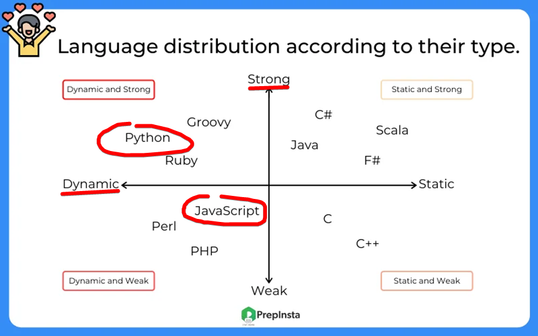
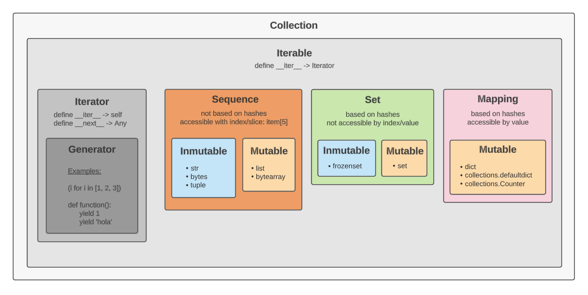
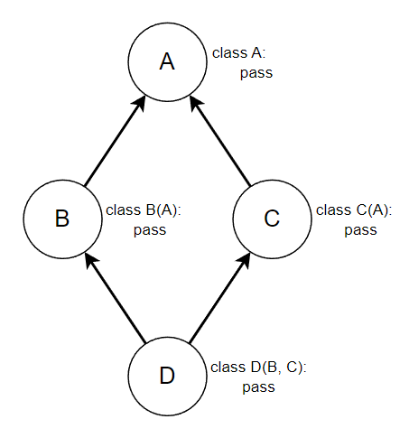
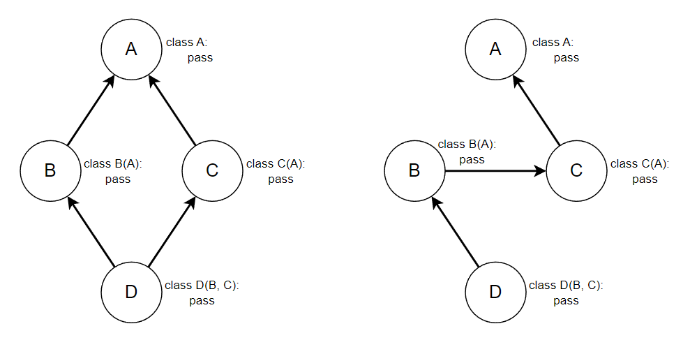
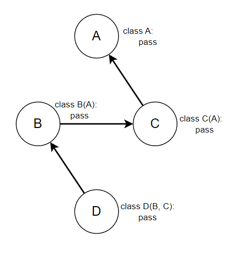
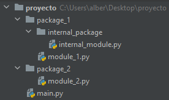

# Guía de Python

## Índice

1. [Tipos de datos](#1-tipos-de-datos)
   1. [Tipos más usados](#11-tipos-más-usados)
   2. [Tranformación de tipos](#12-tranformación-de-tipos)
   3. [Cadenas (Strings)](#13-cadenas-strings)
      1. [Formateo/interpolación de cadenas](#131-formateointerpolación-de-cadenas)
   4. [Tuplas](#14-tuplas)
   5. [Listas](#15-listas)
   6. [Conjuntos](#16-conjuntos)
   7. [Diccionarios](#17-diccionarios)
   8. [Enumeraciones](#18-enumeraciones)
2. [Entrada y salida](#2-entrada-y-salida)
   1. [Consola](#21-consola)
   2. [Archivos](#22-archivos)
3. [Condicionales](#3-condicionales)
4. [Bucles](#4-bucles)
   1. [Listas por comprensión](#41-listas-por-comprensión)
   2. [Generadores](#42-generadores)
5. [Funciones](#5-funciones)
   1. [Funciones sin argumentos](#51-funciones-sin-argumentos)
   2. [Funciones con argumentos](#52-funciones-con-argumentos)
   3. [Argumentos por defecto](#53-argumentos-por-defecto)
   4. [Argumentos posicionales y argumentos nombrados](#54-argumentos-posicionales-y-argumentos-nombrados)
   5. [Número indeterminado de argumentos](#55-número-indeterminado-de-argumentos)
   6. [Funciones anónimas](#56-funciones-anónimas)
   7. [Funciones generadoras](#57-funciones-generadoras)
6. [Excepciones](#6-excepciones)
7. [Clases](#7-clases)
   1. [Atributos](#71-atributos)
      1. [Propiedades](#711-propiedades)
      2. [Atributos estáticos](#712-atributos-estáticos)
   2. [Métodos](#72-métodos)
      1. [Métodos especiales](#721-métodos-especiales)
      2. [Métodos estáticos](#722-métodos-estáticos)
      3. [Métodos de clase](#723-métodos-de-clase)
   3. [Herencia](#73-herencia)
      1. [Clases abstractas](#731-clases-abstractas)
      2. [Herencia múltiple](#732-herencia-múltiple)
8. [Importaciones](#8-importaciones)
9. [Anotaciones de tipos](#9-anotaciones-de-tipos)
10. [Empaquetado y desempaquetado](#10-empaquetado-y-desempaquetado)
    1. [Empaquetado y desempaquetado en funciones](#101-empaquetado-y-desempaquetado-en-funciones)
11. [Convenciones de estilo](#11-convenciones-de-estilo)
    1. [PascalCase y snake_case](#111-pascalcase-y-snake_case)
    2. [Nombres privados](#112-nombres-privados)
    3. [Nombres ya existentes](#113-nombres-ya-existentes)

<br>

## 1. Tipos de datos

Python es un lenguaje de tipado **fuerte** y **dinámico**. A diferencia de otros lenguajes de tipado más débil, en Python cada valor contenido en una variable tienen su tipo y operaciones bien definidas y existen restricciones firmes a la hora de combinar dichos tipos de datos cuando se operan con ellos. En un lenguaje de tipado fuerte cuando se usan tipos distintos en una operación no soportada se produce un error en vez de realizarse transformaciones implícitas de datos.

Ejemplo:

JavaScript

```javascript
>>> 2 + "3"
'23'
>>> 2 * "3"
6
>>> [] + {}
'[object Object]'
>>> {} + []
0
```

Python

```python
>>> 2 + "3"
Traceback (most recent call last):
  File "<stdin>", line 1, in <module>
TypeError: unsupported operand type(s) for +: 'int' and 'str'
```

Python es **dinámico** porque las variables no tienen tipo, sino su contenido. Una variable no es más que un nombre que apunta o referencia a un valor, el cual siempre tiene tipo. Sin embargo, dicha referencia puede cambiar y apuntar a otro valor (cambia su contenido).

```python
>>> house = 5
>>> house = 'hello'
>>> house
'hello'
```

```python
>>> house = 5
>>> house
5
>>> type(house)
<class 'int'>
>>> house = 'hello'
>>> house
'hello'
>>> type(house)
<class 'str'>
```



<br>

### 1.1. Tipos más usados

```python
name = 5  # integer
name = 5.1  # float
name = True  # boolean (True/False)
name = 'hello'  # string
name = (1, 2, 'bye')  # tuple
name = [1, 2, 'bye']  # list
name = {1, 2, 'bye'}  # set
name = {1: 2, 'hello': 'world', 'a': 48.34, 48.34: 'a'}  # dictionary
```



<br>

### 1.2. Tranformación de tipos

Realmente no transformamos los datos pero podemos servirnos de las [funciones integradas](https://docs.python.org/3/library/functions.html) en el lenguaje para construir unos tipos de datos a partir de otros.

```python
>>> text = '45'
>>> number = int(text)
>>> number
45
>>> str(number)
'45'
>>> float(number)
45.0
>>> list('hello world')
['h', 'e', 'l', 'l', 'o', ' ', 'w', 'o', 'r', 'l', 'd']
>>> elements = ('tuple', 'elements', ';)')
>>> elements
>>> ('tuple', 'elements', ';)')
>>> list(elements)
['tuple', 'elements', ';)']
>>> set(elements)
{'elements', ';)', 'tuple'}
>>> keys_values = [(1, 'one'), (2, 'two'), ('a', 'b')]
>>> dict(keys_values)
{1: 'one', 2: 'two', 'a': 'b'}
```

<br>

### 1.3. Cadenas (Strings)

```python
>>> text = 'Hello WORLD'
>>> text[0]
'H'
>>> text[4]
'o'
>>> text[-1]
'D'
>>> text[2:8]
'llo WO'
>>> text[2:8:2]
'loW'
>>> text[3:]
'lo WORLD'
>>> text[:]
'Hello WORLD'
>>> text[::-1]
'DLROW olleH'
```

Las cadenas son **inmutables**:

```python
>>> text[0] = 'x'
Traceback (most recent call last):
  File "<stdin>", line 1, in <module>
TypeError: 'str' object does not support item assignment
```

Algunas funciones de las cadenas:

```python
>>> 'Hello WORLD'.lower()
'hello world'
```
```python
>>> 'Hello WORLD'.upper()
'HELLO WORLD'
```
```python
>>> 'Hello WORLD'.capitalize()
'Hello world'
```
```python
>>> 'Hello WORLD'.title()
'Hello World'
```
```python
>>> 'hello world'.islower()
True
```
```python
>>> 'Hello WORLD'.isupper()
False
```
```python
>>> 'hello world'.isspace()
False
>>> '       '.isspace()
True
```
```python
>>> 'hello'.count('l')
2
>>> 'hello'.count('hel')
1
```
```python
>>> 'hello'.startswith('x')
False
>>> 'hello'.startswith('hel')
True
```
```python
>>> 'hello'.endswith('o')
True
```
```python
>>> 'hello world'.find('o')
4
>>> 'hello world'.find('world')
6
>>> 'hello world'.find('x')
-1
```
```python
>>> 'hello world'.index('o')
4
>>> 'hello world'.index('world')
6
>>> 'hello world'.index('x')
Traceback (most recent call last):
  File "<stdin>", line 1, in <module>
ValueError: substring not found
```
```python
>>> ', '.join(['one', 'two', 'three', 'four'])
'one, two, three, four'
>>> '-YEAH-'.join(['one', 'two', 'three', 'four'])
'one-YEAH-two-YEAH-three-YEAH-four'
```
```python
>>> '    hello  '.strip()
'hello'
>>> '    hello  hellll'.strip('l')
'    hello  he'
```
```python
>>> elements = 'hello world, one two'.split()
>>> elements
['hello', 'world,', 'one', 'two']
>>> len(elements)
4
>>> elements = 'hello world, one two'.split(',')
>>> elements
['hello world', ' one two']
>>> len(elements)
2
```
```python
>>> 'hello'.replace('l', 'g')
'heggo'
>>> 'hello'.replace('ell', '-')
'h-o'
```

<br>

#### 1.3.1. Formateo/interpolación de cadenas

Siempre que necesitemos concatenar cadenas, unirlas, mezclar texto de cadenas y variables para construir una cadena final, etc. vamos a usar las llamadas `f-strings`. Es el método más moderno, legible, eficiente y potente para formatear cadenas.

Solo hay que poner una `f` antes de la cadena.

```python
print(f'2 + 1 = {2 + 1}')
```
Salida:
```
2 + 1 = 3
```

<br>

```python
name = 'Juan'
age = 1400
print(f'Hello! My name is {name} and I am {age} years old.')
```
Salida:
```
Hello! My name is Juan and I am 1400 years old.
```

Si no pusieramos la `f`:

```python
name = 'Juan'
age = 1400
print('Hello! My name is {name} and I am {age} years old.')
```
Salida:
```
Hello! My name is {name} and I am {age} years old.
```

Si por alguna razón necesitáramos construir una plantilla para, posteriormente en otra parte del código, llenar esa plantilla con valores, usaríamos el método `format()` de las cadenas.

```python
text = 'Hello! My name is {} and I am {} years old.'
...
print(text.format('Juan', 1400))
```
Salida:
```
Hello! My name is Juan and I am 1400 years old.
```

<br>

```python
text = 'Hello! My name is {1} and I am {0} years old.'
...
print(text.format('Juan', 1400))
```
Salida:
```
Hello! My name is 1400 and I am Juan years old.
```

<br>

```python
text = 'Hello! My name is {name} and I am {age} years old.'
...
print(text.format(age=1400, name='Juan'))
```
Salida:
```
Hello! My name is Juan and I am 1400 years old.
```

<br>

### 1.4. Tuplas

Las tuplas son colecciones de elementos inmutables menos potentes y flexibles que las listas, esto le permite un manejo más eficiente de la memoria en la mayoría de los casos. Aunque usar una tupla en vez de una lista en Python sería una microptimización superflua con un impacto despreciable, no está de más pensar en usar una tupla cuando definimos una colección de elementos que sabemos que no va a ser alterada nunca más, ya que nos sobraría toda la sobrecarga que aportan las listas.

Se crean con los paréntesis `(` `)`. Pero hay que tener en cuenta que este carácter también se usa para agrupar operaciones: `()` es una tupla vacía, pero cuando escribimos `(1)` no estamos creando una tupla, sino un entero `1`. Igual que `(1+2)` se interpreta así: `(1+2) -> (3) -> 3`. Para solucionar esto usamos la `,`:

```python
>>> elements = ()
>>> type(elements)
<class 'tuple'>
>>> elements = ('hello')
>>> elements
'hello'
>>> type(elements)
<class 'str'>
>>> elements = ('hello',)  # note the comma
>>> elements
('hello',)
>>> type(elements)
<class 'tuple'>
>>> (1 + 2) * 3
9
```

Uso de las tuplas:

```python
>>> elements = (0, 1, 2, 3, 'four', 5, 6, 'seven', 8, 9, 9, 9)
>>> len(elements)
12
>>> elements[0]
0
>>> elements[4]
'four'
>>> elements[-1]
9
>>> elements[2:8]
(2, 3, 'four', 5, 6, 'seven')
>>> elements[2:8:2]
(2, 'four', 6)
>>> elements[3:]
(3, 'four', 5, 6, 'seven', 8, 9, 9, 9)
>>> elements[:]
(0, 1, 2, 3, 'four', 5, 6, 'seven', 8, 9, 9, 9)
>>> elements[::-1]
(9, 9, 9, 8, 'seven', 6, 5, 'four', 3, 2, 1, 0)
```

Las tuplas son **inmutables**:

```python
>>> elements[0] = 'x'
Traceback (most recent call last):
  File "<stdin>", line 1, in <module>
TypeError: 'tuple' object does not support item assignment
```

Funciones de las tuplas:

```python
>>> elements = (0, 1, 'two', 3, 4, 'five', 'five again', 'five again')
>>> elements.index('two')
2
>>> elements.count('five again')
2
```

<br>

### 1.5. Listas

Las listas son una de las colecciones más útiles del lenguaje, se usan continuamente y estarán presentas en prácticamente cualquier programa Python. Funcionan en base al almacenamiento de objetos en bloques contiguos de memoria, por ello este tipo de estructura permite el acceso eficiente de los elementos mediante un índice que indica la posicion relativa dentro de la lista.

Las [cadenas](#13-cadenas-strings) y las [tuplas](#14-tuplas) también almacenan datos de forma contigua en memoria, pero las primeras almacenan carácteres y, las segundas, aunque almacenan objetos, son colecciones inmutables y más simples. Las listas tienen muchas más herramientas y métodos predefinidos, esto hace que sea algo menos eficientes en memoria en la mayoría de los casos pero, como dijimos en el apartado de las tuplas, sería despreciable.

```python
>>> elements = [0, 1, 2, 3, 'four', 5, 6, 'seven', 8, 9, 9, 9]
>>> len(elements)
12
>>> elements[0]
0
>>> elements[4]
'four'
>>> elements[-1]
9
>>> elements[2:8]
[2, 3, 'four', 5, 6, 'seven']
>>> elements[2:8:2]
[2, 'four', 6]
>>> elements[3:]
[3, 'four', 5, 6, 'seven', 8, 9, 9, 9]
>>> elements[:]
[0, 1, 2, 3, 'four', 5, 6, 'seven', 8, 9, 9, 9]
>>> elements[::-1]
[9, 9, 9, 8, 'seven', 6, 5, 'four', 3, 2, 1, 0]
```

Las listas son **mutables**:

```python
>>> elements[0] = 'x'
>>> elements
['x', 1, 2, 3, 'four', 5, 6, 'seven', 8, 9, 9, 9]
```

Algunas funciones de las listas:

```python
>>> elements = [0, 1, 'two', 3, 4, 'five', 'five again', 'five again']
```
```python
>>> elements.append('last')
>>> elements
[0, 1, 'two', 3, 4, 'five', 'five again', 'five again', 'last']
```
```python
>>> del elements[5]
[0, 1, 'two', 3, 4, 'five again', 'five again', 'last']
```
```python
>>> elements.remove('two')
>>> elements
[0, 1, 3, 4, 'five again', 'five again', 'last']
```
```python
>>> elements.insert(2, 'new two')
>>> elements
[0, 1, 'new two', 3, 4, 'five again', 'five again', 'last']
```
```python
>>> last = elements.pop()
>>> last
'last'
>>> elements
[0, 1, 'new two', 3, 4, 'five again', 'five again']  # pop remove the element
>>> second = elements.pop(2)
>>> second
'new two'
>>> elements
[0, 1, 3, 4, 'five again', 'five again']  # pop remove the element
```
```python
>>> elements.index(4)
3
```
```python
>>> elements.count('five again')
2
```
```python
>>> elements_copy = elements.copy()
```
```python
>>> elements.reverse()
>>> elements
['five again', 'five again', 4, 3, 1, 0]
```
```python
>>> elements.clear()
>>> elements
[]
```
```python
>>> elements_copy
[0, 1, 3, 4, 'five again', 'five again']
```

Cómo concatenar/fusionar varias listas:

```python
>>> elements_1 = ['one', False, 2.25, [0, 1, 2], 'last']
>>> elements_2 = ['a', 'b', 'c']
>>> new_elements = elements_1 + elements_2
>>> new_elements
['one', False, 2.25, [0, 1, 2], 'last', 'a', 'b', 'c']
>>> new_elements = [*elements_1, *elements_2]  # alternative
>>> new_elements
['one', False, 2.25, [0, 1, 2], 'last', 'a', 'b', 'c']  # same result
>>> new_elements = [0, 1, 2]
>>> new_elements.extend(elements_2)
>>> new_elements
[0, 1, 2, 'a', 'b', 'c']
```

<br>

### 1.6. Conjuntos

Los conjuntos (`set`) son estructuras de datos cuyos elementos se almacenan a través del cáclulo de [hashes](https://es.wikipedia.org/wiki/Funci%C3%B3n_hash). Los elementos que contienen se organizan según su hash, el cual indica en qué posición se guarda en la estructura, por lo tanto el orden de los elementos es arbitrario: por ejemplo, no mantienen el orden de entrada como las listas.

Se crean con las llaves `{` `}`. Pero hay que tener en cuenta que este carácter también se usa para crear diccionarios así que cuando escribimos `{}` no estamos creando un conjunto vacío, sino un diccionario vacío.

```python
>>> elements = {1}
>>> type(elements)
<class 'set'>
>>> elements = {}
>>> type(elements)
<class 'dict'>
```

Si queremos construir un conjunto vacío tendremos que recurrir a su constructor.

```python
>>> elements = set()
>>> type(elements)
<class 'set'>
```

Los conjuntos **no contienen elementos repetidos**, son estructuras pensadas para comprobar rápida y eficientemente si un elemento está o no en la estructura. Si se añade un elemento que ya existe no ocurrirá nada ni se producirá un error.

```python
>>> elements = {'five', (1, 2), 4, 3, 2, 1, 1, 1, 1, 0, 0, 0, 0, 0, 0, 0, 0, 0}
>>> elements
{0, 1, 2, 3, (1, 2), 'five', 4}
>>> elements.add('five')
>>> elements
{0, 1, 2, 3, (1, 2), 'five', 4}
```

No vamos a poder acceder a los elementos mediante un índice como pasaba en las listas.

```python
>>> elements = {1, 2, 3}
>>> elements[0]
Traceback (most recent call last):
  File "<stdin>", line 1, in <module>
TypeError: 'set' object is not subscriptable
```

Como funcionan mediante hashes solo pueden contener elementos hasheables que mantengan ese valor hash durante toda su vida, es decir, elementos que sean inmutables, ya que si se alteran también alterarían su hash (su "firma") y ocuparían otra posición dentro del conjunto como si fueran otro objeto.

```python
>>> elements = {['lists', 'are', 'mutable'], 1, 0}
Traceback (most recent call last):
  File "<stdin>", line 1, in <module>
TypeError: unhashable type: 'list'
```

Las listas son mutables, por lo tanto no son hasheables y no se pueden almacenar en conjuntos. En cambio las tuplas sí, porque son inmutables.

```python
>>> elements = {('tuples', 'are', 'inmutable'), 1, 0}
>>> elements
{0, ('tuples', 'are', 'inmutable'), 1}
```

Usos de los conjuntos:

```python
>>> names = ['Juan', 'Alberto', 'Elena', 'Juan', 'Juan', 'Ana', 'Elena']  # list
>>> unique_names = set(names)  # set
>>> len(unique_names)
4
>>> len(names) == len(unique_names)
False
>>> unique_names
{'Ana', 'Juan', 'Elena', 'Alberto'}
>>> unique_names.add('Pikachu')
>>> unique_names
{'Pikachu', 'Elena', 'Alberto', 'Ana', 'Juan'}
>>> 'Juan' in unique_names
True
>>> other_names = {'Elena', 'Juanita'}
>>> unique_names - other_names
{'Ana', 'Pikachu', 'Juan', 'Alberto'}
>>> unique_names.discard('Pikachu')
>>> unique_names
{'Elena', 'Alberto', 'Ana', 'Juan'}
>>> unique_names.clear()
>>> unique_names
set()
```

Cómo concatenar/fusionar varios conjuntos:

```python
>>> elements_1 = {'a', 'b', 'c', 'one', False, 2.25, (0, 1, 2), 'last'}
>>> elements_2 = {'a', 'b', 'c'}
>>> new_elements = elements_1 | elements_2
>>> new_elements
{'b', False, 2.25, 'one', 'c', 'a', (0, 1, 2), 'last'}
>>> new_elements = {*elements_1, *elements_2}  # alternative
>>> new_elements
{'b', False, 2.25, 'one', 'c', 'a', (0, 1, 2), 'last'}  # same result
>>> new_elements = {0, 1, 2}
>>> new_elements.update(elements_2)
>>> new_elements
{0, 1, 2, 'b', 'a', 'c'}
```

<br>

### 1.7. Diccionarios

Los diccionarios, junto a las listas, son las colecciones más importantes y útiles del lenguaje. La gestión de elementos se va a hacer, casi siempre, mediante el uso de listas o diccionarios:

- **listas:** cuando únicamente nos interesen los valores en sí.
- **diccionarios:** cuando nos sea útil relacionar un valor con un nombre o clave.

Los diccionarios, además, funcionan mediante hashes, como los conjuntos, consiguiendo con ello un acceso eficiente a los datos mediante la clave, la cual debe ser hasheable (los valores asociados a dichas claves no tienen que serlo).

```python
>>> elements = {'first': 1, 'second': 2.2, 3: 'third', 4: 4}
```

```python
>>> len(elements)
4
```
```python
>>> elements['second']
2.2
```
```python
>>> elements['x']
Traceback (most recent call last):
  File "<stdin>", line 1, in <module>
KeyError: 'x'
```
```python
>>> elements.get('x')
None
>>> elements.get('x', 'NOP')
'NOP'
```
```python
>>> elements['second'] = "now it's me, Mario!"
>>> elements
{'first': 1, 'second': "now it's me, Mario!", 3: 'third', 4: 4}
```
```python
>>> del elements['second']
>>> elements
{'first': 1, 3: 'third', 4: 4}
```
```python
>>> elements.keys()
dict_keys(['first', 3, 4])
>>> list(elements.keys())
['first', 3, 4]
```
```python
>>> elements.values()
dict_values([1, 'third', 4])
>>> list(elements.values())
[1, 'third', 4]
```
```python
>>> elements.items()
dict_items([('first', 1), (3, 'third'), (4, 4)])
>>> list(elements.items())
[('first', 1), (3, 'third'), (4, 4)]
```
```python
>>> element = elements.pop('first')
>>> element
1
>>> elements
{3: 'third'}
>>> element = elements.pop('x')
Traceback (most recent call last):
  File "<stdin>", line 1, in <module>
KeyError: 'x'
>>> element = elements.pop('x', 'NOOOOP')
>>> element
'NOOOOP'
>>> elements
{3: 'third'}
```
```python
>>> elements_copy = elements.copy()
```
```python
>>> elements.clear()
>>> elements
{}
```
```python
>>> elements_copy
{'first': 1, 3: 'third'}
```

Cómo concatenar/fusionar varios diccionarios:

```python
>>> elements_1 = {'one': 'two', False: 5, 2.25: 1.121}
>>> elements_2 = {'one': 'THREE', 'c': 'd'}
>>> new_elements = elements_1 | elements_2
>>> new_elements
{'one': 'THREE', False: 5, 2.25: 1.121, 'c': 'd'}
>>> new_elements = {**elements_1, **elements_2}  # alternative
>>> new_elements
{'one': 'THREE', False: 5, 2.25: 1.121, 'c': 'd'}  # same result
>>> new_elements = {0:1, 1:2, 2:3}
>>> new_elements.update(elements_2)
>>> new_elements
{0: 1, 1: 2, 2: 3, 'one': 'THREE', 'c': 'd'}
```

Nótese que si se introducen varios valores para una misma clave, el último sobrescribirá los anteriores.

<br>

### 1.8. Enumeraciones

Las enumeraciones son unas herramientas bastantes comunes en numerosos lenguajes de programación que nos sirven para definir un conjunto inmutable de constantes con nombre.

Los solemos usar siempre que necesitamos definir un comportamiento que depende de una constante. Por ejemplo, si queremos que una función realice una serie de tareas según el color pasado como argumento:

```python
def do_something(color: str):
    if color == 'red':
        ...
    elif color == 'blue':
        ...
    elif color == 'green':
        ...
    ...
```

Vamos a tener que pasarle una cadena para indicar el color, sin embargo, esto tiene muchos problemas. Para empezar, si usamos cadenas podemos cometer errores ortográficos y escribir `bleu` en vez de `blue`, ya que ambos valores son válidos pero solo uno tiene sentido en nuestro contexto.

Las enumeraciones no son más que [clases](#7-clases) que [heredan](#73-herencia) de `Enum`:

```python
from enum import Enum


class Color(Enum):
    RED = 1
    GREEN = 2
    BLUE = 3


def do_something(color: Color):
    if color == Color.RED:
        ...
    elif color == Color.GREEN:
        ...
    elif color == Color.BLUE:
        ...
    ...
```

Al estar limitando la existencia de constantes mediante la clase `Color`, estamos eliminando la posibilidad de usar valores que no existen en la enumeración, como pasaba con las cadenas. Esto también posibilita al entorno de desarrollo proporcionar autocompletado para los valores de la enumeración. Además, si en un futuro queremos cambiar los valores de la enumeración, no hay que ir buscando en todas las partes del código donde se usan cadenas 'red', 'blue' y 'green' para actualizarlas y mantener la consistencia.

Las `Enum` relacionan un nombre con un valor. En nuestro último ejemplo relacionamos `RED` con el valor 1, `GREEN` con el 2 y `BLUE` con el 3. Podemos generar valores automáticos de la siguiente manera:

```python
from enum import Enum, auto


class Color(Enum):
    RED = auto()
    GREEN = auto()
    BLUE = auto()
```

`auto()` genera valores predeterminados. Tiene como primer valor 1 y los siguientes irán incrementándose. En este caso obtenemos el mismo resultado que antes: `RED` = 1, `GREEN` = 2 y `BLUE` = 3.

<br>

Atributos de las `Enum`:

```python
print(Color.RED)
print(Color.RED.name)
print(Color.RED.value)
```
Salida:
```
Color.RED
RED
1
```

<br>

Búsqueda de enumeraciones por valor:

```python
print(Color(2))
```
Salida:
```
Color.GREEN
```

<br>

Búsqueda de enumeraciones por nombre:

```python
print(Color['RED'])
```
Salida:
```
Color.RED
```

<br>

## 2. Entrada y salida

### 2.1. Consola

Para trabajar con la consola usamos dos de las llamadas [funciones integradas](https://docs.python.org/3/library/functions.html):

- `print()` salida
- `input()` entrada

```python
text = input('Give me a number: ')
print('thank you')
```
Consola:
```
Give me a number: 
```
Escribimos en la consola "7":
```
Give me a number: 7
```
Consola:
```
Give me a number: 7
thank you
```

Nótese que input recibe siempre texto (string).

<br>

### 2.2. Archivos

Para abrir archivos podemos usar `open()`, una [función integrada](https://docs.python.org/3/library/functions.html).

```python
file = open('file.txt')
# file is open here
text = file.read()
file.close()
# file is closed here
```

Sin embargo, la forma recomendada es usar gestores de contexto. 

```python
with open('file.txt') as file:
    # file is open here
    text = file.read()
# file is closed here
```

No entraremos en detalle pero básicamente la palabra reservada `with` define un gestor de contexto. En este caso mantiene el archivo abierto hasta que sale del bloque y si ocurre cualquier error o sale el programa, Python se encargará de cerrar el archivo correctamente antes de salir.

`open()` tiene varios [parámetros](https://docs.python.org/3/library/functions.html#open), pero los más importantes son `file`, que es el cual indica la ubicación del archivo, y `mode`, con el que le decimos en que modo queremos que abra el archivo (lectura, escritura, texto, bytes, etc.). Si no especificamos el parámetro `mode` por defecto se abrirá en modo lectura de texto.

Leer texto:
```python
with open('file.txt') as file:  # nothing or 'r' or 'rt'
    text = file.read()
```
Leer bytes:
```python
with open('file.png', 'rb') as file:
    data = file.read()
```
Escribir texto:
```python
with open('file.txt', 'w') as file:  # 'w' or 'wt'
    file.write('hello')
```
Escribir bytes:
```python
with open('file.png', 'wb') as file:
    file.write(b'\x45\x44\x50\x52\x45\x53\x53\x4f')
```

Finalmente vamos a ver la última alternativa. Es igual de segura que usar los gestores de contexto vistos arriba.

Importamos `pathlib`:
```python
import pathlib
```
Leer texto:
```python
text = pathlib.Path('file.txt').read_text()
```
Leer bytes:
```python
text = pathlib.Path('file.png').read_bytes()
```
Escribir texto:
```python
pathlib.Path('file.txt').write_text('hello')
```
Escribir bytes:
```python
pathlib.Path('file.png').write_bytes(b'\x45\x44\x50\x52\x45\x53\x53\x4f')
```

<br>

## 3. Condicionales

```python
number = 82
numbers = [0, 1, 2, 3, 4, 5, 6]
condition_1 = True
condition_2 = False
condition_3 = True

if number == 82:  # compares the value of two objects
    print('a')
elif number != 82:
    print('b')
elif number is condition_1:  # checks memory reference of two objects
    print('c')
elif number in numbers:
    print('d')
elif number < 2:
    print('e')
elif 12 < number <= 30:
    print('f')
elif condition_1:
    print('g')
elif not condition_1 and condition_2 or condition_3:
    print('h')
else:
    print('i')

print('always')
```

En Python todos los bloques se indican con el nivel de tabulaciones después de "**:**".

En el código anterior `print('i')` está dentro de la cláusula o bloque `else` porque tiene 1 tabulación (4 espacios es lo más usado). En cambio `print('always')` está fuera del `else` y se ejecutará siempre sin importar las condicionales. 

No es necesario poner paréntesis en las condiciones: 

❌ `if (n<2):`

✅ `if n<2:`

Hasta hace poco no existía una cláusula parecida a los `switch` de otros lenguajes. Python tiene una herramienta mucho más potente llamada [Structural Pattern Matching](https://peps.python.org/pep-0636/) en la cual no se entrará en detalle pero que puede usarse como un `switch` tradicional.

```python
number = 7
match number:
    case 1:
        ...
    case 2:
        ...
    case _:  # default case
        ...
```

```python
number = 7
name = 'Alberto'
match number, name:
    case 1, 'Juan':
        ...
    case 2, _:
        ...
    case _:  # default case
        ...
```

<br>

## 4. Bucles

En Python muy raramente se necesitan los bucles `while`.

```python
condition = True
while condition:
    ...
```

```python
i = 0
while i < 10:
    ...
    i += 1
```

La forma más utilizada, legible y ajustada a las técnicas de programación modernas para recorrer estructuras o repetir codigo viene dada por los bucles `for`. Con `for` se van a poder resolver el 99% de los casos. Es bueno intentar ir siempre con la mentalidad de hacer cualquier iteración o repetición con `for` por las ventajas que ofrece la potente y flexible sintaxis de Python.

Hay que tener en cuenta que los `for` en Python se podrían comparar con los `foreach` que existen en otros lenguajes donde se tienen un `for` y un `foreach`. Por ejemplo:

<br>

**C#**

`for`
```cs
string[] words = {"hello", "world", "Juan", "bye"};
for (int i = 0; i < words.Length; i++)
{
    Console.WriteLine(words[i]);
}
```
Salida por consola:
```
hello
world
Juan
bye
```

<br>

`foreach`
```cs
string[] words = {"hello", "world", "Juan", "bye"};
foreach (string word in words)
{
    Console.WriteLine(word);
}
```
Salida por consola:
```
hello
world
Juan
bye
```

<br>

**Python**

```python
words = ['hello', 'world', 'Juan', 'bye']
for word in words:
    print(word)
```
Salida por consola:
```
hello
world
Juan
bye
```

<br>

❌ **Nunca** iterar sobre los elementos de un iterable simulando los antiguos `for` de otros lenguajes:

```python
words = ['hello', 'world', 'Juan', 'bye']
for i in range(len(words)):
    print(words[i])
```
Salida por consola:
```
hello
world
Juan
bye
```
Acabamos de usar la [función integrada](https://docs.python.org/3/library/functions.html) `range()`.

```python
>>> range(10)
range(0, 10)
>>> list(range(10))
[0, 1, 2, 3, 4, 5, 6, 7, 8, 9]
>>> list(range(3, 10))
[3, 4, 5, 6, 7, 8, 9]
>>> list(range(10, -1, -1))
[10, 9, 8, 7, 6, 5, 4, 3, 2, 1, 0]
```

`range()` sirve para crear un generador de números enteros el cual se puede iterar. En el ejemplo anterior los iteramos creando listas para verlo con más claridad. Esta función tiene 3 parámetros:

- start: empezar desde este valor (**inclusive**)
- stop: hasta este (**no inclusive**)
- step: números de pasos o saltos

Si solo se proporciona 1 argumento se interpreta como parámetro `stop` y, por defecto, `start`=0 y `step`=1.

`range()` se comporta igual que el acceso a segmentos de listas mediante [slices](https://docs.python.org/3/glossary.html#term-slice):

```python
>>> list(range(4, 10, 2))
[4, 6, 8]
>>> [0, 1, 2, 3, 4, 5, 6, 7, 8, 9][4:10:2]
[4, 6, 8]
```

<br>

Recapitulando: nunca usar `range` para iterar una colección de elementos.

❌
```python
words = ['hello', 'world', 'Juan', 'bye']
for i in range(len(words)):
    print(words[i])
```
✅
```python
words = ['hello', 'world', 'Juan', 'bye']
for word in words:
    print(word)
```

Si se necesita gestionar un índice numérico como contador, se puede usar la función `enumerate` que devuelve un par (índice, elemento):
```python
words = ['hello', 'world', 'Juan', 'bye']
for i, word in enumerate(words):
    print(i, word)
```
Salida por consola:
```
0 hello
1 world
2 Juan
3 bye
```

<br>

#### Sentencia `break`

`break` rompe el bucle y sale de él:

```python
words = ['hello', 'world', 'Juan', 'bye']
for word in words:
    if word == 'Juan':
        break

    print(word)

print('- end -')
```
Salida por consola:
```
hello
world
- end -
```

<br>

#### Sentencia `continue`

`continue` abandona la iteración actual y continúa con la siguiente, si la hubiera:

```python
words = ['hello', 'world', 'Juan', 'bye']
for word in words:
    if word == 'Juan':
        continue

    print(word)

print('- end -')
```
Salida por consola:
```
hello
world
bye
- end -
```

<br>

#### Cláusula `else`:
```python
words = ['hello', 'world', 'Juan', 'bye']
for word in words:
    print(word)
else:
    print('---> else <---')
print('- end -')
```
Salida por consola:
```
hello
world
Juan
bye
---> else <---
- end -
```

<br>

```python
words = ['hello', 'world', 'Juan', 'bye']
for word in words:
    if word == 'Juan':
        break

    print(word)
else:
    print('---> else <---')
print('- end -')
```
Salida por consola:
```
hello
world
- end -
```

<br>

```python
words = []
for word in words:
    if word == 'Juan':
        break

    print(word)
else:
    print('---> else <---')
print('- end -')
```
Salida por consola:
```
---> else <---
- end -
```

<br>

### 4.1. Listas por comprensión

Python recoge ciertas ideas de la programación funcional, trayendo una sintaxis en una sola línea para crear generadores, listas, conjuntos y diccionarios.

```python
numbers = [0, 1, 2, 3, 4, 5]
numbers_x2 = [number * 2 for number in numbers]
print(numbers_x2)
```
Salida:
```
[0, 2, 4, 6, 8, 10]
```

Alternativa usando `for` normales:

```python
numbers = [0, 1, 2, 3, 4, 5]
numbers_x2 = []
for number in numbers:
    numbers_x2.append(number * 2)
print(numbers_x2)
```
Salida:
```
[0, 2, 4, 6, 8, 10]
```

Si quiesiéramos filtrar los valores pares de una lista de números podríamos hacerlo.

```python
numbers = [0, 1, 2, 3, 4, 5]
even_numbers = [number for number in numbers if number % 2 == 0]
print(even_numbers)
```
Salida:
```
[0, 2, 4]
```

Alternativa usando `for` normales:

```python
numbers = [0, 1, 2, 3, 4, 5]
even_numbers = []
for number in numbers:
    if number % 2 == 0:
        even_numbers.append(number)
print(even_numbers)
```
Salida:
```
[0, 2, 4]
```

<br>

### 4.2. Generadores

¿Cómo podemos definir una sucesión de elementos sin almacenarlos en memoria en una lista u otra estructura? Imaginemos que queremos iterar 1 millón de elementos, pero crear una lista con 1 millón de elementos para iterarlos es demasiado costoso. En estos casos vamos a necesitar generadores, que no son más que "normas" o "reglas" que definen sucesiones de elementos u objetos.

Por ejemplo `range()` te devuelve un generador:

```python
>>> range(1_000_000)
range(0, 1000000)
```

> En python, los números se pueden separar con `_` por legibilidad. No tienen ningún efecto.
> ```python
> >>> 5_746_2341.15_44
> 57462341.1544
> ```

Un generador de pocos elementos va a ocupar en memoria lo mismo que un generador de muchos elementos, ya que solo son líneas de codigo o lógica que especifican una sucesión, no los elementos en sí.

Recordemos las listas por comprensión calculando los cuadrados de unos elementos:

```python
>>> elements = [1, 5, 8, 4, 9, 4]
>>> new_elements = [i ** 2 for i in elements]
>>> new_elements
[1, 25, 64, 16, 81, 16]
```

Si usamos paréntesis `(` `)` en vez de corchetes `[` `]`, obtenemos un generador:

```python
>>> elements = [1, 5, 8, 4, 9, 4]
>>> generator = (i ** 2 for i in elements)
>>> generator
<generator object <genexpr> at 0x00000180F51304A0>
>>> list(generator)
[1, 25, 64, 16, 81, 16]
```

El generador es consumido para generar una lista. Si intentamos volver a consumir el generador consumido:

```python
>>> list(generator)
[]
```

> Podríamos esperar que al hacer una lista por comprensión con paréntesis `(` `)` en vez de corchetes `[` `]`, obtuviéramos una tupla por comprensión en vez de un generador, pero no es así. Si queremos crear una tupla por comprensión podríamos hacer esto:
> ```python
> >>> elements = [1, 5, 8, 4, 9, 4]
> >>> tuple(i ** 2 for i in elements)
> (1, 25, 64, 16, 81, 16)
>```
> Hemos pasado un generador a la [función integrada](https://docs.python.org/3/library/functions.html) `tuple()` para crear una tupla.
> 
> En este caso también podemos observar que los paréntesis no son necesarios. No hacemos:
> ```python
> tuple((i ** 2 for i in elements))
> ```
> sino:
> ```python
> tuple(i ** 2 for i in elements)
> ```
> Realmente el generador es lo que hay dentro de los paréntesis. Si ya está agrupado en unos, no hace falta poner otros.

Podemos iterar manualmente un generador (o iterador) con la [función integrada](https://docs.python.org/3/library/functions.html) `next()`:

```python
>>> elements = [1, 5, 8, 4, 9, 4]
>>> generator = (i ** 2 for i in elements)
>>> next(generator)
1
>>> next(generator)
25
>>> next(generator)
64
>>> next(generator)
16
>>> next(generator)
81
>>> next(generator)
16
>>> next(generator)
Traceback (most recent call last):
  File "<stdin>", line 1, in <module>
StopIteration
```

> Podemos crear un iterador de cualquier iterable con la [función integrada](https://docs.python.org/3/library/functions.html) `iter()`:
> ```python
> >>> elements = [1, 5, 8, 4, 9, 4]
> >>> iter(elements)
> <list_iterator object at 0x00000180F515AFE0>
> >>> next(iter(elements))
> 1
> ```
> Un generador es un iterador. Ver el diagrama del apartado [tipos más usados](#11-tipos-más-usados).

Más tarde veremos las [funciones generadoras](#57-funciones-generadoras).

<br>

## 5. Funciones

Las funciones sirven para agrupar código que se va a ejecutar en distintos lugares. Siempre hay que evitar repetir código y, al usar funciones y mantener todo en un mismo lugar, podremos hacer cambios una sola vez y producir un impacto en esos otros lugares donde se llama a la función.

Un ejemplo sin usar funciones: imaginemos una aplicación donde tenemos una lista de diccionarios con datos de personas y nos dicen que tenemos que hacer un algoritmo que busque a Juan y a Ana y haga algo con sus datos. En este ejemplo vamos a sumar sus edades e imprimirlo por consola.

```python
people = [
    {'id': 1, 'name': 'Juan', 'age': 25},
    {'id': 21, 'name': 'Elena', 'age': 400},
    {'id': 452, 'name': 'Ana', 'age': 4},
    {'id': 621, 'name': 'Alberto', 'age': 72},
    {'id': 705, 'name': 'Mario', 'age': 30}
]

name = 'Juan'
person_found_1 = None
for person in people:
    if person['name'] == name:
        person_found_1 = person
        break

name = 'Ana'
person_found_2 = None
for person in people:
    if person['name'] == name:
        person_found_2 = person
        break

if person_found_1 and person_found_2:
    print(person_found_1['age'] + person_found_2['age'])
else:
    print('someone is missing')
```
Salida:
```
29
```

Ahora imaginemos que nuestro jefe nos dice que buscar las personas por su nombre es inapropiado porque dos personas pueden tener el mismo nombre y nos pide que busquemos por id. Ahora tendríamos que ir a todas las partes del código donde busquemos por nombre y cambiarlo por id. Este caso es muy sencillo, pero si lo aplicáramos a una aplicación real, acabaríamos con varias zonas del código que debieran hacer lo mismo y resulta que no, porque a alguien se le olvidó cambiar una parte. Es en estos momentos cuando tenemos que usar funciones.

Si queremos devolver un valor en una función usamos `return`. Esta sentencia rompe su ejecución y devuelve lo que tenga a su derecha. Toda función devuelve algo, si no se especifica un `return`, se devuelve `None` automáticamente.

```python
def find_person(name):
    for person in people:
        if person['name'] == name:
            return person


people = [
    {'id': 1, 'name': 'Juan', 'age': 25},
    {'id': 21, 'name': 'Elena', 'age': 400},
    {'id': 452, 'name': 'Ana', 'age': 4},
    {'id': 705, 'name': 'Alberto', 'age': 72},
    {'id': 621, 'name': 'Mario', 'age': 30}
]

person_found_1 = find_person('Juan')
person_found_2 = find_person('Ana')

if person_found_1 and person_found_2:
    print(person_found_1['age'] + person_found_2['age'])
else:
    print('someone is missing')
```
Salida:
```
29
```

<br>

### 5.1. Funciones sin argumentos

```python
def print_person():
    name = 'Juan'
    age = 25
    print(f"My name is {name} and I'm {age} years old.")


print_person()
```
Salida:
```
My name is Juan and I'm 25 years old.
```

Podemos usar variables de ámbitos exteriores dentro de la función.

```python
def print_person():
    print(f"My name is {name} and I'm {age} years old.")


name = 'Juan'
age = 25
print_person()
```
Salida:
```
My name is Juan and I'm 25 years old.
```

Pero no al revés. Las variables creadas localmente en una función solo existen ahí:

```python
def print_person():
    name = 'Juan'
    age = 25
    print(f"My name is {name} and I'm {age} years old.")


print_person()
print()
print(name)
```
Salida:
```
My name is Juan and I'm 25 years old.

Traceback (most recent call last):
  File "main.py", line 9, in <module>
    print(name)
NameError: name 'name' is not defined
```

<br>

### 5.2. Funciones con argumentos

```python
def sum_numbers(number_1, number_2):
    return number_1 + number_2


result = sum_numbers(1, 9)
print(result)
```
Salida:
```
10
```


En Python todos los argumentos se pasan por referencia, así que hay que tener en cuenta que, si son objetos mutables, los cambios que les hagamos van a verse reflejados fuera de la función.

```python
def add_something(elements):
    elements.append('something')


numbers = [0, 1, 2]
add_something(numbers)
print(numbers)
```
Salida:
```
[0, 1, 2, 'something']
```

<br>

### 5.3. Argumentos por defecto

```python
def sum_numbers(number_1, number_2=100):
    return number_1 + number_2


print(sum_numbers(1, 5))
print(sum_numbers(1))
```
Salida:
```
6
101
```

Todos los parámetros que tengan argumentos por defecto deben estar a la derecha en la definición de la función:

```python
def sum_numbers(number_2=100, number_1):
    return number_1 + number_2


print(sum_numbers(1, 5))
print(sum_numbers(1))
```
Salida:
```
  File "main.py", line 1
    def sum_numbers(number_2=100, number_1):
                                  ^^^^^^^^
SyntaxError: non-default argument follows default argument
```

<br>

```python
def sum_numbers(number_2=100, number_1=0):
    return number_1 + number_2


print(sum_numbers(1, 5))
print(sum_numbers(1))
```
Salida:
```
6
1
```

<br>

Cuidado con los argumentos por defecto mutables: se definen una sola vez al inicio del programa:

```python
def add_something(elements=[]):
    elements.append('something')
    return elements


print(add_something())
print(add_something())
print(add_something())
print(add_something())
```

Podríamos pensar que lo anterior imprimiría por consola esto:

```
['something']
['something']
['something']
['something']
```

Sin embargo, esta es la realidad:

```
['something']
['something', 'something']
['something', 'something', 'something']
['something', 'something', 'something', 'something']
```

Si necesitáramos algun parámetro mutable por defecto (por ejemplo, una lista) podríamos que hacer lo siguiente:

```python
def add_something(elements=None):
    if elements is None:
        elements = []

    elements.append('something')
    return elements


print(add_something())
print(add_something())
print(add_something())
print(add_something())
```
Ahora sí que estamos creando una lista en el ámbito local de la función cada vez que la ejecutamos. Lo vemos en la consola:
```
['something']
['something']
['something']
['something']
```

<br>

### 5.4. Argumentos posicionales y argumentos nombrados

Imaginemos que tenemos esta función:

```python
def print_person(name, age):
    print(f"My name is {name} and I'm {age} years old.")
```

Cuando la llamemos le pasaremos argumentos posicionales (positional arguments):

```python
print_person('Ana', 25)
```

O argumentos nombrados (keyword arguments):

```python
print_person(name='Ana', age=25)
```

Al estar especificando los agumentos con nombre, podemos introducirlos en distinto orden y seguirá funcionando correctamente.

```python
print_person(age=25, name='Ana')
```
Salida:
```
My name is Ana and I'm 25 years old.
```

<br>

Podemos forzar la utilización del tipo de argumento que queramos en la definición de la función, aunque es un mecanismo que solo hay que usar si sabes muy bien lo que estas haciendo, ya que limitas el uso de tu función. Si estás empezando con este lenguaje no lo vas a necesitar.

```python
def print_person(name, /, second_name, *, age):
    print(f"My name is {name} {second_name} and I'm {age} years old.")
```

Todo argumento a la izquierda de `/` se tendrá que pasar forzosamente como argumento posicional.

Los argumentos entre `/` y `*` podrán pasarse de cualquier manera.

Y los argumentos a la derecha de `*` se tendrán que pasar como argumentos nombrados.

<br>

### 5.5. Número indeterminado de argumentos

Cuando definimos nuestra función podemos diseñarla para aceptar un número indeterminado de argumentos, incluso infinitos (si es que alguien lo consigue):

```python
def print_numbers(*args):
    print(args)


print_numbers(1, 54, 33, 27, 846, 151, 12, 64, 984)
```
Salida:
```
(1, 54, 33, 27, 846, 151, 12, 64, 984)
```

`args` es una tupla que contiene todos los argumentos.

En vez de `args` podemos poner el nombre que queramos pero se usa siempre ese por convenio.

Vamos a hacer otro ejemplo usando la [función integrada](https://docs.python.org/3/library/functions.html) `sum()`, que suma todos los elementos de un iterable.

```python
def sum_numbers(*args):
    return sum(args)


result = sum_numbers(1, 54, 33, 27, 846, 151, 12, 64, 984)
print(result)
```
Salida:
```
2172
```

<br>

Ahora definamos una fución con un número indeterminado de argumentos nombrados también:

```python
def print_things(number_1, number_2, *args, name, age, **kwargs):
    print(number_1)
    print(number_2)
    print(args)
    print(name)
    print(age)
    print(kwargs)


print_things(54, 12, 1, 2, 3, name='Mario', age=25, phone=123456789, dni='12345678X', dog_name='Gandalf')
```
Salida:
```
54
12
(1, 2, 3)
Mario
25
{'phone': 123456789, 'dni': '12345678X', 'dog_name': 'Gandalf'}
```

`kwargs`, en este caso, es un diccionario que contiene todos los argumentos nombrados restantes.

Igual que con `args`, podemos usar cualquier nombre en vez de `kwags`, pero este es el que se usa por convenio.

<br>

### 5.6. Funciones anónimas

Para entender este tipos de funciones vamos a ver varios ejemplos. Este primero que viene a continuación no es el mejor, pero nos va a servir para entender ciertos detalles:

```python
func = lambda x: x + 1
print(func(2))
```
Salida:
```
3
```

Las funciones anónimas se definen en una sola línea con la palabra reservada `lambda`. Usan como argumentos los especificados a la izquierda de los `:` y devuelven lo que esté a la derecha de los `:`  sin usar `return`. Sin embargo, como explicabamos antes, no es un buen ejemplo porque estamos asignando un nombre `func` a la función anónima, lo cual es contradictorio.

Ahora vamos a ver un uso realista de este tipo de funciones. Vamos a crear una función que busque y devuelva el primer elemento de un iterable `people` que cumpla una condición. Esta condición va a ser aplicada a cada elemento, por lo tanto va a ser una función.


```python
def filter_people(people_, condition):
    filtered_people_ = []
    for person in people_:
        if condition(person):
            filtered_people_.append(person)

    return filtered_people_


people = [
    {'id': 1, 'name': 'Juan', 'age': 25},
    {'id': 21, 'name': 'Elena', 'age': 400},
    {'id': 452, 'name': 'Ana', 'age': 4},
    {'id': 705, 'name': 'Alberto', 'age': 72},
    {'id': 621, 'name': 'Mario', 'age': 30}
]

filtered_people = filter_people(people, lambda person: person['age'] >= 30)
for filtered_person in filtered_people:
    print(filtered_person)
```
Salida:
```
{'id': 21, 'name': 'Elena', 'age': 400}
{'id': 705, 'name': 'Alberto', 'age': 72}
{'id': 621, 'name': 'Mario', 'age': 30}
```

Este es un buen caso donde se ve con claridad que es más cómodo crear una función anónima que definir una función normal, que no vamos a necesitar nunca más, y luego pasarla como argumento a otra función.

<br>

### 5.7. Funciones generadoras

Si simplemente usamos la sentencia `yield`, hacemos que una función se convierta en una función generadora:

```python
def something():
    yield 'hola'
    yield 45
    yield [1, 2]


print(something)
print(something())
print(list(something()))
```
Salida:
```
<function something at 0x00000183F13FF6D0>
<generator object something at 0x00000183F1396110>
['hola', 45, [1, 2]]
```

<br>

```python
def squares(elements_):
    for element in elements_:
        yield element ** 2


elements = [1, 5, 8, 4, 9, 4]

print(squares(elements))
for square in squares(elements):
    print(square)
print(list(squares(elements)))
```
Salida:
```
<generator object squares at 0x0000026A9DBB6030>
1
25
64
16
81
16
[1, 25, 64, 16, 81, 16]
```

Podemos usar la sentencia `yield from` para ayudarnos a devolver valores de otro iterable, ahorrándonos las sentencias `for` y `yield`:

```python
def yield_something(elements_):
    yield from elements_[2]
    yield from elements_[3]


elements = [0, 1, ['a', 'b', 'c'], 'hello']

for element in yield_something(elements):
    print(element)
```
Salida:
```
a
b
c
h
e
l
l
o
```

<br>

## 6. Excepciones

Si no especificamos una excepcion después de la cláusula `except`, capturará todo (no recomendado):

```python
elements = [0, 1, 2]
try:
    elements[7]
except:
    print('error')

print('- end -')
```
Salida:
```
error
- end -
```

Si queremos trabajar con la excepción que se ha lanzado, la capturamos y creamos un alias con `as`:

```python
elements = [0, 1, 2]
try:
    elements[7]
except Exception as e:
    print(e)
    print(type(e))

print('- end -')
```
Salida:
```
list index out of range
<class 'IndexError'>
- end -
```

Pero volvemos a capturar un excepción demasiado genérica, nunca vamos a querer eso. Tenemos que intentar capturar siempre la única excepción que esperamos para que no pasen desapercibidos otros errores.

Si miramos el [árbol de excepciones](https://docs.python.org/3/library/exceptions.html#exception-hierarchy) podemos ver todas las que existen. En este caso la excepción que ocurre es `IndexError` puesto que accedemos a la posición 7 de una lista que tiene 3 elementos.

```python
elements = [0, 1, 2]
try:
    elements[7]
except IndexError as e:
    print(e)
    print(type(e))

print('- end -')
```
Salida:
```
list index out of range
<class 'IndexError'>
- end -
```

Podemos concatenar cláusulas `except`:

```python
try:
    ...
except IndexError:
    ...
except ValueError as e:
    ...
except TypeError:
    ...
```

Lo recomendable es poner el menor número de líneas de código dentro del bloque `try` para capturar granularmente las excepciones que queramos donde queramos.

Imaginemos que tenemos una funcion `do_something_1()` y otra `do_something_2()`. Ambas pueden (no siempre) lanzar `ValueError`. Queremos ejecutar la segunda solo si la primera se ha ejecutado con éxito y solo queremos capturar si falla la primera.

Si hacemos lo siguiente estamos capturando el posible error de `do_something_2()` y no queremos eso:

```python
try:
    do_something_1()
    do_something_2()
except ValueError:
    print('ValueError caught!')
```

Si hacemos lo siguiente estamos ejecutando siempre `do_something_2()`, falle o no `do_something_1()`, y queríamos que se ejecutara la segunda solo si la primera se ejecutaba con éxito:

```python
try:
    do_something_1()
except ValueError:
    print('ValueError caught!')

do_something_2()
```

Para estos casos existe la cláusula `else`:

```python
try:
    do_something_1()
except ValueError:
    print('ValueError caught!')
else:
    do_something_2()
```

Y por último tenemos la cláusula `finally`. Todo lo que esté dentro del bloque `finally` se va a ejecutar sí o sí, falle o no falle alguna cosa en el `try` o si se lanza una excepción que no controlemos en ningún `except` y salga de la función o del contexto actual. Esto es útil para asegurar la liberación de recursos sensibles al cierre inesperado del programa.

```python
try:
    do_something_1()
except ValueError:
    print('ValueError caught!')
else:
    do_something_2()
finally:
    print('always')
```

<br>

## 7. Clases

### 7.1. Atributos

Para crear e inicializar atributos de los objetos definimos una función `__init__`, también llamada constructor. Este constructor es llamado usando el nombre de la clase como si fuera una función: `Person('Juan', 25, '123456789', 'Milo')` nos devolverá un objeto, también llamado instancia, de la clase.

```python
class Person:
    def __init__(self, name, age, phone, dog_name=None, dog_age=None):
        self.name = name
        self.age = age
        self.phone = phone
        self.dog_name = dog_name
        self.dog_age = dog_age


juan = Person('Juan', 25, '123456789', 'Milo')
print(juan.name)
print(juan.age)
print(juan.phone)
print(juan.dog_name)
print(juan.dog_age)
```
Salida:
```
Juan
25
123456789
Milo
None
```

Como se muestra, accedemos a los atributos del objeto con el operador `.`.

Los atributos de un objeto residen en un diccionario que crea Python internamente. Podemos acceder a él con la [función integrada](https://docs.python.org/3/library/functions.html) `vars()`. Esta función devuelve un diccionario:

```python
print(vars(juan))
```
Salida:
```
{'name': 'Juan', 'age': 25, 'phone': '123456789', 'dog_name': 'Milo', 'dog_age': None}
```

Pero hay que tener cuidado porque este diccionario es una referencia directa a los datos del objeto, es su "memoria".

```python
attributes = vars(juan)
print(attributes)
attributes['name'] = 'HELLO'
del attributes['age']
print(attributes)
```
Salida:
```
{'name': 'Juan', 'age': 25, 'phone': '123456789', 'dog_name': 'Milo', 'dog_age': None}
{'name': 'HELLO', 'phone': '123456789', 'dog_name': 'Milo', 'dog_age': None}
```

<br>

#### 7.1.1. Propiedades

Las propiedades son comparables a los "getters" y "setters" de otros lenguajes. Sirven para encapsular un acceso "prohibido" o para realizar una serie de pasos o cálculos internos cuando se accede o actualizan atributos de instancias.

Python es muy flexible, y en cuanto a la publicidad o privacidad de los atributos de objetos, todo es público. Existen [convenciones de estilo](#112-nombres-privados) que permiten indicar si un atributo no es recomendable usarse fuera del ámbito interno de la clase ( prefijar con `_` los nombres).

Ejemplo sencillo para ver la sintaxis:

```python
class Person:
    def __init__(self, name, age):
        self._id = age * 5 + 48
        self.name = name
        self.age = age

    @property
    def id(self):
        return self._id

    @id.setter
    def id(self, new_id):
        self._id = new_id


laura = Person('Laura', 27)

print(laura.id)
laura.id = 6
print(laura.id)
```
Salida:
```
183
6
```

No es obligatorio definir el "setter".

Y, como dijimos anteriormente, todo sigue siendo público así que seguiríamos pudiendo hacer esto:

```python
laura = Person('Laura', 27)

print(laura._id)
laura._id = 7
print(laura._id)
```
Salida:
```
183
7
```

Pero sería arriesgarse a romper el objeto que estés usando. Si el diseñador definió a conciencia ese atributo con el prefijo `_`, sería por alguna razón.

<br>

Vamos a ver otro ejemplo. Vamos a crear una clase `Person` que mantenga la edad de su perro siempre la mitad de la suya:

```python
class Person:
    def __init__(self, name, age, dog_name):
        self.name = name
        self.age = age
        self.dog_name = dog_name

    @property
    def age(self):
        return self._age

    @age.setter
    def age(self, age):
        self._age = age
        self.dog_age = self.age // 2  # integer division (no decimals)


laura = Person('Laura', 30, 'Perrito')

print(laura.age, laura.dog_age)
laura.age = 50
print(laura.age, laura.dog_age)
```
Salida:
```
30 15
50 25
```

Vemos como solo definimos en el constructor `self.age` pero también se inicializa `self.dog_age` porque estamos usando el "setter". Luego otra vez cuando hacemos `laura.age = 50`.

<br>

#### 7.1.2. Atributos estáticos

Si definimos variables en el cuerpo de la clase, pero fuera de las funciones (métodos), conseguimos un atributo estático. Hay que entenderlos como atributos de clase y no de objeto (o de instancia). Por ejemplo: el atributo `name` de un objeto `ana` puede ser diferente del atributo `name` de un objeto `juan`. Sin embargo, un atributo estático (atributo de clase) de ambos objetos tendrá el mismo valor porque no depende del objeto, sino de la clase, la cual es la misma.

Vamos a crear un atributo estático `n_eyes`:

```python
class Person:
    n_eyes = 2

    def __init__(self, name, age=25):
        self.name = name
        self.age = age
```

En el siguiente fragmento de código vamos a acceder al atributo `n_eyes` de la clase `Person` sin siquiera crear un objeto:

```python
print(Person.n_eyes)
```
Salida:
```
2
```

Ahora intentemos acceder erróneamente al atributo `name` aunque no tenga sentido:

```python
print(Person.name)
```
Salida:
```
Traceback (most recent call last):
  File "main.py", line 9, in <module>
    print(Person.name)
AttributeError: type object 'Person' has no attribute 'name'
```

Efectivamente se lanza un error porque la clase `Person` solo tiene un atributo: `n_eyes`. Todos esos atributos de **objeto** que vemos en el constructor se inicializan a la hora de constuir el objeto y conviven con él. Así que para que existan tiene que haberse construido un objeto:

```python
juan = Person('Juan')
print(juan.name)
```
Salida:
```
Juan
```

Entonces, hemos aprendido que desde la clase no podemos acceder a variables de una instancia (u objeto) que todavía no existe. Sin embargo, desde una instancia (u objeto) podemos acceder tanto a los atributos de instancia como los de clase:

```python
print(Person.n_eyes)

juan = Person('Juan')
print(juan.n_eyes)
print(juan.name)
```
Salida:
```
2
2
Juan
```

<br>

Finalmente vamos a comprobar como el atributo de clase `n_eyes` es compartido por todas las instancias de la clase. Si alteramos `n_eyes`, se verá reflejado en todos los objetos:

```python
juan = Person('Juan')
ana = Person('Ana')

print(juan.name, juan.n_eyes)
print(ana.name, ana.n_eyes)

Person.n_eyes = 8888  # we alter the class attribute

print(juan.name, juan.n_eyes)
print(ana.name, ana.n_eyes)
```
Salida:
```
Juan 2
Ana 2
Juan 8888
Ana 8888
```

<br>

### 7.2. Métodos

Llamamos métodos a las funciones que residen dentro de las clases. Como en todas las funciones, vamos a recibir un número variable de argumentos según los definamos en la cabecera, sin embargo, en este caso siempre vamos a recibir un argumento, al cual llamamos `self` por convenio. Este `self` es obligatorio y sirve de referencia al objeto en cuestión que estamos manejando.

Este `self` es comparable al `this` opcional en lenguajes como C# o Java, que también se usaba para acceder a los atributos del propio objeto. En Python es diferente, siempre va a ser necesario utilizar `self` para acceder a un atributo o método de clase. Si no lo hacemos estaremos referenciando una variable local dentro del método. Fijémonos en el método `change_name`:

```python
class Person:
    def __init__(self, name):
        self.name = name

    def change_name(self, new_name):
        name = new_name


person = Person('Elena')
person.change_name('Victoria')
print(person.name)
```
Salida:
```
Elena
```

Tenemos una clase `Person` con un atributo `name`. En C# o Java podríamos editar el valor de dicho atributo escribiendo `name = "something"` en cualquier método, pero en Python no es así.

Vamos a arreglarlo usando `self` en el método:

```python
class Person:
    def __init__(self, name):
        self.name = name

    def change_name(self, new_name):
        self.name = new_name


person = Person('Elena')
person.change_name('Victoria')
print(person.name)
```
Salida:
```
Victoria
```

<br>

```python
class Person:
    def __init__(self, name, age, phone, dog_name=None, dog_age=None):
        self.name = name
        self.age = age
        self.phone = phone
        self.dog_name = dog_name
        self.dog_age = dog_age

    def go_outisde(self):
        print(f'{self.name} went ouside.')

    def walk_dog(self):
        print(f'{self.name} is walking {self.dog_name}.')


ana = Person('Ana', 20, '123456789', 'Impa')
ana.go_outisde()
ana.walk_dog()
```
Salida:
```
Ana went ouside.
Ana is walking Impa.
```

<br>

#### 7.2.1. Métodos especiales

Los métodos especiales son aquellos que empiezan con doble `_` y acaban de la misma manera. En ejemplo sería el famoso constructor `__init__`. También son informalmente llamados "magic methods" o "dunder methods" ("dunder": double underscore) y son métodos que permiten a las instancias de una clase interactuar con los operadores y las [funciones integradas](https://docs.python.org/3/library/functions.html).

Vamos a crear una clase `Person` que de soporte para:

- la función integrada `len()`: devuelva cuantas letras tiene el nombre.
- el operador `==`: que devuelva `True` para dos `Person` con los mismos nombre y edad.
- el operador `+`: devuelva la suma de las edades.
- el operador `*`: devuelva un nuevo `Person` hijo de dos `Person` cuyo nombre será la mezcla del de los padres.
- la función integrada `str()`: devuelva una mejor representación del objeto.

```python
class Person:
    def __init__(self, name, age):
        self.name = name
        self.age = age

    def __add__(self, other):
        return self.age + other.age

    def __eq__(self, other):
        return isinstance(other, Person) and self.name == other.name and self.age == other.age

    def __len__(self):
        return len(self.name)

    def __mul__(self, other):
        child_name = self.name[:len(self.name) // 2] + other.name[len(other.name) // 2:]
        child_age = 0
        return Person(child_name, child_age)

    def __str__(self):
        return f'{self.name} ({self.age})'


juan = Person('Juan', 32)
ana = Person('Ana', 35)
ana_2 = Person('Ana', 35)
```

> En el método `__eq__()` hemos utilizado la [función integrada](https://docs.python.org/3/library/functions.html) `isinstance()`. Esta función se utiliza constantemente y sirve para comprobar los tipos de los objetos, teniendo en cuenta, incluso, la [herencia](#73-herencia):
> 
> ✅ `isinstance(elena, Person)`
> 
> ❌ `type(elena) == Person`
>
> Ambos casos funcionan como esperamos y resuelven a `True` pero es recomendable usar la primera opción debido a la jerarquía de [herencias](#73-herencia).

<br>

Una vez creada la clase vamos a probarla:

```python
print(str(ana))
print(ana)
```
Salida:
```
Ana (35)
Ana (35)
```

La [función integrada](https://docs.python.org/3/library/functions.html) `str()` llama al método `__str__()` de los objetos. Y, si nos fijamos, nos daremos cuenta que cuando imprimimos el objeto con `print()` se aplica implícitamente `str()`.

> A veces vamos a ver que redefinir el método `__str__()` no va a ser suficiente para imprimir como queremos nuestro objeto:
> ```python
> juan = Person('Juan', 32)
> ana = Person('Ana', 35)
> people = [juan, ana]
> 
> print(juan)
> print(people)
> ```
> Salida:
> ```
> Juan (32)
> [<__main__.Person object at 0x0000024CA54A3DF0>, <__main__.Person object at 0x0000024CA54A3D90>]
> ```
> En estos casos, Python no llama automáticamente a `__str__()`, solo está representando el objeto. Esta representación suele ser más técnica:
> ```python
> >>> str('hello')
> hello
> >>> repr('hello')
> 'hello'
> ```
> Podemos cambiar la representación predeterminada de nuestras clases redefiniendo el método `__repr__()`:
> ```python
> def __repr__(self):
>     return str(self)
> ```
> Salida:
> ```
> Juan (32)
> [Juan (32), Ana (35)]
> ```
> Hemos aprovechado que ya tenemos redefinido `__str__()` para llamarlo desde `__repr__()`.
> > Si no está definido `__str__()`, cuando vayamos a imprimir un objeto, se llamará a `__repr__()` automáticamente. Que es lo que pasaba cuando imprimíamos nuestro objeto antes de redefinir `__str__()`.

<br>

Verificamos la igualdad de dos `Person` con el mismo `name` y `age` gracias a `__eq__()`:

```python
print(ana == ana_2)
```
Salida:
```
True
```

Si no hubieramos definido `__eq__()`, por defecto se compararía la referencia de memoria para verificar si son el mismo objeto. Básicamente lo que hace `is`:

```python
print(ana is ana_2)
print(ana is ana)
```
Salida:
```
False
True
```

Usamos `len()`, el cual lo hemos programado para que devuelva el número de letras del nombre:

```python
print(len(ana))
```
Salida:
```
3
```

Probamos cómo sumar dos `Person` con el operador `+`:

```python
print(juan + ana)
```
Salida:
```
67
```

Y cómo tienen un hijo con el operador `*`:

```python
print(juan * ana)
```
Salida:
```
Juna (0)
```

<br>

#### 7.2.2. Métodos estáticos

Al igual que con los atributos estáticos, podemos definir métodos que puedan ser accedidos sin tener que construir un objeto. Para ello nos servimos del decorador `@staticmethod`.

No vamos a explicar los decoradores en esta guía, vamos pensar en los decoradores como una "cosa" que se coloca encima de las funciones (principalmente) para añadirle efectos especiales.

```python
class Person:
    def __init__(self, name, age=8):
        self.name = name
        self.age = age

    @staticmethod
    def sum_numbers(number_1, number_2):
        return number_1 + number_2
```

Hemos definido nuestro primer método estático y es importante que nos demos cuenta de que este método no tiene parámetro `self`. Realmente es como tener una función normal que reside dentro de una clase:

```python
print(Person.sum_numbers(1,3))
```
Salida:
```
4
```

Hemos accedido a la función estática como si fuera un atributo estático. Y, como en el ejemplo de los atributos estáticos, vamos a ver ahora como es posible acceder desde la instancia:

```python
mario = Person('Mario')
print(mario.sum_numbers(1,3))
```
Salida:
```
4
```

Recordemos como definimos `sum_numbers`:

```python
@staticmethod
def sum_numbers(number_1, number_2):
    return number_1 + number_2
```

Si quitaramos el `@staticmethod`, `number_1` actuaría como el `self` y se convertiría en la referencia al propio objeto (podríamos hacer `number_1.name = 'something'`). Recordemos que podemos nombrar los parámetros como queramos, poner `self` es solo una convención (que se deberia respetar).

<br>

#### 7.2.3. Métodos de clase

Al igual que con los métodos estáticos, existe otro decorador: `@classmethod`. Es un nombre un poco confuso porque los métodos "normales" son métodos de una clase pero los métodos decorados con `@classmethod` se llaman "métodos de clase". Vamos a ver como funcionan:

```python
class Person:
    def __init__(self, name, age=8):
        self.name = name
        self.age = age

    @classmethod
    def do_something(cls, something='asd'):
        print(cls)


Person.do_something()

elena = Person('Elena')
Person.do_something()
```
Salida:
```
<class '__main__.Person'>
<class '__main__.Person'>
```

Como vemos, tambíen podemos llamarlo tanto con la clase `Person` directamente como con una instancia de la clase. El primer parámetro, que antes solía ser la instancia y la llamabamos `self`, es es ahora la propia clase y la llamamos `cls`. Efectivamente, por convención en este tipo de métodos se nombra `cls` al primer parámetro como abreviatura de "class".

Con `cls` no tenemos acceso a los atributos de instancia como `name` pero podemos hacer cosas:

```python
@classmethod
def do_something(cls, name):
    cls.other_method()
    return cls(name)
```

Al tener referencia a la clase, podemos llamar otros métodos de ésta (`cls.other_method()`), algo que no podíamos hacer con métodos estáticos con `@staticmethod`. Y tambíen hemos aprovechado `cls` para construir un objeto `Person` con `name` y devolverlo (`return cls(name)`), simulando un constructor.

<br>

### 7.3. Herencia

La siguiente clase contiene información sobre una persona y su perro:

```python
class Person:
    def __init__(self, name, age, phone, dog_name, dog_age, dog_chip_id):
        self.name = name
        self.age = age
        self.phone = phone
        self.dog_name = dog_name
        self.dog_age = dog_age
        self.dog_chip_id = dog_chip_id
```

Algunos de los objetivos de las clases son la modularización y el encapsulamiento. Y estamos viendo que los datos sobre personas están acoplados a los de perros. Vamos a poner orden:

```python
class Dog:
    def __init__(self, name, age, chip_id):
        self.name = name
        self.age = age
        self.chip_id = chip_id


class Person:
    def __init__(self, name, age, phone, dog=None):
        self.name = name
        self.age = age
        self.phone = phone
        self.dog = dog


milo = Dog('Milo', 4, 4561)
juan = Person('Juan', 25, '123456789', milo)
print(juan.name)
print(juan.age)
print(juan.phone)
print(juan.dog.name)
print(juan.dog.age)
```
Salida:
```
Juan
25
123456789
Milo
4
```

Ahora hemos creado las instancias de persona y perro por separado. De hecho, para crear una `Person`, le hemos pasado como argumento un `Dog`.

```python
print(milo == juan.dog)
```
Salida:
```
True
```

Sin embargo, al separar código, hemos repetido parte de él. Fijémonos en los dos constructores:

```python
class Dog:
    def __init__(self, name, age, chip_id):
        self.name = name
        self.age = age
        ...
```
```python
class Person:
    def __init__(self, name, age, phone, dog=None):
        self.name = name
        self.age = age
        ...
```

Nos damos cuenta que la lógica de tener nombre y edad es compartida por ambas clases. Siempre que veamos un patrón de repetición, vamos a intentar rediseñar el código, extraer lo común y aplicar el concepto de `herencia`.

```python
class Animal:
    def __init__(self, name, age):
        self.name = name
        self.age = age


class Dog(Animal):
    def __init__(self, name, age, chip_id):
        super().__init__(name, age)
        self.chip_id = chip_id


class Person(Animal):
    def __init__(self, name, age, phone, dog=None):
        super().__init__(name, age)
        self.phone = phone
        self.dog = dog


milo = Dog('Milo', 4, 4561)
juan = Person('Juan', 25, '123456789', milo)
print(juan.name)
print(juan.age)
print(juan.phone)
print(juan.dog.name)
print(juan.dog.age)
```
Salida:
```
Juan
25
123456789
Milo
4
```

Tanto `Dog` como `Person` heredan de `Animal`. En Python se indica con paréntesis:

`class Dog(Animal)`

`class Person(Animal)`

A las clases que están arriba en la jerarquía de herencias se les llama clases padres y, a las que heredan, clases hijas. En este caso, la clase `Animal` es una clase padre que agrupa toda la lógica de gestión de nombres y edades y todas las clases hijas van a heredar estos atributos y métodos, si los hubiera. Las clases hijas son una extensión de las clases padres, por lo tanto una `Person(Animal)` va a a ser y tener, mínimo, todo lo que sea y tenga `Animal` y, además, todo lo que se defina en `Person`.

> En otros lenguajes existía el concepto de "interfaz" como una especie de clase con declaraciones de métodos, pero sin implimentación de estos. En esos lenguajes no estaba permitida la herencia de varias clases al mismo tiempo. Se podía heredar de una sola clase pero de infinitas interfaces.
> 
> En Python se puede heredar de infinitas clases ([herencia múltiple](#732-herencia-múltiple)) y no existe el concepto de interfaz.

En el código anterior apareció un `super().__init__()` que vamos a ignorar por ahora. Miremos el siguiente:

```python
import random


class Animal:
    def __init__(self, age, weight, speed_range):
        self.age = age
        self.weight = weight
        self.speed_range = speed_range

    @property
    def speed(self):
        return random.randint(*self.speed_range)

    def move(self):
        print(f'Moving at {self.speed} km/h.')


class Horse(Animal):
    def move(self):
        print(f'Galloping at {self.speed} km/h.')


class Person(Animal):
    def move(self):
        print(f'Running at {self.speed} km/h.')


class Bird(Animal):
    def move(self):
        print(f'Flying at {self.speed} km/h.')


horse = Horse(7, 850, (70, 95))
person = Person(28, 67, (9, 13))
bird = Bird(7, 850, (100, 200))

horse.move()
person.move()
bird.move()
```
Salida:
```
Galloping at 82 km/h.
Running at 12 km/h.
Flying at 117 km/h.
```

Dejando a un lado que [importamos](#8-importaciones) `random` arriba para usarlo en la [propiedad](#711-propiedades) en `random.randint(*self.speed_range)` y, que usamos también [desempaquetado](#10-empaquetado-y-desempaquetado) con `*`, nos podemos dar cuenta de tres cosas principalmente:

1. Estamos construyendo caballos, personas y pájaros pero no tenemos ningún constructor `__init__()` definido en esas clases.
2. Hemos definido el método `move()` en la clase padre `Animal` pero luego ningún objeto, al llamar a dicho método, imprime por consola `Moving...`, sino `Galloping...`, `Running...` y `Flying...`.
3. Cuando usamos `self.speed` en cada `move()`, estamos usando la propiedad `speed` que solo está definida en la clase padre.

Como se explicó anteriormente, las clases hijas tienen **todo** lo que tengan sus clases padres (podemos heredar de varias clases), por lo tanto, `Horse`, `Person` y `Bird` están usando el constructor `__init__()` y la propiedad `speed` de la clase padre.

En cambio, cuando llamamos a `move()` no estamos llamando a `move()` de la clase padre debido a que ese método ha sido **redefinido** en la clase hija (básicamente se ha sobrescrito). Es como a hacer esto:

```python
def do_something():
    print(111)


def do_something():
    print(222)


a = 'a'
a = 'b'

print(a)
do_something()
```
Salida:
```
b
222
```

Aun así todavía podemos acceder a los métodos de las clases padres: aquí es cuando entra en acción la [función integrada](https://docs.python.org/3/library/functions.html) `super()` que vimos anteriormente.

Vamos a retocar el `move()` de `Horse`:

```python
class Horse(Animal):
    def move(self):
        super().move()
        print(f'Galloping at {self.speed} km/h.')
```

Y ahora vamos a probarlo:

```python
horse = Horse(7, 850, (70, 95))
horse.move()
```
Salida:
```
Moving at 73 km/h.
Galloping at 88 km/h.
```

Como podemos observar, somos capaces de ejecutar código definido en la clase padre desde las hijas. Esto es lo que hacíamos en el ejemplo de `Animal`, `Dog` y `Person`:

```python
class Animal:
    def __init__(self, name, age):
        self.name = name
        self.age = age


class Dog(Animal):
    def __init__(self, name, age, chip_id):
        super().__init__(name, age)
        self.chip_id = chip_id


class Person(Animal):
    def __init__(self, name, age, phone, dog=None):
        super().__init__(name, age)
        self.phone = phone
        self.dog = dog
```

Llamábamos directamente al constructor `__init__()` del padre, con la diferencia de que le estábamos pasando argumentos a la función (`move()` no necesitaba argumentos). Con esto conseguíamos delegar el trabajo de definir e inicializar las variables `name` y `age` a la clase padre.

Al fin y al cabo, redefinir un método en la clase hija y usar `super()` es como decir "me interesaba lo que hacías, pero ahora vamos a hacer lo tuyo y, además, lo que programe a continuación".

<br>

#### 7.3.1. Clases abstractas

Una clase abstracta es una clase que nos es útil para englobar lógica común a varias clases hijas y no repetir código, pero que deja de tener sentido que exista por su propia cuenta (construir una instancia u objeto de ella).

Imaginemos que estamos diseñando un videojuego de rol donde vamos a tener distintos tipos de unidades que van a luchar: guerrero, arquero, mago, clérigo, etc. y vamos a tener que gestionar un montón de lógica para las batallas: una unidad ataca a otra y le quita vida, el nivel de cada una, su equipamiento... Como todas las unidades van a tener estas características en común es razonable agruparlas en una clase `Unit`, sin embargo, nunca vamos a querer un objeto que sea únicamente `Unit` en el juego. Un arquero le va a poder disparar una flecha a un guerrero, a otro arquero, etc., pero no a una entidad `Unit`.

En Python hay varias formas de hacer clases abstractas. Esta es la más simple es importar `ABC` (abstract base class) y heredar de ella.

```python
from abc import ABC


class Unit(ABC):
    pass


class Warrior(Unit):
    pass


class Archer(Unit):
    pass


class Cleric(Unit):
    pass


archer = Archer()
print(archer)
```
Salida:
```
<__main__.Archer object at 0x000001B81F0229E0>
```

Hemos creado una instancia de `Archer`.

Python nunca nos prohíbe nada, nos deja crear una instancia de `Unit`:

```python
unit = Unit()
print(unit)
```
Salida:
```
<__main__.Unit object at 0x0000020CE7FB9E40>
```

Si queremos forzar un error podemos usar los **métodos abstractos** usando el decorador `@abstractmethod`, que tenemos que importar del módulo `abc`. Nunca se va a poder crear un objeto de una clase que contenga algún método abstracto. Este decorador obliga al método a tener que redefinirse en otra clase.

```python
from abc import ABC, abstractmethod


class Unit(ABC):
    @abstractmethod
    def attack(self):
        pass


unit = Unit()
print(unit)
```
Salida:
```
Traceback (most recent call last):
  File "main.py", line 10, in <module>
    unit = Unit()
TypeError: Can't instantiate abstract class Unit with abstract method attack
```

Así estaría obligando a todas sus clases hijas a redefinir el método `attack()`, si no:

```python
from abc import ABC, abstractmethod


class Unit(ABC):
    @abstractmethod
    def attack(self):
        pass


class Archer(Unit):
    pass


archer = Archer()
print(archer)
```
Salida:
```
Traceback (most recent call last):
  File "main.py", line 14, in <module>
    archer = Archer()
TypeError: Can't instantiate abstract class Archer with abstract method attack
```

Lo arreglamos:

```python
from abc import ABC, abstractmethod


class Unit(ABC):
    @abstractmethod
    def attack(self):
        pass


class Archer(Unit):
    def attack(self):
        print('Attacking!')


archer = Archer()
print(archer)
archer.attack()
```
Salida:
```
<__main__.Archer object at 0x000002E9101C7C40>
Attacking!
```

Si quisiéramos evitar la creación de instancias de una clase abstracta, pero no tuviéramos ningún método, como `attack()`, para hacerlo abstracto, siempre podremos decorar el constructor `__init__()` con `@abstracmethod`.

<br>

#### 7.3.2. Herencia múltiple

Imaginemos que tenemos una clase `D` que hereda de `B` y `C`. Y que, tanto `B` como `C`, heredan de `A`:



Vamos a añadirles algunos métodos:

```python
class A:
    def walk(self):
        print('Walking quietly...')


class B(A):
    def sprint(self):
        print('Sprinting on two legs.')


class C(A):
    def sprint(self):
        print('Sprinting on four legs.')


class D(B, C):
    def fly(self):
        print('Falling with style!')
```

Los objetos de la clase `D` deberían tener 3 métodos: `walk()`, `sprint()` y `fly()`:

```python
d = D()

d.walk()
d.sprint()
d.fly()
```
Salida:
```
Walking quietly...
Sprinting on two legs.
Falling with style!
```

Es correcto, pero ¿por qué `sprint()` muestra por consola "on two legs" y no "on four legs"? ¿A qué método se debería llamar si heredo de dos padres que comparten nombres? 

Este es el famoso "problema del diamante". La herencia múltiple puede provocar este tipo de situaciones y en Python se implementa así:



Pero es muy importante entender que el diagrama de la derecha es siempre desde la perspectiva de `D`: cuando existe una clase que hereda de dos, realmente una de esas dos hereda de la otra. En nuestro caso `B` hereda de `C`, pero solamente **cuando estamos en `D`**. Fuera de esta clase, `B` no heredaría nunca de `C`. De hecho hereda de `A` (`class B(A)`).

Por eso cuando hacemos:

```python
d = D()
d.sprint()
```
Tenemos la siguiente salida:
```
Sprinting on two legs.
```

<br>

Teniendo esto claro, vamos a redefinir `sprint()` en `D` y vamos a usar `super()`:

```python
class A:
    def walk(self):
        print('Walking quietly...')


class B(A):
    def sprint(self):
        print('Sprinting on two legs.')


class C(A):
    def sprint(self):
        print('Sprinting on four legs.')


class D(B, C):
    def sprint(self):
        super().sprint()
        print('I am tired now.')

    def fly(self):
        print('Falling with style!')


d = D()
d.sprint()
```
Salida:
```
Sprinting on two legs.
I am tired now.
```

En la redefinición hemos escrito `super().sprint()`. Recordemos que usamos `super()` para acceder a la clase padre, pero ahora heredamos de dos clases y Python, en nuestro caso, resuelve la jerarquía de herencia asi:



Así que `super().sprint()` va a ser el `sprint()`de `B`.

En realidad `super()` es una función que tiene dos parámetros: `super(type, object)` pero por defecto `type` es la clase actual donde estamos llamando a `super()` y `object` es la propia instancia `self`. Las dos siguientes formas de uso son equivalentes:

- `super().sprint()`
- `super(D, self).sprint()`

`super(D, self).sprint()` es como decir "dame lo que está encima de `D` tomando como contexto `self`".

Si sustituyéramos `D` por `B` tendríamos `super(B, self).sprint()`. Vamos a probarlo:

```python
class A:
    def walk(self):
        print('Walking quietly...')


class B(A):
    def sprint(self):
        print('Sprinting on two legs.')


class C(A):
    def sprint(self):
        print('Sprinting on four legs.')


class D(B, C):
    def sprint(self):
        super(B, self).sprint()
        print('I am tired now.')

    def fly(self):
        print('Falling with style!')


d = D()
d.sprint()
```
Salida:
```
Sprinting on four legs.
I am tired now.
```

Ahora imprime "on four legs". Hemos accedido al `sprint()` de `C` desde `D`.

<br>

## 8. Importaciones

En Python se llaman módulos a los archivos `.py`, es decir, al código fuente. A los directorios se les llama paquetes. Los proyectos se van a estructurar en una serie de módulos que pueden estar contenidos en paquetes, pudiendo haber paquetes dentro otros de paquetes.

Es muy importante separar en un módulos partes de tu programa que tienen poco en común. Agrupar la lógica de tu programa en módulos mejorará la comprensión y mantenibilidad del proyecto.

Para importar cualquier elemento de un módulo hay dos formas:

- `import` módulo
- `from` paquete/módulo `import` módulo/elemento

Imaginemos que tenemos un proyecto estructurado de la siguiente manera:



Código del módulo `internal_module.py`:
```python
a = 1


def function_a(number):
    return number + 1
```

Código del módulo `main.py` (el cual ejecutamos):
```python
import package_1.internal_package.internal_module

print(package_1.internal_package.internal_module.a)
print(package_1.internal_package.internal_module.function_a(3))
```
Salida:
```
1
4
```
Alternativa con alias:
```python
import package_1.internal_package.internal_module as hello

print(hello.a)
print(hello.function_a(3))
```

<br>

Usando `from` paquete/módulo `import` módulo/elemento:

```python
from package_1.internal_package import internal_module

print(internal_module.a)
print(internal_module.function_a(3))
```
Alternativa:
```python
from package_1.internal_package.internal_module import a, function_a

print(a)
print(function_a(3))
```
Alternativa con alias:
```python
from package_1.internal_package.internal_module import a as b, function_a as better_name_for_function

print(b)
print(better_name_for_function(3))
```

<br>

## 9. Anotaciones de tipos

En Python las anotaciones de tipo son opcionales y producirán ningún efecto en la ejecución ni provocarán advertencia o error alguno.

```python
number: int = 5
number: float = 5.1
condition: bool = True
name: str = 'Juan'
elements: tuple[int, int, int] = (1, 2, 3)  # tuple of 3 ints (only in the tuples it is necessary to specify the exact size)
elements: tuple[int, ...] = (1, 2, 3)  # if you don't want to specify the size
elements: list[str] = ['hello', 'world', 'bye']  # list of strings
elements: set = {1, 2, 'bye'}  # set of different types
elements: dict[float, str] = {1.1: 'a', 2.3: 'b', 3.6: 'c', 4.8: 'd'}  # dict of float keys and string values


def print_person(name: str, age: str):
    print(f"My name is {name} and I'm {age} years old.")
```
```python
def sum_numbers(number_1: int, number_2: int = 5) -> int:
    return number_1 + number_2


result = sum_numbers(1.5)
print(result)
print(type(result))
```
Salida:
```
6.5
<class 'float'>
```

Según las anotaciones de tipos en `sum_numbers`, está esperando dos números enteros `int` pero podemos introducir también números de punto flotante `float` y funcionaría bien pero devolvería un resultado en punto flotante `float`, mientras que en la anotación está indicado que devolvería `int`. 

Como se dijo anteriormente, esto no produciría ningún error en el programa. Aun así si queremos especificar bien los tipos podríamos hacer esto:

```python
def sum_numbers(number_1: int | float, number_2: int | float = 5) -> int | float:
    return number_1 + number_2
```

<br>

En el siguiente ejemplo, mirando las anotaciones y el código, podemos entender que se va a iterar una lista de diccionarios `people` hasta encontrar (o no) una persona con el nombre `name`.

```python
from collections.abc import Callable


def find(people_: list[dict], condition: Callable) -> dict | None:
    for person in people_:
        if condition(person):
            return person


people = [
    {'id': 1, 'name': 'Juan', 'age': 25},
    {'id': 21, 'name': 'Elena', 'age': 400},
    {'id': 452, 'name': 'Ana', 'age': 4},
    {'id': 705, 'name': 'Alberto', 'age': 72},
    {'id': 621, 'name': 'Mario', 'age': 30}
]

print(find(people, lambda person: person['name'] == 'Ana'))
```
Salida:
```
{'id': 452, 'name': 'Ana', 'age': 4}
```

Como es posible que no encuentre ninguna persona, lo indicamos con `| None`.

<br>

Otro ejemplo: una función que devuelva el primer elemento (de cualquier tipo) de un iterable.

```python
from collections.abc import Iterable
from typing import Any


def first_element(elements: Iterable) -> Any:
    return next(iter(elements))


print(first_element(['hello', 5, (1, 2, 3), {'a', 'b', 'c'}]))
print(first_element([[1, 2], 'Ana', 5.2485]))
print(first_element(i for i in range(9) if i % 2 == 0))
```
Salida:
```
hello
[1, 2]
0
```

> En el ejemplo anterior hemos usado las [funciones integradas](https://docs.python.org/3/library/functions.html) `next()`, `iter()`, `range()`y `print()`.

<br>

## 10. Empaquetado y desempaquetado

Puede aplicarse a cualquier iterable.

```python
>>> elements = (0, 1, 'hello')
>>> a, b, c = elements
>>> a
0
>>> b
1
>>> c
'hello'
```

```python
>>> elements = [0, 1, 2, 3, 4, 5, 6]
>>> a, b, *c = elements
>>> a
0
>>> b
1
>>> c
[2, 3, 4, 5, 6]
```

```python
>>> elements = {0, 1, 2, 3, 4, 5, 6}
>>> a, b, *c, d = elements
>>> a
0
>>> b
1
>>> c
[2, 3, 4, 5]
>>> d
6
```

```python
>>> elements_1 = [0, 1, 2]
>>> elements_2 = {3, 4, 5}
>>> [elements_1, elements_2]  # not unpacking
[[0, 1, 2], {3, 4, 5}]
>>> [*elements_1, *elements_2]  # unpacking
[0, 1, 2, 3, 4, 5]
```

```python
>>> elements_1 = [0, 1, 2]
>>> elements_2 = {3, 4, 5}
>>> (*elements_1, *{'hello', 'world'}, *elements_2)
(0, 1, 2, 'world', 'hello', 3, 4, 5)
>>> [*elements_1, *elements_2, *('yes', 'no')]
[0, 1, 2, 3, 4, 5, 'yes', 'no']
>>> {*['❤️', '🐕'], *elements_1, *elements_2}
{0, 1, 2, 3, '🐕', 4, 5, '❤️'}
```

Para empaquetar y desempaquetar diccionarios usamos `**`:

```python
>>> dict_1 = {1: 2, 3: 4}
>>> dict_2 = {'a': 'b', 'c': 'd'}
>>> {**dict_1, **dict_2}
{1: 2, 3: 4, 'a': 'b', 'c': 'd'}
```

<br>

### 10.1. Empaquetado y desempaquetado en funciones

Empaquetamos todos los argumentos recibidos en la tupla `args`:

```python
def sum_numbers(*args):
    print(args)
    print(sum(args))


sum_numbers(1, 54, 33, 27, 846, 151, 12, 64, 984)
```
Salida:
```
(1, 54, 33, 27, 846, 151, 12, 64, 984)
2172
```

<br>

Desempaquetamos antes de llamar la función:

```python
def sum_numbers(number_1, number_2):
    return number_1 + number_2


numbers = [8, 2]
print(sum_numbers(*numbers))
```
Salida:
```
10
```

<br>

`print()` puede recibir más de un argumento para imprimir por consola, de hecho puede recibir infinitos y lo que hará será imprimirlos todos separados por un espacio.

```python
name = 'Mario'
age = 33
print('My name is', name, "and I'm", age, 'years old.')
```
Salida:
```
My name is Mario and I'm 33 years old.
```

Entonces:

```python
elements = (0, 1, 2, 3, 4, 5, 'hello', 'world', '🍮')
print(elements)  # not unpacking (prints the tuple)
print(*elements)  # unpacking (prints element by element)
```
Salida:
```
(0, 1, 2, 3, 4, 5, 'hello', 'world', '🍮')
0 1 2 3 4 5 hello world 🍮
```

<br>

Desempaquetamos los "argumentos nombrados" antes de llamar la función y, en el interior, empaquetamos en el diccionario `kwargs` los "argumentos nombrados" recibidos restantes tras quitar `name` y `age`, ya que estan definidos en los parámetros de la función:

```python
def print_person(name, age, **kwargs):
    print(name)
    print(age)
    print(kwargs)


print_person(cat_name='Midna', **{'name': 'Ana', 'age': 25, 'dog_name': 'Tingle'})
```
Salida:
```
Ana
25
{'cat_name': 'Midna', 'dog_name': 'Tingle'}
```

<br>

## 11. Convenciones de estilo

Las normas de estilo se rigen por https://peps.python.org/pep-0008/.

<br>

### 11.1. PascalCase y snake_case

- Clases: PascalCase.
```python
class Dog:
    pass


class FlyingDog(Dog):
    pass
```

- Constantes: snake_case en mayúsculas.
```python
PI = 3.1415926535898
MAX_SIZE = 128
```

- Todo lo demás (variables, funciones, nombre de módulos y paquetes): snake_case en minúsculas.
```python
import random

age = random.randint(5, 28)
name = 'Juan'
second_name = 'Robles'


def do_something():
    pass
```

<br>

### 11.2. Nombres privados

Cuando nombramos algo con `_` como prefijo estamos indicando que es un elemento que no se debería tocar fuera de su contexto. Por ejemplo, en un módulo:

```python
def _calculate(a, b):
    return a * b


def multiply(a, b):
    print(_calculate(a, b))


print(multiply(5, 2))
```

Es un ejemplo muy sencillo pero así se indicaría, si importamos `multiply` desde otro módulo, que la función `_calculate` es algo interno que no debería usarse fuera del módulo donde reside originalmente.

Ocurre lo mismo en las clases:

```python
class Car:
    def __init__(self, brand, model, color):
        self._id = 55
        self.brand = brand
        self.model = model
        self.color = color
```

Así especificamos que no debería accederse al atributo `_id` desde fuera de la clase, es decir, de la siguiente manera:

```python
car = Car('SuperBrand', 'x-model', 'red')
car._id ❌
car.brand ✅
```

<br>

Hay una forma de ocultar aún más un atributo de objeto y es prefijando un doble `_` pero sigue siendo público.

```python
class Car:
    def __init__(self, brand, model, color):
        self.__id = 55
        self.brand = brand
        self.model = model
        self.color = color


car = Car('SuperBrand', 'x-model', 'red')
```

Si ahora intentamos acceder a `__id`:

```python
print(car.__id)
```
Salida:
```
Traceback (most recent call last):
  File "main.py", line 10, in <module>
    print(car.__id)
AttributeError: 'Car' object has no attribute '__id'
```

Y no es que este atributo sea privado, es que cuando se prefija con `__`, Python lo renombra a `_Car__id`. Es algo que se hace para evitar conflictos de nombres con otros objetos, no es un tema de público/privado.

```python
print(car._Car__id)
```
Salida:
```
55
```

Esta mecánica no se usa, no es recomendable y no consigue nada especial más allá de añadir complejidad innecesaria.

<br>

### 11.3. Nombres ya existentes

Cuando tengamos que dar nombre a algun elemento cuyo nombre ya exista, por ejemplo `id` es una [función integrada](https://docs.python.org/3/library/functions.html), deberíamos poner `_` como sufijo como dice la convención de estilos:

```python
name = 'Juan'
id_ = 12
```

No es obligatorio pero si asignamos a `id` algún valor, nos estamos cargando la función y ya no la podremos llamar en ese contexto o ámbito. De hecho podemos comprobarlo con la función `print()`:

```python
print(1)
print = 5
print(1)
```
Salida:
```
1
Traceback (most recent call last):
  File "main.py", line 3, in <module>
    print(1)
TypeError: 'int' object is not callable
```

Otro ejemplo con funciones:

```python
def reverse_elements(elements):
    elements = list(reversed(elements))
    print(f'Original elements: {elements}')
    print(f'Reversed elements: {elements}')  # we lost the reference to the outside elements


elements = [0, 1, 2, 3]
reverse_elements(elements)
```
Salida:
```
Original elements: [3, 2, 1, 0]
Reversed elements: [3, 2, 1, 0]
```

Hemos llamado a la variable local `elements` de la función igual que una variable que ya existía en el ámbito global, por lo tanto hemos perdido la opción de acceder a ella. Si aplicamos la convención de estilos y usamos `_` como sufijo:

```python
def reverse_elements(elements_):
    elements_ = list(reversed(elements_))
    print(f'Original elements: {elements_}')
    print(f'Reversed elements: {elements}')  # we lost the reference to the outside elements


elements = [0, 1, 2, 3]
reverse_elements(elements)
```
Salida:
```
Original elements: [3, 2, 1, 0]
Reversed elements: [0, 1, 2, 3]
```
