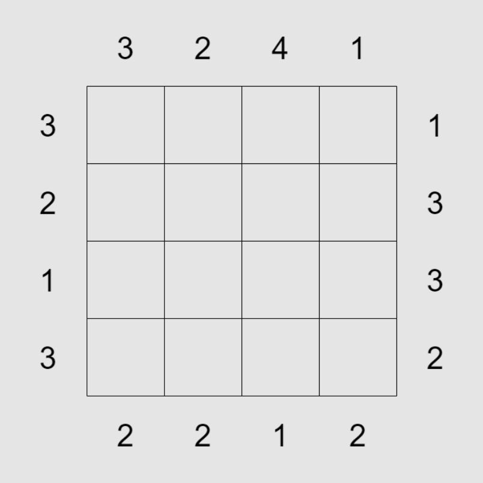

## Variables, tipos, entrada/salida

### Ideas:

- Pedir por consola nombre de fruta y precio por kilo. Luego preguntar cuantos kilos por fruta y al final imprimir coste total.

<br>

### Ejercicios:

1. Pedir por consola cuánto cuesta y cuánto pesa una caja vacía, así como cuánto cuesta y pesa una muñeca. Luego pedir por consola cuántas muñecas hay por caja y cuántas cajas hay. Imprimir en la consola el coste y peso totales.

    <details>
    <summary>Solución</summary>

    ```python
    doll_price = float(input('Precio de una muñeca: '))
    doll_weight = float(input('Peso de una muñeca: '))
    box_price = float(input('Precio de una caja: '))
    box_weight = float(input('Peso de una caja: '))
    doll_number = int(input('¿Cuántas muñecas hay por caja?: '))
    box_number = int(input('¿Cuántas cajas hay?: '))

    boxes_price = box_number * box_price
    boxes_weight = box_number * box_weight

    dolls_price_per_box = doll_number * doll_price
    dolls_weight_per_bax = doll_number * doll_weight

    print()
    print(f'Coste total: {boxes_price + box_number * dolls_price_per_box} €')
    print(f'Peso total: {boxes_weight + box_number * dolls_weight_per_bax} g')
    ```

    </details>

<br>

2. Comprobar si una palabra recibida por consola es un **palíndromo** e imprimir el **booleano** resultante **sin usar sentencias condicionales (if)**. Un **palíndromo** es un texto que se lee igual de izquierda a derecha que de derecha a izquierda. Por ejemplo:

    - `hola` ➡️ `False`
    - `ojos` ➡️ `False`
    - `ojo` ➡️ `True`
    - `abcba` ➡️ `True`
    - `rallar` ➡️ `True`
    - `reconocer` ➡️ `True`

    <br>

    <details>
    <summary>Solución</summary>

    ```python
    text = input('Introduce una palabra: ')
    print(text == text[::-1])
    ```

    </details>

<br>

3. Pedir por consola un texto e imprimir el número de caracteres que contiene **sin usar bucles (for y while)**.

    <details>
    <summary>Solución</summary>

    ```python
    text = input('Introduce un texto: ')
    print(len(text))
    ```

    </details>

<br>

4. Pedir por consola un texto e imprimir el número de caracteres **distintos** que contiene **sin usar bucles (for y while)**.

    <details>
    <summary>Solución</summary>

    ```python
    text = input('Introduce un texto: ')
    print(len(set(text)))
    ```

    </details>

<br>

## Condicionales

### Ideas:

- Calculadora

<br>

### Ejercicios:

1. El programa debe preguntar al usuario la edad del cliente y mostrar el precio de una entrada. Si el cliente es menor de 4 años puede entrar gratis, si tiene entre 4 y 18 años (inclusive) debe pagar 5 € y si es mayor de 18 años, 10 €.

    <details>
    <summary>Solución</summary>

    ```python
    age = int(input('Edad: '))

    if age < 4:
        price = 0
    elif age <= 18:
        price = 5
    else:
        price = 10

    print(f"Precio de la entrada: {f'{price} €.' if price else '¡gratis!'}")
    ```

    </details>

<br>

2. Pedir por consola un año e imprimir si es bisiesto o no.

    <details>
    <summary>Solución</summary>

    ```python
    year = int(input('Año: '))

    if year % 4 == 0 and year % 100 != 0 or year % 400 == 0:
        print('Es bisiesto.')
    else:
        print('No es bisiesto.')
    ```

    </details>

<br>

3. Los alumnos de un curso se han dividido en dos grupos A y B de acuerdo al sexo y el nombre. El grupo A está formado por las mujeres con un nombre anterior a la M y los hombres con un nombre posterior a la N y el grupo B por el resto. Escribir un programa que pregunte al usuario su nombre y sexo, y muestre por consola el grupo que le corresponde.

    <details>
    <summary>Solución</summary>

    ```python
    name_first_letter = input('Introduce tu nombre: ')[0].upper()
    sex = input('Introduce tu sexo (M/F): ').upper()

    if sex == 'F' and name_first_letter < 'M' or sex == 'M' and name_first_letter > 'M':
        print('Grupo A.')
    else:
        print('Grupo B.')
    ```

    </details>

<br>

4. Escribir un programa que reciba tu fecha de nacimiento por consola con un formato como `12/05/97` o `12/05/1997` y que imprima por consola cuantos años cumplirás el año 2023. Hay que tener en cuenta que el año puede darse en dos dígitos o en cuatro.

    <details>
    <summary>Solución</summary>

    a)
    ```python
    date = input('Fecha de nacimiento: ')
    year = int(date.split('/')[-1])

    if year < 1000:
        if year >= 23:
            year += 1900
        else:
            year += 2000

    print(f'Este año cumples {2023 - year} años.')
    ```
    b)
    ```python
    import datetime

    date = input('Fecha de nacimiento: ')

    try:
        year = datetime.datetime.strptime(date, '%d/%m/%y').year
    except ValueError:
        year = datetime.datetime.strptime(date, '%d/%m/%Y').year

    print(f'Este año cumples {2023 - year} años.')
    ```

    </details>

<br>

## Bucles

### Ideas:

- Iterar cadena o colecciones y contar o imprimir.
- Pedir contraseña hasta que sea la correcta.
- Añadir palabras a una lista hasta "fin" e imprimirla.
- Sumar números de una lista.
- Máximo/mínimo manualmente.
- Convertir una lista de números a sus cuadrados.
- Números impares hasta x.
- Número es primo/números primos hasta x.
- Programa que traduzca palabras del siguiente texto. Se introduce por teclado `<palabra>,<traducción>` hasta "fin". Texto:
```
Keith recently came back from a trip to Chicago, Illinois. This midwestern metropolis is found along the shore of Lake Michigan. During his visit, Keith spent a lot of time exploring the city to visit important landmarks and monuments.
```
- Iterar diccionario de datos de alumnos y actualizar estado según nota.
- Matrices. Imprimir la diagonal. Hacer producto vectorial, etc.

<br>

### Ejercicios:

1. Escribir por consola la tabla de multiplicar del número que se pida por consola.

    <details>
    <summary>Solución</summary>

    ```python
    number = int(input('Tabla del: '))
    for i in range(1, 11):
        print(f'{number} * {i} = {number * i}')
    ```

    </details>

<br>

2. Pedir por consola la longitud de un lado de un rombo e imprimir uno por consola siguiendo el formato dado a continuación. Por ejemplo: para longitud 4:

    ```
       *
      ***
     *****
    *******
     *****
      ***
       *
    ```

    <details>
    <summary>Solución</summary>

    ```python
    length = int(input('Introduce la longitud del lado del rombo: '))
    
    for i in range(-length + 1, length):
        print(f"{' ' * (abs(i))}{'*' * ((length - abs(i)) * 2 - 1)}")
    ```

    </details>

<br>

3. Pedir por consola la longitud de un lado de un triángulo e imprimir uno por consola siguiendo el formato dado a continuación. Por ejemplo: para longitud 5:

    ```
    1 
    3 1 
    5 3 1 
    7 5 3 1 
    9 7 5 3 1 
    ```

    <details>
    <summary>Solución</summary>

    ```python
    height = int(input('Introduce la altura del triángulo: '))
    
    for i in range(1, height * 2, 2):
        for j in range(i, 0, -2):
            print(j, end=' ')
        print()
    ```

    </details>

<br>

4. Pedir por consola un texto e imprimir el número de caracteres **distintos** que contiene **usando bucles** y **sin usar conjuntos**.

    <details>
    <summary>Solución</summary>

    ```python
    text = input('Introduce un texto: ')
    characters = []
    for character in text:
        if character not in characters:
            characters.append(character)
    
    print(len(characters))
    ```

    </details>

<br>

5. Comprobar si dos palabras recibidas por consola son **anagramas** entre sí e imprimir el **booleano** resultante. Una palabra se considera **anagrama** de otra si contienen los mismos caracteres sin importar el orden. Por ejemplo:

    - Para `hola` y `adios` ➡️ `False`
    - Para `urnas` y `runa` ➡️ `False`
    - Para `urnas` y `runas` ➡️ `True`

    <br>

    <details>
    <summary>Solución</summary>

    ```python
    word_1 = input('Introduce la primera palabra: ')
    word_2 = input('Introduce la segunda palabra: ')
    print(sorted(word_1) == sorted(word_2))
    ```

    </details>

<br>

6. Programar un juego de piedra, papel y tijeras en el que se pide tu jugada por consola y se genera la jugada de la ia de manera aleatoria. Mientras el usuario proporcione una entrada por consola que no sea "piedra", "papel" o "tijeras" se debe repetir la petición por consola. Al obtener la respuesta se imprimirá por consola que opción escogió la ia y el resultado de la partida. El juego continuará para siempre.

    <details>
    <summary>Solución</summary>

    ```python
    import random
    
    options = ('piedra', 'papel', 'tijeras')
    
    while True:
        human_play = input('Elige tu jugada (piedra/papel/tijeras): ')
        if human_play not in options:
            continue
    
        ai_play = random.choice(options)
    
        if human_play == ai_play:
            print(f'La IA eligió {ai_play}. Empate.')
        elif options[(options.index(human_play) + 1) % 3] == ai_play:
            print(f'La IA eligió {ai_play}. Perdiste.')
        else:
            print(f'La IA eligió {ai_play}. ¡Ganaste!')
    ```

    </details>

<br>

7. Escribir un programa que reciba tu fecha de nacimiento por consola con un formato como `18/6/97` o `18/6/1997` (teniendo en cuenta que el año puede darse en dos o cuatro dígitos) y que imprima por consola una línea por año cumplido hasta 2023, inclusive. Por ejemplo, para `18/6/1997`:

    ```
    "El 18 de junio de 1998 cumpliste 1 año."
    "El 18 de junio de 1999 cumpliste 2 años."
    ...
    ```

    Nótese que cuando se cumple 1 año se indica en singular y, para más años, en plural. Además sustituimos el número de mes por su nombre.

    <details>
    <summary>Solución</summary>

    a)
    ```python
    date = input('Fecha de nacimiento: ')
    day, month, first_year = (int(number) for number in date.split('/'))
    
    if first_year < 1000:
        if first_year >= 23:
            first_year += 1900
        else:
            first_year += 2000
    
    month_names = [
        'enero',
        'febrero',
        'marzo',
        'abril',
        'mayo',
        'junio',
        'julio',
        'agosto',
        'septiembre',
        'octubre',
        'noviembre',
        'diciembre'
    ]
    
    for i, year in enumerate(range(first_year + 1, 2024), start=1):
        print(f"El {day} de {month_names[month - 1]} de {year} cumpliste {i} año{'' if i == 1 else 's'}.")
    ```
    b)
    ```python
    import datetime
    
    date = input('Fecha de nacimiento: ')
    day, month, first_year = (int(number) for number in date.split('/'))
    
    try:
        first_year = datetime.datetime.strptime(date, '%d/%m/%y').year
    except ValueError:
        first_year = datetime.datetime.strptime(date, '%d/%m/%Y').year
    
    month_names = [
        'enero',
        'febrero',
        'marzo',
        'abril',
        'mayo',
        'junio',
        'julio',
        'agosto',
        'septiembre',
        'octubre',
        'noviembre',
        'diciembre'
    ]
    
    for i, year in enumerate(range(first_year + 1, 2024), start=1):
        print(f"El {day} de {month_names[month - 1]} de {year} cumpliste {i} año{'' if i == 1 else 's'}.")
    ```

    </details>

<br>

8. Escribir un programa que pida por consola nombres de asingaturas continuamente hasta que se introduzca "fin". Luego el programa preguntará la nota para cada asignatura y terminará imprimiendo las asignaturas que queden suspensas siguiendo el siguiente formato: `Asignaturas suspensas: Lengua, Matemáticas y Física.`

    <details>
    <summary>Solución</summary>

    ```python
    subject = input('Introduce una asignatura ("fin" para terminar): ')
    subjects = []
    while subject != 'fin':
        subjects.append(subject)
        subject = input('Introduce una asignatura ("fin" para terminar): ')
    
    failed_subjects = []
    for subject in subjects:
        grade = float(input(f'Introduce la nota de {subject}: '))
        if grade < 5:
            failed_subjects.append(subject)
    
    if len(failed_subjects) > 1:
        print(f"Asignaturas suspensas: {', '.join(failed_subjects[:-1])} y {failed_subjects[-1]}.")
    else:
        print(f"Asignaturas suspensas: {failed_subjects[0]}.")
    ```

    </details>

<br>

9. Hacer un programa que imprima por consola el nº de veces que aparece cada palabra en el siguiente texto:

    ```
    Lorem Ipsum es simplemente el texto de relleno de las imprentas y archivos de texto. Lorem Ipsum ha sido el texto de relleno estándar de las industrias desde el año 1500, cuando un impresor (N. del T. persona que se dedica a la imprenta) desconocido usó una galería de textos y los mezcló de tal manera que logró hacer un libro de textos especimen. No sólo sobrevivió 500 años, sino que tambien ingresó como texto de relleno en documentos electrónicos, quedando esencialmente igual al original. Fue popularizado en los 60s con la creación de las hojas "Letraset", las cuales contenian pasajes de Lorem Ipsum, y más recientemente con software de autoedición, como por ejemplo Aldus PageMaker, el cual incluye versiones de Lorem Ipsum.
    ```

    <details>
    <summary>Solución</summary>

    a)
    ```python
    text = 'Lorem Ipsum es simplemente el texto de relleno de las imprentas y archivos de texto. Lorem Ipsum ha sido el texto de relleno estándar de las industrias desde el año 1500, cuando un impresor (N. del T. persona que se dedica a la imprenta) desconocido usó una galería de textos y los mezcló de tal manera que logró hacer un libro de textos especimen. No sólo sobrevivió 500 años, sino que tambien ingresó como texto de relleno en documentos electrónicos, quedando esencialmente igual al original. Fue popularizado en los 60s con la creación de las hojas "Letraset", las cuales contenian pasajes de Lorem Ipsum, y más recientemente con software de autoedición, como por ejemplo Aldus PageMaker, el cual incluye versiones de Lorem Ipsum.'
    
    word_occurrences = {}
    
    for word in text.split():
        if word in word_occurrences:
            word_occurrences[word] += 1
        else:
            word_occurrences[word] = 1
    
    print(word_occurrences)
    ```
    b)
    ```python
    from collections import defaultdict
    
    text = 'Lorem Ipsum es simplemente el texto de relleno de las imprentas y archivos de texto. Lorem Ipsum ha sido el texto de relleno estándar de las industrias desde el año 1500, cuando un impresor (N. del T. persona que se dedica a la imprenta) desconocido usó una galería de textos y los mezcló de tal manera que logró hacer un libro de textos especimen. No sólo sobrevivió 500 años, sino que tambien ingresó como texto de relleno en documentos electrónicos, quedando esencialmente igual al original. Fue popularizado en los 60s con la creación de las hojas "Letraset", las cuales contenian pasajes de Lorem Ipsum, y más recientemente con software de autoedición, como por ejemplo Aldus PageMaker, el cual incluye versiones de Lorem Ipsum.'
    
    word_occurrences = defaultdict(int)
    
    for word in text.split():
        word_occurrences[word] += 1
    
    print(word_occurrences)
    ```
    c)
    ```python
    from collections import Counter
    
    text = 'Lorem Ipsum es simplemente el texto de relleno de las imprentas y archivos de texto. Lorem Ipsum ha sido el texto de relleno estándar de las industrias desde el año 1500, cuando un impresor (N. del T. persona que se dedica a la imprenta) desconocido usó una galería de textos y los mezcló de tal manera que logró hacer un libro de textos especimen. No sólo sobrevivió 500 años, sino que tambien ingresó como texto de relleno en documentos electrónicos, quedando esencialmente igual al original. Fue popularizado en los 60s con la creación de las hojas "Letraset", las cuales contenian pasajes de Lorem Ipsum, y más recientemente con software de autoedición, como por ejemplo Aldus PageMaker, el cual incluye versiones de Lorem Ipsum.'
    
    print(Counter(text.split()))
    ```

    </details>

<br>

10. En una tienda de deportes ha habido un lote de pelotas descoloridas que se tienen que vender con descuento. Crear un programa que pida por consola el precio de una pelota y su descuento, para el lote descolorido. Luego pedir por consola el nº de pelotas normales y descoloridas que hay en la tienda. Mientras queden pelotas en la tienda: preguntar por consola si quiere comprar una pelota normal o una descolorida e imprimir por consola lo que le va a costar al cliente (y la pelota contará ya como vendida).

    <details>
    <summary>Solución</summary>

    ```python
    ball_price = float(input('Precio de una pelota: '))
    discount = float(input('% de descuento para pelota descolorida: '))
    normal_balls = int(input('Nº de pelotas normales: '))
    colorless_balls = int(input('Nº de pelotas descoloridas: '))
    
    discounted_price = ball_price * discount / 100
    
    while normal_balls or colorless_balls:
        option = input('¿Quieres una pelota normal o descolorida? (N/D): ')
    
        if option.upper() == 'N':
            if normal_balls:
                print(f'Te va a costar {ball_price} €')
                normal_balls -= 1
                print(f'Quedan {normal_balls} pelotas normales.')
            else:
                print('No quedan pelotas normales.')
        else:
            if colorless_balls:
                print(f'Te va a costar {discounted_price} €')
                colorless_balls -= 1
                print(f'Quedan {colorless_balls} pelotas descoloridas.')
    ```

    </details>

<br>

## Funciones

### Ideas:

- Filtrar los números de una lista que son múltiplos de 2 y, luego, los que son múltiplos de 3.
- Módulo de un vector.
- Suma de vetores.
- Área de un círculo y otra el volúmen de un cilindro usando la anterior.
- Multiplicar sin usar `*` y potencia sin usar `**` o módulos como math.
- Media de una lista.
- Recibir una lista y una función. Devolver la lista tras aplicar a cada elemento dicha función. Números, booleanos, aprobados/suspensos...
- Que reciba un diccionario y una función y devuelva el diccionario filtrado tras aplicar la función a los valores. Quizás asignaturas aprobadas. O filtrar por `<=`, `>`...
- Un menú con lista de diccionarios de clientes. Añadir, eliminar, mostrar, listar por x.

<br>

### Ejercicios:

1. Crear una función que devuelva el factorial de un número dado como argumento **usando bucles**. El factorial de 0 es 1. Y el factorial de un número negativo debe lanzar un `ValueError`.

    <details>
    <summary>Solución</summary>

    a)
    ```python
    def factorial(number: int) -> int:
        if number < 0:
            raise ValueError
    
        result = 1
        while number > 1:
            result *= number
            number -= 1
    
        return result
    
    
    print(factorial(4))
    print(factorial(-1))
    ```
    b)
    ```python
    def factorial(number: int) -> int:
        if number < 0:
            raise ValueError
    
        result = 1
        for i in range(2, number + 1):
            result *= i
    
        return result
    
    
    print(factorial(4))
    print(factorial(-1))
    ```

    </details>

<br>

2. Crear una función que devuelva el factorial de un número dado como argumento **sin usar bucles**. El factorial de 0 es 1. Y el factorial de un número negativo debe lanzar un `ValueError`.

    <details>
    <summary>Solución</summary>

    ```python
    def factorial(number: int) -> int:
        if number < 0:
            raise ValueError
        if number <= 1:
            return 1
    
        return number * factorial(number - 1)
    
    
    print(factorial(7))
    print(factorial(-1))
    ```

    </details>

<br>

3. Crear una función que aplane una lista (u otro iterable). Una lista puede tener otras listas y demás estructuras como tuplas, conjuntos, etc., por lo tanto, aplanar una lista consiste en conseguir como resultado otra con los elementos que contenía originalmente más aquellos contenidos en esas estructuras o colecciones internas. Por ejemplo:

    - `[0, 1, 2, [3, 4, 5]]` ➡️ `[0, 1, 2, 3, 4, 5]`
    - `[{'hello', 'bye'}, 45, 'text']` ➡️ `['hello', 'bye', 45, 'text']`
    - `[[0], [[[1]]], 2]` ➡️ `[0, 1, 2]`
    - `(0, [1], (2, ('three', [4.0, {'five'}])))` ➡️ `[0, 1, 2, 'three', 4.0, 'five']`
    - `range(6)` ➡️ `[0, 1, 2, 3, 4, 5]`

    La función puede recibir como argumento cualquier iterable, no solo listas, pero el resultado devuelto siempre será una lista.

    <details>
    <summary>Solución</summary>

    ```python
    from collections.abc import Iterable
    
    
    def flatten(elements: Iterable) -> list:
        new_elements = []
    
        for element in elements:
            if isinstance(element, Iterable) and not isinstance(element, str):
                new_elements += flatten(element)
            else:
                new_elements.append(element)
    
        return new_elements
    
    
    print(flatten([0, 1, 2, [3, 4, 5]]))
    print(flatten([{'hello', 'bye'}, 45, 'text']))
    print(flatten([0, 1, 2, [3, 4, 5]]))
    print(flatten((0, [1], (2, ('three', [4.0, {'five'}])))))
    print(flatten(range(6)))
    ```

    </details>

<br>

4. Crear una función que imprima por consola los `n` primeros números de la sucesión de Fibonacci separados por el separador dado por argumento. Esta sucesión es la siguiente: `0, 1, 1, 2, 3, 5, 8, 13, 21, 34, 55, 89, 144, ...`. Los dos primeros números son `0` y `1` y cada número posterior es el resultado de la suma de los dos anteriores. Entonces:

    - `fibonacci_sequence(0, ', ')` ➡️ 
    - `fibonacci_sequence(1, ', ')` ➡️ `0`
    - `fibonacci_sequence(3, ', ')` ➡️ `0, 1, 1`
    - `fibonacci_sequence(5, ' - ')` ➡️ `0 - 1 - 1 - 2 - 3`
    - `fibonacci_sequence(11, ' | ')` ➡️ `0 | 1 | 1 | 2 | 3 | 5 | 8 | 13 | 21 | 34 | 55`

    La sucesión de Fibonacci para `n` negativo debe lanzar un `ValueError`.

    > La función `join()` de las cadenas nos puede ayudar en este ejercicio:
    > ```python
    > >>> ', '.join(['one', 'two', 'three', 'four'])
    > 'one, two, three, four'
    > >>> '-YEAH-'.join(['one', 'two', 'three', 'four'])
    > 'one-YEAH-two-YEAH-three-YEAH-four'
    > ```

    <details>
    <summary>Solución</summary>

    ```python
    def fibonacci(number: int) -> int:
        if number == 0:
            return 0
        if number == 1:
            return 1
    
        return fibonacci(number - 2) + fibonacci(number - 1)
    
    
    def fibonacci_sequence(n: int, separator: str):
        if n < 0:
            raise ValueError
    
        print(separator.join(str(fibonacci(i)) for i in range(n)))
    
    
    fibonacci_sequence(0, ', ')
    fibonacci_sequence(1, ', ')
    fibonacci_sequence(3, ', ')
    fibonacci_sequence(5, ' - ')
    fibonacci_sequence(11, ' | ')
    fibonacci_sequence(-1, ' | ')
    ```

    </details>

<br>

5. Crear dos funciones que simulen el [cifrado césar](https://es.wikipedia.org/wiki/Cifrado_C%C3%A9sar) y posterior descifrado de un mensaje. Este cifrado consiste básicamente en cambiar cada símbolo de un texto por otro que le sigue a cierta distancia en el alfabeto. Por ejemplo, si ciframos el texto `'abc'` con un desplazamiento `1`:

    `encode('abc', 1)` ➡️ `'bcd'`

    Si lo ciframos con desplazamiento `2`:

    `encode('abc', 2)` ➡️ `'cde'`

    En el ejercicio vamos a usar únicamente los [caracteres ascii](https://elcodigoascii.com.ar/)   imprimibles (del 32 al 126) como alfabeto, es decir, del `' '` al `'~'`, así que los textos cifrados van a contener solamente carácteres dentro de ese rango.

    Teniendo esto en cuenta: desarrollar dos funciones que reciban dos argumentos, el texto y el desplazamiento, de forma que siempre se cumpla:

    `decode(encode(text, offset), offset) == text` ➡️ `True`

    <details>
    <summary>Solución</summary>

    ```python
    FIRST_CHARACTER_INDEX = 32
    ALPHABET_LENGHT = 95
    
    
    def encode(text: str, offset: int) -> str:
        new_characters = [
            chr(ord(character) - FIRST_CHARACTER_INDEX + offset % ALPHABET_LENGHT + FIRST_CHARACTER_INDEX)
            for character in text
        ]
        return ''.join(new_characters)
    
    
    def decode(text: str, offset: int) -> str:
        new_characters = [
            chr(ord(character) - FIRST_CHARACTER_INDEX - offset % ALPHABET_LENGHT + FIRST_CHARACTER_INDEX)
            for character in text
        ]
        return ''.join(new_characters)
    
    
    offset = 12
    text = 'asdASD0123456789!"·!"·"$%&/()=?¿¡\'09876.,:;-_´`+çÇ^¨*{}[]@#54321 sdfklwd'
    print(decode(encode(text, offset), offset) == text)
    ```

    </details>

<br>

6. Sea:

    ```python
    elements = [(1, 'one'), (2, 'two'), (3, 'three'), (4, 'four'), (5, 'five'), (6, 'six'), (7, 'seven')]   
    ```

     Ordenar `elements` por el segundo elemento de cada tupla **descendentemente** usando la [función integrada](https://docs.python.org/3/library/functions.html) `sorted()` (y sus parámetros `key` y `reverse`) y mostrar el resultado por consola.

    > `key` espera una función para ordenar los elementos de forma que devuelva el valor a comparar. Podemos usar una [función anónima](README.md#56-funciones-anónimas).

    <details>
    <summary>Solución</summary>

    ```python
    elements = [(1, 'one'), (2, 'two'), (3, 'three'), (4, 'four'), (5, 'five'), (6, 'six'), (7, 'seven')]
    
    print(sorted(elements, key=lambda item: item[1], reverse=True))
    ```

    </details>

<br>

## Clases

### Ejercicios:

1. ☠️ Vehículos.

   Construir con clases el siguiente escenario:

   1. Utilizar anotaciones de tipos para los parámetros de los métodos y para los valores de retorno.
   2. Una clase `Person`:
      1. Atributo `name` que siempre tiene que tener la primera en mayúscula y el resto en minúscula aunque el usuario introduzca el nombre mal.
      2. Atributo `age`.
      3. Sobrecargar los métodos necesarios para imprimir bonitos los objetos de la clase por consola en todo momento.
   3. Clases `Vehicle`, `Car` y `Train`:
      1. Usar clases abstractas si es necesario.
      2. Las 3 clases tienen que tener estos atributos:
         1. `max_passenger`: número máximo de pasajeros. 
         2. `plate`: matrícula de tipo **cadena (`str`)** que, por defecto, si no se introduce nada va a ser un número entre 1111 y 9999 almacenado como texto (es el único parámetro con valor por defecto del ejercicio).
         3. `_passengers`: un **conjunto** de pasajeros que inicialmente está vacío y no debe nunca sobrepasar el límite. No se puede acceder a este atributo desde fuera de la clase.
      3. La clase `Car` tiene, además, los atributos `doors`, `airbags` y `wheel_drive`. Este último es el tipo de tracción y solo tiene dos opciones: front y rear (delantera y trasera).
      4. La clase `Train` tiene, además, un atributo `wagons`.
      5. Un propiedad `passengers` para acceder a `_passengers`.
      6. El resultado de sumar dos vehículos con `+` es un nuevo vehículo con los **atributos del primero** y **los pasajeros de ambos**. Los dos vehículos originales se vaciarán de pasajeros.
      7. `len()` devolverá el número de pasajeros.
      8. Sobrecargar `__iter__` para hacer la clase iterable de forma que se iteren sobre los pasajeros y, estos, sean devueltos uno a uno.
      9. Sobrecargar los métodos necesarios para imprimir bonitos los objetos de la clase por consola en todo momento.
      10. Un método `add_passenger()` que reciba un pasajero por parámetro y lo añada, si puede. Si no, tiene que lanzar un `ValueError`.
      11. Un método `first_passenger()` que reciba una función de un parámetro y devuelva un booleano. `first_passenger()` tiene que devolver el primer pasajero que la cumpla con la función recibida.
      12. Un método `empty()` que vacíe el conjunto de los pasajeros y los devuelva hacia fuera de la función.
      13. Un método `remove_passenger()` que reciba un pasajero por parámetro y lo descarte del conjunto. Si no está no da error.
      14. Un método `remove_passenger_by_name()` que reciba por parámetro un nombre de un posible pasajero y lo elimine sin dar error.
   4. Crear un vehículo cualquiera, intentar añadirle más personas del máximo, controlar el error e imprimir algo por consola indicando que se ha controlado con éxito.

    <br>

    <details>
    <summary>Solución</summary>

    ```python
    from __future__ import annotations
    
    """
    ⬆️
    In some future version this import will not be necessary. This is needed for now to be able to use a class as a type hint within
    itself (before it was defined):
    
    class Vehicle:
        ...                           ⬇️
        def __add__(self, other) -> Vehicle:
            ...
    
    If not, they can be indicated with quotes:
    
    class Vehicle:
        ...                            ⬇️
        def __add__(self, other) -> 'Vehicle':
            ...   
    """
    
    import random
    from abc import ABC, abstractmethod
    from collections.abc import Callable
    from enum import Enum, auto
    from typing import Iterator
    
    
    class WheelDrive(Enum):
        FRONT = auto()
        REAR = auto()
    
    
    class Person:
        def __init__(self, name: str, age: int):
            self.name = name.capitalize()
            self.age = age
    
        def __repr__(self) -> str:
            return str(self)
    
        def __str__(self) -> str:
            return f'{self.name} ({self.age})'
    
    
    class Vehicle(ABC):
        @abstractmethod
        def __init__(self, max_passengers: int, plate: str = None):
            self.max_passengers = max_passengers
            self.plate = plate if plate else str(random.randint(1111, 9999))
            self._passengers = set()
    
        def __add__(self, other) -> Vehicle:
            new_vehicle = type(self)(**{k: v for k, v in vars(self).items() if k not in ('plate', '_passengers')})
            for passenger in self.empty() | other.empty():
                new_vehicle.add_passenger(passenger)
    
            return new_vehicle
    
        def __iter__(self) -> Iterator[Person]:
            yield from self.passengers
    
        def __len__(self) -> int:
            return len(self.passengers)
    
        def __str__(self) -> str:
            return f'{type(self).__name__} ({self.plate}). Passengers: {self.passengers}'
    
        def add_passenger(self, passenger: Person):
            if len(self.passengers) >= self.max_passengers:
                raise ValueError('Full vehicle')
    
            self._passengers.add(passenger)
    
        def first_passenger(self, condition: Callable) -> Person:
            return next(passenger for passenger in self.passengers if condition(passenger))
    
        def empty(self) -> set[Person]:
            passengers = self.passengers.copy()
            self._passengers.clear()
            return passengers
    
        @property
        def passengers(self) -> set[Person]:
            return self._passengers
    
        def remove_passenger(self, passenger: Person):
            self._passengers.discard(passenger)
    
        def remove_passenger_by_name(self, name: str):
            try:
                self.remove_passenger(self.first_passenger(lambda passenger: passenger.name.lower() == name.lower()))
            except StopIteration:
                pass
    
    
    class Car(Vehicle):
        def __init__(self, doors: int, airbags: int, wheel_drive: WheelDrive, max_passengers: int, plate: str = None):
            super().__init__(max_passengers, plate)
            self.doors = doors
            self.airbags = airbags
            self.wheel_drive = wheel_drive
    
    
    class Train(Vehicle):
        def __init__(self, wagons: int, max_passengers: int, plate: str = None):
            super().__init__(max_passengers, plate)
            self.wagons = wagons
    
    
    jorge = Person('Jorge', 24)
    victoria = Person('Victoria', 21)
    javier = Person('Javier', 77)
    elena = Person('Elena', 42)
    
    car = Car(5, 2, WheelDrive.FRONT, 3)
    
    car.add_passenger(jorge)
    car.add_passenger(victoria)
    car.add_passenger(javier)
    
    try:
        car.add_passenger(elena)
    except ValueError:
        print('ValueError controlado con éxito.')
    ```

    </details>

<br>

## Estructuras de datos

### Ejercicios:

1. ☠️ Lista enlazada.

   Crear una lista enlazada con clases:

   1. Llamar a la clase `LinkedList`.
   2. Utilizar anotaciones de tipos para los parámetros de los métodos y para los valores de retorno.
   3. Sobrecargar los métodos necesarios para imprimir bonitas las listas listas enlazadas según el siguiente formato:
      1. Lista vacía: `<>`
      2. Lista con un elemento `'a'`: `<'a'>`
      3. Lista con los elementos `1`, `2`, `3` y `'hello'`: `<1, 2, 3, 'hello'>`. 
   4. Sobrecargar el método necesario para hacer la clase iterable.
   5. Sobrecargar el método necesario para que la [función integrada](https://docs.python.org/3/library/functions.html) `len()` devuelva el número de elementos que contiene la lista enlazada.
   6. Método `add(...)` para añadir elementos a la lista.
   7. Método `get(...)` para obtener el elemento en una posición concreta. Lanza un `IndexError` si el índice dado por argumento es menor que 0 o mayor que el número de elementos contenidos en la lista.
   8. Método `delete(...)` para eliminar el elemento en una posición concreta. Lanza un `IndexError` si el índice dado por argumento es menor que 0 o mayor que el número de elementos contenidos en la lista.
   9. Método `insert(...)` para insertar un elemento en una posición concreta. No lanza excepciones. Si el índice es menor que 0 se inserta al inicio y, si es mayor que el número de elementos, se inserta al final.
   10. Método `clear(...)` para vaciar la lista enlazada.

    <br>

    Puedes servirte de la siguiente función para ejecutar pruebas. Si esta función imprime en la consola `OK`, el ejercicio estará realizado con éxito:

    ```python
    def run_tests():
        ll = LinkedList()
        assert str(ll) == '<>'
        assert len(ll) == 0
    
        ll.add(1)
        assert str(ll) == '<1>'
        ll.add(2)
        assert str(ll) == '<1, 2>'
        ll.add(3)
        assert str(ll) == '<1, 2, 3>'
        assert len(ll) == 3
    
        assert 1 in ll
        assert 2 in ll
        assert 3 in ll
        assert 4 not in ll
    
        try:
            ll.delete(-1)
        except IndexError:
            pass
        else:
            raise Exception('No lanza IndexError')
        try:
            ll.delete(3)
        except IndexError:
            pass
        else:
            raise Exception('No lanza IndexError')
        try:
            ll.delete(24)
        except IndexError:
            pass
        else:
            raise Exception('No lanza IndexError')
        ll.delete(2)
        assert str(ll) == '<1, 2>'
        assert len(ll) == 2
    
        ll.add('aasdasd')
        assert str(ll) == '<1, 2, aasdasd>'
    
        assert ll.get(1) == 2
        assert ll.get(2) == 'aasdasd'
        try:
            ll.get(-1)
        except IndexError:
            pass
        else:
            raise Exception('No lanza IndexError')
        try:
            ll.get(3)
        except IndexError:
            pass
        else:
            raise Exception('No lanza IndexError')
        try:
            ll.get(24)
        except IndexError:
            pass
        else:
            raise Exception('No lanza IndexError')
    
        ll.add(('5', 5))
        assert str(ll) == "<1, 2, aasdasd, ('5', 5)>"
        assert len(ll) == 4
        ll.delete(1)
        assert str(ll) == "<1, aasdasd, ('5', 5)>"
        ll.delete(0)
        assert str(ll) == "<aasdasd, ('5', 5)>"
        ll.delete(0)
        assert str(ll) == "<('5', 5)>"
        assert len(ll) == 1
        ll.delete(0)
        assert str(ll) == "<>"
        assert len(ll) == 0
        ll.clear()
        assert str(ll) == "<>"
        assert len(ll) == 0
        ll.add(5)
        ll.add(5)
        ll.add(5)
        assert str(ll) == "<5, 5, 5>"
        assert len(ll) == 3
        ll.clear()
        assert str(ll) == "<>"
        assert len(ll) == 0
    
        ll.insert(-1, 'a')
        assert str(ll) == "<a>"
        assert len(ll) == 1
        ll.clear()
        assert len(ll) == 0
        ll.insert(24, 'b')
        assert str(ll) == "<b>"
        assert len(ll) == 1
        ll.clear()
        ll.insert(0, 'c')
        assert str(ll) == "<c>"
        assert len(ll) == 1
        ll.clear()
        ll.add('hola')
        ll.insert(-1, 'x')
        assert str(ll) == "<x, hola>"
        assert len(ll) == 2
        ll.delete(0)
        ll.insert(24, 'y')
        assert str(ll) == "<hola, y>"
        assert len(ll) == 2
        ll.delete(1)
        ll.insert(0, 'z')
        assert str(ll) == "<z, hola>"
        assert len(ll) == 2
        ll.add(1)
        ll.add(2)
        ll.add(3)
        ll.insert(2, 'adios')
        assert str(ll) == "<z, hola, adios, 1, 2, 3>"
        assert len(ll) == 6
        ll.insert(len(ll), 'ultimo')
        ll.insert(len(ll) - 1, 'penultimo')
        ll.insert(len(ll) - 2, 'antepenultimo')
        assert str(ll) == "<z, hola, adios, 1, 2, 3, antepenultimo, penultimo, ultimo>"
        assert len(ll) == 9
        ll.insert(4, {1, 2})
        assert str(ll) == "<z, hola, adios, 1, {1, 2}, 2, 3, antepenultimo, penultimo, ultimo>"
        assert len(ll) == 10
        ll.insert(1, range(5))
        assert str(ll) == "<z, range(0, 5), hola, adios, 1, {1, 2}, 2, 3, antepenultimo, penultimo, ultimo>"
        assert len(ll) == 11
    
        print('OK')
    ```

    <details>
    <summary>Solución</summary>

    ```python
    from typing import Any, Iterator
    
    
    class Node:
        def __init__(self, value):
            self.value: Any = value
            self.next: Node | None = None
    
    
    class LinkedList:
        def __init__(self):
            self.root: Node | None = None
            self.last: Node | None = self.root
            self._length = 0
    
        def __iter__(self) -> Iterator[Node]:
            node = self.root
            while node:
                yield node.value
                node = node.next
    
        def __len__(self) -> int:
            return self._length
    
        def __str__(self) -> str:
            return f"<{', '.join(str(value) for value in self)}>"
    
        def _get_node(self, index: int) -> Node:
            if index >= self._length:
                return self.last
    
            node = self.root
            for _ in range(index):
                node = node.next
            return node
    
        def add(self, value: Any):
            if self.last is None:
                self.root = Node(value)
                self.last = self.root
            else:
                self.last.next = Node(value)
                self.last = self.last.next
            self._length += 1
    
        def clear(self):
            self.root = None
            self.last = self.root
            self._length = 0
    
        def delete(self, index: int):
            if not 0 <= index < self._length:
                raise IndexError
    
            if index == 0:
                try:
                    self.root = self.root.next
                except AttributeError:
                    self.root = None
                    self.last = self.root
                self._length -= 1
            else:
                previous_node = self._get_node(index - 1)
                if previous_node.next and previous_node.next.next:
                    previous_node.next = previous_node.next.next
                else:
                    previous_node.next = None
                    self.last = previous_node
                self._length -= 1
    
        def get(self, index: int) -> Any:
            if not 0 < index < self._length:
                raise IndexError
    
            return self._get_node(index).value
    
        def insert(self, index: int, value: Any):
            if self._length == 0:
                self.add(value)
            else:
                if index <= 0:
                    node = Node(value)
                    node.next = self.root
                    self.root = node
                else:
                    node = self._get_node(index - 1)
                    next_node = node.next
                    node.next = Node(value)
                    node.next.next = next_node
                self._length += 1
    
    
    def run_tests():
        ll = LinkedList()
        assert str(ll) == '<>'
        assert len(ll) == 0
    
        ll.add(1)
        assert str(ll) == '<1>'
        ll.add(2)
        assert str(ll) == '<1, 2>'
        ll.add(3)
        assert str(ll) == '<1, 2, 3>'
        assert len(ll) == 3
    
        assert 1 in ll
        assert 2 in ll
        assert 3 in ll
        assert 4 not in ll
    
        try:
            ll.delete(-1)
        except IndexError:
            pass
        else:
            raise Exception('No lanza IndexError')
        try:
            ll.delete(3)
        except IndexError:
            pass
        else:
            raise Exception('No lanza IndexError')
        try:
            ll.delete(24)
        except IndexError:
            pass
        else:
            raise Exception('No lanza IndexError')
        ll.delete(2)
        assert str(ll) == '<1, 2>'
        assert len(ll) == 2
    
        ll.add('aasdasd')
        assert str(ll) == '<1, 2, aasdasd>'
    
        assert ll.get(1) == 2
        assert ll.get(2) == 'aasdasd'
        try:
            ll.get(-1)
        except IndexError:
            pass
        else:
            raise Exception('No lanza IndexError')
        try:
            ll.get(3)
        except IndexError:
            pass
        else:
            raise Exception('No lanza IndexError')
        try:
            ll.get(24)
        except IndexError:
            pass
        else:
            raise Exception('No lanza IndexError')
    
        ll.add(('5', 5))
        assert str(ll) == "<1, 2, aasdasd, ('5', 5)>"
        assert len(ll) == 4
        ll.delete(1)
        assert str(ll) == "<1, aasdasd, ('5', 5)>"
        ll.delete(0)
        assert str(ll) == "<aasdasd, ('5', 5)>"
        ll.delete(0)
        assert str(ll) == "<('5', 5)>"
        assert len(ll) == 1
        ll.delete(0)
        assert str(ll) == "<>"
        assert len(ll) == 0
        ll.clear()
        assert str(ll) == "<>"
        assert len(ll) == 0
        ll.add(5)
        ll.add(5)
        ll.add(5)
        assert str(ll) == "<5, 5, 5>"
        assert len(ll) == 3
        ll.clear()
        assert str(ll) == "<>"
        assert len(ll) == 0
    
        ll.insert(-1, 'a')
        assert str(ll) == "<a>"
        assert len(ll) == 1
        ll.clear()
        assert len(ll) == 0
        ll.insert(24, 'b')
        assert str(ll) == "<b>"
        assert len(ll) == 1
        ll.clear()
        ll.insert(0, 'c')
        assert str(ll) == "<c>"
        assert len(ll) == 1
        ll.clear()
        ll.add('hola')
        ll.insert(-1, 'x')
        assert str(ll) == "<x, hola>"
        assert len(ll) == 2
        ll.delete(0)
        ll.insert(24, 'y')
        assert str(ll) == "<hola, y>"
        assert len(ll) == 2
        ll.delete(1)
        ll.insert(0, 'z')
        assert str(ll) == "<z, hola>"
        assert len(ll) == 2
        ll.add(1)
        ll.add(2)
        ll.add(3)
        ll.insert(2, 'adios')
        assert str(ll) == "<z, hola, adios, 1, 2, 3>"
        assert len(ll) == 6
        ll.insert(len(ll), 'ultimo')
        ll.insert(len(ll) - 1, 'penultimo')
        ll.insert(len(ll) - 2, 'antepenultimo')
        assert str(ll) == "<z, hola, adios, 1, 2, 3, antepenultimo, penultimo, ultimo>"
        assert len(ll) == 9
        ll.insert(4, {1, 2})
        assert str(ll) == "<z, hola, adios, 1, {1, 2}, 2, 3, antepenultimo, penultimo, ultimo>"
        assert len(ll) == 10
        ll.insert(1, range(5))
        assert str(ll) == "<z, range(0, 5), hola, adios, 1, {1, 2}, 2, 3, antepenultimo, penultimo, ultimo>"
        assert len(ll) == 11
    
        print('OK')
    
    
    run_tests()
    ```

    </details>

<br>

## Algoritmos avanzados

### Ejercicios:

1. ☠️☠️☠️ Rascacielos.

   Este ejercicio se basa en el famoso juego de los rascacielos. Este juego tipo puzle tiene similitudes con el sudoku a la hora de colocar los rascacielos en cada celda pero también juega con la perspectiva, es decir, es importante tener en cuenta la cantidad de rascacielos que se pueden ver desde cada lado del tablero.

   La siguiente imagen muestra el inicio del juego, el tablero sin resolver:

   

   En este caso la partida es de `4x4` pero podría tener cualquier tamaño `nxn`. Al ser de tamaño `4`, los rascacielos que podremos colocar tendrán una altura entre `1` y `4` (inclusive).

   No podremos colocar dos rascacielos de la misma altura en una misma fila o columna.

   Los números que aparecen fuera del tablero indican el número de rascacielos que se verían desde esa posición. Vamos a ver la solución de este tablero para tenerlo más claro:

   

   Los rascacielos altos tapan a los más bajos cuando los miramos desde cierto lado.

   Fijémonos en la tercera columna: como arriba tiene un `4` (el número fuera del tablero), eso significa que en esa columna, desde arriba hacia abajo, se pueden ver todos los rascacielos desde altura `1` hasta `4`, o sea, cuatro rascacielos. Y si miramos en el número de abajo de la misma columna nos daremos cuenta de que es un `1`, porque solo podríamos ver un rascacielos, el de altura `4`, tapando los de altura `3`, `2` y `1`.

   Entonces, cumpliendo las reglas indicadas en el exterior de tablero y teniendo en cuenta que no se pueden colocar dos rascacielos de misma altura en una misma fila o columna: crear una función `skyscrapers(...)` que reciba las reglas de cada lado del tablero de cualquier tamaño `nxn` en el orden **arriba**, **abajo**, **izquierda** y **derecha** mediante cuatro listas como argumentos y que devuelva una lista de listas representando el tablero resuelto relleno con los números que simbolizan los rascacielos de altura `1` hasta `n`. En el caso de no existir solución posible al tablero con las reglas propuestas, la función debe devolver `None`.

   Con el tablero del ejemplo sería así:

   `skyscrapers([3, 2, 4, 1], [2, 2, 1, 2], [3, 2, 1, 3], [1, 3, 3, 2])` ➡️ `[[2, 3, 1, 4], [3, 4, 2, 1], [4, 1, 3, 2], [1, 2, 4, 3]]`

   Si cambiáramos en las reglas el primer `3` por un `2`, la partida no tendría solución, entonces:

   `skyscrapers([2, 2, 4, 1], [2, 2, 1, 2], [3, 2, 1, 3], [1, 3, 3, 2])` ➡️ `None`

   <br>

    A continuación se proporcionará una función que ejecuta casos de pruebas para tableros desde tamaño `1x1` hasta `6x6`. Está ofuscada para evitar confusiones y sacar ideas involuntariamente para el ejercicio. Si esta función imprime en la consola `OK`, el ejercicio estará realizado con éxito:

    ```python
    def run_tests():
        def _1(_11, _1001, _1100101, _0011):
            def _10(_00011):
                _0101011 = range
                _010111 = reversed
    
                def _10101(_1011001):
                    _101 = 0
                    _111000 = 0
                    for _10110 in _1011001:
                        if _10110 > _101:
                            _111000 += 1
                            _101 = _10110
                    return _111000
    
                _010101 = enumerate
                _000101 = len
                for _01100, _01 in _010101(_00011):
                    for _1011, _00011110 in _010101(_01):
                        _11110 = 0
                        for _111 in _0101011(_000101(_00011)):
                            if _111 != _1011 and _00011[_01100][_111] == _00011110 or _111 != _01100 and _00011[_111][_1011] == _00011110:
                                _11110 = 1
                                break
                        _11000 = [_000[_1011] for _000 in _00011]
                        _011001 = ((0 in _11000 or _10101(_11000) == _11[_1011] and _10101(_010111(_11000)) == _1001[_1011]) and
                                   (0 in _00011[_01100] or _10101(_00011[_01100]) == _1100101[_01100] and _10101(_010111(_00011[_01100])) == _0011[_01100]))
                        if _11110 or not _011001:
                            return 0
                return 1
    
            if (_0111000 := skyscrapers(_11, _1001, _1100101, _0011)) is None:
                raise ValueError(f'skyscrapers returns None with rules {_11} {_1001} {_1100101} {_0011}')
            assert _10(_0111000)
    
        _1([1], [1], [1], [1])
        assert skyscrapers([1], [1], [2], [1]) is None
        _1([2, 1], [1, 2], [2, 1], [1, 2])
        assert skyscrapers([2, 1], [1, 2], [1, 2], [2, 1]) is None
        _1([3, 2, 4, 1], [2, 2, 1, 2], [3, 2, 1, 3], [1, 3, 3, 2])
        assert skyscrapers([3, 2, 4, 1], [2, 2, 2, 2], [3, 2, 1, 3], [1, 3, 3, 2]) is None
        _1([3, 2, 1, 2, 3], [1, 2, 3, 3, 2], [3, 2, 2, 3, 1], [3, 4, 2, 1, 3])
        assert skyscrapers([3, 1, 1, 2, 3], [1, 1, 3, 3, 2], [3, 2, 2, 3, 1], [3, 4, 2, 1, 3]) is None
        _1([3, 2, 3, 1, 2, 3], [3, 1, 2, 3, 4, 3], [3, 3, 1, 2, 3, 2], [2, 2, 3, 1, 4, 5])
        assert skyscrapers([3, 2, 3, 1, 2, 3], [3, 1, 2, 3, 4, 3], [2, 3, 5, 2, 3, 2], [2, 2, 3, 1, 4, 5]) is None
        
        print('OK')
    ```

    <details>
    <summary>Solución</summary>

    ```python
    from collections.abc import Iterable


    def calculate_solution(
        row_index: int,
        column_index: int,
        up_rules: list[int],
        down_rules: list[int],
        left_rules: list[int],
        right_rules: list[int],
        board: list[list[int]]
    ) -> bool:
        if not (position := next_available_position(row_index, column_index, board)):
            return True
    
        row_index, column_index = position
    
        for i in range(1, len(board) + 1):
            board[row_index][column_index] = i
            if (
                not number_in_cross(i, row_index, column_index, board)
                and
                check_rules(row_index, column_index, up_rules, down_rules, left_rules, right_rules, board)
                and
                calculate_solution(row_index, column_index, up_rules, down_rules, left_rules, right_rules, board)
            ):
                return True
    
        board[row_index][column_index] = 0
        return False
    
    
    def check_rules(
        row_index: int,
        column_index: int,
        up_rules: list[int],
        down_rules: list[int],
        left_rules: list[int],
        right_rules: list[int],
        board: list[list[int]]
    ) -> bool:
        column = get_column(column_index, board)
        return (
            (
                0 in column
                or
                n_sees(column) == up_rules[column_index]
                and
                n_sees(reversed(column)) == down_rules[column_index]
            )
            and
            (
                0 in board[row_index]
                or
                n_sees(board[row_index]) == left_rules[row_index]
                and
                n_sees(reversed(board[row_index])) == right_rules[row_index]
            )
        )
    
    
    def get_column(column_index: int, board: list[list[int]]) -> list[int]:
        return [row[column_index] for row in board]
    
    
    def fill_column_decrement(column_index: int, board: list[list[int]]):
        for i, row in enumerate(board):
            row[column_index] = len(board) - i
    
    
    def fill_column_increment(column_index: int, board: list[list[int]]):
        for i, row in enumerate(board, start=1):
            row[column_index] = i
    
    
    def n_sees(numbers: Iterable[int]) -> int:
        max_ = 0
        n_sees_ = 0
        for number in numbers:
            if number > max_:
                n_sees_ += 1
                max_ = number
    
        return n_sees_
    
    
    def next_available_position(row_index: int, column_index: int, board: list[list[int]]) -> tuple[int, int] | None:
        i = row_index
        j = column_index
        while i < len(board):
            while j < len(board):
                if not board[i][j]:
                    return i, j
                j += 1
            i += 1
            j = 0
    
    
    def number_in_cross(number: int, row_index: int, column_index: int, board: list[list[int]]):
        for i in range(len(board)):
            if i != column_index and board[row_index][i] == number or i != row_index and board[i][column_index] == number:
                return True
    
        return False
    
    
    def put_init_values(up_rules, down_rules, left_rules, right_rules, board):
        for i in range(len(board)):
            if up_rules[i] == 1:
                board[0][i] = len(board)
            if up_rules[i] == len(board):
                fill_column_increment(i, board)
            if down_rules[i] == 1:
                board[len(board) - 1][i] = len(board)
            if down_rules[i] == len(board):
                fill_column_decrement(i, board)
            if left_rules[i] == 1:
                board[i][0] = len(board)
            if left_rules[i] == len(board):
                board[i] = list(range(1, len(board) + 1))
            if right_rules[i] == 1:
                board[i][len(board) - 1] = len(board)
            if right_rules[i] == len(board):
                board[i] = list(range(len(board), 0, -1))
    
    
    def skyscrapers(
        up_rules: list[int],
        down_rules: list[int],
        left_rules: list[int],
        right_rules: list[int]
    ) -> list[list[int]] | None:
        board = [[0] * len(up_rules) for _ in range(len(up_rules))]
    
        put_init_values(up_rules, down_rules, left_rules, right_rules, board)
    
        if (
            valid_board(up_rules, down_rules, left_rules, right_rules, board)
            and
            calculate_solution(0, 0, up_rules, down_rules, left_rules, right_rules, board)
        ):
            return board
    
    
    def valid_board(
        up_rules: list[int],
        down_rules: list[int],
        left_rules: list[int],
        right_rules: list[int],
        board: list[list[int]]
    ):
        for i, row in enumerate(board):
            for j, number in enumerate(row):
                if (
                    number
                    and
                    (
                        number_in_cross(number, i, j, board)
                        or
                        not check_rules(i, j, up_rules, down_rules, left_rules, right_rules, board)
                    )
                ):
                    return False
    
        return True
    
    
    def run_tests():
        def _1(_11, _1001, _1100101, _0011):
            def _10(_00011):
                _0101011 = range
                _010111 = reversed
    
                def _10101(_1011001):
                    _101 = 0
                    _111000 = 0
                    for _10110 in _1011001:
                        if _10110 > _101:
                            _111000 += 1
                            _101 = _10110
                    return _111000
    
                _010101 = enumerate
                _000101 = len
                for _01100, _01 in _010101(_00011):
                    for _1011, _00011110 in _010101(_01):
                        _11110 = 0
                        for _111 in _0101011(_000101(_00011)):
                            if _111 != _1011 and _00011[_01100][_111] == _00011110 or _111 != _01100 and _00011[_111][_1011] == _00011110:
                                _11110 = 1
                                break
                        _11000 = [_000[_1011] for _000 in _00011]
                        _011001 = ((0 in _11000 or _10101(_11000) == _11[_1011] and _10101(_010111(_11000)) == _1001[_1011]) and
                                   (0 in _00011[_01100] or _10101(_00011[_01100]) == _1100101[_01100] and _10101(_010111(_00011[_01100])) == _0011[_01100]))
                        if _11110 or not _011001:
                            return 0
                return 1
    
            if (_0111000 := skyscrapers(_11, _1001, _1100101, _0011)) is None:
                raise ValueError(f'skyscrapers returns None with rules {_11} {_1001} {_1100101} {_0011}')
            assert _10(_0111000)
    
        _1([1], [1], [1], [1])
        assert skyscrapers([1], [1], [2], [1]) is None
        _1([2, 1], [1, 2], [2, 1], [1, 2])
        assert skyscrapers([2, 1], [1, 2], [1, 2], [2, 1]) is None
        _1([3, 2, 4, 1], [2, 2, 1, 2], [3, 2, 1, 3], [1, 3, 3, 2])
        assert skyscrapers([3, 2, 4, 1], [2, 2, 2, 2], [3, 2, 1, 3], [1, 3, 3, 2]) is None
        _1([3, 2, 1, 2, 3], [1, 2, 3, 3, 2], [3, 2, 2, 3, 1], [3, 4, 2, 1, 3])
        assert skyscrapers([3, 1, 1, 2, 3], [1, 1, 3, 3, 2], [3, 2, 2, 3, 1], [3, 4, 2, 1, 3]) is None
        _1([3, 2, 3, 1, 2, 3], [3, 1, 2, 3, 4, 3], [3, 3, 1, 2, 3, 2], [2, 2, 3, 1, 4, 5])
        assert skyscrapers([3, 2, 3, 1, 2, 3], [3, 1, 2, 3, 4, 3], [2, 3, 5, 2, 3, 2], [2, 2, 3, 1, 4, 5]) is None
    
        print('OK')
    
    
    run_tests()
    ```

    </details>
