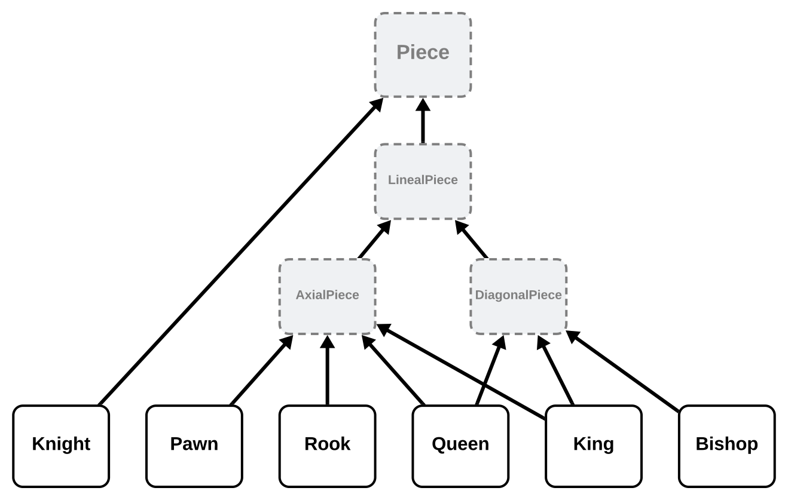
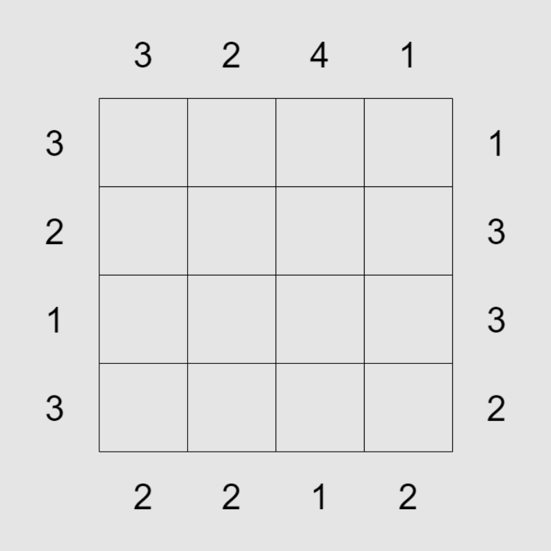
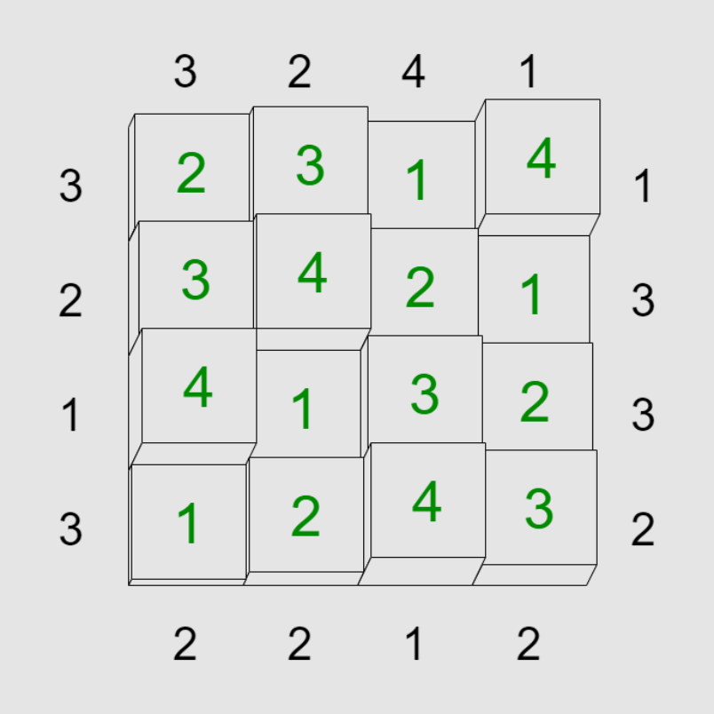

# Ejercicios de Python

## Variables, tipos, entrada/salida

1. Pedir por consola cuánto cuesta y cuánto pesa una caja vacía, así como cuánto cuesta y pesa una muñeca. Luego pedir por consola cuántas muñecas hay por caja y cuántas cajas hay. Imprimir en la consola el coste (€) y el peso (g) totales.

    <details>
    <summary>Solución</summary>

    ```python
    doll_price = float(input('Precio de una muñeca: '))
    doll_weight = float(input('Peso de una muñeca: '))
    box_price = float(input('Precio de una caja: '))
    box_weight = float(input('Peso de una caja: '))
    dolls_number = int(input('¿Cuántas muñecas hay por caja?: '))
    boxes_number = int(input('¿Cuántas cajas hay?: '))
    
    boxes_price = boxes_number * box_price
    boxes_weight = boxes_number * box_weight
    
    dolls_price_per_box = dolls_number * doll_price
    dolls_weight_per_box = dolls_number * doll_weight
    
    print()
    print(f'Coste total: {boxes_price + boxes_number * dolls_price_per_box} €')
    print(f'Peso total: {boxes_weight + boxes_number * dolls_weight_per_box} g')
    ```

    </details>

<br>

2. Pedir por consola un texto e imprimir el número de caracteres que contiene **sin usar [bucles](../README.md#5-bucles)**.

    <details>
    <summary>Solución</summary>

    ```python
    text = input('Introduce un texto: ')
    print(len(text))
    ```

    </details>

<br>

3. Pedir por consola un texto e imprimir el número de caracteres **distintos** que contiene **sin usar [bucles](../README.md#5-bucles)**.

    <details>
    <summary>Solución</summary>

    ```python
    text = input('Introduce un texto: ')
    print(len(set(text)))
    ```

    </details>

<br>

4. Tenemos una lista de pelotas de colores con sus respectivos identificadores:

    ```python
    balls = [('roja', 5), ('azul', 12), ('verde', 27), ('amarilla', 35), ('morada', 44)]
    ```
   
    Crear un programa **sin usar [sentencias condicionales](../README.md#4-condicionales)** que pida por consola un identificador e imprima únicamente el color asociado, sin mostrar el identificador en la salida. Si el identificador introducido no tiene pelota asociada, no importa el resultado.

    <details>
    <summary>Solución</summary>

    a)
    ```python
    balls = [('roja', 5), ('azul', 12), ('verde', 27), ('amarilla', 35), ('morada', 44)]
    
    id = int(input('Id: '))
    print(balls[id // 10][0])
    ```
    b)
    ```python
    balls = [('roja', 5), ('azul', 12), ('verde', 27), ('amarilla', 35), ('morada', 44)]
    
    id = int(input('Id: '))
    print(balls[int(id / 10)][0])
    ```

    </details>

<br>

5. Tenemos unas tuplas que dan información sobre el precio por kilo de algunas frutas:

    ```python
    fruits = ('mandarina', 'plátano', 'manzana', 'pera', 'melocotón', 'uva', 'mango')
    prices = (3.85, 2.99, 2.69, 4.25, 4.50, 4.95, 3.49)
    ```
   
    Crear un programa que pida por consola el nombre de una fruta y cuántos kilos se quiere comprar, e imprima el coste total (€) **sin usar [sentencias condicionales](../README.md#4-condicionales)**.

    <details>
    <summary>Solución</summary>

    ```python
    fruits = ('mandarina', 'plátano', 'manzana', 'pera', 'melocotón', 'uva', 'mango')
    prices = (3.85, 2.99, 2.69, 4.25, 4.50, 4.95, 3.49)
    
    fruit = input('Fruta: ')
    kilos = float(input('Kilos: '))
    index = fruits.index(fruit)
    print(f'Coste total: {prices[index] * kilos} €')
    ```

    </details>

<br>

6. Comprobar si una palabra recibida por consola es un **palíndromo** e imprimir el **[booleano](../README.md#11-tipos-más-usados)** resultante **sin usar [sentencias condicionales](../README.md#4-condicionales)**. Un **palíndromo** es un texto que se lee igual de izquierda a derecha que de derecha a izquierda. Por ejemplo:

    - `'hola'` ➡️ `False`
    - `'ojos'` ➡️ `False`
    - `'ojo'` ➡️ `True`
    - `'abcba'` ➡️ `True`
    - `'rallar'` ➡️ `True`
    - `'reconocer'` ➡️ `True`

    <br>

    <details>
    <summary>Solución</summary>

    ```python
    text = input('Introduce una palabra: ')
    print(text == text[::-1])
    ```

    </details>

<br>

7. Imprimir por consola una lista con los números **pares ordenados** del **0** al **20** teniendo el siguiente código como base:

    ```python
    elements_a = (0, 1, 2, 3, 4, 5, 6, 7, 8, 9, 10)
    elements_b = [11, 12, 13, 14, 15, 16, 17, 18, 19, 20]
    ```

    Prohibiciones:

    - ❌ Usar la [función integrada](https://docs.python.org/3/library/functions.html) `range()`.
    - ❌ Usar [bucles](../README.md#5-bucles).
    - ❌ [Importar](../README.md#9-importaciones).
    - ❌ Añadir números manualmente. Por ejemplo: `[0, 2, 4, ...]`.
    - ❌ Transformar los números en otros con sumas, restas, etc.
    - ❌ Abusar del acceso individual. Por ejemplo: `[elements_a[0], elements_a[2], elements_a[4], ...]`.

    <br>

    <details>
    <summary>Solución</summary>

    a)
    ```python
    elements_a = (0, 1, 2, 3, 4, 5, 6, 7, 8, 9, 10)
    elements_b = [11, 12, 13, 14, 15, 16, 17, 18, 19, 20]
    
    print([*elements_a, *elements_b][::2])
    ```
    b)
    ```python
    elements_a = (0, 1, 2, 3, 4, 5, 6, 7, 8, 9, 10)
    elements_b = [11, 12, 13, 14, 15, 16, 17, 18, 19, 20]
    
    print((list(elements_a) + elements_b)[::2])
    ```

    </details>

<br>

8. Imprimir por consola una lista con **todos** los números **ordenados** del **0** al **20**. A partir de esa lista, imprimir otra con los números **pares ordenados** y otra con los **múltiplos de 3 ordenados**. Trabajar con el siguiente código como base:

    ```python
    elements_a = (14, 14, 14, 13, 13, 13, 12, 12, 12, 11, 11, 11, 10, 10, 10, [[0]])
    elements_b = [(5,), 15, '-', 16, None, 17, False, 18, 0.5, 19]
    elements_c = {9: 1, 8: 2, 7: 3, 6: 4}
    elements_d = {20}
    ```

    Prohibiciones:

    - ❌ Usar las [funciones integradas](https://docs.python.org/3/library/functions.html) `range()` y `sorted()`.
    - ❌ Usar [bucles](../README.md#5-bucles).
    - ❌ [Importar](../README.md#9-importaciones).
    - ❌ Añadir números manualmente. Por ejemplo: `[0, 2, 4, ...]`.
    - ❌ Transformar los números en otros con sumas, restas, etc.
    - ❌ Abusar del acceso individual. Por ejemplo: `[elements_a[0], elements_a[2], elements_a[4], ...]`.

    <br>

    <details>
    <summary>Solución</summary>

    ```python
    elements_a = (14, 14, 14, 13, 13, 13, 12, 12, 12, 11, 11, 11, 10, 10, 10, [[0]])
    elements_b = [(5,), 15, '-', 16, None, 17, False, 18, 0.5, 19]
    elements_c = {9: 1, 8: 2, 7: 3, 6: 4}
    elements_d = {20}
    
    all_elements = [
        elements_a[-1][0][0],
        *elements_c.values(),
        elements_b[0][0],
        *reversed(elements_c),
        *elements_a[-2::-3],
        *elements_b[1::2],
        *elements_d
    ]
    print(all_elements)
    print(all_elements[::2])
    print(all_elements[::3])
    ```

    </details>

<br>

## Condicionales

1. El programa debe preguntar al usuario la edad del cliente y mostrar el precio de una entrada. Si el cliente es menor de 4 años puede entrar gratis, si tiene entre 4 y 18 años (inclusive) debe pagar 5 € y si es mayor de 18 años, 10 €.

    <details>
    <summary>Solución</summary>

    ```python
    age = int(input('Edad: '))

    if age < 4:
        price = 0
    elif age <= 18:
        price = 5
    else:
        price = 10

    print(f'Precio de la entrada: {f'{price} €' if price else '¡gratis!'}')
    ```

    </details>

<br>

2. Pedir por consola una operación a realizar (`'+'`, `'-'`, `'*'` o `'/'`) y dos números, e imprimir el resultado de aplicarles dicha operación. Si se introduce cualquier otra operación deberá mostrar por consola `Operación no válida.`.

    <details>
    <summary>Solución</summary>

    a)
    ```python
    operation = input('Operación: ')
    number_1 = float(input('Primer número: '))
    number_2 = float(input('Segundo número: '))
    
    if operation == '+':
        print(number_1 + number_2)
    elif operation == '-':
        print(number_1 - number_2)
    elif operation == '*':
        print(number_1 * number_2)
    elif operation == '/':
        print(number_1 / number_2)
    else:
        print('Operación no válida.')
    ```
    b)
    ```python
    operation = input('Operación: ')
    number_1 = float(input('Primer número: '))
    number_2 = float(input('Segundo número: '))
    
    match operation:
        case '+':
            print(number_1 + number_2)
        case '-':
            print(number_1 - number_2)
        case '*':
            print(number_1 * number_2)
        case '/':
            print(number_1 / number_2)
        case _:
            print('Operación no válida.')
    ```

    </details>

<br>

3. Pedir por consola un año e imprimir si es bisiesto o no.

    <details>
    <summary>Solución</summary>

    ```python
    year = int(input('Año: '))

    if year % 4 == 0 and year % 100 != 0 or year % 400 == 0:
        print('Es bisiesto.')
    else:
        print('No es bisiesto.')
    ```

    </details>

<br>

4. Los alumnos de un curso se han dividido en dos grupos, A y B, de acuerdo al sexo y al nombre. El grupo A está formado por las mujeres cuyos nombres empiezan por una letra anterior a la M y los hombres cuyos nombres empiezan por N o una letra posterior. El grupo B está formado por el resto. Escribir un programa que pregunte al usuario su nombre y sexo, y muestre por consola el grupo que le corresponde.

    <details>
    <summary>Solución</summary>

    ```python
    name_first_letter = input('Introduce tu nombre: ')[0].upper()
    sex = input('Introduce tu sexo (M/F): ').upper()

    if sex == 'F' and name_first_letter < 'M' or sex == 'M' and name_first_letter >= 'N':
        print('Grupo A.')
    else:
        print('Grupo B.')
    ```

    </details>

<br>

5. Escribir un programa que reciba tu fecha de nacimiento por consola con un formato como `12/05/97` o `12/05/1997` y que imprima por consola cuantos años cumplirás el año 2050. Hay que tener en cuenta que el año puede darse en dos dígitos o en cuatro. Por ejemplo, Python asigna los valores 69–99 a 1969–1999 y los valores 0–68 a 2000–2068.

    <details>
    <summary>Solución</summary>

    a)
    ```python
    date = input('Fecha de nacimiento: ')
    year = int(date.split('/')[-1])

    if year < 1000:
        if year >= 69:
            year += 1900
        else:
            year += 2000

    print(f'En 2050 cumplirás {2050 - year} años.')
    ```
    b)
    ```python
    import datetime

    date = input('Fecha de nacimiento: ')

    try:
        year = datetime.datetime.strptime(date, '%d/%m/%y').year
    except ValueError:
        year = datetime.datetime.strptime(date, '%d/%m/%Y').year

    print(f'En 2050 cumplirás {2050 - year} años.')
    ```

    </details>

<br>

## Bucles

1. Imprimir por consola la tabla de multiplicar del número que se pida por consola.

    <details>
    <summary>Solución</summary>

    ```python
    number = int(input('Tabla del: '))
    for i in range(1, 11):
        print(f'{number} * {i} = {number * i}')
    ```

    </details>

<br>

2. Pedir por consola una contraseña. Luego pedir de nuevo para confirmarla. Repetir esta segunda petición infinitamente mientras no coincida con la primera. Mostrar la contraseña por consola tras la correcta confirmación.

    <details>
    <summary>Solución</summary>

    a)
    ```python
    password = input('Introduce una contraseña: ')
    
    confirm_password = None
    while confirm_password != password:
        confirm_password = input('Confirma la contraseña: ')
    
    print(confirm_password)
    ```
    b)
    ```python
    password = input('Introduce una contraseña: ')
    
    while (confirm_password := input('Confirma la contraseña: ')) != password:
        pass
    
    print(confirm_password)
    ```

    </details>

<br>

3. Pedir por consola un número e imprimir el resultado siguiendo esta lógica:

    - `0` ➡️
    - `1` ➡️ `0`
    - `5` ➡️ `01234`
    - `15` ➡️ `012345678901234`
    - `22` ➡️ `0123456789012345678901`
    - `37` ➡️ `0123456789012345678901234567890123456`

    Resolver este ejercicio dos veces: una **usando [sentencias condicionales](../README.md#4-condicionales)** y otra **sin ellas**. **Solo se puede usar un bucle**.

    <details>
    <summary>Solución</summary>

    a)
    ```python
    number = input('Introduce un número: ')
    
    digit = 0
    for _ in range(number):
        if digit >= 10:
            digit -= 10
    
        print(digit, end='')
    
        digit += 1
    ```
    b)
    ```python
    number = input('Introduce un número: ')
    for i in range(number):
        print(i % 10, end='')
    ```

    </details>

<br>

4. Pedir por consola un número cuyos dígitos vamos a iterar para imprimir, según el valor de cada uno de ellos, una barra de progreso con los caracteres █ y ▒. Por ejemplo, si tuviéramos el número `41752`, iteraríamos cada dígito (empezando por el `4`), entonces imprimiríamos por consola `4 `████▒▒▒▒▒. Luego en la siguiente fila imprimiríamos `1 `█▒▒▒▒▒▒▒▒ y así sucesivamente hasta `2 `██▒▒▒▒▒▒▒.

    <details>
    <summary>Solución</summary>

    ```python
    CHARACTER_ON = '█'
    CHARACTER_OFF = '▒'
    
    number = input('Introduce un número: ')
    
    for digit in number:
        progress = int(digit)
        print(f'{digit} {CHARACTER_ON * progress}{CHARACTER_OFF * (9 - progress)}')
    ```

    </details>

<br>

5. Usando como base el ejercicio anterior: pedir por consola otro número. Si este número es mayor que `0`, las barras de progreso se imprimirán en orden ascendente, si es menor que `0`, en orden descendente, y si es igual a `0`, en orden de aparición (como en el ejercicio anterior).

    <details>
    <summary>Solución</summary>

    ```python
    CHARACTER_ON = '█'
    CHARACTER_OFF = '▒'
    
    number = input('Introduce un número: ')
    order = int(input('Introduce el orden: '))
    
    if order < 0:
        digits = sorted(number, reverse=True)
    elif order == 0:
        digits = number
    else:
        digits = sorted(number)
    
    for digit in digits:
        print(f'{digit} {CHARACTER_ON * int(digit)}{CHARACTER_OFF * (9 - int(digit))}')
    ```

    </details>

<br>

6. Pedir por consola la longitud de un lado de un triángulo e imprimir uno siguiendo el formato dado a continuación. Por ejemplo, para longitud 5:

    ```
    1 
    3 1 
    5 3 1 
    7 5 3 1 
    9 7 5 3 1 
    ```

    <details>
    <summary>Solución</summary>

    ```python
    height = int(input('Introduce la altura del triángulo: '))
    
    for i in range(1, height * 2, 2):
        for j in range(i, 0, -2):
            print(j, end=' ')
        print()
    ```

    </details>

<br>

7. Pedir por consola la longitud de un lado de un rombo e imprimir uno siguiendo el formato dado a continuación. Por ejemplo, para longitud 4:

    ```
       *
      ***
     *****
    *******
     *****
      ***
       *
    ```

    <details>
    <summary>Solución</summary>

    ```python
    length = int(input('Introduce la longitud del lado del rombo: '))
    
    for i in range(-length + 1, length):
        print(f'{' ' * (abs(i))}{'*' * ((length - abs(i)) * 2 - 1)}')
    ```

    </details>

<br>

8. Pedir por consola el número de niveles (altura) del [triángulo de Pascal o de Tartaglia](https://es.wikipedia.org/wiki/Tri%C3%A1ngulo_de_Pascal) e imprimirlo por consola. Por ejemplo:

    - Para altura 0:

        ```
        ```

    - Para altura 1:

        ```
        1 
        ```

    - Para altura 2:

        ```
         1 
        1 1 
        ```

    - Para altura 5:

        ```
            1 
           1 1 
          1 2 1 
         1 3 3 1 
        1 4 6 4 1 
        ```

    <details>
    <summary>Solución</summary>

    a)
    ```python
    length = int(input('Introduce la altura del triángulo: '))
    
    last_row = [0, 1]
    for i in range(length):
        print(' ' * (length - i - 1), end='')
    
        row = [0]
        for j in range(i + 1):
            number = last_row[j] + last_row[j + 1]
            print(number, end=' ')
            row.append(number)
        row.append(0)
        print()
    
        last_row = row
    ```
    b)
    ```python
    length = int(input('Introduce la altura del triángulo: '))
    
    if length > 0:
        print(f'{' ' * (length - 1)}1')
    
    last_row = []
    for i in range(1, length):
        print(f'{' ' * (length - i - 1)}1', end=' ')
    
        row = [1]
        for j in range(i - 1):
            number = last_row[j] + last_row[j + 1]
            print(number, end=' ')
            row.append(number)
        print(1)
        row.append(1)
    
        last_row = row
    ```
    c)
    ```python
    import math
    
    length = int(input('Introduce la altura del triángulo: '))
    
    for i in range(length):
        print(' ' * (length - i - 1), end='')
    
        for j in range(i + 1):
            print(int(math.factorial(i) / (math.factorial(j) * math.factorial(i - j))), end=' ')
        print()
    ```

    </details>

<br>

9. Pedir por consola palabras infinitamente hasta que se introduzca `'fin'`. Luego imprimir cada una de esas palabras en una línea diferente.

    <details>
    <summary>Solución</summary>

    a)
    ```python
    words = []
    while (word := input('Introduce una palabra: ')) != 'fin':
        words.append(word)
    
    for word in words:
        print(word)
    ```
    b)
    ```python
    words = []
    while True:
        word = input('Introduce una palabra: ')
        if word == 'fin':
            break
    
        words.append(word)
    
    for word in words:
        print(word)
    ```

    </details>

<br>

10. Pedir un número por consola e imprimir una lista con los números impares del **1** al número introducido, inclusive. Resolver este ejercicio dos veces: una **usando [sentencias condicionales](../README.md#4-condicionales)** y otra **sin ellas**.

    <details>
    <summary>Solución</summary>

    a)
    ```python
    number = int(input('Impares hasta el: '))
    
    odd_numbers = []
    for i in range(1, number + 1):
        if i % 2 != 0:
            odd_numbers.append(i)
    
    print(odd_numbers)
    ```
    b)
    ```python
    number = int(input('Impares hasta el: '))
    
    odd_numbers = []
    for i in range(1, number + 1, 2):
        odd_numbers.append(i)
    
    print(odd_numbers)
    ```

    </details>

<br>

11. Pedir por consola un texto e imprimir el número de caracteres **distintos** que contiene **usando [bucles](../README.md#5-bucles) y sin usar [conjuntos](../README.md#16-conjuntos)**.

    <details>
    <summary>Solución</summary>

    ```python
    text = input('Introduce un texto: ')
    characters = []
    for character in text:
        if character not in characters:
            characters.append(character)
    
    print(len(characters))
    ```

    </details>

<br>

12. Pedir por consola una serie de números enteros (negativos y positivos) separados por espacios e imprimir la lista de sus cuadrados.

    <details>
    <summary>Solución</summary>

    ```python
    numbers = input('Introduce los números: ').split()
    
    squared_numbers = []
    for number in numbers:
        squared_numbers.append(int(number) ** 2)
    
    print(squared_numbers)
    ```

    </details>

<br>

13. Pedir por consola una serie de números enteros (negativos y positivos) separados por espacios e imprimir el máximo sin usar la [función integrada](https://docs.python.org/3/library/functions.html) `max()`. 

    <details>
    <summary>Solución</summary>

    a)
    ```python
    numbers = input('Introduce los números: ').split()
    
    max_number = int(numbers[0])
    for number in numbers[1:]:
        number = int(number)
        if number > max_number:
            max_number = number
    
    print(max_number)
    ```
    b)
    ```python
    numbers = input('Introduce los números: ').split()
    
    max_number = float('-inf')
    for number in numbers:
        number = int(number)
        if number > max_number:
            max_number = number
    
    print(max_number)
    ```
    
    > En muchos lenguajes de programación es posible representar infinitos mediantenúmeros flotantes. Esto se debe a que los estándares como IEEE 754, utilizados en la representación de números en coma flotante, incluyen un valor especial para infinito positivo y negativo.

    </details>

<br>

14. Sea el código:

    ```python
    from pprint import pprint
    
    students = [
        {'id': 1, 'name': 'Alberto', 'times_taken': 4, 'grade': 3},
        {'id': 2, 'name': 'Ana', 'times_taken': 2, 'grade': 6},
        {'id': 3, 'name': 'Laura', 'times_taken': 4, 'grade': 2},
        {'id': 4, 'name': 'Jorge', 'times_taken': 3, 'grade': 8},
        {'id': 4, 'name': 'Javier', 'times_taken': 1, 'grade': 9},
        {'id': 4, 'name': 'Elena', 'times_taken': 1, 'grade': 5},
    ]
    
    ...
    
    pprint(students)
    ```

    Completar donde `...` para sustituir dentro de `students` las notas numéricas por su equivalente textual, es decir, para:

    - < 5 ➡️ `Suspenso`
    - 5 ➡️ `Aprobado`
    - 6 ➡️ `Bien`
    - 7-8 ➡️ `Notable`
    - 9-10 ➡️ `Sobresaliente`

    <br>

    > `pprint()` (abreviatura de "pretty-print") es una función importada que imprime estructuras de datos de manera más legible y organizada.

    <details>
    <summary>Solución</summary>

    ```python
    from pprint import pprint
    
    students = [
        {'id': 1, 'name': 'Alberto', 'times_taken': 4, 'grade': 3},
        {'id': 2, 'name': 'Ana', 'times_taken': 2, 'grade': 6},
        {'id': 3, 'name': 'Laura', 'times_taken': 4, 'grade': 2},
        {'id': 4, 'name': 'Jorge', 'times_taken': 3, 'grade': 8},
        {'id': 4, 'name': 'Javier', 'times_taken': 1, 'grade': 9},
        {'id': 4, 'name': 'Elena', 'times_taken': 1, 'grade': 5},
    ]
    
    for student in students:
        if student['grade'] < 5:
            student['grade'] = 'Suspenso'
        elif student['grade'] == 5:
            student['grade'] = 'Aprobado'
        elif student['grade'] == 6:
            student['grade'] = 'Bien'
        elif student['grade'] <= 8:
            student['grade'] = 'Notable'
        else:
            student['grade'] = 'Sobresaliente'
    
    pprint(students)
    ```

    </details>

<br>

15. Imaginemos que estamos participando en un concurso en el que debemos girar una ruleta para ganar premios. El objetivo es girar la ruleta **tres veces**, eligiendo nosotros la fuerza del giro en cada ocasión. La fuerza del giro se introducirá por consola, pero no se aplicará de manera exacta; en su lugar, simularemos la fuerza mediante números aleatorios.

    Por ejemplo:

    - Si introducimos una fuerza de 15, la ruleta avanzará un número aleatorio de posiciones entre 13 y 17, inclusive.
    - Si introducimos una fuerza de 20, la ruleta avanzará un número aleatorio entre 18 y 22, inclusive.

    El programa debe permitirnos girar la ruleta **tres veces** para obtener **tres premios** (pueden repetirse), imprimiendo el premio correspondiente cada vez. La posición de la ruleta debe mantenerse entre cada tirada. La fuerza mínima de giro es **10**; si se introduce un número menor, se debe considerar como si fuera **10**. No hay fuerza máxima, se le puede dar muchas vueltas a la ruleta.

    Realizar el ejercicio **sin usar [sentencias condicionales](../README.md#4-condicionales)**.

    Premios asignados a cada sector de la ruleta en orden:

    ```python
    prizes = ['🎁', '📱', '📚', '📷', '💍', '🚗', '🪇', '💻', '🧸', '💰', '📺', '💎', '🧻', '🛫', '🚢', '🚀', '💣']
    ```

    <details>
    <summary>Solución</summary>

    ```python
    import random
    
    prizes = ['🎁', '📱', '📚', '📷', '🍆', '🚗', '🪇', '💻', '🧸', '💰', '📺', '💎', '🧻', '🛫', '🚢', '🚀', '💣']
    
    position = 0
    for _ in range(3):
        force = max(10, int(input('Fuerza: ')))
        position = (position + random.randint(force - 2, force + 2)) % len(prizes)
        print(prizes[position])
    ```

    </details>

<br>

16. Sea el texto:

    ```python
    text = 'Keith recently came back from a trip to Chicago, Illinois. This midwestern metropolis is found along the shore of Lake Michigan. During his visit, Keith spent a lot of time exploring the city to visit important landmarks and monuments.'
    ```

    Introduce por consola pares `'<palabra>,<traducción>'` infinitamente hasta que no se introduzca nada, es decir, introducir una cadena vacía. Una vez obtenidos los datos de la consola se sustituirán las palabras por sus respectivas traducciones y se imprimirá el texto resultante.

    <details>
    <summary>Solución</summary>

    ```python
    text = 'Keith recently came back from a trip to Chicago, Illinois. This midwestern metropolis is found along the shore of Lake Michigan. During his visit, Keith spent a lot of time exploring the city to visit important landmarks and monuments.'
    
    while pair := input('Introduce traducción: '):
        text = text.replace(*pair.split(','))
    
    print(text)
    ```

    </details>

<br>

17. Sea el código:

    ```python
    text = 'Keith recently came back from a trip to Chicago, Illinois. This midwestern metropolis is found along the shore of Lake Michigan. During his visit, Keith spent a lot of time exploring the city to visit important landmarks and monuments.'
    
    ...
    
    for original, translation in zip(originals, translations):
        text = text.replace(original, translation)
    
    print(text)
    ```

    Completar donde `...` para lograr el mismo resultado del ejericio anterior **sin añadir ningún `replace()` más ni alterar el texto más allá de lo que hace ese código**.

    > Se ha usado la [función integrada](https://docs.python.org/3/library/functions.html) `zip()`.

    <details>
    <summary>Solución</summary>

    ```python
    text = 'Keith recently came back from a trip to Chicago, Illinois. This midwestern metropolis is found along the shore of Lake Michigan. During his visit, Keith spent a lot of time exploring the city to visit important landmarks and monuments.'
    
    originals = []
    translations = []
    while pair := input('Introduce traducción: '):
        original, translation = pair.split(',')
        originals.append(original)
        translations.append(translation)
    
    for original, translation in zip(originals, translations):
        text = text.replace(original, translation)
    
    print(text)
    ```

    </details>

<br>

18. Comprobar si dos palabras recibidas por consola son **anagramas** entre sí e imprimir el **[booleano](../README.md#11-tipos-más-usados)** resultante. Una palabra se considera **anagrama** de otra si contienen los mismos caracteres sin importar el orden. Por ejemplo:

    - `'hola'`, `'adios'` ➡️ `False`
    - `'urnas'`, `'runa'` ➡️ `False`
    - `'urnas'`, `'runas'` ➡️ `True`

    <br>

    <details>
    <summary>Solución</summary>

    ```python
    word_1 = input('Introduce la primera palabra: ')
    word_2 = input('Introduce la segunda palabra: ')
    print(sorted(word_1) == sorted(word_2))
    ```

    </details>

<br>

19. A continuación se mostrarán unos fragmentos de código que crean listas. El objetivo de este ejercicio es convertir cada caso en una [lista por comprensión](../README.md#51-listas-por-comprensión) que sea equivalente.

    1. <br>

        ```python
        numbers = []
        for number in [0, 1, 2, 3, 4, 5, 6, 7, 8, 9]:
            numbers.append(number * 2)
        ```

        <details>
        <summary>Solución</summary>

        ```python
        [number * 2 for number in [0, 1, 2, 3, 4, 5, 6, 7, 8, 9]]
        ```

        </details>

    2. <br>

        ```python
        numbers = []
        for number in range(10):
            if number % 3 == 0:
                numbers.append(number)
        ```

        <details>
        <summary>Solución</summary>

        ```python
        [number for number in range(10) if number % 3 == 0]
        ```

        </details>

    3. <br>

        ```python
        words = []
        for word in ['Lorem', 'IPSUM', 'DoLoR', 'sit', 'aMeT']:
            words.append(word.lower())
        ```

        <details>
        <summary>Solución</summary>

        ```python
        [word.lower() for word in ['Lorem', 'IPSUM', 'DoLoR', 'sit', 'aMeT']]
        ```

        </details>

    4. <br>

        ```python
        words = []
        for word in 'lorem ipsum dolor sit amet'.split():
            if word[0] in {'a', 'e', 'i', 'o', 'u'}:
                words.append(word.upper())
        ```

        <details>
        <summary>Solución</summary>

        ```python
        [word.upper() for word in 'lorem ipsum dolor sit amet'.split() if word[0] in {'a', 'e', 'i', 'o', 'u'}]
        ```

        </details>

    5. <br>

        ```python
        characters = []
        for character in 'Lorem IPSUM DoLoR sit aMeT':
            if character.isupper():
                characters.append('🔼')
            else:
                characters.append('🔽')
        ```

        <details>
        <summary>Solución</summary>

        ```python
        ['🔼' if character.isupper() else '🔽' for character in 'Lorem IPSUM DoLoR sit aMeT']
        ```

        </details>

    6. <br>

        ```python
        elements = []
        for i in range(10):
            if 2 <= i < 4:
                elements.append('---')
            else:
                elements.append(i)
        ```

        <details>
        <summary>Solución</summary>

        ```python
        ['---' if 2 <= i < 4 else i for i in range(10)]
        ```

        </details>

    7. <br>

        ```python
        elements = []
        for element in [0, 1, 'two', 'three', 4, 5]:
            if isinstance(element, int):
                if element % 2 == 0:
                    elements.append('even')
                else:
                    elements.append('odd')
        ```

        <details>
        <summary>Solución</summary>

        ```python
        ['even' if element % 2 == 0 else 'odd' for element in [0, 1, 'two', 'three', 4, 5] if isinstance(element, int)]
        ```

        </details>

    8. <br>

        ```python
        elements = []
        for i, element in enumerate([0, 1, 'two', 'three', 4, 5]):
            if i < 4:
                continue
        
            if element % 4 == 0:
                elements.append('✅')
            else:
                elements.append('❌')
        ```

        <details>
        <summary>Solución</summary>

        ```python
        ['✅' if element % 4 == 0 else '❌' for i, element in enumerate([0, 1, 'two', 'three', 4, 5]) if i >= 4]
        ```

        </details>

<br>

20. Hacer un programa que sume las dos matrices proporcionadas, guarde el resultado en una matriz resultado y la imprima fila por fila en la consola. Por ejemplo, para las siguientes matrices:

    ```python
    matrix_a = [
        [1, 2, 3],
        [4, 5, 6],
        [7, 8, 9]
    ]
    
    matrix_b = [
        [9, 8, 7],
        [6, 5, 4],
        [3, 2, 1]
    ]
    ```

    El resultado sería:

    ```python
    [10, 10, 10]
    [10, 10, 10]
    [10, 10, 10]
    ```

    <details>
    <summary>Solución</summary>

    ```python
    matrix_a = [
        [1, 2, 3],
        [4, 5, 6],
        [7, 8, 9]
    ]
    
    matrix_b = [
        [9, 8, 7],
        [6, 5, 4],
        [3, 2, 1]
    ]
    
    matrix_result = [
        [0, 0, 0],
        [0, 0, 0],
        [0, 0, 0]
    ]
    
    for i in range(3):
        for j in range(3):
            matrix_result[i][j] = matrix_a[i][j] + matrix_b[i][j]
    
    for row in matrix_result:
        print(row)
    ```

    </details>

<br>

21. Hacer un programa que multiplique dos matrices cuadradas de cualquier tamaño (ambas del mismo), guarde el resultado en una matriz resultado y la imprima fila por fila en la consola. Por ejemplo, para las siguientes matrices:

    ```python
    matrix_a = [
        [1, 2, 3],
        [4, 5, 6],
        [7, 8, 9]
    ]
    
    matrix_b = [
        [9, 8, 7],
        [6, 5, 4],
        [3, 2, 1]
    ]
    ```

    El resultado sería:

    ```python
    [30, 24, 18]
    [84, 69, 54]
    [138, 114, 90]
    ```

    <details>
    <summary>Solución</summary>

    ```python
    matrix_a = [
        [1, 2, 3],
        [4, 5, 6],
        [7, 8, 9]
    ]
    
    matrix_b = [
        [9, 8, 7],
        [6, 5, 4],
        [3, 2, 1]
    ]
    
    matrix_result = [[0 for _ in range(len(matrix_a))] for _ in range(len(matrix_a))]
    
    for i in range(len(matrix_a)):
        for j in range(len(matrix_a)):
            for k in range(len(matrix_a)):
                matrix_result[i][j] += matrix_a[i][k] * matrix_b[k][j]
    
    for row in matrix_result:
        print(row)
    ```

    </details>

<br>

22. Programar un juego de piedra, papel y tijeras en el que se pide tu jugada por consola y se genera la jugada de la IA de manera aleatoria. Mientras el usuario proporcione una entrada por consola que no sea `'piedra'`, `'papel'` o `'tijeras'` se debe repetir la petición por consola. Al obtener la respuesta se imprimirá por consola que opción escogió la IA y el resultado de la ronda. El juego continuará para siempre.

    <details>
    <summary>Solución</summary>

    ```python
    import random
    
    options = ('piedra', 'papel', 'tijeras')
    
    while True:
        human_play = input('Elige tu jugada (piedra/papel/tijeras): ')
        if human_play not in options:
            continue
    
        ai_play = random.choice(options)
    
        if human_play == ai_play:
            print(f'La IA eligió {ai_play}. Empate.')
        elif options[(options.index(human_play) + 1) % 3] == ai_play:
            print(f'La IA eligió {ai_play}. Perdiste.')
        else:
            print(f'La IA eligió {ai_play}. ¡Ganaste!')
    ```

    </details>

<br>

23. Escribir un programa que reciba tu fecha de nacimiento por consola con un formato como `18/6/97` o `18/6/1997`, teniendo en cuenta que el año puede darse en dos o cuatro dígitos (por ejemplo, Python asigna los valores 69–99 a 1969–1999 y los valores 0–68 a 2000–2068) y que imprima por consola una línea por año cumplido hasta 2023, inclusive. Por ejemplo, para `18/6/1997`:

    ```
    El 18 de junio de 1998 cumpliste 1 año.
    El 18 de junio de 1999 cumpliste 2 años.
    ...
    ```

    Nótese que cuando se cumple 1 año se indica en singular y, para más años, en plural. Además sustituimos el número de mes por su nombre.

    <details>
    <summary>Solución</summary>

    a)
    ```python
    date = input('Fecha de nacimiento: ')
    day, month, first_year = (int(number) for number in date.split('/'))
    
    if first_year < 1000:
        if first_year >= 69:
            first_year += 1900
        else:
            first_year += 2000
    
    month_names = [
        'enero',
        'febrero',
        'marzo',
        'abril',
        'mayo',
        'junio',
        'julio',
        'agosto',
        'septiembre',
        'octubre',
        'noviembre',
        'diciembre'
    ]
    
    for i, year in enumerate(range(first_year + 1, 2024), start=1):
        print(f'El {day} de {month_names[month - 1]} de {year} cumpliste {i} año{'' if i == 1 else 's'}.')
    ```
    b)
    ```python
    import datetime
    
    date = input('Fecha de nacimiento: ')
    day, month, first_year = (int(number) for number in date.split('/'))
    
    try:
        first_year = datetime.datetime.strptime(date, '%d/%m/%y').year
    except ValueError:
        first_year = datetime.datetime.strptime(date, '%d/%m/%Y').year
    
    month_names = [
        'enero',
        'febrero',
        'marzo',
        'abril',
        'mayo',
        'junio',
        'julio',
        'agosto',
        'septiembre',
        'octubre',
        'noviembre',
        'diciembre'
    ]
    
    for i, year in enumerate(range(first_year + 1, 2024), start=1):
        print(f'El {day} de {month_names[month - 1]} de {year} cumpliste {i} año{'' if i == 1 else 's'}.')
    ```

    </details>

<br>

24. Escribir un programa que pida por consola nombres de asignaturas continuamente hasta que se introduzca `'fin'`. Luego el programa preguntará la nota para cada asignatura y terminará imprimiendo las asignaturas que queden suspensas siguiendo el siguiente formato: `Asignaturas suspensas: Lengua, Matemáticas y Física.`

    <details>
    <summary>Solución</summary>

    ```python
    subject = input('Introduce una asignatura ("fin" para terminar): ')
    subjects = []
    while subject != 'fin':
        subjects.append(subject)
        subject = input('Introduce una asignatura ("fin" para terminar): ')
    
    failed_subjects = []
    for subject in subjects:
        grade = float(input(f'Introduce la nota de {subject}: '))
        if grade < 5:
            failed_subjects.append(subject)
    
    if len(failed_subjects) > 1:
        print(f'Asignaturas suspensas: {', '.join(failed_subjects[:-1])} y {failed_subjects[-1]}.')
    else:
        print(f'Asignaturas suspensas: {failed_subjects[0]}.')
    ```

    </details>

<br>

25. Hacer un programa que imprima por consola el número de veces que aparece cada palabra en el siguiente texto:

    ```
    Lorem ipsum dolor sit amet. Et magni enim quo odit pariatur cum voluptatibus temporibus. Quo molestiae tempore qui magni necessitatibus ut sunt nisi est suscipit ullam non voluptatem omnis. Et autem quia et voluptatem mollitia et quam atque. Est consequatur eius non quam nostrum ab quos internos qui incidunt voluptatem. Non harum aperiam et voluptas ipsam aut porro corrupti ut laborum exercitationem eum quidem incidunt est architecto harum. Cum vero voluptatem et culpa reiciendis et dolorum cupiditate et alias expedita. Vel magnam quam in fugiat fugit qui illum provident nam assumenda quia ut labore doloremque id excepturi asperiores sed explicabo expedita! Non amet deleniti id excepturi eaque eum internos velit ut commodi quia non tenetur dolorem!
    ```

    <details>
    <summary>Solución</summary>

    a)
    ```python
    text = 'Lorem ipsum dolor sit amet. Et magni enim quo odit pariatur cum voluptatibus temporibus. Quo molestiae tempore qui magni necessitatibus ut sunt nisi est suscipit ullam non voluptatem omnis. Et autem quia et voluptatem mollitia et quam atque. Est consequatur eius non quam nostrum ab quos internos qui incidunt voluptatem. Non harum aperiam et voluptas ipsam aut porro corrupti ut laborum exercitationem eum quidem incidunt est architecto harum. Cum vero voluptatem et culpa reiciendis et dolorum cupiditate et alias expedita. Vel magnam quam in fugiat fugit qui illum provident nam assumenda quia ut labore doloremque id excepturi asperiores sed explicabo expedita! Non amet deleniti id excepturi eaque eum internos velit ut commodi quia non tenetur dolorem!'
    
    word_occurrences = {}
    
    for word in text.split():
        if word in word_occurrences:
            word_occurrences[word] += 1
        else:
            word_occurrences[word] = 1
    
    print(word_occurrences)
    ```
    b)
    ```python
    from collections import defaultdict
    
    text = 'Lorem ipsum dolor sit amet. Et magni enim quo odit pariatur cum voluptatibus temporibus. Quo molestiae tempore qui magni necessitatibus ut sunt nisi est suscipit ullam non voluptatem omnis. Et autem quia et voluptatem mollitia et quam atque. Est consequatur eius non quam nostrum ab quos internos qui incidunt voluptatem. Non harum aperiam et voluptas ipsam aut porro corrupti ut laborum exercitationem eum quidem incidunt est architecto harum. Cum vero voluptatem et culpa reiciendis et dolorum cupiditate et alias expedita. Vel magnam quam in fugiat fugit qui illum provident nam assumenda quia ut labore doloremque id excepturi asperiores sed explicabo expedita! Non amet deleniti id excepturi eaque eum internos velit ut commodi quia non tenetur dolorem!'
    
    word_occurrences = defaultdict(int)
    
    for word in text.split():
        word_occurrences[word] += 1
    
    print(word_occurrences)
    ```
    c)
    ```python
    from collections import Counter
    
    text = 'Lorem ipsum dolor sit amet. Et magni enim quo odit pariatur cum voluptatibus temporibus. Quo molestiae tempore qui magni necessitatibus ut sunt nisi est suscipit ullam non voluptatem omnis. Et autem quia et voluptatem mollitia et quam atque. Est consequatur eius non quam nostrum ab quos internos qui incidunt voluptatem. Non harum aperiam et voluptas ipsam aut porro corrupti ut laborum exercitationem eum quidem incidunt est architecto harum. Cum vero voluptatem et culpa reiciendis et dolorum cupiditate et alias expedita. Vel magnam quam in fugiat fugit qui illum provident nam assumenda quia ut labore doloremque id excepturi asperiores sed explicabo expedita! Non amet deleniti id excepturi eaque eum internos velit ut commodi quia non tenetur dolorem!'
    
    print(Counter(text.split()))
    ```

    </details>

<br>

26. En una tienda de deportes ha habido un lote de pelotas descoloridas que se tienen que vender con descuento. Crear un programa que pida por consola el precio de una pelota y su descuento para el lote descolorido. Luego pedir por consola el número de pelotas normales y descoloridas que hay en la tienda. Mientras queden pelotas en la tienda: preguntar por consola si quiere comprar una pelota normal o una descolorida e imprimir por consola lo que le va a costar al cliente (y la pelota contará ya como vendida).

    <details>
    <summary>Solución</summary>

    ```python
    ball_price = float(input('Precio de una pelota: '))
    discount = float(input('% de descuento para pelota descolorida: '))
    normal_balls = int(input('Nº de pelotas normales: '))
    colorless_balls = int(input('Nº de pelotas descoloridas: '))

    discounted_price = ball_price * discount / 100

    while normal_balls or colorless_balls:
        option = input('¿Quieres una pelota normal o descolorida? (N/D): ')

        if option.upper() == 'N':
            if normal_balls:
                print(f'Te va a costar {ball_price} €')
                normal_balls -= 1
                print(f'Quedan {normal_balls} pelotas normales.')
            else:
                print('No quedan pelotas normales.')
        elif option.upper() == 'D':
            if colorless_balls:
                print(f'Te va a costar {discounted_price} €')
                colorless_balls -= 1
                print(f'Quedan {colorless_balls} pelotas descoloridas.')
            else:
                print('No quedan pelotas descoloridas.')
    ```

    </details>

<br>

## Funciones

1. Sea una función `sum_numbers` que sume una lista de números enteros y devuelva el resultado:

    ```python
    def sum_numbers(numbers: list[int]) -> int:
        ...
    
    
    assert sum_numbers([1]) == 1
    assert sum_numbers([0, 1, 2, 3, 4, 5]) == 15
    assert sum_numbers([5, 1, 85, 21, 5, 1, 252, 15, 1, 0, 56]) == 442
    assert sum_numbers([99, -2, 651, -215, -5, 15, -2, -5, -5, 9, -165, -1]) == 374
    assert sum_numbers([]) == 0
    
    print('✅')
    ```
   
    Rellenar el código donde `...` para que, al ejecutarlo, no se produzca ningún error y se imprima `✅` por consola.
    
    > `assert` es una sentencia que comprueba la veracidad de lo que haya a la derecha. Si es `True` no hace nada, pero si es `False` lanza una [excepción](../README.md#7-excepciones).

    <details>
    <summary>Solución</summary>

    a)
    ```python
    def sum_numbers(numbers: list[int]) -> int:
        total = 0
        for number in numbers:
            total += number
    
        return total
    
    
    assert sum_numbers([1]) == 1
    assert sum_numbers([0, 1, 2, 3, 4, 5]) == 15
    assert sum_numbers([5, 1, 85, 21, 5, 1, 252, 15, 1, 0, 56]) == 442
    assert sum_numbers([99, -2, 651, -215, -5, 15, -2, -5, -5, 9, -165, -1]) == 374
    assert sum_numbers([]) == 0
    
    print('✅')
    ```
    b)
    > Usando la [función integrada](https://docs.python.org/3/library/functions.html) `sum()`:

    ```python
    def sum_numbers(numbers: list[int]) -> int:
        return sum(numbers)
    
    
    assert sum_numbers([1]) == 1
    assert sum_numbers([0, 1, 2, 3, 4, 5]) == 15
    assert sum_numbers([5, 1, 85, 21, 5, 1, 252, 15, 1, 0, 56]) == 442
    assert sum_numbers([99, -2, 651, -215, -5, 15, -2, -5, -5, 9, -165, -1]) == 374
    assert sum_numbers([]) == 0
    
    print('✅')
    ```

    </details>

<br>

2. Crear una función que devuelva la media de una lista de números enteros. Para ello rellenar el siguiente código donde `...` y ejecutarlo sin errores:

    ```python
    ...
    
    
    assert average([0, 1]) == 0.5
    assert average([1, 3]) == 2
    assert average([1, 1, 1, 2, 2, 2]) == 1.5
    assert average([1, 2, 3, 4, 5, 6, 7]) == 4
    assert average([99, -2, 651, -215, -5, 15, -2, -5, -5, 9, -1]) == 49
    
    print('✅')
    ```

    <details>
    <summary>Solución</summary>

    a)
    ```python
    def average(numbers: list[int]) -> float:
        return sum(numbers) / len(numbers)
    
    
    assert average([0, 1]) == 0.5
    assert average([1, 3]) == 2
    assert average([1, 1, 1, 2, 2, 2]) == 1.5
    assert average([1, 2, 3, 4, 5, 6, 7]) == 4
    assert average([99, -2, 651, -215, -5, 15, -2, -5, -5, 9, -1]) == 49
    
    print('✅')
    ```
    b)
    ```python
    import statistics
    
    
    def average(numbers: list[int]) -> float:
        return statistics.mean(numbers)
    
    
    assert average([0, 1]) == 0.5
    assert average([1, 3]) == 2
    assert average([1, 1, 1, 2, 2, 2]) == 1.5
    assert average([1, 2, 3, 4, 5, 6, 7]) == 4
    assert average([99, -2, 651, -215, -5, 15, -2, -5, -5, 9, -1]) == 49
    
    print('✅')
    ```

    </details>

<br>

3. Crear una función que multiplique dos números enteros y devuelva el resultado **sin usar el operador `*` ni otras funciones ya existentes en el lenguaje**. Para ello rellenar el siguiente código donde `...` y ejecutarlo sin errores:

    ```python
    ...
    
    
    assert multiply(1, 0) == 0
    assert multiply(1, 5) == 5
    assert multiply(2, 3) == 6
    assert multiply(4, 6) == 24
    assert multiply(9, 9) == 81
    assert multiply(156, 748) == 116688
    
    print('✅')
    ```

    <details>
    <summary>Solución</summary>

    a)
    ```python
    def multiply(a: int, b: int) -> int:
        result = 0
        for _ in range(b):
            result += a
    
        return result
    
    
    assert multiply(1, 0) == 0
    assert multiply(1, 5) == 5
    assert multiply(2, 3) == 6
    assert multiply(4, 6) == 24
    assert multiply(9, 9) == 81
    assert multiply(156, 748) == 116688
    
    print('✅')
    ```

    </details>

<br>

4. Crear una función que calcule la potencia de dos números enteros y devuelva el resultado **sin usar el operador `*` ni el `**` ni otras funciones ya existentes en el lenguaje**. Para ello rellenar el siguiente código donde `...` y ejecutarlo sin errores:

    ```python
    ...
    
    
    assert power(1, 0) == 1
    assert power(1, 5) == 1
    assert power(2, 3) == 8
    assert power(4, 6) == 4096
    assert power(9, 9) == 387420489
    assert power(156, 748) == 286549443351127940912310344045265379399803458435563791862649509231216879586336194220793821017373647185528398137999718912683128795377832303403490201379359728778963725712702463720899321651446986307432812286112922967228580960214040125458695767296293492756095590796296252772591364291990138982325685743548631279104099327229955069543312383943928569589500428240235864193352231896378085487701206310482438629978196570600669696176974867295927957162771499932719963782638405872941627163945392132697296159548444339186032772019071612508373347184386809719130025733501976239325432083270617606124112480291078628881717726173272160235619918748740934426750510852059921564202650490333472044279349258704176344258614157450959649432290412661948873317244678184320775559997651598349552153798297229315952888067156171478848685229875195340084118982746553371195570217565399222912887319714437063923000301169199431174634221186253813327520958521863464388914428822386196528155397135516468634450866394412866963150900511750867881496922423196459731944557792051780869298758423806545140278667826504433395868108990488815000032551672311460007973246010385852170542062600416835177910004633677354230797418744082051322584486841250399669246233133287810006784316971050988939252097351751754453069226094037483479404065220228309524776165493035610689065099827326914471595115782429383596669980591989328083380710996308171307342231329766100047312986412629944411588282939893313052319942829030706584636734295943711749021207252714951142354676931287445776741682610756756409826172383898461966942453065292464871485995092675008017851221446856996710750853618091265093397903433961824210436455077318230016
    
    print('✅')
    ```

    <details>
    <summary>Solución</summary>

    a)
    ```python
    def multiply(a: int, b: int) -> int:
        result = 0
        for _ in range(b):
            result += a
    
        return result
    
    
    def power(a: int, b: int) -> int:
        result = 1
        for _ in range(b):
            result *= a
    
        return result
    
    
    assert power(1, 0) == 1
    assert power(1, 5) == 1
    assert power(2, 3) == 8
    assert power(4, 6) == 4096
    assert power(9, 9) == 387420489
    assert power(156, 748) == 286549443351127940912310344045265379399803458435563791862649509231216879586336194220793821017373647185528398137999718912683128795377832303403490201379359728778963725712702463720899321651446986307432812286112922967228580960214040125458695767296293492756095590796296252772591364291990138982325685743548631279104099327229955069543312383943928569589500428240235864193352231896378085487701206310482438629978196570600669696176974867295927957162771499932719963782638405872941627163945392132697296159548444339186032772019071612508373347184386809719130025733501976239325432083270617606124112480291078628881717726173272160235619918748740934426750510852059921564202650490333472044279349258704176344258614157450959649432290412661948873317244678184320775559997651598349552153798297229315952888067156171478848685229875195340084118982746553371195570217565399222912887319714437063923000301169199431174634221186253813327520958521863464388914428822386196528155397135516468634450866394412866963150900511750867881496922423196459731944557792051780869298758423806545140278667826504433395868108990488815000032551672311460007973246010385852170542062600416835177910004633677354230797418744082051322584486841250399669246233133287810006784316971050988939252097351751754453069226094037483479404065220228309524776165493035610689065099827326914471595115782429383596669980591989328083380710996308171307342231329766100047312986412629944411588282939893313052319942829030706584636734295943711749021207252714951142354676931287445776741682610756756409826172383898461966942453065292464871485995092675008017851221446856996710750853618091265093397903433961824210436455077318230016
    
    print('✅')
    ```

    </details>

<br>

5. Crear una función que calcule y devuelva el área de un círculo dado su radio como argumento. Para ello rellenar el siguiente código donde `...` y ejecutarlo sin errores:

    ```python
    ...
    
    
    assert get_circle_area(3) == 28.274333882308138
    assert get_circle_area(0) == 0
    assert get_circle_area(0.0001) == 3.141592653589793e-08
    assert get_circle_area(2.5) == 19.634954084936208
    assert get_circle_area(10000) == 314159265.3589793
    
    print('✅')
    ```

    <details>
    <summary>Solución</summary>

    ```python
    import math
    
    
    def get_circle_area(radius: float) -> float:
        return math.pi * radius ** 2
    
    
    assert get_circle_area(3) == 28.274333882308138
    assert get_circle_area(0) == 0
    assert get_circle_area(0.0001) == 3.141592653589793e-08
    assert get_circle_area(2.5) == 19.634954084936208
    assert get_circle_area(10000) == 314159265.3589793
    
    print('✅')
    ```

    </details>

<br>

6. Basarse en el ejercicio anterior para crear una función que calcule y devuelva el volumen de un cilindro dado su radio y altura como argumentos sin repetir código. Para ello rellenar el siguiente código donde `...` y ejecutarlo sin errores:

    ```python
    import math
    from unittest import mock
    
    
    ...
    
    
    with mock.patch('__main__.get_circle_area', wraps=get_circle_area) as mock_get_circle_area:
        assert get_cylinder_volume(2, 10) == 125.66370614359172
        assert get_cylinder_volume(2.5, 7) == 137.44467859455347
        assert get_cylinder_volume(0.0001, 0.0001) == 3.141592653589793e-12
        assert get_cylinder_volume(1.5, 4.5) == 31.808625617596654
        assert get_cylinder_volume(3.0, 0.0) == 0.0
        assert get_cylinder_volume(0.0, 5.0) == 0.0
        assert get_cylinder_volume(1000, 5000) == 15707963267.948965
    
    assert mock_get_circle_area.call_args_list == [
        mock.call(2),
        mock.call(2.5),
        mock.call(0.0001),
        mock.call(1.5),
        mock.call(3.0),
        mock.call(0.0),
        mock.call(1000)
    ]
    
    print('✅')
    ```

    <details>
    <summary>Solución</summary>

    ```python
    import math
    from unittest import mock
    
    
    def get_circle_area(radius: float) -> float:
        return math.pi * radius ** 2
    
    
    def get_cylinder_volume(radius: float, height: float) -> float:
        return get_circle_area(radius) * height
    
    
    with mock.patch('__main__.get_circle_area', wraps=get_circle_area) as mock_get_circle_area:
        assert get_cylinder_volume(2, 10) == 125.66370614359172
        assert get_cylinder_volume(2.5, 7) == 137.44467859455347
        assert get_cylinder_volume(0.0001, 0.0001) == 3.141592653589793e-12
        assert get_cylinder_volume(1.5, 4.5) == 31.808625617596654
        assert get_cylinder_volume(3.0, 0.0) == 0.0
        assert get_cylinder_volume(0.0, 5.0) == 0.0
        assert get_cylinder_volume(1000, 5000) == 15707963267.948965
    
    assert mock_get_circle_area.call_args_list == [
        mock.call(2),
        mock.call(2.5),
        mock.call(0.0001),
        mock.call(1.5),
        mock.call(3.0),
        mock.call(0.0),
        mock.call(1000)
    ]
    
    print('✅')
    ```

    </details>

<br>

7. Crear una función que devuelva el factorial de un número dado como argumento **usando [bucles](../README.md#5-bucles)**. El factorial de 0 es 1. Y el factorial de un número negativo debe [lanzar](../README.md#71-lanzamiento-de-excepciones) un `ValueError`. Para ello rellenar el siguiente código donde `...` y ejecutarlo sin errores:

    ```python
    ...
    
    
    try:
        factorial(-1)
    except ValueError:
        pass
    else:
        raise AssertionError
    
    try:
        factorial(-10)
    except ValueError:
        pass
    else:
        raise AssertionError
    
    assert factorial(1) == 1
    assert factorial(2) == 2
    assert factorial(3) == 6
    assert factorial(4) == 24
    assert factorial(10) == 3628800
    assert factorial(20) == 2432902008176640000
    
    print('✅')
    ```

    <details>
    <summary>Solución</summary>

    a)
    ```python
    def factorial(number: int) -> int:
        if number < 0:
            raise ValueError
    
        result = 1
        while number > 1:
            result *= number
            number -= 1
    
        return result
    
    
    try:
        factorial(-1)
    except ValueError:
        pass
    else:
        raise AssertionError
    
    try:
        factorial(-10)
    except ValueError:
        pass
    else:
        raise AssertionError
    
    assert factorial(1) == 1
    assert factorial(2) == 2
    assert factorial(3) == 6
    assert factorial(4) == 24
    assert factorial(10) == 3628800
    assert factorial(20) == 2432902008176640000
    
    print('✅')
    ```
    b)
    ```python
    def factorial(number: int) -> int:
        if number < 0:
            raise ValueError
    
        result = 1
        for i in range(2, number + 1):
            result *= i
    
        return result
    
    
    try:
        factorial(-1)
    except ValueError:
        pass
    else:
        raise AssertionError
    
    try:
        factorial(-10)
    except ValueError:
        pass
    else:
        raise AssertionError
    
    assert factorial(1) == 1
    assert factorial(2) == 2
    assert factorial(3) == 6
    assert factorial(4) == 24
    assert factorial(10) == 3628800
    assert factorial(20) == 2432902008176640000
    
    print('✅')
    ```

    </details>

<br>

8. Crear una función que devuelva el factorial de un número dado como argumento **sin usar [bucles](../README.md#5-bucles)**. El factorial de 0 es 1. Y el factorial de un número negativo debe [lanzar](../README.md#71-lanzamiento-de-excepciones) un `ValueError`. Para ello rellenar el siguiente código donde `...` y ejecutarlo sin errores:

    ```python
    ...
    
    
    try:
        factorial(-1)
    except ValueError:
        pass
    else:
        raise AssertionError
    
    try:
        factorial(-10)
    except ValueError:
        pass
    else:
        raise AssertionError
    
    assert factorial(1) == 1
    assert factorial(2) == 2
    assert factorial(3) == 6
    assert factorial(4) == 24
    assert factorial(10) == 3628800
    assert factorial(20) == 2432902008176640000
    
    print('✅')
    ```

    <details>
    <summary>Solución</summary>

    ```python
    def factorial(number: int) -> int:
        if number < 0:
            raise ValueError
        if number <= 1:
            return 1
    
        return number * factorial(number - 1)
    
    
    try:
        factorial(-1)
    except ValueError:
        pass
    else:
        raise AssertionError
    
    try:
        factorial(-10)
    except ValueError:
        pass
    else:
        raise AssertionError
    
    assert factorial(1) == 1
    assert factorial(2) == 2
    assert factorial(3) == 6
    assert factorial(4) == 24
    assert factorial(10) == 3628800
    assert factorial(20) == 2432902008176640000
    
    print('✅')
    ```

    </details>

<br>

9. Sea:

    ```python
    numbers = (0, 2, 3, 5, 7, 8, 11, 14, 20, 22, 24, 27, 29, 30, 31, 34, 40, 45, 46, 48)
    ```

    Completar el código para agrupar esa lista de números según los múltiplos de **1, 2, 3, 4, hasta 9**. Imprimir cada grupo en líneas separadas en la consola. Se recomienda hacer al menos una función.

    <details>
    <summary>Solución</summary>

    ```python
    def filter_multiples(numbers_: list[int], multiple_of: int) -> list[int]:
        multiples = []
        for number in numbers_:
            if number % multiple_of == 0:
                multiples.append(number)
    
        return multiples
    
    
    numbers = (0, 2, 3, 5, 7, 8, 11, 14, 20, 22, 24, 27, 29, 30, 31, 34, 40, 45, 46, 48)
    
    for i in range(1, 10):
        print(filter_multiples(numbers, i))
    ```

    </details>

<br>

10. Pedir un número `n` por consola e imprimir una lista con los `n` primeros números primos. Se recomienda hacer al menos una función.

    <details>
    <summary>Solución</summary>

    ```python
    n = int(input('n: '))
    
    
    def is_prime(n_: int) -> bool:
        if n_ <= 1:
            return False
    
        for i_ in range(2, int(n_ ** (1 / 2)) + 1):
            if n_ % i_ == 0:
                return False
    
        return True
    
    
    primes = []
    for i in range(2, n + 1):
        if is_prime(i):
            primes.append(i)
    
    print(primes)
    ```

    </details>

<br>

11. Crear una función que reciba una matriz y devuelva dos listas, cada una con los elementos de cada diagonal. Si la matriz no es cuadrada debe [lanzar](../README.md#71-lanzamiento-de-excepciones) un `ValueError` con el mensaje `'non-square matrix'`. Para ello rellenar el siguiente código donde `...` y ejecutarlo sin errores:

    ```python
    ...
    
    
    try:
        get_diagonals([[0, 1]])
    except ValueError as e:
        assert str(e) == 'non-square matrix'
    else:
        raise AssertionError
    
    try:
        get_diagonals([[0], [1]])
    except ValueError as e:
        assert str(e) == 'non-square matrix'
    else:
        raise AssertionError
    
    try:
        get_diagonals([[0, 1, 2], [0, 1, 2], [0, 1, 2, 3]])
    except ValueError as e:
        assert str(e) == 'non-square matrix'
    else:
        raise AssertionError
    
    assert get_diagonals([[42]]) == ([42], [42])
    assert get_diagonals([[1, 2], [3, 4]]) == ([1, 4], [2, 3])
    assert get_diagonals([[2, 2, 2], [2, 2, 2], [2, 2, 2]]) == ([2, 2, 2], [2, 2, 2])
    assert get_diagonals([[1, 2, 3], [4, 5, 6], [7, 8, 9]]) == ([1, 5, 9], [3, 5, 7])
    assert get_diagonals([[9, 8, 7], [6, 5, 4], [3, 2, 1]]) == ([9, 5, 1], [7, 5, 3])
    assert get_diagonals([[4, -2, 6], [-7, 5, -8], [9, -10, 11]]) == ([4, 5, 11], [6, 5, 9])
    assert get_diagonals([[1, 2, 3, 4], [5, 6, 7, 8], [9, 10, 11, 12], [13, 14, 15, 0]]) == ([1, 6, 11, 0], [4, 7, 10, 13])
    
    print('✅')
    ```

    <details>
    <summary>Solución</summary>

    ```python
    def get_diagonals(matrix: list[list[int | float]]) -> tuple[list[int | float], list[int | float]]:
        for row in matrix:
            if len(row) != len(matrix):
                raise ValueError('non-square matrix')
    
        main_diagonal = []
        secondary_diagonal = []
    
        for i in range(len(matrix)):
            main_diagonal.append(matrix[i][i])
            secondary_diagonal.append(matrix[i][len(matrix) - i - 1])
    
        return main_diagonal, secondary_diagonal
    
    
    try:
        get_diagonals([[0, 1]])
    except ValueError as e:
        assert str(e) == 'non-square matrix'
    else:
        raise AssertionError
    
    try:
        get_diagonals([[0], [1]])
    except ValueError as e:
        assert str(e) == 'non-square matrix'
    else:
        raise AssertionError
    
    try:
        get_diagonals([[0, 1, 2], [0, 1, 2], [0, 1, 2, 3]])
    except ValueError as e:
        assert str(e) == 'non-square matrix'
    else:
        raise AssertionError
    
    assert get_diagonals([[42]]) == ([42], [42])
    assert get_diagonals([[1, 2], [3, 4]]) == ([1, 4], [2, 3])
    assert get_diagonals([[2, 2, 2], [2, 2, 2], [2, 2, 2]]) == ([2, 2, 2], [2, 2, 2])
    assert get_diagonals([[1, 2, 3], [4, 5, 6], [7, 8, 9]]) == ([1, 5, 9], [3, 5, 7])
    assert get_diagonals([[9, 8, 7], [6, 5, 4], [3, 2, 1]]) == ([9, 5, 1], [7, 5, 3])
    assert get_diagonals([[4, -2, 6], [-7, 5, -8], [9, -10, 11]]) == ([4, 5, 11], [6, 5, 9])
    assert get_diagonals([[1, 2, 3, 4], [5, 6, 7, 8], [9, 10, 11, 12], [13, 14, 15, 0]]) == ([1, 6, 11, 0], [4, 7, 10, 13])
    
    print('✅')
    ```

    </details>

<br>

12. Podemos representar un tablero de [4 en raya](https://en.wikipedia.org/wiki/Connect_Four#/media/File:Connect_Four.gif) con una lista de listas de cadenas donde `'x'` representa un jugador, `'o'` otro y `' '` un espacio vacío. Crear una función que, dado un tablero de cualquier tamaño y forma, devuelva una lista de tuplas indicando las posiciones disponibles para jugar en el próximo turno. Cada tupla debe representar una coordenada `(<fila>, <columna>)` que esté vacía, es decir, una posición válida para que un jugador coloque su ficha. Por ejemplo, para este tablero 3x3:

    ```
    [
        ['x', ' ', ' '],
        ['o', ' ', 'o'],     ➡️     [(1, 1), (0, 2)]
        ['o', 'x', 'x']
    ]
    ```

    Rellenar el siguiente código donde `...` y ejecutarlo sin errores:

    ```python
    ...
    
    
    assert get_available_positions([[]]) == []
    assert get_available_positions([[' ']]) == [(0, 0)]
    assert get_available_positions([['x']]) == []
    assert get_available_positions([
        [' ', ' '],
        [' ', ' ']
    ]) == [(1, 0), (1, 1)]
    assert get_available_positions([
        [' ', ' ', ' ', ' ', ' '],
        [' ', ' ', ' ', ' ', ' ']
    ]) == [(1, 0), (1, 1), (1, 2), (1, 3), (1, 4)]
    assert get_available_positions([
        [' ', ' ', ' ', 'o', ' '],
        [' ', 'x', 'o', 'x', ' ']
    ]) == [(1, 0), (0, 1), (0, 2), (1, 4)]
    assert get_available_positions([
        [' ', ' ', ' '],
        [' ', ' ', ' '],
        [' ', ' ', ' ']
    ]) == [(2, 0), (2, 1), (2, 2)]
    assert get_available_positions([
        [' ', ' ', 'x'],
        [' ', 'o', 'o'],
        ['x', 'x', 'o']
    ]) == [(1, 0), (0, 1)]
    assert get_available_positions([
        ['x', ' ', ' '],
        ['o', ' ', 'o'],
        ['o', 'x', 'x']
    ]) == [(1, 1), (0, 2)]
    assert get_available_positions([
        [' ', ' ', ' ', ' ', ' ', ' ', ' '],
        [' ', ' ', ' ', ' ', ' ', ' ', ' '],
        [' ', ' ', ' ', ' ', ' ', ' ', ' '],
        [' ', ' ', ' ', ' ', ' ', ' ', ' '],
        [' ', ' ', ' ', ' ', ' ', ' ', ' '],
        [' ', ' ', ' ', ' ', ' ', ' ', ' '],
    ]) == [(5, 0), (5, 1), (5, 2), (5, 3), (5, 4), (5, 5), (5, 6)]
    assert get_available_positions([
        [' ', ' ', ' ', ' ', 'o', ' ', ' '],
        [' ', ' ', ' ', ' ', 'o', 'x', ' '],
        ['o', ' ', ' ', ' ', 'x', 'x', ' '],
        ['x', ' ', ' ', 'o', 'x', 'o', ' '],
        ['o', ' ', ' ', 'x', 'o', 'x', 'o'],
        ['x', 'x', ' ', 'o', 'o', 'o', 'x'],
    ]) == [(1, 0), (4, 1), (5, 2), (2, 3), (0, 5), (3, 6)]
    
    print('✅')
    ```

    <details>
    <summary>Solución</summary>

    a)
    ```python
    def get_available_positions(board: list[list[str]]) -> list[tuple[int, int]]:
        available_positions = []
        for j in range(len(board[0])):
            for i in range(len(board) - 1, -1, -1):
                if board[i][j] == ' ':
                    available_positions.append((i, j))
                    break
    
        return available_positions
    
    
    assert get_available_positions([[]]) == []
    assert get_available_positions([[' ']]) == [(0, 0)]
    assert get_available_positions([['x']]) == []
    assert get_available_positions([
        [' ', ' '],
        [' ', ' ']
    ]) == [(1, 0), (1, 1)]
    assert get_available_positions([
        [' ', ' ', ' ', ' ', ' '],
        [' ', ' ', ' ', ' ', ' ']
    ]) == [(1, 0), (1, 1), (1, 2), (1, 3), (1, 4)]
    assert get_available_positions([
        [' ', ' ', ' ', 'o', ' '],
        [' ', 'x', 'o', 'x', ' ']
    ]) == [(1, 0), (0, 1), (0, 2), (1, 4)]
    assert get_available_positions([
        [' ', ' ', ' '],
        [' ', ' ', ' '],
        [' ', ' ', ' ']
    ]) == [(2, 0), (2, 1), (2, 2)]
    assert get_available_positions([
        [' ', ' ', 'x'],
        [' ', 'o', 'o'],
        ['x', 'x', 'o']
    ]) == [(1, 0), (0, 1)]
    assert get_available_positions([
        ['x', ' ', ' '],
        ['o', ' ', 'o'],
        ['o', 'x', 'x']
    ]) == [(1, 1), (0, 2)]
    assert get_available_positions([
        [' ', ' ', ' ', ' ', ' ', ' ', ' '],
        [' ', ' ', ' ', ' ', ' ', ' ', ' '],
        [' ', ' ', ' ', ' ', ' ', ' ', ' '],
        [' ', ' ', ' ', ' ', ' ', ' ', ' '],
        [' ', ' ', ' ', ' ', ' ', ' ', ' '],
        [' ', ' ', ' ', ' ', ' ', ' ', ' '],
    ]) == [(5, 0), (5, 1), (5, 2), (5, 3), (5, 4), (5, 5), (5, 6)]
    assert get_available_positions([
        [' ', ' ', ' ', ' ', 'o', ' ', ' '],
        [' ', ' ', ' ', ' ', 'o', 'x', ' '],
        ['o', ' ', ' ', ' ', 'x', 'x', ' '],
        ['x', ' ', ' ', 'o', 'x', 'o', ' '],
        ['o', ' ', ' ', 'x', 'o', 'x', 'o'],
        ['x', 'x', ' ', 'o', 'o', 'o', 'x'],
    ]) == [(1, 0), (4, 1), (5, 2), (2, 3), (0, 5), (3, 6)]
    
    print('✅')
    ```
    b)
    ```python
    def get_available_positions(board: list[list[str]]) -> list[tuple[int, int]]:
        available_positions = []
        for j in range(len(board[0])):
            for i in reversed(range(len(board))):
                if board[i][j] == ' ':
                    available_positions.append((i, j))
                    break
    
        return available_positions
    
    
    assert get_available_positions([[]]) == []
    assert get_available_positions([[' ']]) == [(0, 0)]
    assert get_available_positions([['x']]) == []
    assert get_available_positions([
        [' ', ' '],
        [' ', ' ']
    ]) == [(1, 0), (1, 1)]
    assert get_available_positions([
        [' ', ' ', ' ', ' ', ' '],
        [' ', ' ', ' ', ' ', ' ']
    ]) == [(1, 0), (1, 1), (1, 2), (1, 3), (1, 4)]
    assert get_available_positions([
        [' ', ' ', ' ', 'o', ' '],
        [' ', 'x', 'o', 'x', ' ']
    ]) == [(1, 0), (0, 1), (0, 2), (1, 4)]
    assert get_available_positions([
        [' ', ' ', ' '],
        [' ', ' ', ' '],
        [' ', ' ', ' ']
    ]) == [(2, 0), (2, 1), (2, 2)]
    assert get_available_positions([
        [' ', ' ', 'x'],
        [' ', 'o', 'o'],
        ['x', 'x', 'o']
    ]) == [(1, 0), (0, 1)]
    assert get_available_positions([
        ['x', ' ', ' '],
        ['o', ' ', 'o'],
        ['o', 'x', 'x']
    ]) == [(1, 1), (0, 2)]
    assert get_available_positions([
        [' ', ' ', ' ', ' ', ' ', ' ', ' '],
        [' ', ' ', ' ', ' ', ' ', ' ', ' '],
        [' ', ' ', ' ', ' ', ' ', ' ', ' '],
        [' ', ' ', ' ', ' ', ' ', ' ', ' '],
        [' ', ' ', ' ', ' ', ' ', ' ', ' '],
        [' ', ' ', ' ', ' ', ' ', ' ', ' '],
    ]) == [(5, 0), (5, 1), (5, 2), (5, 3), (5, 4), (5, 5), (5, 6)]
    assert get_available_positions([
        [' ', ' ', ' ', ' ', 'o', ' ', ' '],
        [' ', ' ', ' ', ' ', 'o', 'x', ' '],
        ['o', ' ', ' ', ' ', 'x', 'x', ' '],
        ['x', ' ', ' ', 'o', 'x', 'o', ' '],
        ['o', ' ', ' ', 'x', 'o', 'x', 'o'],
        ['x', 'x', ' ', 'o', 'o', 'o', 'x'],
    ]) == [(1, 0), (4, 1), (5, 2), (2, 3), (0, 5), (3, 6)]
    
    print('✅')
    ```

    </details>

<br>

13. Crear una función que aplane una lista (u otro iterable). Una lista puede tener otras listas y demás estructuras como tuplas, conjuntos, etc., por lo tanto, aplanar una lista consiste en conseguir como resultado otra con los elementos que contenía originalmente más aquellos contenidos en esas estructuras o colecciones internas. Por ejemplo:

    - `[0, 1, 2, [3, 4, 5]]` ➡️ `[0, 1, 2, 3, 4, 5]`
    - `[{'hello', 'bye'}, 45, 'text']` ➡️ `['hello', 'bye', 45, 'text']`
    - `[[0], [[[1]]], 2]` ➡️ `[0, 1, 2]`
    - `(0, [1], (2, ('three', [4.0, {'five'}])))` ➡️ `[0, 1, 2, 'three', 4.0, 'five']`
    - `range(6)` ➡️ `[0, 1, 2, 3, 4, 5]`

    La función puede recibir como argumento cualquier iterable, no solo listas, pero el resultado devuelto siempre será una lista.

    <details>
    <summary>Solución</summary>

    ```python
    from collections.abc import Iterable
    
    
    def flatten(elements: Iterable) -> list:
        new_elements = []
    
        for element in elements:
            if isinstance(element, Iterable) and not isinstance(element, str):
                new_elements += flatten(element)
            else:
                new_elements.append(element)
    
        return new_elements
    
    
    print(flatten([0, 1, 2, [3, 4, 5]]))
    print(flatten([{'hello', 'bye'}, 45, 'text']))
    print(flatten([0, 1, 2, [3, 4, 5]]))
    print(flatten((0, [1], (2, ('three', [4.0, {'five'}])))))
    print(flatten(range(6)))
    ```

    </details>

<br>

14. Crear una función que imprima por consola los `n` primeros números de la sucesión de Fibonacci separados por el separador dado como argumento. Esta sucesión es la siguiente: `0, 1, 1, 2, 3, 5, 8, 13, 21, 34, 55, 89, 144, ...`. Los dos primeros números son `0` y `1` y cada número posterior es el resultado de la suma de los dos anteriores. Entonces:

    - `fibonacci_sequence(0, ', ')` ➡️
    - `fibonacci_sequence(1, ', ')` ➡️ `'0'`
    - `fibonacci_sequence(3, ', ')` ➡️ `'0, 1, 1'`
    - `fibonacci_sequence(5, ' - ')` ➡️ `'0 - 1 - 1 - 2 - 3'`
    - `fibonacci_sequence(11, ' | ')` ➡️ `'0 | 1 | 1 | 2 | 3 | 5 | 8 | 13 | 21 | 34 | 55'`

    La sucesión de Fibonacci para `n` negativo debe [lanzar](../README.md#71-lanzamiento-de-excepciones) un `ValueError`.

    > La función `join()` de las cadenas nos puede ayudar en este ejercicio:
    > ```python
    > >>> ', '.join(['one', 'two', 'three', 'four'])
    > 'one, two, three, four'
    > >>> '-YEAH-'.join(['one', 'two', 'three', 'four'])
    > 'one-YEAH-two-YEAH-three-YEAH-four'
    > ```

    <details>
    <summary>Solución</summary>

    ```python
    def fibonacci(number: int) -> int:
        if number == 0:
            return 0
        if number == 1:
            return 1
    
        return fibonacci(number - 2) + fibonacci(number - 1)
    
    
    def fibonacci_sequence(n: int, separator: str) -> None:
        if n < 0:
            raise ValueError
    
        print(separator.join(str(fibonacci(i)) for i in range(n)))
    
    
    fibonacci_sequence(0, ', ')
    fibonacci_sequence(1, ', ')
    fibonacci_sequence(3, ', ')
    fibonacci_sequence(5, ' - ')
    fibonacci_sequence(11, ' | ')
    fibonacci_sequence(-1, ' | ')
    ```

    </details>

<br>

15. Crear dos funciones que simulen el [cifrado césar](https://es.wikipedia.org/wiki/Cifrado_C%C3%A9sar) y posterior descifrado de un mensaje **sin usar [sentencias condicionales](../README.md#4-condicionales) ni [bucles](../README.md#5-bucles) `while`**. Este cifrado consiste básicamente en cambiar cada símbolo de un texto por otro que le sigue a cierta distancia en el alfabeto. Por ejemplo, si ciframos el texto `'abc'` con un desplazamiento `1`:

    `encode('abc', 1)` ➡️ `'bcd'`

    Si lo ciframos con desplazamiento `2`:

    `encode('abc', 2)` ➡️ `'cde'`

    En el ejercicio vamos a usar únicamente los [caracteres ascii](https://elcodigoascii.com.ar/) imprimibles (del 32 al 126) como alfabeto, es decir, del `' '` al `'~'`, así que los textos cifrados van a contener solamente carácteres dentro de ese rango.

    Teniendo esto en cuenta: desarrollar dos funciones que reciban dos argumentos, el texto y el desplazamiento, de forma que siempre se cumpla:

    `decode(encode(text, offset), offset) == text` ➡️ `True`

    <details>
    <summary>Solución</summary>

    ```python
    FIRST_CHARACTER_INDEX = 32
    ALPHABET_LENGHT = 95
    
    
    def encode(text: str, offset: int) -> str:
        new_characters = [
            chr(ord(character) - FIRST_CHARACTER_INDEX + offset % ALPHABET_LENGHT + FIRST_CHARACTER_INDEX)
            for character in text
        ]
        return ''.join(new_characters)
    
    
    def decode(text: str, offset: int) -> str:
        new_characters = [
            chr(ord(character) - FIRST_CHARACTER_INDEX - offset % ALPHABET_LENGHT + FIRST_CHARACTER_INDEX)
            for character in text
        ]
        return ''.join(new_characters)
    
    
    offset = 12
    text = 'asdASD0123456789!"·!"·"$%&/()=?¿¡\'09876.,:;-_´`+çÇ^¨*{}[]@#54321 sdfklwd'
    print(decode(encode(text, offset), offset) == text)
    ```

    </details>

<br>

16. Sustituir los `...` de los comentarios del siguiente códido por `local` o `global` según el ámbito del nombre/recurso usado:

    > Para este ejercicio es necesario entender el capítulo [6.3. Ámbitos](../README.md#63-ámbitos) de la teoría.

    ```python
    n = 45
    word = 'house'
    
    
    def aaa(text, n):
        print(f'--- {text} ---')  # text ➡️ ...
        print(n * 2)  # n ➡️ ...
    
    
    def bbb(f, numbers):
        word = 'car'
        aaa(word, n)  # aaa ➡️ ... # word ➡️ ... # n ➡️ ...
        for number in numbers:  # numbers ➡️ ...
            print(number)  # number ➡️ ...
        f()  # f ➡️ ...
        ccc()  # ccc ➡️ ...
    
    
    def ccc():
        def ddd():
            print(n)  # n ➡️ ...
    
        ddd()  # ddd ➡️ ...
    
    
    aaa(word, n)  # aaa ➡️ ... # word ➡️ ... # n ➡️ ...
    bbb(ccc, [1, 2, 3])  # bbb ➡️ ... # ccc ➡️ ...
    ```

    <details>
    <summary>Solución</summary>

    ```python
    n = 45
    word = 'house'
    
    
    def aaa(text, n):
        print(f'--- {text} ---')  # text ➡️ local
        print(n * 2)  # n ➡️ local
    
    
    def bbb(f, numbers):
        word = 'car'
        aaa(word, n)  # aaa ➡️ global # word ➡️ local # n ➡️ global
        for number in numbers:  # numbers ➡️ local
            print(number)  # number ➡️ local
        f()  # f ➡️ local
        ccc()  # ccc ➡️ global
    
    
    def ccc():
        def ddd():
            print(n)  # n ➡️ global
    
        ddd()  # ddd ➡️ local
    
    
    aaa(word, n)  # aaa ➡️ global # word ➡️ global # n ➡️ global
    bbb(ccc, [1, 2, 3])  # bbb ➡️ global # ccc ➡️ global
    ```

    </details>

<br>

17. Ejercicio `time_it()`.

    > Para este ejercicio es necesario haber hecho y entendido el ejercicio anterior.

    > Si se complica este ejercicio: revisar los capítulos de la teoría de [funciones](../README.md#índice).

    1. Se proporcionará código que contiene dos funciones:`function_1()` y `time_it()`.

        - `function_1()` está ya hecha y se encarga de generar una espera aleatoria entre 1 y 3 segundos.
        - `time_it()` hay que completarla y tiene que servir para calcular cuanto tarda cualquier función en ejecutarse usando la función `perf_counter()` del módulo `time`.

        Objetivo: completar el código donde `...` de forma que se imprima por consola cuantos segundos ha tardado `function_1()` en ejecutarse **sin usar `function_1()` globalmente dentro de `time_it`**.

        ```python
        import random
        import time
        from collections.abc import Callable
        
        
        def function_1() -> None:
            time.sleep(random.randint(1, 3))
        
        
        def time_it(...) -> None:
            ...
        
        
        time_it(...)
        ```

        <details>
        <summary>Solución</summary>

        ```python
        import random
        import time
        from collections.abc import Callable
        
        
        def function_1() -> None:
            time.sleep(random.randint(1, 3))
        
        
        def time_it(function: Callable) -> None:
            start = time.perf_counter()
            function()
            print(f'Ha tardado {time.perf_counter() - start} segundos.')
        
        
        time_it(function_1)
        ```

        </details>

    2. `function_1()` ha evolucionado a `function_2()`. Ahora, además, devuelve la suma de tres números enteros recibidos por parámetro.

        Objetivo: completar el siguiente código donde `...` de forma que se imprima por consola cuantos segundos ha tardado `function_2()` en ejecutarse y el resultado de la suma (de ahí el `print()` añadido en la última línea) **sin usar `function_2()` globalmente dentro de `time_it`**.

        ```python
        import random
        import time
        from collections.abc import Callable
        
        
        def function_2(a: int, b: int, c: int) -> int:
            time.sleep(random.randint(1, 3))
        
            return a + b + c
        
        
        def time_it(...) -> int:
            ...
        
        
        print(time_it(...))
        ```

        <details>
        <summary>Solución</summary>

        ```python
        import random
        import time
        from collections.abc import Callable
        
        
        def function_2(a: int, b: int, c: int) -> int:
            time.sleep(random.randint(1, 3))
        
            return a + b + c
        
        
        def time_it(function: Callable, a: int, b: int, c: int) -> int:
            start = time.perf_counter()
        
            value = function(a, b, c)
            print(f'Ha tardado {time.perf_counter() - start} segundos.')
            return value
        
        
        print(time_it(function_2, 5, 2, 7))
        ```

        </details>

    3. Ahora tenemos todas las funciones anteriores más `function_3()`. Esta genera una espera aleatoria y devuelve la cadena de texto resultante de multiplicar una cadena por un número (ambos recibidos por parámetro).

        Objetivo: completar el siguiente código donde `...` de forma que se imprima por consola cuantos segundos han tardado `function_1()`, `function_2()` y `function_3()` en ejecutarse y sus resultados.

        ```python
        import random
        import time
        from collections.abc import Callable
        from typing import Any
        
        
        def function_1() -> None:
            time.sleep(random.randint(1, 3))
        
        
        def function_2(a: int, b: int, c: int) -> int:
            time.sleep(random.randint(1, 3))
        
            return a + b + c
        
        
        def function_3(text: str, n: int) -> str:
            time.sleep(random.randint(1, 3))
        
            return text * n
        
        
        def time_it(...) -> Any:
            ...
        
        
        time_it(function_1)
        print(time_it(function_2, 5, 2, 7))
        print(time_it(function_3, 'hola', 3))
        ```

        <details>
        <summary>Solución</summary>

        ```python
        import random
        import time
        from collections.abc import Callable
        from typing import Any
        
        
        def function_1() -> None:
            time.sleep(random.randint(1, 3))
        
        
        def function_2(a: int, b: int, c: int) -> int:
            time.sleep(random.randint(1, 3))
        
            return a + b + c
        
        
        def function_3(text: str, n: int) -> str:
            time.sleep(random.randint(1, 3))
        
            return text * n
        
        
        def time_it(function: Callable, *args: Any) -> Any:
            start = time.perf_counter()
        
            value = function(*args)
            print(f'Ha tardado {time.perf_counter() - start} segundos.')
            return value
        
        
        time_it(function_1)
        print(time_it(function_2, 5, 2, 7))
        print(time_it(function_3, 'hola', 3))
        ```

        </details>

    4. Por último: completar `...` para conseguir la misma salida del ejercicio anterior con la cabecera de `time_it()` ya definida como sigue:

        ```python
        import random
        import time
        from collections.abc import Callable
        from typing import Any
        
        
        def function_1() -> None:
            time.sleep(random.randint(1, 3))
        
        
        def function_2(a: int, b: int, c: int) -> int:
            time.sleep(random.randint(1, 3))
        
            return a + b + c
        
        
        def function_3(text: str, n: int) -> str:
            time.sleep(random.randint(1, 3))
        
            return text * n
        
        
        def time_it(function: Callable) -> Any:
            ...
        
        
        time_it(...)
        print(time_it(...))
        print(time_it(...))
        ```

        <details>
        <summary>Solución</summary>

        ```python
        import random
        import time
        from collections.abc import Callable
        from typing import Any
        
        
        def function_1() -> None:
            time.sleep(random.randint(1, 3))
        
        
        def function_2(a: int, b: int, c: int) -> int:
            time.sleep(random.randint(1, 3))
        
            return a + b + c
        
        
        def function_3(text: str, n: int) -> str:
            time.sleep(random.randint(1, 3))
        
            return text * n
        
        
        def time_it(function: Callable) -> Any:
            start = time.perf_counter()
        
            value = function()
            print(f'Ha tardado {time.perf_counter() - start} segundos.')
            return value
        
        
        time_it(function_1)
        print(time_it(lambda: function_2(5, 2, 7)))
        print(time_it(lambda: function_3('hola', 3)))
        ```

        </details>

<br>

18. Sea:

    ```python
    from collections.abc import Callable
    from typing import Any
    
    
    def process(numbers: list, something: Callable[[int], Any]) -> None:
        print([something(number) for number in numbers])
    
    
    numbers_ = [0, 1, 2, 3, 4, 5, 6, 7, 8, 9, 10]
    ...
    ```
    
    Completar `...` **sin usar `print()`** y ejecutar para que en la consola salga:

    ```
    [0, 3, 6, 9, 12, 15, 18, 21, 24, 27, 30]
    [False, True, False, True, False, True, False, True, False, True, False]
    ['Suspenso', 'Suspenso', 'Suspenso', 'Suspenso', 'Suspenso', 'Aprobado', 'Aprobado', 'Aprobado', 'Aprobado', 'Aprobado', 'Aprobado']
    ```

    <details>
    <summary>Solución</summary>

    ```python
    from collections.abc import Callable
    from typing import Any
    
    
    def process(numbers: list[int], something: Callable[[int], Any]) -> None:
        print([something(number) for number in numbers])
    
    
    numbers_ = [0, 1, 2, 3, 4, 5, 6, 7, 8, 9, 10]
    process(numbers_, lambda number: number * 3)
    process(numbers_, lambda number: number % 2 != 0)
    process(numbers_, lambda number: 'Aprobado' if number >= 5 else 'Suspenso')
    ```

    </details>

<br>

19. Sea:

    ```python
    elements = [(1, 'one'), (2, 'two'), (3, 'three'), (4, 'four'), (5, 'five'), (6, 'six'), (7, 'seven')]   
    ```

    Ordenar `elements` por el **segundo elemento** de cada tupla **descendentemente** usando la [función integrada](https://docs.python.org/3/library/functions.html) `sorted()` (y sus parámetros `key` y `reverse`) y mostrar el resultado por consola.

    > `key` espera una función para ordenar los elementos de forma que devuelva el valor a comparar.

    <details>
    <summary>Solución</summary>

    ```python
    elements = [(1, 'one'), (2, 'two'), (3, 'three'), (4, 'four'), (5, 'five'), (6, 'six'), (7, 'seven')]
    
    print(sorted(elements, key=lambda item: item[1], reverse=True))
    ```

    </details>

<br>

20. Filtrado de archivos.

    En el siguiente grupo de ejercicios vamos a utilizar varias técnicas para navegar por los archivos de nuestro ordenador. Vamos a usar diversos recursos de la biblioteca [pathlib](https://docs.python.org/3/library/pathlib.html) (`import pathlib`), que viene ya instalada con el lenguaje, para iterar los archivos como objetos `Path`.

    1. Crear una función:
        - Que tenga dos parámetros: la ruta (`str`) donde se encuentran los archivos y una extensión (`str`) para filtrar aquellos que la tengan (por ejemplo: `.jpg`)
        - Que devuelva la lista de archivos (`list[Path]`) en ese directorio que tengan dicha extensión.
        - Sin buscar recursivamente en subdirectorios.
        - Sin usar [listas por comprensión](../README.md#51-listas-por-comprensión).

       Probar la función pidiendo por consola la ruta y la extensión e imprimir cada ruta con el número correspondiente tal que:
        ```
        1. <ruta>
        2. <ruta>
        3. <ruta>
        ...
        ```

        <details>
        <summary>Solución</summary>

        ```python
        import pathlib
        
        
        def filter_files(path: str, extension: str) -> list[pathlib.Path]:
            files = []
            for path in pathlib.Path(path).iterdir():
                if path.suffix == extension:
                    files.append(path)
        
            return files
        
        
        path_ = input('Ruta: ')
        extension_ = input('Extensión: ')
        
        for i, path_ in enumerate(filter_files(path_, extension_), start=1):
            print(f'{i}. {path_}')
        ```

        > Alternativamente se podrían importar los recursos así: `from pathlib import Path`. De esta manera usaríamos `Path` directamente en vez de `pathlib.Path`. Es preferencia personal elegir que método resulta más descriptivo y cómodo pero ten en cuenta que, cuando se usan muchas bibliotecas, ayuda mucho importar sólo el módulo y luego acceder al recurso explícitamente como se hace en la solución para saber de donde vienen las cosas.

        </details>

    2. En el ejercicio anterior creamos una lista con todas las rutas `Path` de los archivos que cumplen nuestro filtro. Imaginemos que nuestro directorio contiene millones de archivos: estamos guardando en memoria un objeto `Path` por cada uno de ellos y, como es lógico, eso es bastante problemático. En los casos donde tengamos que procesar muchos elementos y no necesitemos que persistan en el tiempo o no sea posible por las limitaciones de memoria del ordenador tendremos que usar [iteradores](../README.md#52-iteradores).

       Con eso en mente: arreglar la función del ejercicio anterior manteniendo los requisitos (menos el valor de retorno `list[Path]`).

        <details>
        <summary>Solución</summary>

        ```python
        import pathlib
        from collections.abc import Iterator
        
        
        def filter_files(path: str, extension: str) -> Iterator[pathlib.Path]:
            for path in pathlib.Path(path).iterdir():
                if path.suffix == extension:
                    yield path
        
        
        path_ = input('Ruta: ')
        extension_ = input('Extensión: ')
        
        for i, path_ in enumerate(filter_files(path_, extension_), start=1):
            print(f'{i}. {path_}')
        ```

        > Alternativamente, en la función generadora se podria declarar este tipo de retorno: ` -> Generator[Path, None, None]:`. Más información en la [documentación](https://docs.python.org/3/library/typing.html#annotating-generators-and-coroutines).

        </details>

    3. Olvidemos los iteradores. Volvamos a hacer el ejercicio inicial, pero con [listas por comprensión](../README.md#51-listas-por-comprensión) (prohibido usar `append()`).

        <details>
        <summary>Solución</summary>

        ```python
        import pathlib
        
        
        def filter_files(path: str, extension: str) -> list[pathlib.Path]:
            return [path for path in pathlib.Path(path).iterdir() if path.suffix == extension]
        
        
        path_ = input('Ruta: ')
        extension_ = input('Extensión: ')
        
        for i, path_ in enumerate(filter_files(path_, extension_), start=1):
            print(f'{i}. {path_}')
        ```

        </details>

    4. Ahora, en vez de una lista por comprensión, usar un [generador con paréntesis](../README.md#521-generadores) (no debería ocupar ni una línea más ni menos que el ejercicio anterior).

        <details>
        <summary>Solución</summary>

        ```python
        import pathlib
        from collections.abc import Iterator
        
        
        def filter_files(path: str, extension: str) -> Iterator[pathlib.Path]:
            return (path for path in pathlib.Path(path).iterdir() if path.suffix == extension)
        
        
        path_ = input('Ruta: ')
        extension_ = input('Extensión: ')
        
        for i, path_ in enumerate(filter_files(path_, extension_), start=1):
            print(f'{i}. {path_}')
        ```

        </details>

    5. Envolver el `for` con el `print(...)` que ponemos al final para probar nuestra función en otra, de forma que reciba los `Path` por parámetro.

        <details>
        <summary>Solución</summary>

        ```python
        import pathlib
        from collections.abc import Iterable, Iterator
        
        
        def filter_files(path: str, extension: str) -> Iterator[pathlib.Path]:
            return (path for path in pathlib.Path(path).iterdir() if path.suffix == extension)
        
        
        def print_files(paths: Iterable[pathlib]) -> None:
            for i, path in enumerate(paths, start=1):
                print(f'{i}. {path}')
        
        
        path_ = input('Ruta: ')
        extension_ = input('Extensión: ')
        print_files(filter_files(path_, extension_))
        ```

        > Es recomdable declarar los tipos de los parámetros lo más ampliamente posible. En nuestro caso vamos a iterar los `Path`, no necesitamos que sea específicamente una lista, un conjunto, un generador, etc., con que sea iterable nos vale. Así hacemos nuestra función más flexible.

        </details>

    6. Por último, queremos poder filtrar los archivos siguiendo otros criterios, añadir flexibilidad al filtro de forma que, desde fuera, se pueda definir que archivos queremos, es decir, el usuario final de la función deberá poder trabajar directamente con los `Path` para poder definir filtros como:

        - Archivos que comiencen por mayúsculas.
        - Archivos cuya primera letra esté entre la `'a'` y la `'g'`.
        - Archivos que pesen más de 1 MB.
        - Archivos cuya extensión esté en `{'.png', .flv' .mp4'}`
        - Cualquier combinación de todas las reglas anteriores.
        - Cualquier cosa que se le ocurra a quien quiera usar la función y que pueda hacer con los objetos `Path`.

       Por lo tanto el filtro debe ser recibido por parámetro.

       Objetivo: alterar el programa anterior de forma que la función no reciba una extensión por parámetro, sino que reciba "algo" que se pueda aplicar dentro del generador para filtrar los `Path` que nos interesan.

       Probar los siguientes filtros:

        - Archivos que contienen la letra `'e'` en su nombre y tienen un número impar de letras.
        - Archivos `.jpg` o `.png` que pesan menos de 1 MB.
        - Archivos sin extensión (no directorios).
        - Archivos que se modificaron hace menos de un año.

        <br>

        <details>
        <summary>Solución</summary>

        ```python
        import datetime
        import pathlib
        from collections.abc import Callable, Iterable, Iterator
        
        
        def filter_files(path: str, filter_: Callable[[pathlib.Path], bool]) -> Iterator[pathlib.Path]:
            return (path for path in pathlib.Path(path).iterdir() if filter_(path))
        
        
        def print_files(paths: Iterable[pathlib]) -> None:
            for i, path in enumerate(paths, start=1):
                print(f'{i}. {path}')
        
        
        path_ = input('Ruta: ')
        print_files(filter_files(path_, lambda path: 'e' in path.name and len(path.name) % 2 != 0))
        print()
        print_files(filter_files(path_, lambda path: path.suffix in {'.jpg', '.png'} and path.stat().st_size < 1_000_000))
        print()
        print_files(filter_files(path_, lambda path: not path.suffix and path.is_file()))
        print()
        minimum_date = datetime.datetime.now() - datetime.timedelta(days=365)
        print_files(filter_files(path_, lambda path: minimum_date < datetime.datetime.fromtimestamp(path.stat().st_mtime)))
        ```

        </details>

<br>

21. Consultas relacionales estilo SQL a colecciones de estudiantes.
    
    > No es necesario saber nada de bases de datos.

    Para realizar este grupo de ejercicios es necesario descargar este [zip](https://github.com/user-attachments/files/21373353/funciones_21.zip), que contiene los módulos `main.py`, `data.py` y `tests.py` y descomprimirlos en el directorio donde se vaya a trabajar.

    El módulo `tests.py` contiene código que será utilizado automáticamente para hacer pruebas, no hace falta entenderlo ni leerlo.

    En el módulo `data.py` podemos observar varias cosas:

    - Una [enumeración](../README.md#19-enumeraciones) `Gender` para especificar el género de un estudiante.
    - Varias listas de diccionarios (`list[dict]`):

        - `students`: colección con los datos de todos los estudiantes.
        - `countries`: colección con los datos de los países.
        - `subjects`: colección con los datos de las asignaturas.
        - `student_subject_relations`: colección que relaciona estudiantes con asignaturas.
    
    Estas colecciones simulan vagamente unas tablas típicas de bases de datos relacionales (SQL). Por ejemplo, en `students` tenemos los atributos de los estudiantes. Uno de estos atributos es `country_id`, sin embargo, este no proporciona el nombre del país directamente, sino que especifica un id que apunta a otro dato en otra coleccion (`countries`). En bases de datos esto se denomina relación de **uno a muchos**: un país, muchos estudiantes.

    Por otro lado, la relación de estudiantes-asignaturas es de **muchos a muchos**, por lo tanto se utiliza una colección auxiliar (`student_subject_relations`), la cual indica qué estudiantes estudian qué asignaturas.

    Finalmente tenemos el módulo `main.py`, que es donde vamos a trabajar. Si lo abrimos, veremos una serie de funciones que están incompletas, cada una es un ejercicio. El objetivo es completarlas todas.

    Está permitido programar fuera de las regiones marcadas con `...`, definir otras funciones, importar bibliotecas, etc., de hecho, será necesario [importar](../README.md#9-importaciones) recursos de `data.py`.

    Como las funciones están vacías, normalmente los editores/entornos de desarrollo marcarán con una advertencia los parámetros porque no se usan. Si molesta mucho se pueden comentar las funciones que no estemos usando (no afectará a las pruebas).

    Al final de este módulo se llama a `test()` para realizar las correcciones/pruebas.

    1. `find_name_by_id()`:

        Esta función recibe por parámetro una colección (`students`, `countries`, etc.) y un id. Luego devuelve el `name` del elemento (de la colección proporcionada) que corresponde al id recibido. Si el id no existe, devuelve `None`.

        Se espera que la colección recibida tenga diccionarios con las claves `id` y `name`. No hay que tener en cuenta el caso de que se le pase una colección que no cumpla dicho formato, como por ejemplo, `student_subject_relations`.

        `id` ➡️ `name` | `None`

        <details>
        <summary>Solución</summary>

        ```python
        def find_name_by_id(elements: list[dict], id_: int) -> str | None:
            return next((element['name'] for element in elements if element['id'] == id_), None)
        ```

        </details>

    2. `find_id_by_name()`:

        Esta función es como la anterior pero al revés, es decir, devuelve el `id` del elemento (de la colección proporcionada) que corresponde al nombre recibido. Si el nombre no existe, devuelve `None`.

        `name` ➡️ `id` | `None`.

        <details>
        <summary>Solución</summary>

        ```python
        def find_id_by_name(elements: list[dict], name: str) -> int | None:
            return next((element['id'] for element in elements if element['name'] == name), None)
        ```

        </details>

    3. `select_student()`:

        Esta función recibe por parámetro un estudiante (`dict`) y una lista de claves (`list[str]`) permitidas. Luego devuelve el diccionario `student` filtrado, es decir, conteniendo solo los pares clave:valor según las claves especificadas por `keys`. Por ejemplo:

        `select_student({'id': 1, 'name': 'Juan', 'age': 2}, ['id', 'name'])` ➡️ `{'id': 1, 'name': 'Juan'}`

        <details>
        <summary>Solución</summary>

        ```python
        def select_student(student: dict, keys: list[str]) -> dict:
            return {k: v for k, v in student.items() if k in keys}
        ```

        </details>

    4. `find_students_by_age()`:

        Esta función recibe por parámetro dos números enteros que indican la mínima y la máxima edad.

        La función debe devolver una lista de diccionarios de estudiantes conteniendo únicamente los atributos `name` y `last_name` cuyas edades se comprenden entre el mínimo y el máximo proporcionados (ambos inclusive).

        <details>
        <summary>Solución</summary>

        ```python
        def find_students_by_age(min_age: int, max_age: int) -> list[dict]:
            return [
                select_student(student, ['name', 'last_name'])
                for student in students if min_age <= student['age'] <= max_age
            ]
        ```

        </details>

    5. `find_student_country()`:

        Esta función recibe por parámetro el id de un estudiante y devuelve el nombre de su país. Si el id no existe, devuelve `None`.

        <details>
        <summary>Solución</summary>

        ```python
        def find_student_country(student_id: int) -> str | None:
            try:
                student = next(student for student in students if student['id'] == student_id)
            except StopIteration:
                return
        
            return find_name_by_id(countries, student['country_id'])
        ```

        </details>

    6. `students_by_subject_and_gender_count()`:

        Esta función devuelve el número de estudiantes que estudian la asignatura `subject` y son el género `gender`.

        <details>
        <summary>Solución</summary>

        ```python
        def students_by_subject_and_gender_count(subject: str, gender: Gender) -> int:
            subject_id = find_id_by_name(subjects, subject)
        
            student_ids = {
                relation['student_id']
                for relation in student_subject_relations
                if relation['subject_id'] == subject_id
            }
            count = 0
            for student_id in student_ids:
                for student in students:
                    if student['id'] == student_id and student['gender'] is gender:
                        count += 1
        
            return count
        ```

        </details>

    7. Nos podemos dar cuenta de que tener los atributos de los estudiantes distribuidos en distintos sitios es muy tedioso a la hora de buscar o relacionar datos.

        Vamos a intentar unir toda la información de cada estudiante en un solo lugar, para ello, debemos inyectar en los diccionarios de los estudiantes los datos que podemos obtener de las otras colecciones. Por ejemplo, para el estudiante con id `37`:

        `{'id': 37, 'name': 'Yumiko', 'last_name': 'Suzuki', 'age': 18, 'gender': Gender.FEMALE, 'country_id': 1}`

        ⬇️

        `{'id': 37, 'name': 'Yumiko', 'last_name': 'Suzuki', 'age': 18, 'gender': Gender.FEMALE, 'country': 'Japan', 'subjects': ['Literature', 'History']}`

        Esto lo vamos a hacer en la función `join()`, la cual recibe una lista de estudiantes (`list[dict]`) y los devuelve con la información completa obtenida de todas las fuentes.

        <details>
        <summary>Solución</summary>

        ```python
        def join_countries(students_: list[dict]) -> list[dict]:
            new_students = []
            for student in students_:
                student = student.copy()
                student['country'] = find_name_by_id(countries, student['country_id'])
                del student['country_id']
                new_students.append(student)
        
            return new_students
        
        
        def join_subjects(students_: list[dict]) -> list[dict]:
            new_students = []
            for student in students_:
                student = student.copy()
        
                subject_names = []
                for student_subject_relation in student_subject_relations:
                    if student_subject_relation['student_id'] == student['id']:
                        subject_names.append(find_name_by_id(subjects, student_subject_relation['subject_id']))
                student['subjects'] = subject_names
        
                new_students.append(student)
        
            return new_students
        
        
        def join(students_: list[dict]) -> list[dict]:
            return join_subjects(join_countries(students_))
        ```

        </details>

    8. `function_1()`:

        Esta función devuelve los hombres que estudian alguna de las asignaturas proporcionadas por parámetro. Seleccionar solo el id, nombre y edad de cada estudiante.

        <details>
        <summary>Solución</summary>

        ```python
        def function_1(subjects_: list[str]) -> list[dict]:
            students_ = join(students)
            return [
                select_student(student, ['id', 'name', 'age'])
                for student in students_
                if student['gender'] is Gender.MALE and any(subject in student['subjects'] for subject in subjects_)
            ]
        ```

        </details>

    9. `function_2()`:

        Esta función devuelve las personas (solo nombres y apellidos) mayores de edad (>= 18) que estudian todas las asignaturas proporcionadas por parámetro.

        <details>
        <summary>Solución</summary>

        ```python
        def function_2(subjects_: list[str]) -> list[dict]:
            students_ = join(students)
            return [
                select_student(student, ['name', 'last_name'])
                for student in students_
                if student['age'] >= 18 and all(subject in student['subjects'] for subject in subjects_)
            ]
        ```

        </details>

    10. `function_3()`:

        Esta función devuelve la lista de los nombres de las mujeres asiáticas.

        <details>
        <summary>Solución</summary>

        ```python
        def function_3() -> list[str]:
            students_ = join(students)
            return [
                student['name']
                for student in students_
                if student['gender'] is Gender.FEMALE and student['country'] in ['India', 'China', 'Japan']
            ]
        ```

        </details>

    11. `function_4()`:

        Esta función devuelve el id máximo de los estudiantes que tienen el número de asignaturas dado por parámetro. Si no hay estudiantes que cumplan eso, devuelve `None`.

        <details>
        <summary>Solución</summary>

        ```python
        def function_4(subjects_number: int) -> int | None:
            students_ = join(students)
            return max([student['id'] for student in students_ if len(student['subjects']) == subjects_number], default=None)
        ```

        </details>

    12. `function_5()`:

        Esta función recibe por parámetro una asignatura y una lista de países y devuelve el número de personas de esos países que estudian esa asignatura. 

        <details>
        <summary>Solución</summary>

        ```python
        def function_5(subject: str, countries_: list[str]) -> int:
            students_ = join(students)
            return len(
                [student for student in students_ if subject in student['subjects'] and student['country'] in countries_]
            )
        ```

        </details>

    13. `function_6()`:

        Esta función devuelve el número de mujeres no españolas que tienen una `'a'` en su nombre. 

        <details>
        <summary>Solución</summary>

        ```python
        def function_6() -> int:
            students_ = join(students)
            return len(
                [
                    student
                    for student in students_
                    if 'a' in student['name'] and student['gender'] is Gender.FEMALE and student['country'] != 'Spain'
                ]
            )
        ```

        </details>

    14. `function_7()`:

        Esta función devuelve la edad media de los hombres que estudian `Computer Science`.

        <details>
        <summary>Solución</summary>

        ```python
        def function_7() -> float:
            students_ = join(students)
            student_ages = [
                student['age']
                for student in students_
                if student['gender'] is Gender.MALE and 'Computer Science' in student['subjects']
            ]
            return sum(student_ages) / len(student_ages)
        ```

        </details>

    15. `function_8()`:

        Esta función devuelve la lista de todos los apellidos ordenados por el nombre del país.

        <details>
        <summary>Solución</summary>

        ```python
        def function_8() -> list[str]:
            students_ = join(students)
            return [student['last_name'] for student in sorted(students_, key=lambda student_: student_['country'])]
        ```

        </details>

    16. Por último, `function_9()`:

        Esta función imprime por pantalla el porcentaje de hombres y mujeres que estudian cada asignatura siguiendo el siguiente formato:

        ```
        Mathematics
        -----------
        Male: 60%
        Female: 40%
        
        Literature
        ----------
        Male: 43%
        Female: 57%
        
        ...
        ```

        Fijémonos en que los porcentajes están redondeados y la longitud de las líneas que separan cada nombre de asignatura con sus valores tienen la misma longitud que dichos nombres.

        <details>
        <summary>Solución</summary>

        ```python
        def function_9() -> None:
            students_ = join(students)
        
            subject_gender_count = {subject['name']: {'males': 0, 'females': 0} for subject in subjects}
            for subject, gender_count in subject_gender_count.items():
                for student in students_:
                    if subject not in student['subjects']:
                        continue
        
                    if student['gender'] is Gender.MALE:
                        gender_count['males'] += 1
                    else:
                        gender_count['females'] += 1
        
            for subject, gender_count in subject_gender_count.items():
                total = gender_count['males'] + gender_count['females']
                print(subject)
                print('-' * len(subject))
                print(f'Male: {gender_count['males'] / total:.0%}')
                print(f'Female: {gender_count['females'] / total:.0%}')
                print()
        ```

        </details>

<br>

22. ☠️ Crear un gestor de clientes por consola.

    > Para este ejercicio es recomendable saber utilizar [excepciones](../README.md#7-excepciones).

    - ▶️ Inicio.

        - Cada cliente se va a gestionar como un diccionario `{'id': <value>, 'name': <value>, 'age': <value>}`.
        - Los clientes se van a almacenar en una lista global `clients`, es decir, `clients: list[dict] = []` .
        - Cuando se inicie por primera vez se imprimirá lo siguiente:

            ```
            Bienvenido al gestor de clientes.
            
            ----- Menú -----
            1. ➕ Añadir cliente.
            2. 🔎 Buscar clientes.
            3. 🔄️ Actualizar cliente.
            4. 🗑️ Eliminar cliente.
            5. 🏃🏻 Salir.
             
            > 
            ```

        - La flecha `>` de abajo es el `input()` para elegir la opción del menú.
        - Si se introduce una opción inválida se imprimirá otra vez el menú y se volverá a pedir la opción.

    - ➕ Añadir cliente.

        - Una vez introducida la opción `1` el programa pedirá un nombre y una edad.

            - El nombre puede ser cualquier texto.
            - La edad tiene que ser un número entero mayor que 0. Si el valor introducido no es válido se repetirá la petición de la edad.

        - Cada cliente tendrá un id generado incrementalmente por el programa. Dicho id será el número que sigue al máximo de todos los ids de los clientes existentes en ese momento.
        - Finalmente se almacenará el cliente, se enviará un mensaje y se preguntará si quiere añadir otro:

            ```
            > 1
            Nombre: Juan
            Edad: 22
            Cliente añadido exitosamente.
            
            ¿Añadir otro? (s/n): 
            ```

            - Si la opción introducida es distinta de `'s'` o `'n'` se repetirá la pregunta.
            - Si la opción introducida es `'s'` se repetirá la petición de datos para un nuevo cliente.
            - Si la opción introducida es `'n'` se volverá al menú.

    - 🔎 Buscar clientes.

        - Una vez introducida la opción `2` se imprimirá lo siguiente:

            ```
            > 2
            🔎🔎🔎 Búsqueda de clientes 🔎🔎🔎
            ▫️Los filtros se separan por ";".
            ▫️"exit" para salir.
            
            --- Tipos de filtros ---
            id:<id>
            name:<name part>
            age:<age>
            min:<id|name|age>
            max:<id|name|age>
            
            > 
            ```

        - Como indica el texto, el programa podrá filtrar clientes mediante unos filtros que se pedirán por consola siguiendo el formato indicado.
        - Ejemplos de filtros:

            - `'id:2'` ➡️ clientes cuyo id sea `2`.
            - `'name:Juan'` ➡️ clientes cuyo nombre contenga `'Juan'`.
            - `'name:a'` ➡️ clientes cuyo nombre contenga `'a'`.
            - `'age:22'` ➡️ clientes cuya edad sea `22`.
            - `'min:id'` ➡️ el cliente de menor id.
            - `'max:age'` ➡️ el cliente de mayor edad.
            - `'name:an;age:22;max:id'` ➡️ el cliente cuyo nombre contenga `'a'`, cuya edad sea 22 y cuyo id sea el mayor.

        - Se podrán introducir varios filtros a la vez seprándolos con ";", como se especifica en las intrucciones. Estos filtros se aplicarán uno detrás del otro, es decir, si tuviéramos tres filtros:

            - El primer filtro se aplicaría a todos los clientes.
            - El segundo filtro se aplicaría al resultado del primero.
            - Y el tercero, al resultado del segundo.

            Por lo tanto, filtrar por `'min:id'` y luego por `'max:id'` va a ser lo mismo que filtrar solo por `'min:id'`.

        - Si se introduce `'exit'` en vez de un filtro, se volverá al menú principal.
        - Si no se introducen filtros, o ningún filtro introducido es válido, no se aplicará ningún filtro. 
        - Si se introducen varios filtros, solo se aplicarán los válidos.
        - Cada vez que se introduzcan los filtros se imprimirán por consola los clientes filtrados y se volverá a pedir otro filtro.

            Por ejemplo, si tuviéramos los siguientes clientes almacenados:

            ```
            [
                {'id': 1, 'name': 'Ana', 'age': 22},
                {'id': 2, 'name': 'María', 'age': 63},
                {'id': 3, 'name': 'Juan', 'age': 22},
                {'id': 4, 'name': 'Alberto', 'age': 22},
                {'id': 5, 'name': 'Elena', 'age': 41}
            ]
            ```
            
            Si se introdujera un filtro vacío:

            ```
            > 
            {'id': 1, 'name': 'Ana', 'age': 22}
            {'id': 2, 'name': 'María', 'age': 63}
            {'id': 3, 'name': 'Juan', 'age': 22}
            {'id': 4, 'name': 'Alberto', 'age': 22}
            {'id': 5, 'name': 'Elena', 'age': 41}
            ```
            
            Otros ejemplos de filtros:

            ```
            > id:4
            {'id': 4, 'name': 'Alberto', 'age': 22}
            ```

            ```
            > name:Elena
            {'id': 5, 'name': 'Elena', 'age': 41}
            ```

            ```
            > name:a
            {'id': 1, 'name': 'Ana', 'age': 22}
            {'id': 2, 'name': 'María', 'age': 63}
            {'id': 3, 'name': 'Juan', 'age': 22}
            {'id': 5, 'name': 'Elena', 'age': 41}
            ```

            ```
            > age:22
            {'id': 1, 'name': 'Ana', 'age': 22}
            {'id': 3, 'name': 'Juan', 'age': 22}
            {'id': 4, 'name': 'Alberto', 'age': 22}
            ```

            ```
            > min:id
            {'id': 1, 'name': 'Ana', 'age': 22}
            ```

            ```
            > max:age
            {'id': 2, 'name': 'María', 'age': 63}
            ```

            ```
            > name:a;age:22;max:id
            {'id': 3, 'name': 'Juan', 'age': 22}
            ```

            ```
            > name:a;asdasdasdasd;max:id
            {'id': 5, 'name': 'Elena', 'age': 41}
            ```

            ```
            > min:id;max:id
            {'id': 1, 'name': 'Ana', 'age': 22}
            ```

    - 🔄️ Actualizar cliente.

        - Una vez introducida la opción `3` el programa pedirá un id.

            - Si el valor introducido no es un número entero se repetirá la petición.

        - Si el id introducido no existe se enviará un mensaje y se esperará a que el usuario esté listo para volver al menú mediante otro `input()`:

            ```
            > 3
            Id: 345
            Cliente no encontrado.
            
            Presione INTRO para volver al menú...
            ```

        - Si el id existe: como cuando añadimos un cliente, se pedirán nombre y edad.

            - El nombre puede ser cualquier texto.
            - La edad tiene que ser un número entero mayor que 0. Si el valor introducido no es válido se repetirá la petición de la edad.

        - Una vez introducidos los datos correctamente se actualizarán los datos el cliente in situ, es decir, sin eliminar el cliente y añadir uno nuevo. Luego se enviará un mensaje de éxito y se esperará a que el usuario esté listo para volver al menú mediante otro `input()`:

            ```
            > 3
            Id: 2
            Nombre: Alberto
            Edad: 35
            Cliente actualizado exitosamente.
                
            Presione INTRO para volver al menú...
            ```

    - 🗑️ Eliminar cliente.

        - Una vez introducida la opción `4` el programa pedirá un id.

            - Si el valor introducido no es un número entero se repetirá la petición.

        - Si el id introducido no existe se enviará un mensaje y se esperará a que el usuario esté listo para volver al menú mediante otro `input()`:

            ```
            > 4
            Id: 345
            Cliente no encontrado.
            
            Presione INTRO para volver al menú...
            ```

        - Si el id existe: se eliminará el cliente, se enviará un mensaje de éxito y se esperará a que el usuario esté listo para volver al menú mediante otro `input()`:

            ```
            > 4
            Id: 2
            Cliente eliminado exitosamente.
            
            Presione INTRO para volver al menú...
            ```

    - 🏃🏻 Salir.

        - Al introducir la opción `5` se terminará el programa.

    <br>

    <details>
    <summary>Solución</summary>

    ```python
    from collections.abc import Collection
    
    
    def add_client() -> None:
        id_ = max((client['id'] for client in clients), default=0)
    
        option = None
        while option != 'n':
            id_ += 1
            name = input('Nombre: ')
            age = age_input('Edad: ')
    
            clients.append({'id': id_, 'name': name, 'age': age})
            print('Cliente añadido exitosamente.\n')
            option = options_input('¿Añadir otro? (s/n): ', {'s', 'n'})
    
    
    def age_input(prompt: str) -> int:
        age = 0
        while age <= 0:
            age = int_input(prompt)
    
        return age
    
    
    def client_index_by_id(id_: int) -> int | None:
        for i, client in enumerate(clients):
            if client['id'] == id_:
                return i
    
    
    def int_input(prompt: str) -> int:
        option = None
        while option is None:
            try:
                option = int(input(prompt))
            except ValueError:
                pass
    
        return option
    
    
    def options_input(prompt: str, options: Collection[str]) -> str:
        option = None
        while option not in options:
            option = input(prompt)
    
        return option
    
    
    def remove_client() -> None:
        id_ = int_input('Id: ')
        index = client_index_by_id(id_)
        if index is None:
            print('Cliente no encontrado.')
        else:
            del clients[index]
            print('Cliente eliminado exitosamente.')
    
        input('\nPresione INTRO para volver al menú...')
    
    
    def search_clients() -> None:
        def search_clients_(filters: list[str]):
            filtered_clients = clients.copy()
            for filter_ in filters:
                if not filtered_clients:
                    break
    
                match filter_.split(':'):
                    case ['id' | 'age' as key, value]:
                        try:
                            value = int(value)
                        except ValueError:
                            pass
                        else:
                            filtered_clients = [client for client in filtered_clients if client[key] == value]
                    case ['name', name]:
                        filtered_clients = [client for client in filtered_clients if name in client['name']]
                    case ['min', 'id' | 'name' | 'age' as key]:
                        filtered_clients = [min(filtered_clients, key=lambda client: client[key])]
                    case ['max', 'id' | 'name' | 'age' as key]:
                        filtered_clients = [max(filtered_clients, key=lambda client: client[key])]
    
            for client in filtered_clients:
                print(client)
            print()
    
        print('🔎🔎🔎 Búsqueda de clientes 🔎🔎🔎\n'
              '▫️Los filtros se separan por ";".\n'
              '▫️"exit" para salir.\n'
              '\n--- Tipos de filtros ---\n'
              'id:<id>\n'
              'name:<name part>\n'
              'age:<age>\n'
              'min:<id|name|age>\n'
              'max:<id|name|age>\n')
    
        option = input('> ')
        while option != 'exit':
            search_clients_(option.split(';'))
            option = input('> ')
    
    
    def update_client() -> None:
        id_ = int_input('Id: ')
        index = client_index_by_id(id_)
        if index is None:
            print('Cliente no encontrado.')
        else:
            name = input('Nombre: ')
            age = age_input('Edad: ')
            clients[index]['name'] = name
            clients[index]['age'] = age
            print('Cliente actualizado exitosamente.')
    
        input('\nPresione INTRO para volver al menú...')
    
    
    clients: list[dict] = []
    print('Bienvenido al gestor de clientes.')
    
    while True:
        print(f'\n----- Menú -----\n'
              f'1. ➕ Añadir cliente.\n'
              f'2. 🔎 Buscar clientes.\n'
              f'3. 🔄️ Actualizar cliente.\n'
              f'4. 🗑️ Eliminar cliente.\n'
              f'5. 🏃🏻 Salir.\n')
    
        match input('> '):
            case '1':
                add_client()
            case '2':
                search_clients()
            case '3':
                update_client()
            case '4':
                remove_client()
            case '5':
                break
    ```

    </details>

<br>

## Clases

1. ☠️ Vehículos.

    Para realizar este ejercicio es necesario descargar este [zip](https://github.com/user-attachments/files/21373355/clases_1.zip), que contiene los módulos `main.py` y `tests.py` y descomprimirlos en el directorio donde se vaya a trabajar.

    > El módulo `tests.py` contiene código de pruebas. No hace falta entenderlo ni leerlo pero necesitaremos importar la función `test()` en `main.py` para corregir/probar nuestro código.
    > 
    > Este ejercicio pedírá definir unas clases según unos requisitos. Para probar dichas clases podremos crear objetos y pasarlos como argumentos a `test()`. Esta función recibe opcionalmente un objeto de cada clase para extraer su información, comprobar cuantos requisitos del ejercicio se han completado con éxito e imprimir por consola una tabla resultado. Adicionalmente, admite un argumento booleano `numbers` (`False` por defecto), que determina el tipo de numeración de la tabla.
    > 
    > Podemos detectar fallos en las [anotaciones de tipos](../README.md#11-anotaciones-de-tipos) con más precisión usando la función `test_type_hints()`. Esta imprimirá una lista más detallada con los métodos que no cumplan con las reglas de tipado.

    Construir con clases el siguiente escenario en el módulo `main.py`:

    1. Utilizar [anotaciones de tipos](../README.md#11-anotaciones-de-tipos) para los parámetros de los métodos y los valores de retorno.
    2. Una clase `Person`:

        1. Con un atributo `name` (cadena) que siempre tiene que tener la primera en mayúscula, el resto en minúscula y ningún espacio al principio o al final aunque el usuario lo introduzca mal al usar el constructor.
        2. Con un atributo `age` (número entero). Si se introduce una edad menor o igual que 0 se debe lanzar un `ValueError`.
        3. Redefinir dos métodos para que las personas sean ordenables por su edad (no debemos redefinir `__eq__()` porque provocaría problemas de hashes a la hora de almacenar personas en conjuntos). De igual manera, si tuviéramos una lista de personas, esta debería ser ordenable por la edad de sus integrantes. Hay que tener en cuenta que un hipotético animal y una persona con los mismos nombre y edad no son ordenables. En ese caso, como dichas comparaciones no deberían estar permitidas, los métodos redefinidos deberían comportarse como los métodos originales.
        4. Redefinir los métodos necesarios para imprimir por consola los objetos de la clase siguiendo el siguiente formato:

            - para una persona con nombre `'Juan'` y `10` años ➡️ `Juan (10)`.
            - para una persona con nombre `'Ana'` y `35` años ➡️ `Ana (35)`.
            - cuando se representa una estructura con personas, por ejemplo, una lista ➡️ `[Juan (10), Ana (35)]`.

    3. Clases `Vehicle`, `Car` y `Train`:

        1. Modelar usando [clases abstractas](../README.md#831-clases-abstractas) y evitar que se puedan crear objetos de ellas.
        2. Los objetos de las tres clases tendrán estos atributos:

            1. `max_passengers` (número entero): máximo de pasajeros.
            2. `plate` (cadena): matrícula. Por defecto, si no se introduce nada, será un número generado automáticamente entre `'0000'` y `'9999'` (almacenado como texto). Debe ser el único parámetro con valor por defecto del ejercicio.
            3. `_passengers` (conjunto): conjunto de pasajeros que inicialmente está vacío.

        3. Los objetos de la clase `Car` tendrán, además, los atributos:

            1. `doors` (número entero): número de puertas.
            2. `airbags` (número entero): número de airbags.
            3. `wheel_drive` ([enumeración](../README.md#19-enumeraciones) `WheelDrive` que tiene dos valores: `FRONT` y `REAR`): tipo de tracción.

        4. Los objetos de la clase `Train` tendrán, además de los comunes `max_passengers`, `plate` y `_passengers`, un atributo `wagons` (número entero).
        5. El parámetro `plate` del constructor de la clase `Vehicle` será el único con valor por defecto del ejercicio.
        6. No se puede acceder a un atributo interno (los que tienen `_` de prefijo) desde fuera de su clase.
        7. Los vehículos tendrán una propiedad `passengers` (solo obtener, no asignar) que devuelva sus pasajeros.
        8. Dos vehículos serán comparables con `==` y se considerarán iguales si tienen la misma matrícula. Hay que tener en cuenta que un vehículo y otro tipo de objeto, incluso con los mismos atributos, no deberían considerarse iguales.
        9. Hacer la clase iterable de forma que, cuando se itere un vehículo, los pasajeros sean devueltos uno a uno.
        10. Aplicar `len()` a un vehículo devolverá su número de pasajeros actual.
        11. Redefinir los métodos necesarios para imprimir por consola los objetos de la clase siguiendo el siguiente formato:

            - Coche con matrícula `'0011'` sin pasajeros ➡️ `Car_0011. Passengers: set()`.
            - Coche con matrícula `'1234'` con un pasajero con nombre `'Juan'` y `10` años ➡️ `Car_1234. Passengers: {Juan (10)}`.
            - Tren con matrícula `'3210'` con dos pasajeras `'Ana'` y `'Elena'` de `35` y `28` años respectivamente ➡️ `Train_3210. Passengers: {Ana (35), Elena (28)}`.

        12. Los vehículos tendrán un método `add_passenger()` que reciba un pasajero por parámetro y lo añada si cabe, si no, deberá lanzar un `ValueError` con el mensaje `'full vehicle'`.
        13. Un método `first_passenger()` que reciba una función por parámetro que reciba, a su vez, un pasajero por parámetro y devuelva un booleano. `first_passenger()` tiene que devolver el primer pasajero que la cumpla con la función recibida. Si ningún pasajero la cumple, devolverá `None`.
        14. Un método `empty()` que vacíe el conjunto de los pasajeros y los devuelva hacia fuera de la función.
        15. Un método `remove_passenger()` que reciba un pasajero por parámetro y lo descarte del conjunto. Si no está no da error.
        16. Un método `remove_passenger_by_name()` que reciba por parámetro el nombre de un posible pasajero y lo elimine sin dar error.
        17. El resultado de sumar dos vehículos con `+` será un nuevo vehículo con matrícula nueva, con el tipo y los atributos del primero (menos la matrícula) y los pasajeros de ambos. Los dos vehículos originales se vaciarán de pasajeros.

    <br>

    <details>
    <summary>Solución</summary>

    ```python
    import random
    from abc import ABC, abstractmethod
    from collections.abc import Callable, Iterator
    from enum import Enum, auto
    from typing import Any, Self
    
    from tests import test
    
    
    class WheelDrive(Enum):
        FRONT = auto()
        REAR = auto()
    
    
    class Person:
        def __init__(self, name: str, age: int) -> None:
            if age <= 0:
                raise ValueError
    
            self.name = name.strip().capitalize()
            self.age = age
    
        def __le__(self, other: Any) -> bool:
            if not isinstance(other, type(self)):
                return super().__le__(other)
    
            return self.age <= other.age
    
        def __lt__(self, other: Any) -> bool:
            if not isinstance(other, type(self)):
                return super().__lt__(other)
    
            return self.age < other.age
    
        def __repr__(self) -> str:
            return f'{self.name} ({self.age})'
    
    
    class Vehicle(ABC):
        @abstractmethod
        def __init__(self, max_passengers: int, plate: str | None = None) -> None:
            self.max_passengers = max_passengers
            self.plate = plate if plate else f'{random.randint(0, 9999):0>4}'
            self._passengers = set()
    
        def __add__(self, other: Any) -> Self:
            new_vehicle = type(self)(**{k: v for k, v in vars(self).items() if k not in ('plate', '_passengers')})
            for passenger in self.empty() | other.empty():
                new_vehicle.add_passenger(passenger)
    
            return new_vehicle
    
        def __eq__(self, other: Any) -> bool:
            return isinstance(other, type(self)) and self.plate == other.plate
    
        def __iter__(self) -> Iterator[Person]:
            yield from self.passengers
    
        def __len__(self) -> int:
            return len(self.passengers)
    
        def __str__(self) -> str:
            return f'{type(self).__name__}_{self.plate}. Passengers: {self.passengers}'
    
        def add_passenger(self, passenger: Person) -> None:
            if len(self.passengers) >= self.max_passengers:
                raise ValueError('full vehicle')
    
            self.passengers.add(passenger)
    
        def first_passenger(self, condition: Callable[[Person], bool]) -> Person | None:
            return next((passenger for passenger in self if condition(passenger)), None)
    
        def empty(self) -> set[Person]:
            passengers = self.passengers.copy()
            self.passengers.clear()
            return passengers
    
        @property
        def passengers(self) -> set[Person]:
            return self._passengers
    
        def remove_passenger(self, passenger: Person) -> None:
            self.passengers.discard(passenger)
    
        def remove_passenger_by_name(self, name: str) -> None:
            if passenger := self.first_passenger(lambda passenger_: passenger_.name.lower() == name.lower()):
                self.remove_passenger(passenger)
    
    
    class Car(Vehicle):
        def __init__(
            self,
            doors: int,
            airbags: int,
            wheel_drive: WheelDrive,
            max_passengers: int,
            plate: str | None = None
        ) -> None:
            super().__init__(max_passengers, plate)
            self.doors = doors
            self.airbags = airbags
            self.wheel_drive = wheel_drive
    
    
    class Train(Vehicle):
        def __init__(self, wagons: int, max_passengers: int, plate: str | None = None) -> None:
            super().__init__(max_passengers, plate)
            self.wagons = wagons
    
    
    test(Person('_', 1), Car(1, 1, WheelDrive.FRONT, 1), Train(1, 1))
    ```

    </details>

<br>

2. ☠️☠️ Ajedrez.

    Para realizar este ejercicio es necesario descargar este [zip](clases_2.zip), que contiene los recursos necesarios y descomprimirlos en el directorio donde se vaya a trabajar.

    > El módulo `tests.py` contiene código de pruebas. No hace falta entenderlo ni leerlo pero necesitaremos importar la función `test()` en `main.py` para corregir/probar nuestro código.
    > 
    > El módulo `main.py` contendrá inicialmente la línea `from __future__ import annotations` para habilitar la evaluación pospuesta de las anotaciones de tipos, lo que permite utilizar referencias adelantadas o evitar problemas con tipos que aún no se han definido en el momento de la anotación. Por ejemplo, si tenemos una clase `A` con un método que devuelve un objeto de `B`, pero la clase `B` aún no está definida, podríamos simplemente definir primero la clase `B`. Sin embargo, ¿qué sucedería si `B` también tiene un método que devuelve un objeto de `A`? Esto generaría una referencia circular, dificultando la definición de ambas clases antes de usarlas en las anotaciones. Esta línea debe ser siempre la primera del módulo.
    > 
    > Este ejercicio pedírá definir unas clases según unos requisitos. Para probar dichas clases podremos crear objetos y pasarlos como argumentos a `test()`. Esta función tiene los siguientes parámetros opcionales:
    > - `pawn`, `knight`, `bishop`, `rook`, `queen`, `king`, `board`: un objeto de cada clase para extraer su información, comprobar cuantos requisitos del ejercicio se han completado con éxito e imprimir por consola una tabla resultado.
    > - `numbers` (booleano): determina el tipo de numeración de la tabla (`False` por defecto).
    > - `random_boards` (int): determina el número de tableros aleatorios a generar en cada test que lo necesite (`10` por defecto).
    > - `play_game` (booleano): este ejercicio ejecutará un juego de ajedrez cuya lógica será determinada por el código del ejercicio. Este parámetro controla la ejecución del juego (`True` por defecto).
    > 
    > <br>
    >  
    > Podemos detectar fallos en las [anotaciones de tipos](../README.md#11-anotaciones-de-tipos) con más precisión usando la función `test_type_hints()`. Esta imprimirá una lista más detallada con los métodos que no cumplan con las reglas de tipado.

    El objetivo de este ejercicio es ganarle una partida de ajedrez a una [IA](https://stockfishchess.org/). Para ello, vamos a tener que programar los [movimientos](https://www.chess.com/es/lessons/movimiento-de-las-piezas) de nuestras piezas, modelar el tablero de ajedrez, definir reglas y situaciones como los jaques, etc. Todo lo que hagamos impactará en el juego. Sin embargo, las piezas de la IA están ya programadas y no se verán afectadas por el código resultado de este ejercicio.

    Los tests comprueban que los movimientos de cada pieza sean los correctos, los recogidos en las normas oficiales del juego, excluyendo los [enroques](https://www.chess.com/es/terms/enroque-ajedrez) y las [capturas al paso](https://www.chess.com/es/terms/captura-al-paso-ajedrez), que se han eliminado para simplificar el ejercicio.

    Una vez que se superen todos los tests, se permitirá alterar el código (hacer trampa) para el objetivo final: **hacerle jaque mate a la IA**. Si no, es imposible 🐟.

    Construir con clases el siguiente escenario en el módulo `main.py`:

    1. Utilizar [anotaciones de tipos](../README.md#11-anotaciones-de-tipos) para los parámetros de los métodos y los valores de retorno.
    2. Crear tres excepciones personalizadas:
       1. `OutOfBoundsError`: tipo de `IndexError` que tiene como mensaje `'position must be within board bounds'`.
       2. `NoPieceError`: tipo de `LookupError` que tiene como mensaje `'there is no piece at position (<row>, <column>)'`, cambiando `<row>` y `<column>` por los respectivos valores del contexto donde se lance.
       3. `SamePositionError`: tipo de `ValueError` que tiene como mensaje `'the piece is already at the target position'`.
    3. Crear una [enumeración](../README.md#19-enumeraciones) `Color` con:

        1. Dos valores: `WHITE` y `BLACK`.
        2. Una propiedad `opposite` (solo obtener, no asignar) que devuelva el miembro contrario de la enumeración.

    4. Clases de piezas:

        

        1. Modelar usando [clases abstractas](../README.md#831-clases-abstractas).
        2. Todos los objetos de las clases de piezas tendrán estos atributos:

            1. `_color` (enumeración): color de la pieza.
            2. `row` (número entero): fila en la que se encuentra en el tablero.
            3. `column` (número entero): columna en la que se encuentra en el tablero.
            4. `has_moved` (booleano): indica si se ha movido en la partida, e inicialmente es `False`. Los peones, en cambio, deben mantener la coherencia entre este atributo y los valores de `row` y `column`.

        3. Las piezas correspondientes tendrán un [atributo estático](../README.md#812-atributos-estáticos) `value` que indiquen el valor de cada pieza según la [norma general](https://www.chess.com/es/terms/el-valor-de-las-piezas-de-ajedrez) (número entero).
        4. Dos piezas del mismo tipo serán comparables y se considerarán iguales si tienen los mismos atributos. Hay que tener en cuenta que una pieza y otro tipo de objeto, incluso con los mismos atributos, no deberían considerarse iguales.
        5. Cada pieza se representará con su [carácter unicode](https://es.wikipedia.org/wiki/S%C3%ADmbolos_de_ajedrez_en_Unicode). De este modo, al imprimirlas por consola se verán según el siguiente formato:

            - para un caballo blanco ➡️ `♘`.
            - para alfil negro ➡️ `♝`.
            - cuando se representa una estructura con piezas, por ejemplo, una lista ➡️ `['♘', '♝']`.

            El método de este apartado deberá ser abstracto en la clase `Piece`.

        6. Las piezas tendrán una propiedad `color` (solo obtener, no asignar) que devuelva su color. 
        7. Las piezas que hereden de `LinealPiece` tendrán un método `get_lineal_moveset()` (abstracto en la clase `LinealPiece`) con los siguientes parámetros:

            - `board` (tipo `Board`, clase que habrá que crear posteriormente): tablero donde se encuentran.
            - `directions` (iterable de tuplas de dos números enteros): direcciones en las que la pieza puede moverse. Por ejemplo, ➡️ es `(0, 1)`, ⬆️ es `(-1, 0)`, ↙️ es `(1, -1)`, etc. La idea es implementar el método de la manera más genérica posible en `LinealPiece`, de modo que tanto `AxialPiece` como `DiagonalPiece` solo necesiten especificar las direcciones correspondientes, evitando así la duplicación de código. Tendrá una tupla vacía como valor por defecto.
            - `limit` (número entero): límite de casillas que puede recorrer en cada dirección. Tendrá `None` como valor por defecto.
            - `can_capture` (booleano): indicando si puede capturar, en cada dirección, al encontrar una pieza del color contrario. Tendrá `True` como valor por defecto.

            Este método devolverá la lista de posiciones a donde se puede desplazar, ya sea para moverse o capturar, representadas mediante una lista de tuplas de dos números enteros: la fila y la columna.

            > A partir de ahora se entenderá "posiciones" y "casillas" como esa lista de tuplas de dos enteros.

        8. Todas las piezas tendrán un método `get_moveset()` (abstracto en la clase `Piece`) que reciba por parámetro el tablero (`Board`) donde se encuentra y devuelva la lista de posiciones a donde se puede desplazar, ya sea para moverse o capturar.
        9. Las piezas tendrán un método `is_attacking_to()` que reciba por parámetro el tablero (`Board`) y una pieza, y devuelva un booleano indicando si está atacando a la pieza recibida.
        10. Un método `move()` que reciba 3 argumentos: el tablero (`Board`), una fila y una columna (números enteros), y se encargue de mover la pieza por el tablero, gestionando sus atributos con coherencia. Si se intenta mover la pieza fuera del tablero se debe lanzar un `OutOfBoundsError`. Si se intenta mover la pieza a su misma posición deberá lanzar un `SamePositionError`. Los peones promocionan a reinas cuando alcanzan el lado contrario del tablero.
        11. Una propiedad `svg` (abstracta en la clase `Piece`) que devuelva el enlace a su representación vectorial:

            - Peón blanco ➡️ `'https://upload.wikimedia.org/wikipedia/commons/4/45/Chess_plt45.svg'`
            - Peón negro ➡️ `'https://upload.wikimedia.org/wikipedia/commons/c/c7/Chess_pdt45.svg'`
            - Caballo blanco ➡️ `'https://upload.wikimedia.org/wikipedia/commons/7/70/Chess_nlt45.svg'`
            - Caballo negro ➡️ `'https://upload.wikimedia.org/wikipedia/commons/e/ef/Chess_ndt45.svg'`
            - Alfil blanco ➡️ `'https://upload.wikimedia.org/wikipedia/commons/b/b1/Chess_blt45.svg'`
            - Alfil negro ➡️ `'https://upload.wikimedia.org/wikipedia/commons/9/98/Chess_bdt45.svg'`
            - Torre blanca ➡️ `'https://upload.wikimedia.org/wikipedia/commons/7/72/Chess_rlt45.svg'`
            - Torre negra ➡️ `'https://upload.wikimedia.org/wikipedia/commons/f/ff/Chess_rdt45.svg'`
            - Reina blanca ➡️ `'https://upload.wikimedia.org/wikipedia/commons/1/15/Chess_qlt45.svg'`
            - Reina negra ➡️ `'https://upload.wikimedia.org/wikipedia/commons/4/47/Chess_qdt45.svg'`
            - Rey blanco ➡️ `'https://upload.wikimedia.org/wikipedia/commons/4/42/Chess_klt45.svg'`
            - Rey negro ➡️ `'https://upload.wikimedia.org/wikipedia/commons/f/f0/Chess_kdt45.svg'`

            Esta propiedad determinará la representación de las piezas en el juego.

        12. Los reyes tendrán, además:

            1. Un método `iter_checkers()` que reciba por parámetro el tablero y devuelva un iterador de todas las piezas que le hagan jaque.
            2. Un método `is_in_check()` que reciba por parámetro el tablero y devuelva un booleano indicando si él mismo está en jaque.
            3. Un método `iter_safe_moveset()` que reciba por parámetro el tablero y devuelva un iterador de las casillas a las que puede desplazarse de forma segura.            
            4. Un método `is_in_checkmate()` que reciba por parámetro el tablero y devuelva un booleano indicando si él mismo está en jaque.

    5. Clase `Board`:

        1. Los objetos de esta clase tendrán estos atributos:

           1. `_board` (lista de lista de [pieza o `None`]): si no se proporciona una cadena [FEN](https://es.wikipedia.org/wiki/Notaci%C3%B3n_de_Forsyth-Edwards) `fen_board`, se inicializará con todas las casillas a `None`. Esta notación se utiliza para representar el estado actual de una partida de ajedrez y la utilizaremos para cargar tableros fácilmente, es decir, inicializar nuestro `Board`. En esta [web](https://lichess.org/editor) se pueden crear configuraciones de tableros de manera sencilla y exportarlas como cadenas FEN. Solo nos interesa la parte que aparece antes del primer espacio, ya que lo que sigue no representa posiciones, sino otras situaciones de la partida.
           2. `human_color` (enumeración): color de las piezas que queremos controlar. Tendrá `Color.WHITE` como valor por defecto.

        2. Un método `load_fen()` que reciba por parámetro una cadena FEN y cargue el tablero descrito.
        3. Evitar repetir código en la carga de tableros.
        4. Hacer que la clase sea accesible con `[]`, de forma que se pueda tratar el objeto de la clase como si fuera el propio tablero. Por ejemplo, `board[2]` devolvería la tercera fila del tablero.
        5. Hacer la clase iterable para que el objeto de la clase se comporte como si fuera el propio tablero.
        6. Aplicar `len()` a un objeto de esta clase devolverá el valor coherente con lo descrito anteriormente.
        7. Al imprimir un objeto de esta clase con un tablero en su estado inicial en la consola, se verá de la siguiente forma:

            ```
            ♜ ♞ ♝ ♛ ♚ ♝ ♞ ♜
            ♟ ♟ ♟ ♟ ♟ ♟ ♟ ♟
            ㅤ ㅤ ㅤ ㅤ ㅤ ㅤ ㅤ ㅤ
            ㅤ ㅤ ㅤ ㅤ ㅤ ㅤ ㅤ ㅤ
            ㅤ ㅤ ㅤ ㅤ ㅤ ㅤ ㅤ ㅤ
            ㅤ ㅤ ㅤ ㅤ ㅤ ㅤ ㅤ ㅤ
            ♙ ♙ ♙ ♙ ♙ ♙ ♙ ♙
            ♖ ♘ ♗ ♕ ♔ ♗ ♘ ♖
            ```

            Si el tablero tuviera la configuración `'3q1bnr/4P3/2bk2B1/7P/3PKr2/p7/P1B3PP/RN3B1R w - - 0 1'`:

            ```
            ㅤ ㅤ ㅤ ♛ ㅤ ♝ ♞ ♜
            ㅤ ㅤ ㅤ ㅤ ♙ ㅤ ㅤ ㅤ
            ㅤ ㅤ ♝ ♚ ㅤ ㅤ ♗ ㅤ
            ㅤ ㅤ ㅤ ㅤ ㅤ ㅤ ㅤ ♙
            ㅤ ㅤ ㅤ ♙ ♔ ♜ ㅤ ㅤ
            ♟ ㅤ ㅤ ㅤ ㅤ ㅤ ㅤ ㅤ
            ♙ ㅤ ♗ ㅤ ㅤ ㅤ ♙ ♙
            ♖ ♘ ㅤ ㅤ ㅤ ♗ ㅤ ♖
            ```

            Esos caracteres unicode tienen un ancho especial, para que quede bien se debe sustituir las casillas vacías por `'ㅤ'`, que es un espacio más ancho.
        8. Un método genérico `iter_pieces[T]()` que reciba por parámetro un color `color` y una clase de pieza `piece_class` y devuelva un iterador de las piezas de ese color y clase. Si no se proporciona un color, deberá coger las piezas de ambos bandos y, si no se especifica la clase de pieza, será `Piece` por defecto. La clase de pieza recibida por parámetro será la que determine el tipo de elemento que devolverá el iterador.

            > Para más información sobre como crear genéricos, consultar la [documentación](https://docs.python.org/3/library/typing.html#generics).

        9. Un método `get_king()` que reciba un color y devuelva el rey de ese color.
        10. Un método `get_moveset_at()` que reciba una fila y una columna, y devuelva las casillas a las que la pieza en esa posición pueda desplazarse. Si se intenta acceder a una casilla fuera de los límites del tablero, el método deberá lanzar la excepción correspondiente. Si no hay ninguna pieza en la casilla indicada, deberá lanzar un `NoPieceError`.
        11. Un método `get_score()` que reciba un color y devuelva la suma de los valores de las piezas que permanecen en juego.
        12. Un método `is_check()` que reciba un color y devuelva un booleano indicando si el bando de ese color esta en jaque.
        13. Un método `is_checkmate()` que reciba un color y devuelva un booleano indicando si el bando de ese color esta en jaque mate.
        14. Un método `is_in_bounds()` que reciba una fila y una columna, y devuelva si un booleano indicando si la posición especificada se encuentra dentro de los límites del tablero.
    6. No se añadirán ni eliminarán parámetros con valores por defecto distintos de los especificados por el ejercicio.
    7. No se puede acceder a un atributo interno (los que tienen _ de prefijo) desde fuera de su clase.
    8. Evitar la duplicación de código en las comparaciones.
    9. Evitar la duplicación de código en las redefiniciones de los métodos.
    10. Utilizar `is_in_bounds()` en `Piece.move()`, `LinealPiece.get_lineal_moveset()`, `Pawn.get_moveset()` y `Knight.get_moveset()`.

    <br>

    <details>
    <summary>Solución</summary>

    ```python
    from __future__ import annotations
    
    from abc import ABC, abstractmethod
    from collections.abc import Iterable, Iterator
    from enum import Enum, auto
    from typing import Any, Self
    
    from tests import test
    
    BOARD_LENGTH = 8
    
    
    class OutOfBoundsError(IndexError):
        def __init__(self) -> None:
            super().__init__('position must be within board bounds')
    
    
    class NoPieceError(LookupError):
        def __init__(self, row: int, column: int) -> None:
            super().__init__(f'there is no piece at position ({row}, {column})')
    
    
    class SamePositionError(ValueError):
        def __init__(self) -> None:
            super().__init__('the piece is already at the target position')
    
    
    class Color(Enum):
        WHITE = auto()
        BLACK = auto()
    
        @property
        def opposite(self) -> Self:
            return Color.BLACK if self is Color.WHITE else Color.WHITE
    
    
    class Piece(ABC):
        def __init__(self, color: Color, row: int, column: int) -> None:
            self._color = color
            self.row = row
            self.column = column
            self.has_moved = False
    
        def __eq__(self, other: Any) -> bool:
            return isinstance(other, type(self)) and vars(self) == vars(other)
    
        @abstractmethod
        def __repr__(self) -> str:
            pass
    
        @property
        def color(self) -> Color:
            return self._color
    
        @abstractmethod
        def get_moveset(self, board: Board) -> list[tuple[int, int]]:
            pass
    
        def is_attacking_to(self, board: Board, piece: Piece) -> bool:
            return (piece.row, piece.column) in self.get_moveset(board)
    
        def move(self, board: Board, row: int, column: int) -> None:
            if not board.is_in_bounds(row, column):
                raise OutOfBoundsError
    
            if self.row == row and self.column == column:
                raise SamePositionError
    
            board[self.row][self.column] = None
            board[row][column] = self
            self.row = row
            self.column = column
            self.has_moved = True
    
        @property
        @abstractmethod
        def svg(self) -> str:
            pass
    
    
    class LinealPiece(Piece, ABC):
        @abstractmethod
        def get_lineal_moveset(
            self,
            board: Board,
            directions: Iterable[tuple[int, int]] = (),
            limit: int | None = None,
            can_capture=True
        ) -> list[tuple[int, int]]:
            positions = []
            if limit is None:
                limit = len(board)
    
            for vertical_direction, horizontal_direction in directions:
                new_row = self.row
                new_column = self.column
                for _ in range(limit):
                    new_row += vertical_direction
                    new_column += horizontal_direction
                    if not board.is_in_bounds(new_row, new_column):
                        break
    
                    if piece := board[new_row][new_column]:
                        if piece.color != self.color and can_capture:
                            positions.append((new_row, new_column))
    
                        break
    
                    positions.append((new_row, new_column))
    
            return positions
    
    
    class AxialPiece(LinealPiece, ABC):
        def get_lineal_moveset(
            self,
            board: Board,
            directions: Iterable[tuple[int, int]] = (),
            limit: int | None = None,
            can_capture=True
        ) -> list[tuple[int, int]]:
            if not directions:
                directions = ((-1, 0), (0, 1), (1, 0), (0, -1))
    
            return super().get_lineal_moveset(board, directions, limit, can_capture)
    
    
    class DiagonalPiece(LinealPiece, ABC):
        def get_lineal_moveset(
            self,
            board: Board,
            directions: Iterable[tuple[int, int]] = (),
            limit: int | None = None,
            can_capture=True
        ) -> list[tuple[int, int]]:
            if not directions:
                directions = ((-1, 1), (1, 1), (1, -1), (-1, -1))
    
            return super().get_lineal_moveset(board, directions, limit, can_capture)
    
    
    class Pawn(AxialPiece):
        value = 1
    
        def __init__(self, color: Color, row: int, column: int) -> None:
            super().__init__(color, row, column)
            self.has_moved = color is Color.WHITE and row != 6 or color is Color.BLACK and row != 1
    
        def __repr__(self) -> str:
            return '♙' if self.color is Color.WHITE else '♟'
    
        @property
        def svg(self) -> str:
            if self.color is Color.WHITE:
                return 'https://upload.wikimedia.org/wikipedia/commons/4/45/Chess_plt45.svg'
            else:
                return 'https://upload.wikimedia.org/wikipedia/commons/c/c7/Chess_pdt45.svg'
    
        def get_moveset(self, board: Board) -> list[tuple[int, int]]:
            direction = -1 if self.color is Color.WHITE else 1
            directions = ((1 * direction, 0),)
            limit = 1 if self.has_moved else 2
            positions = super().get_lineal_moveset(board, directions, limit, can_capture=False)
    
            for vertical_offset, horizontal_offset in ((direction, -1), (direction, 1)):
                new_row = self.row + vertical_offset
                new_column = self.column + horizontal_offset
                if not board.is_in_bounds(new_row, new_column):
                    continue
    
                piece = board[new_row][new_column]
                if piece and piece.color != self.color:
                    positions.append((new_row, new_column))
    
            return positions
    
        def move(self, board: Board, row: int, column: int) -> None:
            super().move(board, row, column)
            if (
                self.color is Color.WHITE and self.row == 0
                or
                self.color is Color.BLACK and self.row == len(board) - 1
            ):
                board[self.row][self.column] = Queen(self.color, self.row, self.column)
    
    
    class Knight(Piece):
        value = 3
    
        def __repr__(self) -> str:
            return '♘' if self.color is Color.WHITE else '♞'
    
        @property
        def svg(self) -> str:
            if self.color is Color.WHITE:
                return 'https://upload.wikimedia.org/wikipedia/commons/7/70/Chess_nlt45.svg'
            else:
                return 'https://upload.wikimedia.org/wikipedia/commons/e/ef/Chess_ndt45.svg'
    
        def get_moveset(self, board: Board) -> list[tuple[int, int]]:
            positions = []
    
            for vertical_offset, horizontal_offset in (
                (-2, -1), (-2, 1), (-1, 2), (1, 2), (2, -1), (2, 1), (-1, -2), (1, -2)
            ):
                new_row = self.row + vertical_offset
                new_column = self.column + horizontal_offset
                if not board.is_in_bounds(new_row, new_column):
                    continue
    
                piece = board[new_row][new_column]
                if not piece or piece.color != self.color:
                    positions.append((new_row, new_column))
    
            return positions
    
    
    class Bishop(DiagonalPiece):
        value = 3
    
        def __repr__(self) -> str:
            return '♗' if self.color is Color.WHITE else '♝'
    
        @property
        def svg(self) -> str:
            if self.color is Color.WHITE:
                return 'https://upload.wikimedia.org/wikipedia/commons/b/b1/Chess_blt45.svg'
            else:
                return 'https://upload.wikimedia.org/wikipedia/commons/9/98/Chess_bdt45.svg'
    
        def get_moveset(self, board: Board) -> list[tuple[int, int]]:
            return super().get_lineal_moveset(board)
    
    
    class Rook(AxialPiece):
        value = 5
    
        def __repr__(self) -> str:
            return '♖' if self.color is Color.WHITE else '♜'
    
        @property
        def svg(self) -> str:
            if self.color is Color.WHITE:
                return 'https://upload.wikimedia.org/wikipedia/commons/7/72/Chess_rlt45.svg'
            else:
                return 'https://upload.wikimedia.org/wikipedia/commons/f/ff/Chess_rdt45.svg'
    
        def get_moveset(self, board: Board) -> list[tuple[int, int]]:
            return super().get_lineal_moveset(board)
    
    
    class Queen(AxialPiece, DiagonalPiece):
        value = 9
    
        def __repr__(self) -> str:
            return '♕' if self.color is Color.WHITE else '♛'
    
        @property
        def svg(self) -> str:
            if self.color is Color.WHITE:
                return 'https://upload.wikimedia.org/wikipedia/commons/1/15/Chess_qlt45.svg'
            else:
                return 'https://upload.wikimedia.org/wikipedia/commons/4/47/Chess_qdt45.svg'
    
        def get_moveset(self, board: Board) -> list[tuple[int, int]]:
            return super().get_lineal_moveset(board) + super(AxialPiece, self).get_lineal_moveset(board)
    
    
    class King(AxialPiece, DiagonalPiece):
        def __repr__(self) -> str:
            return '♔' if self.color is Color.WHITE else '♚'
    
        @property
        def svg(self) -> str:
            if self.color is Color.WHITE:
                return 'https://upload.wikimedia.org/wikipedia/commons/4/42/Chess_klt45.svg'
            else:
                return 'https://upload.wikimedia.org/wikipedia/commons/f/f0/Chess_kdt45.svg'
    
        def get_moveset(self, board: Board) -> list[tuple[int, int]]:
            return super().get_lineal_moveset(board, limit=1) + super(AxialPiece, self).get_lineal_moveset(board, limit=1)
    
        def is_in_check(self, board: Board) -> bool:
            return any(self.iter_checkers(board))
    
        def is_in_checkmate(self, board: Board) -> bool:
            if not self.is_in_check(board):
                return False
    
            if any(self.iter_safe_moveset(board, self)):
                return False
    
            for ally in board.iter_pieces(self.color):
                if any(self.iter_safe_moveset(board, ally)):
                    return False
    
            return True
    
        def iter_checkers(self, board: Board) -> Iterator[Piece]:
            return (piece for piece in board.iter_pieces(self.color.opposite) if piece.is_attacking_to(board, self))
    
        def iter_safe_moveset(self, board: Board, piece: Piece) -> Iterator[tuple[int, int]]:
            old_position = (piece.row, piece.column)
            has_moved = piece.has_moved
    
            for new_position in piece.get_moveset(board):
                target_piece = board[new_position[0]][new_position[1]]
                piece.move(board, new_position[0], new_position[1])
    
                is_in_check = self.is_in_check(board)
    
                piece.move(board, old_position[0], old_position[1])
                piece.has_moved = has_moved
                board[new_position[0]][new_position[1]] = target_piece
    
                if not is_in_check:
                    yield new_position
    
    
    class Board:
        def __init__(self, fen_board: str | None = None, human_color=Color.WHITE) -> None:
            if fen_board:
                self.load_fen(fen_board)
            else:
                self._board: list[list[Piece | None]] = [[None for _ in range(BOARD_LENGTH)] for _ in range(BOARD_LENGTH)]
    
            self.human_color = human_color
    
        def __getitem__(self, index: int) -> list[Piece | None]:
            return self._board[index]
    
        def __iter__(self) -> Iterator[list[Piece | None]]:
            return (row for row in self._board)
    
        def __len__(self) -> int:
            return len(self._board)
    
        def __str__(self) -> str:
            lines = []
            for row in self:
                line = ' '.join(str(piece) if piece else 'ㅤ' for piece in row)
                lines.append(line)
    
            return '\n'.join(lines)
    
        def iter_pieces[T](self, color: Color | None = None, piece_class: type[T] = Piece) -> Iterator[T]:
            for row in self:
                for piece in row:
                    if isinstance(piece, piece_class) and (not color or piece.color is color):
                        yield piece
    
        def get_king(self, color: Color) -> King:
            return next(self.iter_pieces(color, King))
    
        def get_moveset_at(self, row: int, column: int) -> list[tuple[int, int]]:
            if not self.is_in_bounds(row, column):
                raise OutOfBoundsError
    
            if not (piece := self[row][column]):
                raise NoPieceError(row, column)
    
            return piece.get_moveset(self)
    
        def get_score(self, color: Color) -> int:
            return sum(piece.value for piece in self.iter_pieces(color) if hasattr(piece, 'value'))
    
        def is_check(self, color: Color) -> bool:
            return self.get_king(color).is_in_check(self)
    
        def is_checkmate(self, color: Color) -> bool:
            return self.get_king(color).is_in_checkmate(self)
    
        def is_in_bounds(self, row: int, column: int) -> bool:
            return row in range(len(self)) and column in range(len(self))
    
        def load_fen(self, fen_board: str) -> None:
            rows = fen_board.split('/')
    
            self._board = []
    
            for i, row in enumerate(rows):
                board_row = []
                for character in row:
                    if character == ' ':
                        break
                    elif character.isdigit():
                        board_row.extend([None] * int(character))
                    else:
                        board_row.append(fen_character_to_piece(character, i, len(board_row)))
                self._board.append(board_row)
    
    
    def fen_character_to_piece(character: str, row: int, column: int) -> Piece | None:
        color = Color.BLACK if character.islower() else Color.WHITE
    
        match character.lower():
            case 'p':
                return Pawn(color, row, column)
            case 'n':
                return Knight(color, row, column)
            case 'b':
                return Bishop(color, row, column)
            case 'r':
                return Rook(color, row, column)
            case 'q':
                return Queen(color, row, column)
            case 'k':
                return King(color, row, column)
    
    
    pawn = Pawn(Color.WHITE, 0, 0)
    knight = Knight(Color.BLACK, 5, 2)
    bishop = Bishop(Color.WHITE, 7, 3)
    rook = Rook(Color.BLACK, 1, 6)
    queen = Queen(Color.WHITE, 2, 0)
    king = King(Color.BLACK, 7, 4)
    board_ = Board('rnbqkbnr/pppppppp/8/8/8/8/PPPPPPPP/RNBQKBNR w KQkq - 0 1')
    test(pawn, knight, bishop, rook, queen, king, board_)
    ```

    </details>

<br>

## Estructuras de datos

1. ☠️ Lista enlazada.

    Para realizar este ejercicio es necesario descargar este [zip](https://github.com/user-attachments/files/21373388/estructuras_de_datos_1.zip), que contiene los módulos `main.py` y `tests.py` y descomprimirlos en el directorio donde se vaya a trabajar.

    > El módulo `tests.py` contiene código de pruebas. No hace falta entenderlo ni leerlo pero necesitaremos importar la función `test()` en `main.py` para corregir/probar nuestro código.

    Crear en el módulo `main.py` una lista enlazada con clases que cumpla, al menos, los siguientes requisitos:

    1. Utilizar [anotaciones de tipos](../README.md#11-anotaciones-de-tipos) para los parámetros de los métodos y los valores de retorno.

    2. Una clase `LinkedList`:
        1. Hacer la clase iterable para iterar sobre los elementos.
        2. Aplicar `len()` a una lista enlazada devolverá el número de elementos que contenga en tiempo constante, es decir, tiene que tardar lo mismo tenga pocos elementos o millones.
        3. Redefinir los métodos necesarios para imprimir por consola las listas enlazadas siguiendo el siguiente formato:

            - Lista vacía: `<>`
            - Lista con un elemento `'a'`: `<'a'>`
            - Lista con los elementos `1`, `2`, `3` y `'hello'`: `<1, 2, 3, 'hello'>`.

            Aviso: en las pruebas se va a almacenar la lista enlazada en sí misma. Si no se implementa correctamente este apartado, puede producirse un error de recursividad infinita cuando se vaya a obtener su representación textual.

        4. Un método `add()` que reciba un elemento por parámetro y lo añada al final de la lista enlazada en tiempo constante.
        5. Hacer lo necesario para que se pueda acceder a los elementos usando `[]`:

            ```python
            linked_list = LinkedList()
            linked_list.add(1)
            linked_list.add('hello')
            linked_list.add(3)
            print(linked_list[1])
            ```
            Salida:
            ```
            hello
            ```

            Debe admitir índices negativos como si fuera una lista normal. Si el índice excede los límites deberá lanzar un `IndexError` con el mensaje `'list index out of range'`, por ejemplo, para una lista enlazada con dos elementos podremos acceder a los índices `-2`, `-1`, `0` y `1`.

        6. Un método `get()` que haga lo mismo que el apartado anterior y que tenga los mismos parámetros. Tiene que llamar al código del apartado anterior sin acceder a atributos o métodos internos (los que empiezan con una o varias `_`).
        7. Hacer lo necesario para que se puedan reemplazar elementos usando `[]`:

            ```python
            linked_list = LinkedList()
            linked_list.add(1)
            linked_list.add('hello')
            linked_list.add(3)
            linked_list[1] = 'bye'
            print(linked_list)
            ```
            Salida:
            ```
            <1, 'bye', 3>
            ```

            También debe admitir números negativos y lanzar un `IndexError` con el mensaje `'list index out of range'` si excede los límites.

        8. Un método `set()` que llame al código del apartado anterior (mismos parámetros) sin acceder a atributos o métodos internos.
        9. Hacer lo necesario para poder eliminar elementos usando `del` y `[]`:

            ```python
            linked_list = LinkedList()
            linked_list.add(1)
            linked_list.add('hello')
            linked_list.add(3)
            del linked_list[1]
            print(linked_list)
            ```
            Salida:
            ```
            <1, 3>
            ```

            También debe admitir números negativos y lanzar un `IndexError` con el mensaje `'list index out of range'` si excede los límites.

        10. Un método `insert()` que reciba por parámetro un índice y un elemento (en ese orden) e inserte dicho elemento en la posición indicada por el índice. Debe admitir índices negativos como si fuera una lista normal. Si excede los límites, no lanza excepciones. En su lugar, deberá insertar el elemento en la posición válida más cercana.
        11. Un método `remove()` que reciba por parámetro un elemento y elimine el primero que encuentre en la lista enlazada. Si no existe, deberá lanzar un `ValueError` con el mensaje `'<x> not in list'`, cambiando `<x>` por la representación (`repr()`) del objeto.
        12. Un método `clear()` que vacíe la lista enlazada.

    <details>
    <summary>Solución</summary>

    ```python
    from collections.abc import Iterator
    from typing import Any
    
    from tests import test
    
    
    class Node:
        def __init__(self, element: Any) -> None:
            self.element = element
            self.next: Node | None = None
    
    
    class LinkedList:
        def __init__(self) -> None:
            self.first: Node | None = None
            self.last: Node | None = self.first
            self._length = 0
    
        def __getitem__(self, index: int) -> Any:
            if index < 0:
                index += len(self)
    
            return self._get_node(index).element
    
        def __setitem__(self, index: int, element: Any) -> None:
            if index < 0:
                index += len(self)
    
            self._get_node(index).element = element
    
        def __delitem__(self, index: int) -> None:
            if index < 0:
                index += len(self)
    
            if self and index == 0:
                self.first = self.first.next
                if not self.first:
                    self.last = self.first
            else:
                previous_node = self._get_node(index - 1)
                if not previous_node.next:
                    raise IndexError('list index out of range')
    
                previous_node.next = previous_node.next.next
                if not previous_node.next:
                    self.last = previous_node
    
            self._length -= 1
    
        def __iter__(self) -> Iterator:
            node = self.first
            while node:
                yield node.element
                node = node.next
    
        def __len__(self) -> int:
            return self._length
    
        def __str__(self) -> str:
            return f'<{', '.join(repr(element) for element in self)}>'
    
        def _get_node(self, index: int) -> Node:
            if not 0 <= index < len(self):
                raise IndexError('list index out of range')
    
            node = self.first
            for _ in range(index):
                node = node.next
    
            return node
    
        def add(self, element: Any) -> None:
            if self:
                self.last.next = Node(element)
                self.last = self.last.next
            else:
                self.first = Node(element)
                self.last = self.first
    
            self._length += 1
    
        def clear(self) -> None:
            self.first = None
            self.last = self.first
            self._length = 0
    
        def get(self, index: int) -> Any:
            return self[index]
    
        def insert(self, index: int, element: Any) -> None:
            if index < 0:
                index += len(self)
    
            if not self or index >= len(self):
                self.add(element)
                return
    
            if index <= 0:
                next_node = self.first
                self.first = Node(element)
                self.first.next = next_node
            else:
                previous_node = self._get_node(index - 1)
                next_node = previous_node.next
                previous_node.next = Node(element)
                previous_node.next.next = next_node
    
            self._length += 1
    
        def remove(self, element: Any) -> None:
            node = self.first
            last_node = None
            while node and node.element != element:
                last_node = node
                node = node.next
    
            if not node:
                raise ValueError(f'{repr(element)} not in list')
    
            if last_node:
                last_node.next = node.next
            else:
                self.first = self.first.next
                self.last = self.first
    
            self._length -= 1
    
        def set(self, index: int, element: Any) -> None:
            self[index] = element
    
    
    test()
    ```

    </details>

<br>

## Algoritmos avanzados

1. ☠️☠️☠️ Rascacielos.

    Este ejercicio se basa en el famoso juego de los rascacielos. Este juego tipo puzle tiene similitudes con el sudoku a la hora de colocar los rascacielos en cada celda pero también juega con la perspectiva, es decir, es importante tener en cuenta la cantidad de rascacielos que se pueden ver desde cada lado del tablero.

    La siguiente imagen muestra el inicio del juego, el tablero sin resolver:

   

    En este caso la partida es de `4x4` pero podría tener cualquier tamaño `nxn`. Al ser de tamaño `4`, los rascacielos que podremos colocar tendrán una altura entre `1` y `4` (inclusive).

    No podremos colocar dos rascacielos de la misma altura en una misma fila o columna.

    Los números que aparecen fuera del tablero indican el número de rascacielos que se verían desde esa posición. Vamos a ver la solución de este tablero para tenerlo más claro:

   

    Los rascacielos altos tapan a los más bajos cuando los miramos desde cierto lado.

    Fijémonos en la tercera columna: como arriba tiene un `4` (el número fuera del tablero), eso significa que en esa columna, desde arriba hacia abajo, se pueden ver todos los rascacielos desde altura `1` hasta `4`, o sea, cuatro rascacielos. Y si miramos en el número de abajo de la misma columna nos daremos cuenta de que es un `1`, porque solo podríamos ver un rascacielos, el de altura `4`, tapando los de altura `3`, `2` y `1`.

    Entonces, cumpliendo las reglas indicadas en el exterior de tablero y teniendo en cuenta que no se pueden colocar dos rascacielos de misma altura en una misma fila o columna: crear una función `skyscrapers(...)` que reciba las reglas de cada lado del tablero de cualquier tamaño `nxn` en el orden **arriba**, **abajo**, **izquierda** y **derecha** mediante cuatro listas como argumentos y que devuelva una lista de listas representando el tablero resuelto relleno con los números que simbolizan los rascacielos de altura `1` hasta `n`. En el caso de no existir solución posible al tablero con las reglas propuestas, la función debe devolver `None`.

    Con el tablero del ejemplo sería así:

    `skyscrapers([3, 2, 4, 1], [2, 2, 1, 2], [3, 2, 1, 3], [1, 3, 3, 2])` ➡️ `[[2, 3, 1, 4], [3, 4, 2, 1], [4, 1, 3, 2], [1, 2, 4, 3]]`

    Si cambiáramos en las reglas el primer `3` por un `2`, la partida no tendría solución, entonces:

    `skyscrapers([2, 2, 4, 1], [2, 2, 1, 2], [3, 2, 1, 3], [1, 3, 3, 2])` ➡️ `None`

    <br>

    A continuación se proporcionará una función que ejecuta casos de pruebas para tableros desde tamaño `1x1` hasta `6x6`. Está ofuscada para evitar confusiones y sacar ideas involuntariamente para el ejercicio. Si esta función imprime en la consola `✅`, el ejercicio estará realizado con éxito:

    ```python
    def test() -> None:
        def _1(_11, _1001, _1100101, _0011):
            def _10(_00011):
                _0101011 = range
                _010111 = reversed
    
                def _10101(_1011001):
                    _101 = 0
                    _111000 = 0
                    for _10110 in _1011001:
                        if _10110 > _101:
                            _111000 += 1
                            _101 = _10110
                    return _111000
    
                _010101 = enumerate
                _000101 = len
                for _01100, _01 in _010101(_00011):
                    for _1011, _00011110 in _010101(_01):
                        _11110 = 0
                        for _111 in _0101011(_000101(_00011)):
                            if _111 != _1011 and _00011[_01100][_111] == _00011110 or _111 != _01100 and _00011[_111][_1011] == _00011110:
                                _11110 = 1
                                break
                        _11000 = [_000[_1011] for _000 in _00011]
                        _011001 = ((0 in _11000 or _10101(_11000) == _11[_1011] and _10101(_010111(_11000)) == _1001[_1011]) and
                                   (0 in _00011[_01100] or _10101(_00011[_01100]) == _1100101[_01100] and _10101(_010111(_00011[_01100])) == _0011[_01100]))
                        if _11110 or not _011001:
                            return 0
                return 1
    
            if (_0111000 := skyscrapers(_11, _1001, _1100101, _0011)) is None:
                raise ValueError(f'skyscrapers returns None with rules {_11} {_1001} {_1100101} {_0011}')
            assert _10(_0111000)
    
        _1([1], [1], [1], [1])
        assert skyscrapers([1], [1], [2], [1]) is None
        _1([2, 1], [1, 2], [2, 1], [1, 2])
        assert skyscrapers([2, 1], [1, 2], [1, 2], [2, 1]) is None
        _1([3, 2, 4, 1], [2, 2, 1, 2], [3, 2, 1, 3], [1, 3, 3, 2])
        assert skyscrapers([3, 2, 4, 1], [2, 2, 2, 2], [3, 2, 1, 3], [1, 3, 3, 2]) is None
        _1([3, 2, 1, 2, 3], [1, 2, 3, 3, 2], [3, 2, 2, 3, 1], [3, 4, 2, 1, 3])
        assert skyscrapers([3, 1, 1, 2, 3], [1, 1, 3, 3, 2], [3, 2, 2, 3, 1], [3, 4, 2, 1, 3]) is None
        _1([3, 2, 3, 1, 2, 3], [3, 1, 2, 3, 4, 3], [3, 3, 1, 2, 3, 2], [2, 2, 3, 1, 4, 5])
        assert skyscrapers([3, 2, 3, 1, 2, 3], [3, 1, 2, 3, 4, 3], [2, 3, 5, 2, 3, 2], [2, 2, 3, 1, 4, 5]) is None
    
        print('✅')
    ```

    <details>
    <summary>Solución</summary>

    ```python
    from collections.abc import Iterable
    
    
    def calculate_solution(
        row_index: int,
        column_index: int,
        up_rules: list[int],
        down_rules: list[int],
        left_rules: list[int],
        right_rules: list[int],
        board: list[list[int]]
    ) -> bool:
        if not (position := next_available_position(row_index, column_index, board)):
            return True
    
        row_index, column_index = position
    
        for i in range(1, len(board) + 1):
            board[row_index][column_index] = i
            if (
                not number_in_cross(i, row_index, column_index, board)
                and
                check_rules(row_index, column_index, up_rules, down_rules, left_rules, right_rules, board)
                and
                calculate_solution(row_index, column_index, up_rules, down_rules, left_rules, right_rules, board)
            ):
                return True
    
        board[row_index][column_index] = 0
        return False
    
    
    def check_rules(
        row_index: int,
        column_index: int,
        up_rules: list[int],
        down_rules: list[int],
        left_rules: list[int],
        right_rules: list[int],
        board: list[list[int]]
    ) -> bool:
        column = get_column(column_index, board)
        return (
            (
                0 in column
                or
                n_sees(column) == up_rules[column_index]
                and
                n_sees(reversed(column)) == down_rules[column_index]
            )
            and
            (
                0 in board[row_index]
                or
                n_sees(board[row_index]) == left_rules[row_index]
                and
                n_sees(reversed(board[row_index])) == right_rules[row_index]
            )
        )
    
    
    def get_column(column_index: int, board: list[list[int]]) -> list[int]:
        return [row[column_index] for row in board]
    
    
    def fill_column_decrement(column_index: int, board: list[list[int]]) -> None:
        for i, row in enumerate(board):
            row[column_index] = len(board) - i
    
    
    def fill_column_increment(column_index: int, board: list[list[int]]) -> None:
        for i, row in enumerate(board, start=1):
            row[column_index] = i
    
    
    def n_sees(numbers: Iterable[int]) -> int:
        max_ = 0
        n_sees_ = 0
        for number in numbers:
            if number > max_:
                n_sees_ += 1
                max_ = number
    
        return n_sees_
    
    
    def next_available_position(row_index: int, column_index: int, board: list[list[int]]) -> tuple[int, int] | None:
        i = row_index
        j = column_index
        while i < len(board):
            while j < len(board):
                if not board[i][j]:
                    return i, j
                j += 1
            i += 1
            j = 0
    
    
    def number_in_cross(number: int, row_index: int, column_index: int, board: list[list[int]]) -> bool:
        for i in range(len(board)):
            if i != column_index and board[row_index][i] == number or i != row_index and board[i][column_index] == number:
                return True
    
        return False
    
    
    def put_init_values(
        up_rules: list[int],
        down_rules: list[int],
        left_rules: list[int],
        right_rules: list[int],
        board: list[list[int]]
    ) -> None:
        for i in range(len(board)):
            if up_rules[i] == 1:
                board[0][i] = len(board)
            if up_rules[i] == len(board):
                fill_column_increment(i, board)
            if down_rules[i] == 1:
                board[len(board) - 1][i] = len(board)
            if down_rules[i] == len(board):
                fill_column_decrement(i, board)
            if left_rules[i] == 1:
                board[i][0] = len(board)
            if left_rules[i] == len(board):
                board[i] = list(range(1, len(board) + 1))
            if right_rules[i] == 1:
                board[i][len(board) - 1] = len(board)
            if right_rules[i] == len(board):
                board[i] = list(range(len(board), 0, -1))
    
    
    def skyscrapers(
        up_rules: list[int],
        down_rules: list[int],
        left_rules: list[int],
        right_rules: list[int]
    ) -> list[list[int]] | None:
        board = [[0] * len(up_rules) for _ in range(len(up_rules))]
    
        put_init_values(up_rules, down_rules, left_rules, right_rules, board)
    
        if (
            valid_board(up_rules, down_rules, left_rules, right_rules, board)
            and
            calculate_solution(0, 0, up_rules, down_rules, left_rules, right_rules, board)
        ):
            return board
    
    
    def valid_board(
        up_rules: list[int],
        down_rules: list[int],
        left_rules: list[int],
        right_rules: list[int],
        board: list[list[int]]
    ) -> bool:
        for i, row in enumerate(board):
            for j, number in enumerate(row):
                if (
                    number
                    and
                    (
                        number_in_cross(number, i, j, board)
                        or
                        not check_rules(i, j, up_rules, down_rules, left_rules, right_rules, board)
                    )
                ):
                    return False
    
        return True
    
    
    def test() -> None:
        def _1(_11, _1001, _1100101, _0011):
            def _10(_00011):
                _0101011 = range
                _010111 = reversed
    
                def _10101(_1011001):
                    _101 = 0
                    _111000 = 0
                    for _10110 in _1011001:
                        if _10110 > _101:
                            _111000 += 1
                            _101 = _10110
                    return _111000
    
                _010101 = enumerate
                _000101 = len
                for _01100, _01 in _010101(_00011):
                    for _1011, _00011110 in _010101(_01):
                        _11110 = 0
                        for _111 in _0101011(_000101(_00011)):
                            if _111 != _1011 and _00011[_01100][_111] == _00011110 or _111 != _01100 and _00011[_111][_1011] == _00011110:
                                _11110 = 1
                                break
                        _11000 = [_000[_1011] for _000 in _00011]
                        _011001 = ((0 in _11000 or _10101(_11000) == _11[_1011] and _10101(_010111(_11000)) == _1001[_1011]) and
                                   (0 in _00011[_01100] or _10101(_00011[_01100]) == _1100101[_01100] and _10101(_010111(_00011[_01100])) == _0011[_01100]))
                        if _11110 or not _011001:
                            return 0
                return 1
    
            if (_0111000 := skyscrapers(_11, _1001, _1100101, _0011)) is None:
                raise ValueError(f'skyscrapers returns None with rules {_11} {_1001} {_1100101} {_0011}')
            assert _10(_0111000)
    
        _1([1], [1], [1], [1])
        assert skyscrapers([1], [1], [2], [1]) is None
        _1([2, 1], [1, 2], [2, 1], [1, 2])
        assert skyscrapers([2, 1], [1, 2], [1, 2], [2, 1]) is None
        _1([3, 2, 4, 1], [2, 2, 1, 2], [3, 2, 1, 3], [1, 3, 3, 2])
        assert skyscrapers([3, 2, 4, 1], [2, 2, 2, 2], [3, 2, 1, 3], [1, 3, 3, 2]) is None
        _1([3, 2, 1, 2, 3], [1, 2, 3, 3, 2], [3, 2, 2, 3, 1], [3, 4, 2, 1, 3])
        assert skyscrapers([3, 1, 1, 2, 3], [1, 1, 3, 3, 2], [3, 2, 2, 3, 1], [3, 4, 2, 1, 3]) is None
        _1([3, 2, 3, 1, 2, 3], [3, 1, 2, 3, 4, 3], [3, 3, 1, 2, 3, 2], [2, 2, 3, 1, 4, 5])
        assert skyscrapers([3, 2, 3, 1, 2, 3], [3, 1, 2, 3, 4, 3], [2, 3, 5, 2, 3, 2], [2, 2, 3, 1, 4, 5]) is None
    
        print('✅')
    
    
    test()
    ```

    </details>
