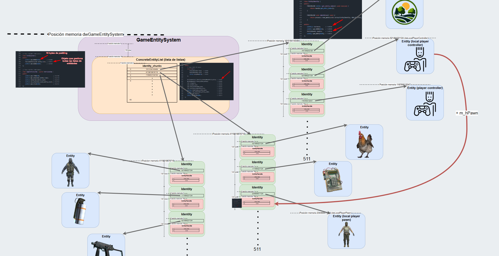

# Guía chetil 🤯🧱🔫🤖

## Acceso a memoria

Para poder acceder a la memoria del juego necesitaremos instalar la biblioteca `pymem`.

```
pip install pymem
```

Una vez que la tengamos instalada podremos acceder a la memoria del proceso.

```python
import pymem

pm = pymem.Pymem('cs2.exe')
client_address = pymem.process.module_from_name(pm.process_handle, 'client.dll').lpBaseOfDll
```

- `pm` es el objeto de la biblioteca pymem que gestiona todo.
- `pm.process_handle` es el manejador del proceso abierto.

Una vez que tengamos la dirección base de la memoria de nuestro cliente (básicamente nuestro Counter corriendo en el pc) podemos acceder a los datos que maneja el juego.

Queremos acceder a la información más importante, que suelen ser las entidades de la partida. Cada jugador, arma, objeto, etc., en una partida es una entidad, por lo tanto, para hacer cualquier tipo de cheat, lo básico es acceder a las entidades.

https://gist.github.com/a2x/6eb033d3c7b9a97fb7e10d2763de0f9f

Previsualización del [diagrama completo](memory_diagram.drawio):



Necesitamos saber donde buscar. Y para eso están los famosos “offsets”.

## Offsets

https://github.com/a2x/cs2-dumper

```python
import pymem

pm = pymem.Pymem('cs2.exe')
client_address = pymem.process.module_from_name(pm.process_handle, 'client.dll').lpBaseOfDll

game_entity_system_address = pm.read_ulonglong(client_address + 28364024)
entity_lists_address = game_entity_system_address + 16
```

No podemos hardcodear todos los offsets así que antes de continuar vamos a gestionarlos mejor.

Vamos a descargar automáticamente los offsets haciendo peticiones http y guardarlos en jsons.

```
pip install requests
```

Obtenemos los offsets generales en crudo, lo pasamos a diccionario. También lo guardamos en un archivo json para posteriores consultas.

```python
import json
import pathlib

import requests

general_offsets = requests.get('https://raw.githubusercontent.com/a2x/cs2-dumper/refs/heads/main/output/offsets.json').json()
general_offsets_text = json.dumps(general_offsets)

general_offsets_path = pathlib.Path('markdown_resources/offsets/general_offsets.json')
general_offsets_path.write_text(general_offsets_text)
```

Para que no nos baneen los de github de tanta petición vamos a leer del json siempre que podamos.

```python
import json

import requests

import constants


def get_offsets(update=False) -> dict:
    if update:
        general_offsets = requests.get('https://raw.githubusercontent.com/a2x/cs2-dumper/refs/heads/main/output/offsets.json').json()
        constants.GENERAL_OFFSETS_PATH.write_text(json.dumps(general_offsets))
    else:
        general_offsets = json.loads(constants.GENERAL_OFFSETS_PATH.read_text())

    return general_offsets
```

Todo está muy hardcodeado. Vamos a arreglarlo.

- `main.py`:

    ```python
    import json
    
    import requests
    
    import constants
    
    
    def get_offsets(update=False) -> dict:
        if update:
            general_offsets = requests.get(constants.ENDPOINTS['general_offsets']).json()
            constants.GENERAL_OFFSETS_PATH.write_text(json.dumps(general_offsets))
        else:
            general_offsets = json.loads(constants.GENERAL_OFFSETS_PATH.read_text())
    
        return general_offsets
    ```

- `constants.py`:

    ```python
    import pathlib
    
    ENDPOINTS = {
        'general_offsets': 'https://raw.githubusercontent.com/a2x/cs2-dumper/refs/heads/main/output/offsets.json'
    }
    
    GENERAL_OFFSETS_PATH = pathlib.Path('markdown_resources/offsets/general_offsets.json')
    ```
  
Vale, pero no queremos el diccionario de los offsets tal cual, vamos a extraer todos los pares clave-valor en otro diccionario.

```python
import json
from pprint import pprint

import requests

import constants


def get_offsets(update=False) -> dict:
    if update:
        general_offsets = requests.get(constants.ENDPOINTS['general_offsets']).json()
        constants.GENERAL_OFFSETS_PATH.write_text(json.dumps(general_offsets))
    else:
        general_offsets = json.loads(constants.GENERAL_OFFSETS_PATH.read_text())

    offsets = {}

    for group_name, group_data in general_offsets.items():
        for offset_name, offset in group_data.items():
            offsets[offset_name] = offset

    return offsets

pprint(get_offsets())
```

Ahora igual con los `client_offsets`, pero solo con los que nos interesan.

- `main.py`:

    ```python    
    import json
    from pprint import pprint
    
    import requests
    
    import constants
    
    
    def get_offsets(update=False) -> dict:
        if update:
            client_offsets = requests.get(constants.ENDPOINTS['client_offsets']).json()
            general_offsets = requests.get(constants.ENDPOINTS['general_offsets']).json()
    
            constants.CLIENT_OFFSETS_PATH.write_text(json.dumps(client_offsets))
            constants.GENERAL_OFFSETS_PATH.write_text(json.dumps(general_offsets))
        else:
            client_offsets = json.loads(constants.CLIENT_OFFSETS_PATH.read_text())
            general_offsets = json.loads(constants.GENERAL_OFFSETS_PATH.read_text())
    
        offsets = {}
    
        for group_name, group_data in general_offsets.items():
            for offset_name, offset in group_data.items():
                offsets[offset_name] = offset
    
        for class_name, class_data in client_offsets['client.dll']['classes'].items():
            if class_name not in constants.REQUIRED_OFFSET_CLASSES:
                continue
    
            for offset_name, offset in class_data['fields'].items():
                offsets[offset_name] = offset
    
        return offsets
    
    pprint(get_offsets(update=True))
    ```

- `constants.py`:

    ```python    
    import pathlib
    
    ENDPOINTS = {
        'client_offsets': 'https://raw.githubusercontent.com/a2x/cs2-dumper/refs/heads/main/output/client_dll.json',
        'general_offsets': 'https://raw.githubusercontent.com/a2x/cs2-dumper/refs/heads/main/output/offsets.json'
    }
    
    CLIENT_OFFSETS_PATH = pathlib.Path('markdown_resources/offsets/client_offsets.json')
    GENERAL_OFFSETS_PATH = pathlib.Path('markdown_resources/offsets/general_offsets.json')
    
    REQUIRED_OFFSET_CLASSES = {'CBasePlayerController', 'CCSPlayerBase_CameraServices', 'CCSWeaponBaseVData',
                               'CEntityIdentity', 'CEntityInstance', 'CGameSceneNode', 'CGlowProperty',
                               'CPlayer_ObserverServices', 'CSkeletonInstance', 'C_AttributeContainer', 'C_BaseEntity',
                               'C_BaseModelEntity', 'C_BasePlayerPawn', 'C_CSPlayerPawn', 'C_CSPlayerPawnBase',
                               'C_EconEntity', 'C_EconItemView', 'C_SmokeGrenadeProjectile', 'EntitySpottedState_t'}
    ```

Como hay conflicto con un par de nombres iguales en clases diferentes añadimos lo siguiente al último `for`:

```python
if (
    (offset_name != 'm_vSmokeColor' or class_name == 'C_SmokeGrenadeProjectile')
    and
    (offset_name != 'm_name' or class_name == 'CEntityIdentity')
):
    offsets[offset_name] = offset
```

Ahora que tenemos los offsets, juntémoslo con lo que hicimos al principio.

- `main.py`:

    ```python    
    import json
    
    import pymem
    import requests
    
    import constants
    
    
    def get_offsets(update=False) -> dict:
        if update:
            client_offsets = requests.get(constants.ENDPOINTS['client_offsets']).json()
            general_offsets = requests.get(constants.ENDPOINTS['general_offsets']).json()
    
            constants.CLIENT_OFFSETS_PATH.write_text(json.dumps(client_offsets))
            constants.GENERAL_OFFSETS_PATH.write_text(json.dumps(general_offsets))
        else:
            client_offsets = json.loads(constants.CLIENT_OFFSETS_PATH.read_text())
            general_offsets = json.loads(constants.GENERAL_OFFSETS_PATH.read_text())
    
        offsets = {}
    
        for group_name, group_data in general_offsets.items():
            for offset_name, offset in group_data.items():
                offsets[offset_name] = offset
    
        for class_name, class_data in client_offsets['client.dll']['classes'].items():
            if class_name not in constants.REQUIRED_OFFSET_CLASSES:
                continue
    
            for offset_name, offset in class_data['fields'].items():
                if (
                    (offset_name != 'm_vSmokeColor' or class_name == 'C_SmokeGrenadeProjectile')
                    and
                    (offset_name != 'm_name' or class_name == 'CEntityIdentity')
                ):
                    offsets[offset_name] = offset
    
        return offsets
    
    
    offsets = get_offsets()
    
    pm = pymem.Pymem('cs2.exe')
    client_address = pymem.process.module_from_name(pm.process_handle, 'client.dll').lpBaseOfDll
    
    game_entity_system_address = pm.read_ulonglong(client_address + offsets['dwGameEntitySystem'])
    entity_lists_address = game_entity_system_address + constants.CONCRETE_ENTITY_LIST_PADDING
    ```

- `constants.py`:

    ```python    
    import pathlib
    
    CONCRETE_ENTITY_LIST_PADDING = 16
    
    ENDPOINTS = {
        'client_offsets': 'https://raw.githubusercontent.com/a2x/cs2-dumper/refs/heads/main/output/client_dll.json',
        'general_offsets': 'https://raw.githubusercontent.com/a2x/cs2-dumper/refs/heads/main/output/offsets.json'
    }
    
    CLIENT_OFFSETS_PATH = pathlib.Path('markdown_resources/offsets/client_offsets.json')
    GENERAL_OFFSETS_PATH = pathlib.Path('markdown_resources/offsets/general_offsets.json')
    
    REQUIRED_OFFSET_CLASSES = {'CBasePlayerController', 'CCSPlayerBase_CameraServices', 'CCSWeaponBaseVData',
                               'CEntityIdentity', 'CEntityInstance', 'CGameSceneNode', 'CGlowProperty',
                               'CPlayer_ObserverServices', 'CSkeletonInstance', 'C_AttributeContainer', 'C_BaseEntity',
                               'C_BaseModelEntity', 'C_BasePlayerPawn', 'C_CSPlayerPawn', 'C_CSPlayerPawnBase',
                               'C_EconEntity', 'C_EconItemView', 'C_SmokeGrenadeProjectile', 'EntitySpottedState_t'}
    ```

## No-flash

```python
local_player_pawn_address = pm.read_ulonglong(client_address + offsets['dwLocalPlayerPawn'])
pm.write_float(local_player_pawn_address + offsets['m_flFlashMaxAlpha'], 0.0)
```

## Glow

- `main.py`:

    ```python
    import json
    
    import pymem
    import requests
    
    import constants
    
    
    def get_offsets(update=False) -> dict:
        if update:
            client_offsets = requests.get(constants.ENDPOINTS['client_offsets']).json()
            general_offsets = requests.get(constants.ENDPOINTS['general_offsets']).json()
    
            constants.CLIENT_OFFSETS_PATH.write_text(json.dumps(client_offsets))
            constants.GENERAL_OFFSETS_PATH.write_text(json.dumps(general_offsets))
        else:
            client_offsets = json.loads(constants.CLIENT_OFFSETS_PATH.read_text())
            general_offsets = json.loads(constants.GENERAL_OFFSETS_PATH.read_text())
    
        offsets = {}
    
        for group_name, group_data in general_offsets.items():
            for offset_name, offset in group_data.items():
                offsets[offset_name] = offset
    
        for class_name, class_data in client_offsets['client.dll']['classes'].items():
            if class_name not in constants.REQUIRED_OFFSET_CLASSES:
                continue
    
            for offset_name, offset in class_data['fields'].items():
                if (
                    (offset_name != 'm_vSmokeColor' or class_name == 'C_SmokeGrenadeProjectile')
                    and
                    (offset_name != 'm_name' or class_name == 'CEntityIdentity')
                ):
                    offsets[offset_name] = offset
    
        return offsets
    
    
    offsets = get_offsets()
    
    pm = pymem.Pymem('cs2.exe')
    client_address = pymem.process.module_from_name(pm.process_handle, 'client.dll').lpBaseOfDll
    
    local_player_pawn_address = pm.read_ulonglong(client_address + offsets['dwLocalPlayerPawn'])
    pm.write_float(local_player_pawn_address + offsets['m_flFlashMaxAlpha'], 0.0)
    
    game_entity_system_address = pm.read_ulonglong(client_address + offsets['dwGameEntitySystem'])
    entity_lists_address = game_entity_system_address + constants.CONCRETE_ENTITY_LIST_PADDING
    entity_list_address = pm.read_ulonglong(entity_lists_address)
    
    while True:
        # for i in range(1, constants.MAX_PLAYERS):
        controller_address = pm.read_ulonglong(entity_list_address + 2 * constants.IDENTITY_SIZE)
        if not controller_address:
            continue
    
        pawn_handle_address = pm.read_ulonglong(controller_address + offsets['m_hPawn'])
        entity_index = pawn_handle_address & constants.MAX_ENTITIES - 1
    
        entity_list_index = entity_index // constants.LIST_ENTITIES
        entity_subindex = entity_index % constants.LIST_ENTITIES
    
        pawn_identity_address = pm.read_ulonglong(
            entity_lists_address + entity_list_index * constants.UNSIGNED_LONG_LONG_SIZE
        )
        pawn_address = pm.read_ulonglong(pawn_identity_address + entity_subindex * constants.IDENTITY_SIZE)
    
        pm.write_bool(pawn_address + offsets['m_Glow'] + offsets['m_bGlowing'], True)
        color = (255, 0, 255, 255)
        for i in range(4):
            pm.write_bytes(
                pawn_address + offsets['m_Glow'] + offsets['m_glowColorOverride'] + i,
                color[i].to_bytes(),
                1
            )
    
        # color = (255, 0, 0, 255)
        # for i, color_component in enumerate(color):
        #     pm.write_bytes(
        #         pawn_address + offsets['m_Glow'] + offsets['m_glowColorOverride'] + i,
        #         color_component.to_bytes(),
        #         1
        #     )
        #
        # color = (255, 0, 0)
        # color_bytes = struct.pack('4B', *color, 255)
        # pm.write_bytes(
        #     pawn_address + offsets['m_Glow'] + offsets['m_glowColorOverride'],
        #     color_bytes,
        #     len(color_bytes)
        # )
    ```

- `constants.py`:

    ```python
    import pathlib
    
    CONCRETE_ENTITY_LIST_PADDING = 16
    ENTITY_LISTS = 64
    IDENTITY_SIZE = 120
    LIST_ENTITIES = 512
    MAX_ENTITIES = LIST_ENTITIES * ENTITY_LISTS
    MAX_PLAYERS = 64
    UNSIGNED_LONG_LONG_SIZE = 8
    
    ENDPOINTS = {
        'client_offsets': 'https://raw.githubusercontent.com/a2x/cs2-dumper/refs/heads/main/output/client_dll.json',
        'general_offsets': 'https://raw.githubusercontent.com/a2x/cs2-dumper/refs/heads/main/output/offsets.json'
    }
    
    CLIENT_OFFSETS_PATH = pathlib.Path('markdown_resources/offsets/client_offsets.json')
    GENERAL_OFFSETS_PATH = pathlib.Path('markdown_resources/offsets/general_offsets.json')
    
    REQUIRED_OFFSET_CLASSES = {'CBasePlayerController', 'CCSPlayerBase_CameraServices', 'CCSWeaponBaseVData',
                               'CEntityIdentity', 'CEntityInstance', 'CGameSceneNode', 'CGlowProperty',
                               'CPlayer_ObserverServices', 'CSkeletonInstance', 'C_AttributeContainer', 'C_BaseEntity',
                               'C_BaseModelEntity', 'C_BasePlayerPawn', 'C_CSPlayerPawn', 'C_CSPlayerPawnBase',
                               'C_EconEntity', 'C_EconItemView', 'C_SmokeGrenadeProjectile', 'EntitySpottedState_t'}
    ```

Filtrado por equipo.

```python
local_player_controller_address = pm.read_ulonglong(client_address + offsets['dwLocalPlayerController'])
```

```python
team = Team(pm.read_int(controller_address + offsets['m_iTeamNum']))
local_player_team = Team(pm.read_int(local_player_controller_address + offsets['m_iTeamNum']))
if team is local_player_team:
    continue
```

## Pasamos a clases

Hacer primero el constructor de `Entity`.

Utilizar código en [glow_with_classes](glow_with_classes).

Hacer:

- `Memory.open_process_from_name`.
- `main.iter_players`.
- Filtrar por equipos (enumeraciones).
- Glow por vida.
- Filtrar por clase.
- Iterar por clase. Hacer el glow de gallinas.

Ahora actualizamos el iterador de entidades.

En clase `Entity`:

```python
@classmethod
def from_identity_address(cls, memory: models.memory.Memory, identity_address: int) -> Self:
   return cls(memory, memory.read_ulonglong(identity_address))
```

En `main.py`:

```python
for entity in memory.full_entity_list.iter_entities_by_class('cs_player_controller'):
```

## Humos

```python
import random
import struct
from collections.abc import Iterator


from models.memory import Memory
from models.entities.local_player import LocalPlayer
from models.entities.player import Player


def iter_entities() -> Iterator[Player]:
   for entity_ in memory.full_entity_list.iter_entities_by_class('smokegrenade_projectile'):
       yield entity_


memory = Memory()
local_player_address = memory.read_ulonglong(memory.client_address + memory.dwLocalPlayerPawn)
local_player = LocalPlayer(memory, local_player_address)


while True:
   for entity in iter_entities():
       color = (random.choice((0, 255)) for _ in range(3))
       color_bytes = struct.pack('3f', *color)
       memory.write_bytes(entity.address + memory.m_vSmokeColor, color_bytes, len(color_bytes))


       # memory.write_bool(entity.address + memory.m_bDidSmokeEffect, True)
```

## Aimbot

Comando para mostrar información en el juego:

```
cl_showpos 1
```

Hacer `__init__`, `__add__`, `__str__`, `distance` y `magnitude` de la clase `Vector`.

Utilizar código en [aimbot](aimbot).

Completar e imprimir `local_player.view_position`.

## Cheat manager

Utilizar código en [cheat_manager](cheat_manager).

Completar.
